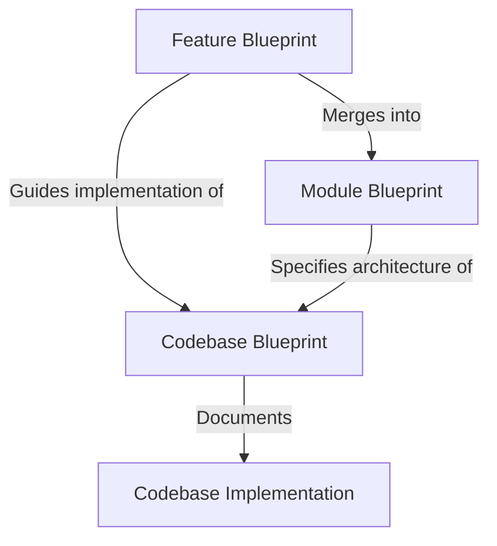

# Spec-Driven Development (SDD) Reference Guide

This document defines the **Spec-Driven Development (SDD)** methodology for the A2UI repository. SDD streamlines the implementation and maintenance of the A2UI protocol and its features across multiple programming languages and UI frameworks by establishing clear, language-agnostic specifications (**Blueprints**) and leveraging AI coding agents to scale development with high quality and consistency.



Under this model:

1. **Module Blueprints** (`blueprints/modules/`): Language-agnostic authorities defining core architecture, interfaces, and behaviors for a subsystem (e.g., `a2ui_core`, `a2ui_agent`, `a2ui_framework_adapter`).
2. **Feature Blueprints** (`blueprints/features/`): Standalone specifications for specific feature additions or behavioral changes.
3. **Codebase Blueprints** (`blueprints/codebases/<relative_codebase_path>/codebase.blueprint.md`): Metadata files tracking each concrete platform implementation's compliance commit against its associated Module Blueprint, listing implemented optional features and documenting platform-specific design decisions.

Formal blueprints are primarily used for major features (e.g. addition of a public API, protocol message schema, behavior, or architectural pattern). By checking specifications into the repository, feature designs undergo review before implementation and can be ported across languages with high fidelity.

### Smaller features

Smaller features can still be implemented ad-hoc with no formal blueprint. These smaller features typically:

- Make changes to functionality not explicitly covered in the module blueprint;
- Address local bugs, refactorings, or performance optimizations that do not affect the public API or cross-language protocol compliance; or
- Add codebase-specific utility functions or internal helpers that do not impact compatibility or consistency with other SDKs.

---

## Document types

### Feature blueprint

Feature blueprints describe a *diff* in functionality that can be implemented in a codebase.

#### Required features

A **Required Feature Blueprint** describes a feature whose design has been merged into all relevant module blueprints. It is expected to be eventually implemented in all codebases for that module. 

- *Agents implementing new codebases* never need to read required feature blueprints. They can completely implement the module and all its required features using only the Module Blueprint.
- *Agents implementing new required features in existing codebases* can consult the archived feature blueprint to understand the feature's design and test plan.

#### Optional features

An **Optional Feature Blueprint** describes a feature that is not baked into the module blueprint and is not expected to be implemented in all codebases. It allows platforms to support experimental or framework-specific capabilities without forcing compliance across all SDKs.

- **Decoupled Lifecycle**: Optional feature blueprints exist as standalone specification files in `blueprints/features/` and are not merged into the base Module Blueprint.
- **Ad-hoc Implementation**: Each codebase decides independently whether to support an optional feature based on platform capabilities and requirements.
- **Discovery**: Codebases that implement an optional feature list it in their `codebase.blueprint.md` under `implemented_features`.

#### Feature dependencies

A feature blueprint can optionally specify a list of `dependencies` in its frontmatter. This list includes other feature blueprints that this feature directly depends on. The purpose of this field is to provide a pragmatic way for coding agents to identify prerequisite features that might be missing from a codebase and need to be implemented first.

#### Feature Blueprint Structure & Example

Every feature blueprint must follow a standardized Markdown structure with YAML frontmatter. Feature blueprints are named `<feature_name>.blueprint.md` (`snake_case`, no date prefix). The `date_added` frontmatter field records when the feature was first written (YYYY-MM-DD) and is used only for rough chronological sorting; it does not imply dependency order.

Example feature blueprint (`blueprints/features/dynamic_theming.blueprint.md`):

```md
---
feature_name: dynamic_theming
module_blueprints:
  - a2ui_core
  - a2ui_framework_adapter
dependencies: []
date_added: 2026-06-23
---

# **Dynamic Theming Feature Blueprint**

## **Requirements**

Allow agents or clients to dynamically adjust the visual theme of an active surface without recreating the surface. The client must parse theme updates in the incoming message stream and apply the new styling parameters in real time using common reactivity interfaces.

## **Detailed Description of Changes**

1. **Protocol Schema**: Add an optional `updateTheme` object to the `A2uiMessage` envelope schema.
2. **Message Ingestion**: The `MessageProcessor` must parse the `updateTheme` message...

## **Links**

- RFC/Discussion: [Issue #452](https://github.com/a2ui-project/a2ui/issues/452)
- Protocol Specification: [a2ui_protocol.md](../../specification/v1_0/docs/a2ui_protocol.md)

## **Test Cases & Conformance**

- **Test Case 1: Simple Theme Apply**: Verify that sending `updateTheme` with a new background color updates the theme signal on `SurfaceModel` and triggers a re-render.

## **Implementation Steps**

1. Update the `server_to_client.json` schema to include the `updateTheme` envelope.
2. Implement parsing and state propagation in the `a2ui_core` codebase implementations.
```

---

### Module blueprint

A **Module Blueprint** describes an entire architectural module in a language-agnostic way. It serves as the primary source of truth for building a new codebase from scratch or verifying the correctness of an existing one.

When required features affecting the module are approved, their specifications are integrated into the module blueprint. Module blueprints act as a coherent, compacted description of the module, ensuring that the overall module specification does not have unbounded growth over time as features are added.

#### Module Blueprint Structure & Example

Module blueprints live at `blueprints/modules/<module_name>.blueprint.md`. They begin with YAML frontmatter containing `name`, `type: module`, and a description. Module blueprints specify overall architecture, core interfaces, and the conformance test plan, rather than maintaining an ad-hoc feature checklist.

Example module blueprint (`blueprints/modules/a2ui_core.blueprint.md`):

```md
---
name: a2ui_core
type: module
description: Framework-agnostic core state model, message processing, and data binding engine.
---

# **Core State Layer (a2ui_core) Module Blueprint**

## **Architecture Overview**

The core state layer is the framework-agnostic engine of A2UI. It is responsible for parsing inbound JSON streams from the agent, maintaining active UI surface models, resolving JSON Pointer data bindings, and dispatching client actions back to the transport layer.

## **Core Interfaces**

- **`MessageProcessor`**: The central controller that ingests `A2uiMessage` envelopes and directs updates.
- **`SurfaceModel`**: Encapsulates surface metadata, component hierarchies, and reactive signals.
- **`DataModel`**: Manages underlying application data and resolves bound pointers.

## **Conformance Test Plan**

Every implementation of `a2ui_core` must pass the core conformance test suite:

- **JSON Parsing Suite**: Validates envelope compliance against schemas.
- **Data Model Binding Suite**: Verifies pointer resolution, type coercion rules, and signal emissions.
```

---

### Codebase blueprint

A **Codebase** is a concrete, language-specific or framework-specific implementation of a module. Examples of codebases in this repository include `typescript/web_core` (TypeScript implementation of `a2ui_core`), `renderers/react` (React implementation of `a2ui_framework_adapter`), and `python/a2ui_core` (Python implementation of `a2ui_core`).

Every codebase tracked under SDD has a corresponding `codebase.blueprint.md` located under `blueprints/codebases/<relative_codebase_path>/codebase.blueprint.md`. This file maps the concrete implementation back to its language-agnostic module blueprint, tracks compliance against a specific module blueprint git commit hash (`module_blueprint_commit`), records implemented optional features, and documents platform-specific engineering decisions.

#### Codebase Blueprint Structure & Example

Example codebase blueprint (`blueprints/codebases/renderers/react/codebase.blueprint.md`):

```yaml
---
codebase_path: renderers/react
associated_module: a2ui_framework_adapter
module_blueprint_commit: 8d75b7901dcbb78dded6449036a6f17bf52c62c1
implemented_features:
  - dynamic_theming
  - call_function_rpc
---

# React Renderer Codebase Blueprint

## Architecture & Styling
This codebase implements the `a2ui_framework_adapter` module blueprint using React 19 and functional components.
- **Reactivity**: We map core state signals to React state via custom hooks to trigger declarative re-renders.
- **Context Propagation**: We use React Context to propagate data binding scopes recursively down the widget tree.

## Technical Decisions & Overrides
- **Dynamic Binders**: Runtime reflection resolves dynamic properties into component props.
- **Event Throttling**: User input change actions are throttled before committing to the local data model.
```

---

## Developer journeys

### Specify a new required feature

1. Create a feature blueprint at `blueprints/features/<feature_name>.blueprint.md`.
2. Integrate the feature's architectural specifications, schemas, and behavior into the target module blueprint(s) in `blueprints/modules/`.
3. Move the feature blueprint to `blueprints/features/archived/<feature_name>.blueprint.md` via `git mv`.
4. Validate the blueprints:
   ```bash
   python3 blueprints/validate_blueprints.py
   ```
5. Submit a PR for review.

### Specify a new optional feature

1. Create an optional feature blueprint at `blueprints/features/<feature_name>.blueprint.md`.
2. Validate the blueprints:
   ```bash
   python3 blueprints/validate_blueprints.py
   ```
3. Submit a PR for review.

### Promote an optional feature to be required

1. Open the feature blueprint from `blueprints/features/<feature_name>.blueprint.md`.
2. Integrate the feature's specifications into the target module blueprint(s) in `blueprints/modules/`.
3. Move the feature blueprint to `blueprints/features/archived/<feature_name>.blueprint.md` via `git mv`.
4. Validate the blueprints:
   ```bash
   python3 blueprints/validate_blueprints.py
   ```
5. Submit a PR for review.

### Implement an optional or required feature in a codebase

1. Open the target codebase's blueprint at `blueprints/codebases/<codebase_path>/codebase.blueprint.md`.
2. Review the feature blueprint or the diff in the module blueprint since the pinned commit:
   ```bash
   git diff <module_blueprint_commit>..HEAD blueprints/modules/<associated_module>.blueprint.md
   ```
3. Implement the feature in the codebase directory and pass local unit and conformance tests.
4. Update `codebase.blueprint.md`:
   - If bringing the codebase up to date with the latest Module Blueprint commit, update `module_blueprint_commit` to the current commit hash:
     ```bash
     git log -n 1 --pretty=format:%H blueprints/modules/<associated_module>.blueprint.md
     ```
   - If implementing an optional feature, add its name to `implemented_features`.
5. Validate the blueprints:
   ```bash
   python3 blueprints/validate_blueprints.py
   ```
6. Submit a PR for review.

### Implement all features necessary to bring a codebase up to date

1. Read the codebase blueprint at `blueprints/codebases/<codebase_path>/codebase.blueprint.md`.
2. Inspect the git log and diff of the associated module blueprint since `module_blueprint_commit`:
   ```bash
   git log <module_blueprint_commit>..HEAD --oneline -- blueprints/modules/<associated_module>.blueprint.md
   git diff <module_blueprint_commit>..HEAD blueprints/modules/<associated_module>.blueprint.md
   ```
3. Implement the missing specifications and verify with conformance tests.
4. Update `module_blueprint_commit` in `codebase.blueprint.md` to the latest commit hash of the module blueprint.
5. Validate the blueprints and submit a PR.

### Resolve inconsistencies between a module blueprint and associated codebases

1. Run the compliance auditor:
   ```bash
   python3 .agents/skills/a2ui-blueprint-compliance/scripts/check_compliance.py
   ```
2. Analyze codebases associated with the module, identifying missing specifications, API naming discrepancies, or intentional platform deviations.
3. Propose actions:
   - Clarify or refine specifications in the module blueprint.
   - Update codebase implementations to match the module blueprint.
   - Document intentional platform-specific deviations in the codebase blueprint's technical decisions section.
4. Implement approved changes, validate blueprints, and submit a PR.

### Implement a new codebase

1. Review the relevant Module Blueprint in `blueprints/modules/`.
2. Implement the module in the target platform language or framework.
3. Create a new codebase blueprint at `blueprints/codebases/<relative_codebase_path>/codebase.blueprint.md` with:
   - `codebase_path`: target platform path
   - `associated_module`: module name
   - `module_blueprint_commit`: commit hash of the module blueprint implemented
   - `implemented_features`: list of implemented optional features
4. Validate blueprints using `python3 blueprints/validate_blueprints.py`.
5. Submit PR for review.

---

## Lifecycle & archiving

Feature blueprints undergo a clean, Git-centric lifecycle:

1. **Merged / Required Features**: When a feature specification is merged into its target Module Blueprint(s), the feature blueprint file is moved to `blueprints/features/archived/<feature_name>.blueprint.md` via `git mv`. Its requirements are permanently part of the module blueprint.
2. **Deprecated Optional Features**: If an optional feature in `blueprints/features/` is deprecated or abandoned without being merged, it is moved to `blueprints/features/archived/<feature_name>.blueprint.md`.

---

## Folder structure & first-class tooling

Specifications, blueprints, and validation tools reside in the top-level `/blueprints/` directory, while agent skills reside as first-class citizens in `/.agents/skills/`:

```
/
├── .agents/
│   └── skills/                             # First-class SDD and repository skills
│       ├── a2ui-blueprint-compliance/      # Codebase compliance auditing
│       ├── a2ui-blueprint-maintenance/     # Feature merging and archiving recipes
│       ├── a2ui-blueprint-navigator/       # Discovery and commit diff inspection
│       ├── a2ui-create-feature-blueprint/  # Feature blueprint authoring
│       └── a2ui-implement-feature-from-blueprint/ # Implementation workflow
├── blueprints/
│   ├── README.md                           # Blueprint documentation and guide
│   ├── validate_blueprints.py              # Blueprint frontmatter and structure validator
│   ├── modules/                            # Language-agnostic Module Blueprints
│   │   ├── a2ui_core.blueprint.md
│   │   └── a2ui_framework_adapter.blueprint.md
│   ├── features/                           # Unmerged / Optional Feature Blueprints
│   │   ├── dynamic_theming.blueprint.md
│   │   └── archived/                       # Merged / Required Feature Blueprints
│   │       └── bidirectional_rpc.blueprint.md
│   └── codebases/                          # Codebase Blueprints tracking module compliance by commit hash
│       ├── renderers/
│       │   └── react/
│       │       └── codebase.blueprint.md
│       └── python/
│           └── a2ui_core/
│               └── codebase.blueprint.md
```

### SDD Agent Skills

The repository provides 5 first-class skills in `.agents/skills/`:

- **`a2ui-blueprint-navigator`**: An analytical guide for discovering blueprints, inspecting commit-hash compliance (`module_blueprint_commit`), and viewing spec diffs.
- **`a2ui-blueprint-compliance`**: Audits codebase blueprint compliance against the latest module blueprints across all platform codebases and outputs a structured compliance report.
- **`a2ui-create-feature-blueprint`**: Guides the creation and formatting of new language-agnostic Feature Blueprints inside `blueprints/features/`.
- **`a2ui-implement-feature-from-blueprint`**: Provides step-by-step instructions for implementing feature specs and updating codebase compliance commit hashes.
- **`a2ui-blueprint-maintenance`**: Manages merging feature specs into Module Blueprints and archiving feature blueprints to `blueprints/features/archived/`.

### Blueprint validation

The repository includes a blueprint validator script (`blueprints/validate_blueprints.py`) that runs in CI (`.github/workflows/validate_blueprints.yml`) to block submission of invalid blueprints:

- **Frontmatter compliance**: Verifies mandatory YAML fields are present and valid.
- **Entity naming rules**: Ensures feature names and module names use `snake_case` without date prefixes and match filenames (`<name>.blueprint.md`).
- **Reference integrity**: Validates that `codebase_path`, `associated_module`, `module_blueprint_commit`, and `implemented_features` in codebase blueprints point to valid targets.
