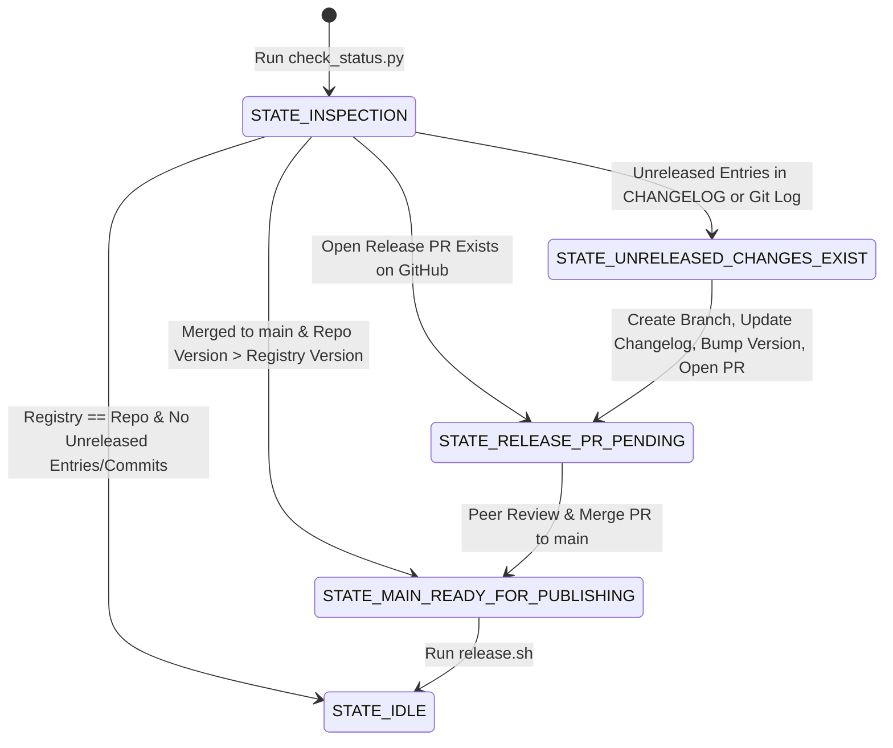

# A2UI SDK & Package Release Skill

Guidelines and tactical recipes for AI agents to inspect, prepare, and execute releases for A2UI Python (`a2ui-agent-sdk`, `a2ui-core`) and TypeScript (`@a2ui/web_core`, `@a2ui/lit`, `@a2ui/angular`, `@a2ui/react`, `@a2ui/markdown-it`) packages using a deterministic **State Machine**.

Primary sources of truth:

- Master Release Guide: [docs/contributing/release.md](../../../docs/contributing/release.md)
- Python Technical Guide: [agent_sdks/python/docs/python_publishing.md](../../../agent_sdks/python/docs/python_publishing.md)
- TypeScript Technical Guide: [renderers/docs/web_publishing.md](../../../renderers/docs/web_publishing.md)

---

## State Machine Architecture & Named States

The release state of **each package is evaluated independently** by relative directory path (e.g. `renderers/web_core`, `agent_sdks/python/a2ui_core`). Each package transitions through its own state machine:



### Official Named States:

1. **`STATE_IDLE`**: The package in `main` is up to date with the public/staging registry and has no unreleased commits or changelog entries.
2. **`STATE_UNRELEASED_CHANGES_EXIST`**: The package has unreleased changes (in `CHANGELOG.md` or git log), but the version in `main` is not yet bumped and no release PR is open.
3. **`STATE_RELEASE_PR_PENDING`**: A version bump PR targeting `main` for this package is currently open on GitHub awaiting review/merge.
4. **`STATE_MAIN_READY_FOR_PUBLISHING`**: The release PR has landed in `main`. The version string in `main` is greater than the published registry version.

---

## Phase 0: Automated State Discovery

To inspect the current release state across all packages at once, execute the status checker script:

```bash
./.agents/skills/a2ui-release-sdks/scripts/check_status.py
```

This script evaluates each package independently by directory path, compares local versions against PyPI / NPM registries, parses `CHANGELOG.md` files, checks git logs, and reports the active state for every package.

---

## Versioning & Changelog Policy

### 1. SemVer Version Bump Rules

- **Pre-1.0 (`0.x.y`)**:
  - **MINOR Bump** (`0.10.x` -> `0.11.0`): Mandatory when changes contain `BREAKING CHANGE:` entries or breaking API modifications.
  - **PATCH Bump** (`0.10.x` -> `0.10.y`): Used for backward-compatible features (`feat:`) and bug fixes (`fix:`).
- **Post-1.0 (`X.y.z`)**:
  - **MAJOR Bump** (`1.x.y` -> `2.0.0`): Mandatory for breaking changes (`BREAKING CHANGE:`).
  - **MINOR Bump** (`1.x.y` -> `1.y+1.0`): New backward-compatible features.
  - **PATCH Bump** (`1.x.y` -> `1.x.y+1`): Backward-compatible bug fixes.

### 2. Changelog Conventions & Auto-Population

- **Breaking Changes Format**: In `CHANGELOG.md`, any breaking change entry MUST start with `BREAKING CHANGE:` or `- BREAKING CHANGE: <description>`.
- **Unpopulated `## Unreleased` Policy**: If `## Unreleased` is empty, the agent must check `git log -n 20 <pkg_dir>`:
  1. Filter out non-user-facing commits (`chore:`, `docs:`, `ci:`, `test:`).
  2. If significant commits exist (`feat:`, `fix:`, `refactor:`, `BREAKING CHANGE:`), automatically populate `## Unreleased` in `CHANGELOG.md` with standard bullet items before bumping version.
  3. If no significant commits exist, leave the package in `STATE_IDLE`.

---

## Action Recipes by Package State

### Recipe for `STATE_IDLE`

Emit status summary to the user: _"Package `<name>` is fully up to date."_ No action needed.

---

### Recipe for `STATE_UNRELEASED_CHANGES_EXIST`

1. **Prepare Release Branch**:

   ```bash
   git checkout main
   git pull upstream main
   git checkout -b release/sdks-$(date +%Y-%m-%d)
   ```

2. **Update Changelogs & Bump Versions**:
   - If `## Unreleased` is empty, populate it from `git log` of the package directory.
   - Determine SemVer bump (MINOR for `BREAKING CHANGE:` in pre-1.0, PATCH otherwise).
   - Move `## Unreleased` items to `## <new_version>` and insert a fresh `## Unreleased` header above.
   - **TypeScript**: Edit `"version": "<new_version>"` directly in package `package.json`.
   - **Python**: Edit `__version__ = "<new_version>"` in `version.py`.
   - Run `yarn install` at the workspace root to update lockfiles cleanly.

3. **Commit & Open Upstream PR**:
   ```bash
   git add -u
   git commit -m "release: prepare <package> v<new_version> for release"
   git push -u origin release/sdks-$(date +%Y-%m-%d)
   GH_TOKEN="$A2UI_UPSTREAM_TOKEN" gh pr create -R a2ui-project/a2ui --base main --title "release: prepare <package> v<new_version> for release" --body "Automated version bump and release notes."
   ```

---

### Recipe for `STATE_RELEASE_PR_PENDING`

1. Display the open PR link to the user/maintainer.
2. Wait for peer review and PR merge into `main`.

---

### Recipe for `STATE_MAIN_READY_FOR_PUBLISHING`

Once the release PR is merged into `main`, execute the release script targeting the package relative directory path:

1. **Sync Local Main**:

   ```bash
   git checkout main
   git pull upstream main
   ```

2. **Execute Package Release Script**:
   - **TypeScript Packages**:
     ```bash
     ./renderers/release.sh renderers/web_core
     ./renderers/release.sh renderers/lit
     ```
   - **Python Packages**:
     ```bash
     ./agent_sdks/python/release.sh agent_sdks/python/a2ui_core
     ./agent_sdks/python/release.sh agent_sdks/python/a2ui_agent
     ```

3. **Verify Staging & Exit Gate**:
   - Confirm Artifact Registry staging upload.
   - Confirm Exit Gate manifest GCS trigger.
