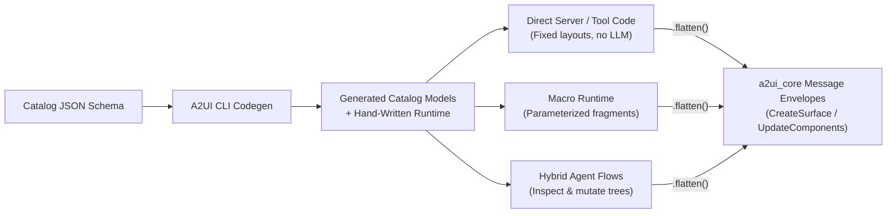

# Typesafe builder API feature blueprint

## Design goals and use cases

### Design goals

The A2UI wire format represents user interfaces as a flat list of sibling component dictionaries linked together by string IDs (`"child": "text_1"`, `"children": ["btn_1", "btn_2"]`). While convenient for streaming and incremental updates, authoring flat JSON lists by hand in application code is verbose and error-prone.

The Typesafe Builder API provides a typed authoring interface for constructing A2UI layouts:

1. **Hierarchical readability**: Developers author UI layouts as nested component trees (`Card(child=Column(children=[...]))`), and the builder flattens the hierarchy into the post-order component list required by the wire protocol.
2. **Compile-time and construction-time strictness**: Authoring mistakes (misspelled component or property names, invalid enum variants, wrong property types, or malformed unions) are caught immediately by the compiler or constructor validation.
3. **Idiomatic design**: The API follows standard host language conventions (such as optional named arguments, data classes, or structs) without introducing heavy frameworks.
4. **Reuse of core models and serializers**: The builder reuses schema models from `a2ui_core` and standard serialization libraries wherever possible, adding only the logic needed to resolve nested component hierarchies into flat component lists.

> **SDD status**: This feature is optional and applies primarily to statically typed SDKs. Codebases that implement it declare `typesafe_builder_api` under `implemented_features` in their `codebase.blueprint.md`.

---

### Use cases

The builder API is consumer-agnostic and sits below both agent inference pipelines and direct server integrations:



1. **Deterministic layouts (no model in the loop)**:
   A tool server or deterministic agent step that already knows the data it wants to display constructs the component tree in code, flattens it, and packages it into `a2ui_core` message envelopes.
2. **Parameterized UI fragments and macros**:
   Reusable functions or macro definitions construct subtrees and splice them into larger surfaces. Because a fragment may be instantiated multiple times on the same surface, the builder supports anchoring `.flatten(prefix="...")` to namespace auto-generated component IDs and prevent collisions.
3. **Round-trip tree inspection and mutation ([Phase 2, #2571](https://github.com/a2ui-project/a2ui/issues/2571))**:
   Client or server middleware can deserialize a flat wire component list back into a nested builder tree, inspect or transform specific nodes with static typing, and re-flatten the tree while preserving stable component IDs.

---

### Reference implementation (Python)

In the [Python reference implementation](../../python/a2ui_agent/src/a2ui/builder/), developers author nested trees using generated catalog classes and package the flattened output directly into `a2ui_core` message models:

```python
from a2ui.builder.v0_9 import Action, ActionEvent, DataBinding
from a2ui.builder.v0_9.catalogs.basic import Button, Card, Column, Text
from a2ui.core.schema.v0_9.server_to_client import (
    CreateSurface,
    CreateSurfaceMessage,
    UpdateComponents,
    UpdateComponentsMessage,
)

def build_order_card(order_id: str) -> list:
    # 1. Author hierarchically with static type checking
    tree = Card(
        id="order_card",
        child=Column(
            children=[
                Text(text=f"Order #{order_id}", variant="h3"),
                Text(text=DataBinding(path="/order/status"), variant="body"),
                Button(
                    variant="primary",
                    child=Text(text="Refresh"),
                    action=Action(event=ActionEvent(name="refresh_order")),
                ),
            ]
        ),
    )

    # 2. Flatten into post-order wire dicts and package into core envelopes
    return [
        CreateSurfaceMessage(
            create_surface=CreateSurface(
                surface_id="main",
                catalog_id="https://a2ui.org/specification/v0_9/catalogs/basic/catalog.json",
            )
        ),
        UpdateComponentsMessage(
            update_components=UpdateComponents(
                surface_id="main",
                components=tree.flatten(),
            )
        ),
    ]
```

**Reference codebase links:**

- Version-agnostic runtime (`core/`): [`python/a2ui_agent/src/a2ui/builder/core/`](../../python/a2ui_agent/src/a2ui/builder/core/)
- Versioned v0.9 models (`v0_9/`): [`python/a2ui_agent/src/a2ui/builder/v0_9/`](../../python/a2ui_agent/src/a2ui/builder/v0_9/)
- Generated basic catalog: [`python/a2ui_agent/src/a2ui/builder/v0_9/catalogs/basic.py`](../../python/a2ui_agent/src/a2ui/builder/v0_9/catalogs/basic.py)
- Unified CLI codegen emitter (`dart/a2ui_cli`): [`dart/a2ui_cli/lib/src/emitters/python/python_emitter.dart`](../../dart/a2ui_cli/lib/src/emitters/python/python_emitter.dart)

---

## Target-language design decisions

When implementing the Typesafe Builder API in a new language, resolve four language-specific design questions first.

### Decision 1: Traversal and serialization strategy

The builder transforms a nested tree of component objects into a flat list of wire-formatted component dictionaries. Component classes must not hand-write custom serialization loops; field name aliasing (`camelCase`), omission of unset fields, and union encoding should be delegated to the host serialization mechanism used by `a2ui_core`.

How the tree is walked depends on the host language's serialization library:

- **Approach A (explicit two-pass walker, preferred for most languages)**:
  Standard serialization libraries in many languages are designed for 1:1 structural encoding and cannot carry mutable traversal state down nested fields. In these environments, write a clean, two-pass `flatten()` walker in `builder/core`. The walker inspects child slots, allocates IDs, replaces child node references with allocated string IDs, and delegates property formatting to the standard serializer.
- **Approach B (contextual serializer hooks)**:
  If the model library supports stateful, context-carrying field serializers (such as Pydantic's `@PlainSerializer` with `SerializationInfo.context`), child-slot resolution can be attached directly to slot annotations so a single serializer pass drives both child emission and dictionary conversion.

### Decision 2: Authoring syntax and construct idioms

Use the language construct that provides named or optional parameters, default omitted values, and IDE autocomplete in the target language (such as data classes, structs with default field values, or parameter objects).

- **Avoid redundant wrapper functions**: If a class or struct can be constructed cleanly (`Text(text="Hello")` or `Required(value=...)`), avoid emitting pass-through functions (`text(...)`, `required(...)`) that duplicate signatures.
- **Static visibility of ergonomics**: Every accepted authoring form must be visible in the static type signature. Avoid hidden runtime coercions inside constructors (such as accepting a raw string where `Action` is expected), which trigger static analyzer errors. Shorthands should be statically typed constructors or factory methods (such as `Action.event("save")`) or omitted in favor of direct model construction (`Action(event=ActionEvent(name="save"))`).

### Decision 3: Model reuse strategy

`a2ui_core` defines the wire schema models for the protocol. Redefining all of them in the builder causes drift, while reusing all of them directly can degrade authoring ergonomics where nested trees differ from flat wire models.

Classify each protocol model into one of three tiers:

| Tier                                | Condition                                                                                                              | Protocol models                                                                                                                                                                              | Implementation rule                                                                                                                                                                               |
| :---------------------------------- | :--------------------------------------------------------------------------------------------------------------------- | :------------------------------------------------------------------------------------------------------------------------------------------------------------------------------------------- | :------------------------------------------------------------------------------------------------------------------------------------------------------------------------------------------------ |
| **1. Direct reuse**                 | Authoring shape and wire shape are identical.                                                                          | `DataBinding`, `ActionEvent`, `FunctionCall`, `CheckRule`, `AccessibilityAttributes`                                                                                                         | Re-export directly from `a2ui_core`.                                                                                                                                                              |
| **2. Ergonomic subclass / wrapper** | Wire model wraps parameters inside an inner map (`args`), which is awkward to author directly.                         | Catalog functions (`Required`, `Regex`, `Pluralize`, `OpenUrl`, etc.)                                                                                                                        | Subclass or wrap `FunctionCall` with a flat typed initializer (`Pluralize(value=1, ...)`) that sets `call="pluralize"` and `args={...}` without requiring an intermediate `PluralizeArgs` object. |
| **3. Builder-specific model**       | Authoring holds nested `ComponentBuilderNode` objects or requires a single constructible type where Core uses a union. | `DynamicChildList` (holds `template: ComponentBuilderNode` instead of wire `componentId: str`), `Action` (constructible class enforcing mutual exclusion between `event` and `functionCall`) | Define in `builder/<version>` and verify that serialized output validates against `a2ui_core` wire models.                                                                                        |

### Decision 4: Dual-mode enum representation

Catalog enumerations (such as `Text.variant: "h1" | "h2" | "body"`) require different handling during authoring versus parsing:

- **Authoring requires closed types**: The static field type must be a closed enum or literal union so compilers and IDEs reject typos (such as `variant="h9"`). Widening the static type to `string` breaks authoring safety.
- **Parsing requires opt-in leniency**: When parsing wire payloads from peers ([Phase 2, #2571](https://github.com/a2ui-project/a2ui/issues/2571)), callers need a way to accept unknown enum values from newer catalog revisions (`variant="displayLarge"`).
- **Resolution**: Keep the static field type strictly closed. Support open enums via an opt-in deserialization context flag (`OPEN_ENUM_CONTEXT`) that allows unrecognized strings to pass through during wire parsing.

---

## Type-checking and validation rules

A conforming builder API catches authoring mistakes at compile time, static-analysis time, or object construction time:

1. **Unknown or misspelled component types**: Each catalog component is a distinct static type (`Card`, `Column`, `Text`). Unrecognized components cannot be instantiated through catalog classes.
2. **Unknown or misspelled property names**: Passing an undeclared keyword or property (such as `Text(txt="Hello")`) is rejected by the compiler or forbidden at runtime.
3. **Wrong property types and implicit coercions**:
   - Passing an incorrect type to a property fails validation.
   - For polymorphic `Dynamic*` unions (`DynamicString`, `DynamicNumber`, `DynamicBoolean`, `DynamicStringList`, `DynamicValue`), validators must enforce strict primitive matching (such as `StrictStr`, `StrictInt`, `StrictBool`). A validator must not coerce an integer or boolean into `DynamicString`, or coerce `"true"` into `DynamicBoolean`.
4. **Invalid enum values**: Passing an unlisted enum value fails static analysis and runtime construction unless the caller runs with `OPEN_ENUM_CONTEXT` enabled.
5. **Invalid union combinations**: For mutually exclusive fields, such as `Action` requiring either `event` or `functionCall`, passing neither or both raises a validation error at construction time.
6. **Invalid slot cardinality**:
   - Single-child slots (`Child`) accept only a single `ComponentBuilderNode` or `ComponentRef`.
   - Multi-child slots (`ChildList`) accept only a sequence of `ComponentBuilderNode`s or a `DynamicChildList`.

---

## Architecture and implementation requirements

### Part 1: Core flattening runtime

The core runtime is hand-written and independent of any specific protocol version or catalog.

#### Base builder node

- **`BuilderBaseModel`**: Shared base class or configuration for component nodes and auxiliary item models (`TabItem`, `ChoicePickerOption`). Enforces strict property checking, supports field aliasing (`camelCase` on wire, idiomatic naming in host code), and omits unset fields during serialization.
- **`ComponentBuilderNode`**: Base class for generated catalog components.
  - Declares `component: str` (the wire discriminator, such as `"Card"`) and `id: Optional[str] = None`.
  - Exposes `.flatten(prefix: Optional[str] = None) -> list[dict[str, Any]]`, delegating to `flatten_component_tree(self, root_id=prefix)`.

#### External surface references (ComponentRef)

`ComponentRef(id="existing_id")` represents a component that already exists on the target surface outside the current builder tree.

- Assignable to any `Child` slot or `ChildList` collection.
- Serves as a traversal boundary: resolves to its `id` string in parent slots, is never emitted into the output component list, and is never renamed or prefixed by `root_id`.
- Carries no fake `component` wire name.

#### Two-pass deterministic flattening

Flattening converts a single `ComponentBuilderNode` or a sequence of root nodes (a forest) into a depth-first, post-order list of wire dictionaries.

Two passes are required because authors can mix explicit IDs (`Text(id="Card_0")`) with anonymous components (`Card()`). In a single-pass allocator, an anonymous `Card` encountered early in traversal could receive `"Card_0"`, colliding with an explicit ID declared later in the tree.

- **Pass 1 (reservation scan)**: Traverse the component graph without allocating IDs. Collect all explicit `node.id` values (and the caller-supplied `root_id` anchor) into a reserved set.
- **Pass 2 (allocation and post-order emit)**:
  - Initialize `IdAllocator` with the reserved set and a scope prefix (`root_id`, `root.id`, or `"root"`).
  - For nodes lacking an explicit `id`, allocate sequential IDs (`{prefix}_{ComponentType}_{counter}`) skipping reserved names.
  - Recursively flatten and emit all descendant nodes before appending the parent dictionary (depth-first post-order).
- **DAG shared-instance deduplication**:
  - Track visited component instances by object identity (`id(node)` or reference equality `===`).
  - If the same component instance appears in two slots, allocate one ID, emit the component dictionary once, and reference that ID in both slots.
- **Root anchoring (`root_id`) for macro namespacing**:
  - Passing `root_id="panel_a"` assigns `"panel_a"` to the root component and prefixes all auto-allocated descendant IDs with `"panel_a_..."`. This prevents ID collisions when fragments or macros expand into an existing surface.
- **Forest (multi-root sequence) input**:
  - `flatten_component_tree` accepts either a single `ComponentBuilderNode` or a sequence of roots. When given a sequence, each item is flattened in its own scope (`{root_id}_{index}`) and the results are concatenated.

#### ComponentTree container and round-trip readiness (#2571)

`ComponentTree(root=..., dangling_components=[...])` wraps a root node alongside unattached subtrees (`dangling_components`), exposing `.flatten()` and `.to_json()`.

Designing `ComponentTree` and `ComponentRef` with these boundaries ensures that [Phase 2 deflattening (#2571)](https://github.com/a2ui-project/a2ui/issues/2571) (`flat list -> tree`) can reconstruct external references (`ComponentRef`), fallback nodes (`UnknownComponent`), and multi-root payloads without altering the authoring API.

---

### Part 2: Versioned protocol layer

Each protocol version (such as `v0_9` or `v1_0`) provides a package containing protocol models and generated catalog files.

#### Shared core models

When re-exporting `DataBinding`, `ActionEvent`, `FunctionCall`, `CheckRule`, and `AccessibilityAttributes` from `a2ui_core`:

1. **No materialized schema defaults on writer models**:
   - In JSON Schema, a `"default"` annotation (such as `FunctionCall.returnType` defaulting to `"boolean"`, or `AccessibilityAttributes.live` defaulting to `"off"`) tells readers what to assume when a key is absent; it does not instruct writers to emit that key on every payload.
   - Optional fields in `a2ui_core` models must default to unset (`None` / `null`) so unauthored default properties are omitted from the wire output.
2. **Preserve data model paths verbatim**:
   - `DataBinding.path` and `DynamicChildList.path` must reach the wire exactly as written.
   - In the A2UI specification, a leading slash (`"/user/name"`) denotes an absolute path resolved from the data model root. A path without a leading slash (`"name"`) denotes a relative path resolved against the enclosing `DynamicChildList` collection scope. Adding a leading slash breaks collection templates.

#### Authoring-specific models

- **`DynamicChildList`**: Authoring accepts `DynamicChildList(path="/users", template=Card(...))`. During flattening, the `template` subtree is emitted as a component and `DynamicChildList` serializes to `{"path": "/users", "componentId": "<template_id>"}`.
- **`Action`**: Accepts either `event=ActionEvent(...)` or `function_call=FunctionCall(...)`, validates mutual exclusion, and serializes to the active branch.
- **Direct envelope packaging**: The builder does not define custom `create_surface()` or `update_components()` helper functions. Callers construct standard `a2ui_core` message envelopes (`CreateSurfaceMessage`, `UpdateComponentsMessage`, `UpdateDataModelMessage`) using the list returned by `.flatten()`.

---

### Part 3: Code generator emitter (dart/a2ui_cli)

The A2UI CLI ([`dart/a2ui_cli`](../../dart/a2ui_cli/)) is a single Dart codebase that generates catalog builder code for all supported target languages. New languages are supported by adding an emitter under [`dart/a2ui_cli/lib/src/emitters/<lang>/`](../../dart/a2ui_cli/lib/src/emitters/) consuming the CLI's shared `CatalogSpec` representation.

Catalog files (such as `builder/v0_9/catalogs/basic.<ext>`) are generated from the catalog JSON schema by `dart/a2ui_cli` and are never edited by hand. Emitters follow these rules:

1. **Strict directory separation**: Hand-written runtime code lives in `builder/core/` and `builder/<version>/`; generated catalogs live in `builder/<version>/catalogs/`.
2. **Component classes**: Emit one class per catalog component, inheriting from `ComponentBuilderNode`, setting `component = "<ComponentName>"`, and mapping properties to their builder types (`Child`, `ChildList`, `DynamicString`, `Action`, open enum).
3. **Promote inline object schemas to named models**:
   - Inline object schemas (such as `TabItem` in `Tabs.tabItems`, `ChoicePickerOption` in `ChoicePicker.options`, or `IconNameSvgPath` in `Icon.name`) must be promoted to standalone `BuilderBaseModel` classes.
   - This ensures child slots nested inside item objects (such as `TabItem.child`) participate in flattening.
4. **Preserve union branches**: Preserve all `oneOf` and `anyOf` branches rather than narrowing to the most common branch.
5. **Reserved keyword sanitization**: If a property name collides with a host language keyword (`from`, `class`, `in`, `default`), sanitize the identifier (`from_`) and attach a serialization alias (`"from"`).
6. **Typed catalog function classes**: Emit a `FunctionCall` subclass for each catalog function with a typed initializer matching its schema parameters.

---

### Part 4: Conformance and testing

#### Cross-language golden test suite

All positive authoring and serialization cases are defined in [`conformance/agent/builder/builder.yaml`](../../conformance/agent/builder/builder.yaml) with golden outputs in [`conformance/agent/builder/golden/`](../../conformance/agent/builder/golden/) (see [`builder_suite.py`](../../python/a2ui_agent/tests/conformance/builder_suite.py) for the reference test harness).

Every conformance test runner must verify each case with two checks:

1. **Golden equality**: Serialized envelope lists match golden JSON byte-for-byte.
2. **A2UI schema validation**: Output passes the `a2ui_core` schema and integrity validator (`ValidationConfig`).

#### Local tests for non-obvious invariants

Because the golden suite tests only valid positive ASTs, each language implementation must include local unit tests for the following cases (see [`test_pydantic_builders.py`](../../python/a2ui_agent/tests/test_pydantic_builders.py)):

1. **Negative strictness tests**:
   - Constructing a component or item model with an undeclared property raises an error.
   - Passing an invalid enum string fails during authoring, while deserializing the same payload with `OPEN_ENUM_CONTEXT` enabled succeeds.
   - Passing an invalid primitive type to a `Dynamic*` property raises a validation error rather than coercing across union branches.
   - Constructing `Action()` with neither or both branches raises an error.
2. **ID reservation and DAG identity edge cases**:
   - If an anonymous component appears before an explicit component declaring `id="root_Card_0"`, Pass 1 reserves `"root_Card_0"` so the anonymous component receives a different ID.
   - Placing the same component instance into two slots emits the component dictionary once and writes the same ID into both slots.
3. **Core synchronization tests**:
   - Assert minimal serialized dictionary output for shared `a2ui_core` models (`FunctionCall(call="fn")` emits `{"call": "fn"}` without unauthored defaults).
   - Assert that serialized output of `Action` and flattened `DynamicChildList` validates against `a2ui_core` wire models (`CoreAction`, `TemplateChildList`).
4. **Catalog regeneration freshness**:
   - Verify that running `dart/a2ui_cli` against `specification/<version>/catalogs/basic/catalog.json` produces output byte-for-byte identical to the committed catalog file.

---

## Implementation steps

When implementing `typesafe_builder_api` in a new SDK language, proceed in this order:

1. **Audit core and resolve language decisions**:
   - Inspect `a2ui_core` models to verify that optional fields do not emit default values when unset.
   - Decide on the traversal mechanism (Decision 1) and open enum strategy (Decision 4).
2. **Implement core runtime (`builder/core`)**:
   - Implement `BuilderBaseModel`, `ComponentBuilderNode`, and `ComponentRef`.
   - Implement `IdAllocator`, the two-pass `flatten_component_tree` function, `OPEN_ENUM_CONTEXT`, and `ComponentTree`.
3. **Implement versioned models (`builder/<version>`)**:
   - Re-export shared `a2ui_core` models.
   - Implement `Action`, `DynamicChildList`, and strict `Dynamic*` union aliases.
   - Write local unit tests for negative validation, ID collisions, DAG deduplication, and core synchronization (Part 4).
4. **Add emitter to `dart/a2ui_cli` and generate catalogs**:
   - Implement the language emitter under `dart/a2ui_cli/lib/src/emitters/<lang>/`.
   - Add CLI codegen conformance assertions in [`conformance/cli/codegen.yaml`](../../conformance/cli/codegen.yaml) and generate the `basic` catalog file.
5. **Run cross-language conformance suite**:
   - Implement a test runner for [`conformance/agent/builder/builder.yaml`](../../conformance/agent/builder/builder.yaml) verifying golden equality and schema validation.
6. **Update codebase blueprint**:
   - Add `typesafe_builder_api` under `implemented_features` in the codebase blueprint (`blueprints/codebases/<sdk_path>/codebase.blueprint.md`) and run `python3 blueprints/validate_blueprints.py`.
