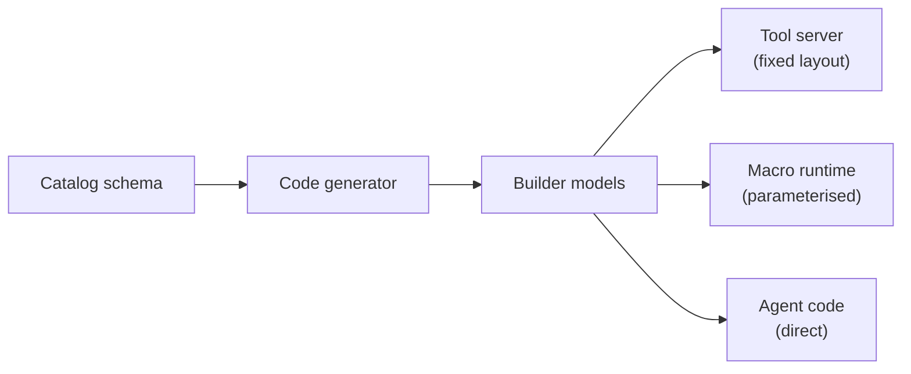

# **Typesafe Builder API Feature Blueprint**

A builder API lets application code construct A2UI directly, with a catalog's
component and function set expressed as native types of the host language. It is
the authoring counterpart to the inference formats: where a format asks a model
to emit A2UI and then parses what comes back, a builder is used by code that
already knows what it wants to render.

The point of typing it is to move failure earlier. A misspelled property, an
invalid enum value or a malformed action should fail where it is written, not
arrive at a renderer as a payload that validates structurally and then does
nothing.

This feature is optional. A language binding is useful without one, and a
binding that has no static type system gains little from it. When implemented,
it spans both `a2ui_agent` (for agent-side authoring, tool responses, and macros)
and `a2ui_core` (for tree representation, message serialization, and round-trip
deserialization back into typed node graphs).

## **Consumers**

The builder is a standalone capability that depends on nothing above it. Any
code holding a catalog's generated models can produce A2UI with it. Two
consumers are worth naming, because they pull in different directions and the
API has to serve both.

### A fixed layout, with no model in the loop

A tool server answering a request it fully understands does not need inference
at all. It constructs the tree and returns the messages:

```python
from a2ui.builder.v0_9 import create_surface
from a2ui.builder.v0_9.catalogs.basic import Card, Column, Text

def order_status(order_id: str, state: str) -> list:
    return create_surface(
        "order_status",
        Card(child=Column(children=[
            Text(text=f"Order {order_id}", variant="h3"),
            Text(text=state),
        ])),
    )
```

There is no prompt, no parsing and no model. The value is that `variant="h3"`
is checked against the catalog when it is written, and the flat wire form is
produced without the caller assembling component IDs by hand.

### A parameterised fragment, expanded by a caller

A macro runtime layers parameter binding and expansion on top of the same
models. It is a consumer of the builder, not a peer:



Two properties matter more to this consumer than to direct authoring, and both
are stated generally because they are not macro-specific: a subtree can be
anchored at a caller-supplied root ID, which namespaces everything beneath it so
repeated expansions cannot collide (R3.13), and a reference to something already
on the surface stays a boundary that is never renamed or re-emitted (R3.12). A
tool server returning the same fragment twice on one surface needs exactly the
same guarantees.

Nothing in the builder may name a specific consumer. A type whose contract can
only be stated in terms of macros is a type in the wrong package.

## **Requirements**

### R1. Authoring is strict

1. Constructing a component with an unknown property must fail. A misspelled
   attribute must not be carried silently to a renderer.
2. A property whose catalog schema is an enumeration must be declared as exactly
   that value set, so that a static checker rejects an invalid value before the
   code runs. Languages without a suitable type must reject at construction.
3. Where a schema expresses a choice between branches, the constraint must be
   enforced at construction. An object that satisfies neither branch, or both,
   must not be constructible.
4. An ergonomic shorthand must not be introduced in a way that static analysis
   cannot see. A coercion applied inside a constructor widens the runtime
   contract while the declared type stays narrow, so a type checker reports the
   ergonomic spelling as an error even though it works. Shorthands must be
   separate named constructors whose signature states what they accept.

### R2. Parsing is lenient on request

5. A peer may legitimately send a value from a newer catalog revision than the
   one the builder was generated from. Parsing must be able to accept an
   unknown enum value.
6. That relaxation must be opt-in, supplied by the caller at the point of
   parsing. The declared type must not be widened to achieve it, because that
   would also relax authoring and defeat R1.2.

### R3. Authoring is nested, the wire is flat

A2UI is a flat format: every component appears as a sibling in a single list and
references its children by ID. Builders are the opposite, because nesting is how
a reader understands a layout. Converting between the two is the only real
behaviour a builder has.

7. A field that holds a child component must serialize to that child's allocated
   ID, and the child's own subtree must be emitted into the same flat output.
8. Component IDs must be allocated deterministically, so that the same tree
   produces the same output on every run.
9. An author-supplied ID must be preserved and must never be handed out again by
   the allocator.
10. Components must be emitted in depth-first post-order, so that a reference
    can only point at a component already present in the list.
11. The same object appearing in two slots is one component referenced twice,
    not two copies.
12. A reference to a component that already exists on the surface is a boundary.
    It must be referenced by its existing ID, never re-emitted and never
    renamed.
13. Flattening may be anchored at a caller-supplied root ID, which namespaces
    the IDs generated beneath it. This is what allows one tree to be expanded
    into a surface that other trees also write to, without collisions.

### R4. Serialization belongs to the host language

14. Field shape, name mapping, defaults, omission of empty values, unions and
    nested models must be handled by the host language's existing serialization
    library. Implementations must not hand-write a serializer per model.
15. The only behaviour a builder adds on top of that library is child
    resolution, as described in R3.

The reason is maintenance cost rather than elegance. A hand-written serializer
has to be extended for every property of every component in every catalog, and
each extension is a place for the wire format to drift from the schema. Three
wire-format defects were found in the reference implementation at review time,
all of them inside hand-written serialization code.

### R5. Names and paths are normalized declaratively

16. Authoring names must be idiomatic to the host language while the emitted
    names come from the schema. The mapping must be declared on the field, not
    applied by a serialization step.
17. Data model paths must be normalized to their absolute form at construction.
    A path written in the relative-looking form is a path a client cannot
    resolve, and the author will not see the difference until render time.

### R6. Envelope construction is versioned and separate

18. A component tree knows its own shape but not how a protocol version packages
    it. Building the messages that carry a tree to a client must live with the
    protocol version, not on the tree.
19. Envelope helpers must return typed messages rather than untyped maps, so the
    message schema is checked the same way component construction is.

### R7. Catalog modules are generated

20. The per-catalog part of a builder must be generated from the catalog JSON
    schema and never edited by hand.
21. A conforming generator must:
    - Emit one type per component, typed against the runtime's child-slot,
      action, binding and check-rule types.
    - Promote inline object schemas, such as a tab or a picker option, to named
      models, so that a component slot nested inside one is still a child slot
      and still participates in flattening.
    - Preserve every branch of a schema choice. Narrowing a property to its most
      common branch rejects payloads the catalog permits.
    - Resolve name clashes across enums, item models and components rather than
      letting one shadow another.
    - Emit a callable and its type per catalog function, so a call site can be
      typed by the function it invokes.
    - Reserve no property for call correlation. Correlating a call with its
      response is a message-level concern, not a property of an invocation
      inside a component.
    - Derive the module name from the catalog's own identifier when the output
      target is a directory, so a regenerated catalog lands on the path already
      committed and drift shows up as a diff.

### R8. Round-trip parsing (not yet implemented)

Deserialization today means reading a payload into the catalog's models, per R2.
The inverse of flattening is a separate capability that no binding implements
yet. Specifying it now constrains the design so that adding it later does not
require the wire format or the authoring API to change.

22. It must be possible to read a flat component list back into a nested tree.
23. Parsing must preserve every component ID, so that a tree that is parsed,
    modified and re-emitted keeps its references stable.
24. A reference pointing outside the set being parsed must become an external
    reference, per R3.12, rather than an error or a dangling ID.
25. For any tree the builder can produce, parsing its flattened output must
    yield a tree that flattens to the same output.
26. An unrecognized component name must parse into a fallback node that
    preserves its properties, rather than raising. A catalog the parser has not
    seen must not make a payload unreadable.
27. A payload whose components do not all reduce to one root must still parse.
    An unrecognized container may hold children the parser can type but cannot
    attach; those must be retained as typed subtrees alongside the primary root,
    not dropped and not degraded to untyped maps. This is what a tree container
    is for, and it is the reason a binding needs one at all: a single node can
    only ever be one root.

## **Detailed Description of Changes**

### Why the child slot carries the conversion

The obvious way to flatten a builder tree is a separate traversal that walks the
object graph, finds the fields holding children, and rewrites them. That
traversal has to re-derive facts the serialization library already knows: which
fields exist, what they are named on the wire, whether a value is absent, how a
union resolved. Two pieces of code deriving the same facts is where they drift,
and the drift is invisible until a payload is wrong.

Attaching the conversion to the child slot type itself avoids the second
derivation. A field annotated as a child slot serializes to an ID and emits the
subtree as a side effect, and the serialization library drives the walk. There
is one traversal, and it is the one whose output is the wire format.

This is also why R4 forbids hand-written serializers. The two requirements are
the same decision seen from either end.

### Why flattening needs two passes

An author may supply IDs for some components and leave the rest to the
allocator. If allocation happened in a single pass, an ID generated early could
collide with an author-supplied ID appearing later in the tree, and which
component won would depend on document order.

So flattening scans first and emits second. The scan visits the tree and
reserves every author-supplied ID without allocating anything. The emit pass
then allocates only names the scan did not reserve. Both passes are driven by
the serialization library, so both see exactly the fields the output will see.

### Why enum leniency is metadata rather than a wider type

R1.2 and R2.5 pull in opposite directions: authoring wants the narrow value set,
parsing wants to tolerate values from a newer catalog. The tempting resolution
is to declare the property as the enum widened with a free-form string. That
satisfies parsing and abandons authoring, since every typo then type-checks.

The resolution that holds both is to keep the declared type narrow and attach
the leniency as metadata that a parsing context activates. Static analysis sees
the narrow type. A parse that explicitly asks for leniency gets it.

An implementation detail worth recording, because it is easy to get wrong: the
leniency must be attached as annotation metadata on the declared type. Wrapping
the type in a helper that returns a permissive type erases the value set for the
static checker, which reintroduces exactly the problem the narrow type was there
to prevent.

### Why shorthands must be visible to static analysis

The reference implementation initially accepted a bare event name where an
action was expected, coercing it inside the constructor. The coercion worked at
runtime and was reported as a type error by the static checker, because the
declared type never mentioned it. The ergonomic spelling was the one that got
flagged.

The rule in R1.4 follows: a shorthand is a named constructor whose signature
says what it takes. Inference output is a separate case, since it is not
type-checked and arrives in whatever shape a model emitted. Coercion for that
input belongs in the component that receives model output, in one place, not in
the constructors that application code calls.

R1.4 constrains how a shorthand may be introduced; it does not require that any
exist. The reference implementation has since removed the ones it had, so that
every value is constructed through the type that models it. Whether to restore
them is an open question rather than a settled one, tracked in
[#2744](https://github.com/a2ui-project/a2ui/issues/2744).

### Why envelopes are separate from the tree

A tree is a shape. How that shape is packaged into messages, what the messages
are called and which of them a surface lifecycle requires are all properties of
a protocol version. Putting envelope construction on the tree binds every tree
to one version and means supporting a second version changes the authoring API.
Keeping envelopes in a versioned module leaves the tree alone.

### Which models are shared with the core SDK

The core SDK already models the protocol's common types, so a builder that
restates them invites the two to drift. It cannot reuse all of them, though,
because core models the wire as a client parses it and the builder models it as
an author writes it.

The test is whether reuse changes what reaches the wire:

- **Reuse outright** where the authoring form and the parsed form are the same
  thing. A named event carrying a name and a context is the same object to both
  sides.
- **Extend the core model** where the fields agree but authoring needs added
  behaviour. A data binding is core's field set plus the path normalization R5
  requires and immutability so one binding can be shared. Extending keeps the
  core type assignable, so the two cannot diverge structurally.
- **Define locally** where core carries a field authoring must not emit.
  A core model that defaults a field to a non-null value will serialize it, so
  every call site would carry a property the author never wrote. The same
  applies where core's type is wider than the version being targeted: a v1.0
  model reused in a v0.9 builder emits attributes that version does not define.

Whatever is reused must be pinned by a test asserting it still matches core.
Reuse is only safe while it is visible; without that test an upstream field
change reaches every payload the builder produces with no local diff to review.

### Why generated and hand-written code are separated

The runtime is small, changes rarely and encodes the decisions above. The
catalog layer is large, changes whenever a catalog changes, and encodes nothing
but the catalog. Mixing them means a regeneration either overwrites hand-written
decisions or cannot be run at all, which is how the reference implementation's
catalog module came to sit three defects behind its own generator.

Keeping them in separate directories, with the generated directory regenerated
in full, makes staleness visible as a diff.

## **Links**

- Module blueprint section: [`a2ui_agent.blueprint.md`](../modules/a2ui_agent.blueprint.md), section 3H.
- Cross-language conformance suite: [`conformance/agent/builder/`](../../conformance/agent/builder/).
- Protocol definition of the flat component model and message envelopes:
  [`specification/v0_9_1/docs/a2ui_protocol.md`](../../specification/v0_9_1/docs/a2ui_protocol.md).
- Catalog schema the generator consumes:
  [`specification/v0_9_1/catalogs/basic/catalog.json`](../../specification/v0_9_1/catalogs/basic/catalog.json).

## **Test Cases & Conformance**

The cross-language suite in `conformance/agent/builder/` is the conformance
surface for this feature. `builder.yaml` declares each case as a builder AST
plus the golden output it must produce, so a binding in any language can be
held to the same cases without restating them.

Every case is checked twice: builder output must equal the golden, and the
golden must pass the A2UI validator. One assertion alone is not enough. A golden
that is only diffed pins whatever the implementation emitted, bugs included,
which is how a wrong action key, a wrong dynamic-child-list shape and an
invented call-correlation property all survived review in the reference
implementation. Regeneration is gated on the same validator, so an invalid
payload cannot be recorded.

A conforming implementation must pass the declared cases, which cover primitive
components and strict enums, nested single and multi-child containers,
deterministic ID allocation with a root anchor, data bindings and path
normalization, accessibility attributes, both action branches, collection-bound
children, external references, the full surface lifecycle, and check rules.

Beyond the shared suite, an implementation should verify locally that
constructing a component with an unknown property fails, that an invalid enum
value is rejected while a lenient parse of the same value succeeds, and that the
generated catalog module is byte-identical to fresh generator output.

## **Implementation Steps**

1. Implement the runtime: the child slot type and its serializer, the flatten
   entry point with its scan and emit passes, the ID allocator, the external
   component reference, and the enum leniency metadata and its parsing context.
2. Implement the versioned protocol models by hand: bindings, function calls,
   actions, check rules, accessibility attributes and the child list, each
   declaring its own wire names.
3. Implement the versioned envelope helpers, returning typed messages.
4. Extend the A2UI CLI's emitter for the target language to satisfy R7, and
   generate the catalog module from the catalog JSON schema.
5. Wire the shared conformance suite to the new binding and run it, including
   validator checks.
6. Record the feature in the binding's codebase blueprint under
   `implemented_features`.
