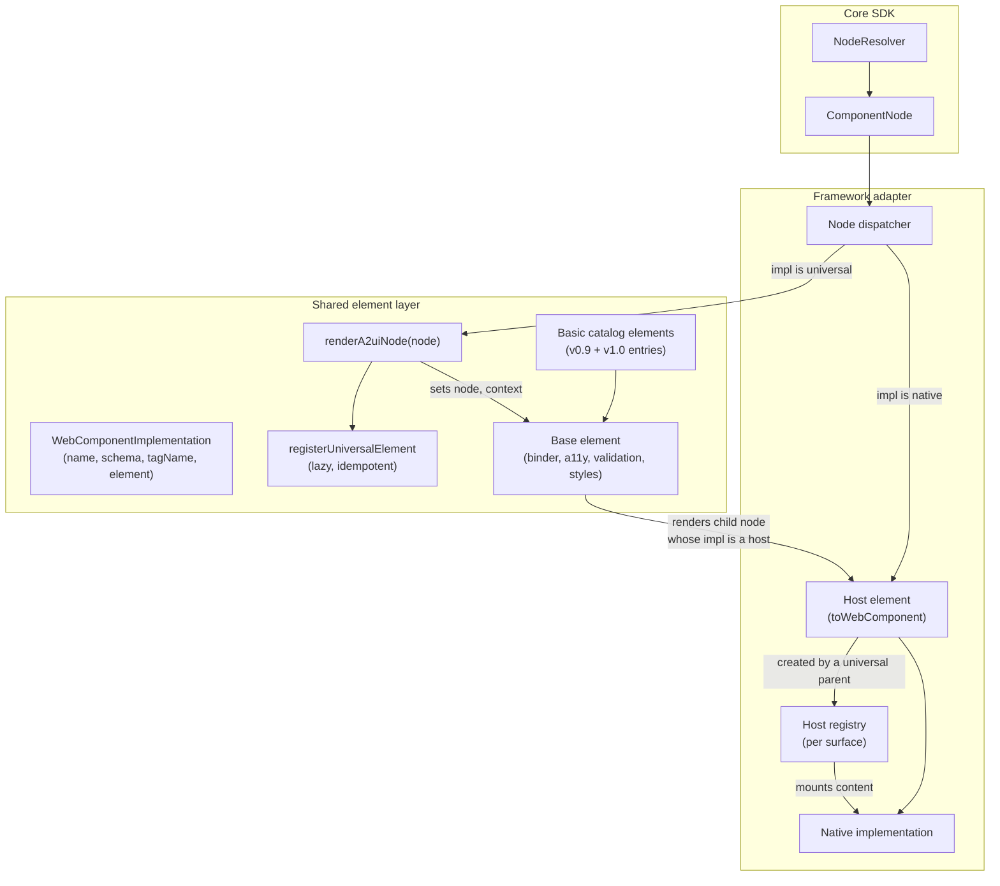

# **Universal Custom Elements Feature Blueprint**

This document specifies how framework adapters on one host platform share component implementations through the platform's element registry. On the web, that registry is Custom Elements: an implementation is a custom element class with a tag name, and any adapter that can create a DOM element can render it. One set of basic catalog elements then serves every web adapter, and an application can mix elements from one framework with native components from another on a single surface.

The feature is optional. An adapter on a platform without a shared element registry (Flutter, SwiftUI) does not implement it. An adapter that implements it still satisfies the [framework adapter blueprint](../modules/a2ui_framework_adapter.blueprint.md) in full: the node tree, the dispatcher, and the lifecycle rules are unchanged. This feature only changes what a `ComponentImplementation` can be and how a node becomes an element.

---

## **Requirements**

### **1. Implementation type**

- A universal implementation is a catalog entry (`ComponentApi`: `name`, `schema`) plus the element that renders it: a `tagName` and an `element` class. It is called `WebComponentImplementation` here.
- One element class MAY serve several protocol versions. Each versioned catalog pairs the class with its own `ComponentApi`, so the element and tag name are shared while the schema follows the catalog. A helper, `toWebComponentImplementation(element, api)`, produces the entry from the two.
- A type guard, `isWebComponentImplementation(entry)`, tells a universal entry from a framework-native one. A catalog MAY hold both kinds.

### **2. Element contract**

- An element exposes two settable properties: `node`, the resolved `ComponentNode` it renders, and `context`, the binding context Core resolved for that node. A renderer sets `node`; setting `node` also sets `context` from `node.context`.
- When both are set, `node` wins: the element takes its context (`node.context`) and its children from the node. An element that only reads `context` keeps working.
- An element binds itself when `node` or `context` is assigned, rebinds when it is reassigned to a different node, and tolerates both being unset while detached or rendered standalone.
- An element renders its own children: for each child node in its resolved props it renders that node's element (requirement 4). It does not ask its parent to do so.

### **3. Registration**

- Registration is lazy: an element is defined in the registry the first time a node with that implementation is rendered, not when the catalog is built.
- Registration is idempotent. Defining the same class under the same tag name twice is a no-op. Defining a different class under an already-registered tag name is an error raised at the call site, not a silent override.
- In an environment with no element registry (server-side rendering), registration reports the problem once and returns. The rest of the surface still resolves.

### **4. Rendering a node as an element**

- A function, `renderA2uiNode(node)`, renders a resolved node as its implementation's element: it registers the element if needed, creates one element per child position, assigns `node` and `node.context`, and returns the element to the host framework.
- A placeholder node (`isPlaceholder`), a disposed node, a node with no `context`, or a node whose implementation is not universal renders nothing from this path. The adapter's own dispatcher handles those cases as the module blueprint describes.
- A parent re-render reuses the element at each child position. The element is replaced only when the tag name at that position changes.

### **5. Hosting framework-native implementations**

An adapter whose implementations are not elements (React function components, Angular components) makes them reachable by tag name so that a universal container can render them as children:

- `toWebComponent(implementation)` wraps a native entry in a **host element**: a `WebComponentImplementation` with the same `name` and `schema`, a generated tag name, and an element class that holds no implementation. Calling it twice for one entry returns the same wrapper. An entry that already is an element is returned as is.
- The generated tag name is `a2ui-<framework>-<name>` in lowercase; a second entry with the same name gets a numeric suffix. Each wrapper gets its own element class, because a registry refuses to define one class under two tag names.
- When the adapter's own dispatcher creates a host element, the node's content renders as the element's children in the usual way.
- When a universal element creates a host element (a universal `Column` rendering a native `Badge`), the host registers itself with its surface's **host registry** under the nearest adapter-rendered element above it in the DOM. That ancestor's view mounts the node's content into the host. The adapter tree then nests like the DOM, so ambient context, error boundaries, and events pass through a universal element in between.
- A host that is disconnected and reconnected within one task keeps its registration and its mounted state.
- The adapter prepares every catalog on the surface this way, `defaultCatalog` and each entry of `availableCatalogs`, before it renders the first node. A native entry in a secondary catalog that was not wrapped cannot be rendered by a universal container.

### **6. Styling**

- Elements render into the light DOM by default, so the application's stylesheet reaches them and framework components can be composed inside them. An element MAY opt into shadow DOM.
- An element's own styles are adopted once per document or shadow root and scoped to its tag name, so that two elements with the same selectors do not leak styles into each other.
- Elements style themselves from CSS custom properties with documented names and defaults. They read no styling from the protocol: a surface at v1.0 or later carries no `theme`, and the element layer MUST NOT depend on one. A legacy v0.9 theme, where an adapter still supports it, is applied by setting the same custom properties from outside the element. (In the current reference layer, `BasicCatalogA2uiLitElement` still reads `context.theme.primaryColor` on the element itself for v0.9 surfaces; that is a known deviation.)

### **7. Shared basic catalog**

- The basic catalog ships once, as universal elements in the shared layer, with one `WebComponentImplementation` per element per supported protocol version. Framework packages register these entries; they do not reimplement the basic catalog.
- The shared base element applies the module blueprint's cross-cutting rules for every element that extends it: the `accessibility` attribute mapping and the rendering of validation messages. A custom element that extends the base gets both without extra work.

### **8. Lifecycle**

- An element creates its binder or controller when it is first bound and reuses it while it is reassigned the same component at the same data path. It disposes the binder when it is bound to a different component.
- An element MUST also dispose its binder when it is disconnected from the document and not reconnected within the same task. A disconnected element that keeps its binder keeps the data model subscriptions with it. (In the current reference layer, `A2uiController.hostDisconnected` unsubscribes its update listeners on disconnect but disposes the binder only when the context is replaced; that is a known deviation.)
- When a node is disposed, the element renders nothing; the adapter's dispatcher removes the element when the parent re-renders.

---

## **Detailed Description of Changes**

### **How the pieces fit**



### **Two trees, one nesting**

A surface rendered this way has two trees that must agree: the DOM, which the elements own, and the adapter's view tree, which owns ambient context and error handling. A native implementation rendered by the adapter's dispatcher sits in both at the same place. A native implementation created by a universal parent sits in the DOM where the parent put it, and the host registry puts its view content under the nearest adapter-rendered ancestor, so the view tree nests the same way. Without the registry, the content would mount at the surface root and lose its ancestors' context.

### **Interfaces**

The blocks below use the core blueprint's notation. Names are normative; parameter spelling follows each language.

```typescript
/** A catalog entry rendered by an element registered under `tagName`. */
interface WebComponentImplementation extends ComponentApi {
  readonly tagName: string;
  readonly element: ElementClass;
}

/** Pairs an element class that declares its own tag name with one version's API. */
function toWebComponentImplementation(
  element: ElementClass & {tagName: string},
  api: ComponentApi,
): WebComponentImplementation;

function isWebComponentImplementation(entry: unknown): entry is WebComponentImplementation;

/** Defines the element once; throws if `tagName` is taken by another class. */
function registerUniversalElement(impl: WebComponentImplementation): void;

/** Renders a resolved node as its element, or nothing for a placeholder or non-universal node. */
function renderA2uiNode(node: ComponentNode): HostView;

/** The properties every element accepts from the renderer that creates it. */
interface A2uiWebComponentElement extends HTMLElement {
  node?: ComponentNode;
  context?: ComponentContext;
}

/** Adapter side: wraps a native entry in a host element with a generated tag. */
function toWebComponent(
  impl: ComponentImplementation | WebComponentImplementation,
): WebComponentImplementation;
```

### **Changes to the framework adapter contract**

1. **Implementation kinds.** A catalog may hold native entries and universal entries side by side. The dispatcher branches on `isWebComponentImplementation(node.impl)`.
2. **Preparation covers every catalog.** The module blueprint already requires this; here it is load-bearing, because a universal container renders children by tag name and cannot fall back to the adapter's dispatcher.
3. **Cross-cutting rules move to the base element.** Accessibility mapping and validation rendering are implemented once in the shared base element rather than in each adapter.

---

## **Links**

- Framework adapter blueprint: [`a2ui_framework_adapter.blueprint.md`](../modules/a2ui_framework_adapter.blueprint.md)
- Node resolution feature: [`node_resolution.blueprint.md`](node_resolution.blueprint.md)
- Reference shared layer: [`typescript/web_core/src/universal`](../../typescript/web_core/src/universal) (`a2ui-lit-element.ts`, `a2ui-controller.ts`, `render-a2ui-node.ts`, `register_universal_element.ts`, `to_web_component_implementation.ts`, `basic_catalog/components/`)
- Reference host adapters: React [`renderers/react/src/catalog`](../../renderers/react/src/catalog) and [`host_registry.ts`](../../renderers/react/src/host_registry.ts); Angular [`renderers/angular/src/catalog`](../../renderers/angular/src/catalog)
- Accessibility requirements: [protocol v1.0, Catalog-Agnostic Accessibility Requirements](../../specification/v1_0/docs/a2ui_protocol.md#catalog-agnostic-accessibility-requirements)

---

## **Test Cases & Conformance**

These cases run in each adapter that implements the feature. They are framework tests, not entries in `conformance/core/`.

- **Implementation type**
  - One element class paired with a v0.9 API and a v1.0 API yields two entries with the same `tagName` and different schemas, and both render.
  - `isWebComponentImplementation` is true for an element entry and false for a native entry.
- **Registration**
  - Rendering two nodes of one type defines the element once.
  - Registering a different class under a taken tag name throws.
- **Rendering**
  - A placeholder node renders no element; when the component arrives, the element appears at the same position.
  - A parent re-render keeps the same element object at each child position.
- **Hosting**
  - A universal container whose child is a native implementation renders the child inside the container's element.
  - That child receives the ambient context of the adapter view above the container, not the surface root's.
  - A native child in a secondary catalog renders when the catalog was prepared.
  - A host moved within the DOM in one task keeps its mounted state.
- **Styling**
  - Two different elements with the same internal selector do not style each other.
  - A `createSurface` at v1.0 or later with a `theme` object renders exactly as one without it.
- **Shared basic catalog**
  - `accessibility.label` on a basic catalog component appears as the platform label attribute on the element.
  - A failed check with severity `error` renders its message; the element's action is disabled.
- **Lifecycle**
  - Disconnecting an element and not reconnecting it releases its data model subscriptions.
  - Reassigning the same component at the same path does not recreate the binder.

---

## **Implementation Steps**

1. **Shared layer.** Define `WebComponentImplementation`, `toWebComponentImplementation`, `isWebComponentImplementation`, `registerUniversalElement`, and `renderA2uiNode`. Define the base element with `node`/`context` binding, light DOM styling, accessibility mapping, and validation rendering.
2. **Basic catalog.** Implement the basic catalog elements on the base element and publish one entry set per supported protocol version.
3. **Adapter hosting.** In each framework adapter, implement `toWebComponent`, the host element, the per-surface host registry, and the preparation pass over `defaultCatalog` and `availableCatalogs`.
4. **Dispatcher.** Branch the node dispatcher on the implementation kind and route universal nodes through `renderA2uiNode`.
5. **Tests.** Cover the cases above in each adapter, and record the feature in the adapter's codebase blueprint under `implemented_features`.
