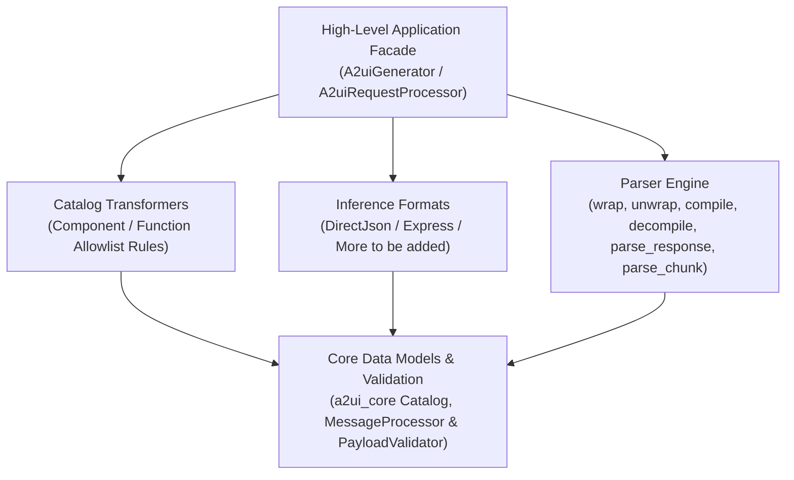

# Agent SDK Development Guide

This document describes the architecture of an A2UI Agent SDK. The design separates concerns into distinct layers to follow a similar structure for consistency across languages, providing a streamlined developer experience for building AI agents that generate rich UI.

The Agent SDK is responsible for:

- **Catalog management**
- **Capability negotiation**
- **Prompt engineering**
- **Response parsing**
- **Payload validation**
- **Transport packaging**

It enables Large Language Models (LLMs) and autonomous agents to understand available UI capabilities and ensures that generated UI payloads conform strictly to negotiated specification contracts before transmission to client renderers.

---

## 1. Unified Architecture Overview

The Agent SDK architecture introduces a clear separation between **low-level single-responsibility primitives** and a **high-level application manager facade**:



1. **Decoupled Primitive Layer**:
   - **Catalog Representation**: Directly uses canonical `Catalog` models from `a2ui_core`.
   - **Catalog Transformers**: Standalone rule sets (`CatalogTransformer`, `ComponentPruningTransformer`, `FunctionPruningTransformer`) for filtering component definitions and function signatures from pristine catalogs.
   - **Inference Formats**: Strategy facades (`InferenceFormat`, `InferenceFormatFactory`) pairing format-specific prompt generators (`PromptGenerator`) and parsers (`Parser`). Supported strategies include `DirectJsonFormat` and `ExpressFormat`.
   - **Prompt Generators**: Format builders consuming transformed catalogs and prompt examples to generate system instruction snippets.
   - **Parsers**: Response extraction engines performing tag detection (`has_format_content`), tag unwrapping (`unwrap`) and wrapping (`wrap`), syntax compilation (`compile`) and decompilation (`decompile`). A format whose notation can be read incrementally also implements streaming chunk processing (`parse_chunk`).
   - **Validation Layer**: Reaches `a2ui_core` validation through `MessageProcessor`, which holds every active catalog, resolves each item to the catalog it belongs to, and delegates the item to that catalog's `PayloadValidator`. Protocol version branching (`v0_8`, `v0_9`, `v0_9_1`, `v1_0`) is handled by the core version adapters.
2. **Encapsulated Application Processor**:
   - `CatalogConfig`: Configuration dataclass pairing a resolved `Catalog` with the custom transformers to apply to it. A `CatalogProvider` (`FileSystemCatalogProvider`, `InMemoryCatalogProvider`) is how a catalog document becomes that `Catalog`, but the config holds the result rather than the provider.
   - `A2uiGenerator`: Agent-level lifecycle manager holding supported `CatalogConfig`s, generating pre-negotiated `A2uiRequestProcessor` instances per renderer capability signature.
   - `A2uiRequestProcessor`: Central processor facade object unifying multi-catalog capability resolution (`resolve_catalogs`), system prompt snippet rendering, turn-scoped parser creation, and response validation.

---

## 2. Directory & Package Structure

All SDK implementations of `a2ui_agent` must maintain a standardized directory layout similar to the Python SDK under `python/a2ui_agent/`.

```
a2ui_agent/
├── processor/                 # High-level application facade package
│   ├── catalog_config         # CatalogConfig structure for catalog registration
│   ├── processor              # A2uiRequestProcessor facade implementation
│   ├── generator              # A2uiGenerator class
│   └── catalog_providers      # Catalog provider classes
├── inference_format           # Abstract InferenceFormat & InferenceFormatFactory facades
├── inference_formats/         # Concrete inference format strategy implementations
│   ├── direct_json/           # Self-contained Direct JSON format package
│   │   ├── format             # DirectJsonFormat, DirectJsonFormatFactory
│   │   ├── prompt_generator   # DirectJsonPromptGenerator
│   │   └── parser             # DirectJsonParser class, including parse_chunk streaming
│   └── express/               # Self-contained Express DSL format package
│       ├── format             # ExpressFormat, ExpressFormatFactory
│       ├── compiler           # ExpressCompiler class
│       ├── decompiler         # ExpressDecompiler class
│       ├── parser             # ExpressParser class
│       └── prompt_generator   # ExpressPromptGenerator class
├── parser/                    # Common Parser contracts and data structures
│   ├── parser                 # Abstract Parser base class
│   └── response_part          # RawResponsePart, RawA2uiPart, TextPart, A2uiPart data structures
├── prompt/                    # Prompt Generation contracts
│   └── generator              # Abstract PromptGenerator base class
├── catalog_transformers/      # Catalog and Protocol Transformers
│   ├── base                   # Abstract CatalogTransformer class
│   └── pruning                # ComponentPruningTransformer, FunctionPruningTransformer
└── utils/                     # Utility helpers layer
    └── catalog_resolver       # resolve_catalogs capability resolution function
```

---

## 3. Interface Specification

### A. Catalog Representation & Catalog Transformers

The Agent SDK uses `a2ui.core.Catalog` directly as the canonical model representing component definitions, function signatures, and theme schemas.

#### `CatalogTransformer`

Abstract base interface for transformation rules applied to catalog schemas prior to prompt engineering and payload validation.

```python
TComponent = TypeVar("TComponent", bound=ComponentApi)
TFunction = TypeVar("TFunction", bound=FunctionApi)

class CatalogTransformer(ABC):
    """Abstract base interface for transformation rules applied to catalog schemas."""

    @abstractmethod
    def transform(
        self, catalog: Catalog[TComponent, TFunction]
    ) -> Catalog[TComponent, TFunction]:
        """Transforms a Catalog into a modified Catalog of the same component and function types."""
        pass
```

#### `ComponentPruningTransformer`

Prunes catalog component definitions to an allowlist of allowed components.

```python
class ComponentPruningTransformer(CatalogTransformer):
    """Prunes catalog component definitions to an allowlist of allowed components."""

    def __init__(self, allowed_components: Sequence[str]):
        self.allowed_components = set(allowed_components)

    def transform(
        self, catalog: Catalog[TComponent, TFunction]
    ) -> Catalog[TComponent, TFunction]:
        """Returns a new Catalog filtered to only include components in allowed_components."""
        pass
```

#### `FunctionPruningTransformer`

Prunes catalog function definitions to an allowlist of allowed renderer-side validation rules and logic functions.

```python
class FunctionPruningTransformer(CatalogTransformer):
    """Prunes catalog function definitions to an allowlist of allowed functions."""

    def __init__(self, allowed_functions: Sequence[str]):
        self.allowed_functions = set(allowed_functions)

    def transform(
        self, catalog: Catalog[TComponent, TFunction]
    ) -> Catalog[TComponent, TFunction]:
        """Returns a new Catalog filtered to only include functions in allowed_functions."""
        pass
```

---

### B. Prompt Generation Layer (`a2ui.prompt`)

#### `PromptGenerator`

Abstract base interface for constructing system prompt instruction snippets across inference formats.

```python
class PromptGenerator(ABC):
    """Abstract base class for format-specific prompt generators.

    Attributes:
        catalogs: List of active Catalog instances to include in the system instructions.
        examples: Optional ordered list of prompt example turns. Each item is the list of
            AgentToRendererMessage objects making up one example turn, rendered into the
            snippet in the order given. An example carries no label of its own: what the
            model learns from it is the payload, so a description would be the prompt
            author's prose rather than part of the contract.
    """

    def __init__(
        self,
        catalogs: Sequence[Catalog[TComponent, TFunction]],
        examples: Optional[Sequence[Sequence[AgentToRendererMessage]]] = None,
    ):
        self.catalogs = catalogs
        self.examples = examples

    @abstractmethod
    def generate(self) -> str:
        """
        Renders format-specific system prompt instructions and catalog schemas.
        The caller (Agent / Framework) prepends role/workflow preambles and appends suffixes.
        """
        pass
```

---

### C. Common Parser Package (`a2ui.parser`)

#### Response Part Structures

```python
@dataclass
class TextPart:
    """Represents extracted conversational text from an LLM response.

    Attributes:
        text: The conversational text content intended for user display.
    """
    text: str

@dataclass
class RawA2uiPart:
    """Represents an uncompiled A2UI format content block extracted from an LLM response.

    Attributes:
        a2ui_raw: The raw uncompiled format content string (e.g., raw XML/DSL/JSON).
    """
    a2ui_raw: str

@dataclass
class RawResponsePart:
    """Represents an uncompiled token from an LLM response stream.

    Attributes:
        part: The underlying content, either conversational TextPart or uncompiled RawA2uiPart.
        is_final: Whether this part is complete/closed (not truncated during streaming).
    """
    part: Union[TextPart, RawA2uiPart]
    is_final: bool = True

@dataclass
class A2uiPart:
    """Represents extracted and compiled A2UI payload messages.

    Attributes:
        a2ui: List of validated AgentToRendererMessage objects to deliver to client renderers.
    """
    a2ui: list[AgentToRendererMessage]

ResponsePart = Union[TextPart, A2uiPart]
```

#### `Parser`

Base interface for response parsers across all inference format strategies.

```python
class Parser(ABC):
    """Abstract base class for response parsers.

    Responsible for tokenizing LLM output streams, unwrapping format tags, and compiling raw format
    expressions into standard A2UI payload messages.
    """

    @abstractmethod
    def has_format_content(self, content: str, complete: bool = False) -> bool:
        """Reports whether the content carries a block written in this format.

        A caller uses this to decide whether a response is this format's business at all,
        without paying for a parse. It reads the sentinel tags only and never compiles.

        Args:
            content: Raw string response emitted by the LLM, possibly partial.
            complete: Whether to require a closed block. False matches an opening tag on
                its own, which is what a streaming caller needs to know it has started
                receiving a payload.

        Returns:
            True when the content carries a block belonging to this format.
        """
        pass

    @abstractmethod
    def wrap(self, blocks: Sequence[RawResponsePart]) -> str:
        """Converts a sequence of RawResponseParts to a string, adding enclosing tags or markers around each raw A2UI section and concatenating conversational text parts."""
        pass

    @abstractmethod
    def unwrap(self, content: str) -> list[RawResponsePart]:
        """Tokenizes the LLM response into an ordered list of RawResponsePart objects, extracting raw format content between sentinel tags while preserving chronological order.

        Args:
            content: Raw string response emitted by the LLM.

        Returns:
            An ordered list of RawResponsePart objects representing alternating slices of
            conversational text and tagged A2UI payload blocks exactly as emitted by the LLM.
        """
        pass

    @abstractmethod
    def compile(self, format_content: str) -> list[AgentToRendererMessage]:
        """Compiles a raw format content string into a list of validated A2UI message structures.

        Args:
            format_content: The uncompiled raw payload string (e.g. raw JSON or DSL expression).

        Returns:
            List of compiled AgentToRendererMessage objects.
        """
        pass

    @abstractmethod
    def decompile(self, a2ui_payload: Sequence[AgentToRendererMessage]) -> str:
        """Decompiles structured A2UI payload messages into this format's raw notation.

        Args:
            a2ui_payload: List of AgentToRendererMessage objects to convert to raw format text.

        Returns:
            Raw format content string representing the messages.
        """
        pass

    def parse_response(self, content: str, wrapped: bool = True) -> list[ResponsePart]:
        """Generic non-streaming response parsing. Unwraps raw LLM text and compiles valid A2UI payloads,
        preserving the exact chronological order of conversational text and A2UI payload blocks.

        Args:
            content: Complete raw text response emitted by the LLM.
            wrapped: Whether the output is expected to be wrapped inside format sentinel tags.

        Returns:
            List of ResponsePart objects (TextPart / A2uiPart).
        """
        if wrapped:
            parts = self.unwrap(content)
            result: list[ResponsePart] = []
            for raw_part in parts:
                if isinstance(raw_part.part, TextPart):
                    result.append(raw_part.part)
                elif isinstance(raw_part.part, RawA2uiPart):
                    compiled = self.compile(raw_part.part.a2ui_raw)
                    result.append(A2uiPart(a2ui=compiled))
            return result
        return [A2uiPart(a2ui=self.compile(content))]

    @property
    def supports_streaming(self) -> bool:
        """Whether this parser can read a response incrementally through parse_chunk.

        A format can only stream if a partial block already means something. Direct JSON
        can, because an unfinished object can be healed and re-read as it grows. Express
        cannot: its notation resolves references across the whole block, so a block is
        read once it is closed and not before. A parser that returns False here buffers
        the response and is parsed whole through parse_response.
        """
        return False

    def parse_chunk(self, chunk: str, wrapped: bool = True) -> list[ResponsePart]:
        """Processes streaming response chunks incrementally.

        Implemented only by parsers whose supports_streaming is True. The default refuses,
        so that a caller handed a non-streaming parser fails at the call rather than
        silently receiving nothing.

        Args:
            chunk: Incremental text chunk received from the LLM stream.
            wrapped: Whether the output stream is expected to be wrapped inside format sentinel tags.

        Returns:
            List of newly parsed ResponsePart objects (incremental delta) extracted since the last chunk.

        Raises:
            NotImplementedError: If this format does not support streaming.
        """
        raise NotImplementedError
```

---

### D. Validation Layer

Validation belongs to the `a2ui_core` package, and the Agent SDK does not maintain a
redundant validator wrapper. Core splits the work across two objects, and an agent
reaches validation through the first of them:

- **`MessageProcessor` (`a2ui.core.processing`)** is the entry point. It holds every
  active catalog, resolves each component and function call to the catalog it belongs to
  (the item's own `catalogId`, else the surface default, else the sole catalog), and hands
  the item to that catalog's validator. It also owns the checks that need more than one
  item: surface lifecycle, component uniqueness, root reachability, cycles, recursion
  depth caps, and data binding JSON Pointer syntax. A surface whose components come from
  several catalogs can only be checked here, which is why this and not the validator is
  what an agent calls.
- **`PayloadValidator` (`a2ui.core.validation`)** is scoped to exactly one catalog and
  checks exactly one item against it, through `validate_component`, `validate_function`
  and `validate_theme`. It cannot see a whole payload and cannot know which catalog an
  item belongs to, so it never decides routing.

Wire envelope structure is checked before either of them, by the core version adapter for
the protocol version the message declares. That is also where version branching across
`v0_8`, `v0_9`, `v0_9_1` and `v1_0` lives, so neither object above is version-aware.

See [`a2ui_core.blueprint.md`](a2ui_core.blueprint.md) for the full validation contract
and its implementation matrix.

#### Surface state during validation

A stateless check sees one outbound payload at a time, the agent-to-renderer messages the agent is about to send, with nothing else to compare it against. When that payload updates a surface it did not itself create, it carries no component tree, so a reference to a component the agent sent in an earlier payload cannot be resolved and is accepted.

An agent that keeps one `MessageProcessor` across a session and runs its own outbound messages through it holds that tree. References then resolve against the components the surface already has, and cycles are found across the whole surface instead of one payload at a time. The renderer runs these same checks when the payload arrives, so an agent that runs them first catches a bad payload before sending it rather than after.

---

### E. Inference Format Facades (`a2ui.inference_format`)

#### `InferenceFormatFactory` & `InferenceFormat`

```python
class InferenceFormatFactory(ABC):
    """Abstract interface for constructing InferenceFormat strategies bound to active catalogs."""

    @abstractmethod
    def create_format(
        self,
        catalogs: Sequence[Catalog[TComponent, TFunction]],
        examples: Optional[Sequence[Sequence[AgentToRendererMessage]]] = None,
    ) -> "InferenceFormat":
        """Constructs an InferenceFormat instance bound to the provided active catalogs.

        Args:
            catalogs: List of active Catalog instances.
            examples: Optional list of few-shot example turns, each a list of messages.

        Returns:
            An InferenceFormat strategy instance.
        """
        pass

class InferenceFormat(ABC):
    """Coordinator facade pairing a prompt generator (input) and parser (output) for a format."""

    @property
    @abstractmethod
    def prompt_generator(self) -> PromptGenerator:
        """Returns the format prompt generator instance."""
        pass

    @abstractmethod
    def create_parser(self) -> Parser:
        """Creates a new parser instance bound to this format strategy."""
        pass
```

---

### F. High-Level Application Facade (`a2ui.processor`)

#### Catalog Providers

A provider can be constructed with a catalog id and a protocol version. Each is both a
default and an assertion: when the document states the same field, the two must agree or
the load fails; when the document states nothing, the provider's value is used, and the
resulting catalog is no different from one that carried its own.

Neither field has a fallback default. A load fails when nothing names the catalog, since
nothing could then address it in `supportedCatalogIds` or `createSurface`, and it fails
when nothing states a version, since a document read under the wrong version
mis-validates every payload written against it. This is what the notes below about
`catalog_id` being undefined in v0.8 and `protocol_version` being undefined before v1.0
imply: a provider value would otherwise be useless for exactly the documents that need it
most.

Every failure a provider raises is a catalog error, whether it comes from a file that is
not there, a document that is not JSON, a declaration conflicting with the document, or
an id or version nobody stated.

```python
class CatalogProvider(ABC):
    """Abstract base class for loading catalog definitions."""

    @abstractmethod
    def load(self) -> Catalog[TComponent, TFunction]:
        """Loads and returns a Catalog definition instance."""
        pass

class FileSystemCatalogProvider(CatalogProvider):
    """Loads a catalog definition from a JSON file on the local filesystem."""

    def __init__(
        self,
        path: str,
        protocol_version: Optional[ProtocolVersion] = None,  # protocol_version is not defined before v1.0
        catalog_id: Optional[str] = None,        # catalog_id is not defined in v0.8
    ):
        """Initializes the filesystem catalog provider.

        Args:
            path: Absolute or relative filesystem path to the catalog JSON file.
            protocol_version: Optional expected A2ui protocol version for validation.
            catalog_id: Optional expected catalog ID for validation.
        """
        self.path = path
        self.protocol_version = protocol_version
        self.catalog_id = catalog_id

    def load(self) -> Catalog[TComponent, TFunction]:
        """Reads the catalog JSON file and returns a Catalog instance.

        If self.protocol_version or self.catalog_id are defined and the loaded catalog
        has protocol_version or catalog_id specified, verify they match; if they conflict, raise an error.
        """
        pass

class InMemoryCatalogProvider(CatalogProvider):
    """Loads a catalog definition from an in-memory dictionary schema."""

    def __init__(
        self,
        catalog: Mapping[str, Any],
        protocol_version: Optional[ProtocolVersion] = None,  # protocol_version is not defined before v1.0
        catalog_id: Optional[str] = None,        # catalog_id is not defined in v0.8
    ):
        """Initializes the in-memory provider.

        Args:
            catalog: Raw catalog schema dictionary.
            protocol_version: Optional expected A2ui protocol version for validation.
            catalog_id: Optional expected catalog ID for validation.
        """
        self.catalog = catalog
        self.protocol_version = protocol_version
        self.catalog_id = catalog_id

    def load(self) -> Catalog[TComponent, TFunction]:
        """Constructs and returns a Catalog instance from the raw schema dictionary.

        If self.protocol_version or self.catalog_id are defined and the loaded catalog
        has protocol_version or catalog_id specified, verify they match; if they conflict, raise an error.
        """
        pass
```

#### `CatalogConfig`

```python
@dataclass
class CatalogConfig:
    """Configuration model associating a component catalog definition with its transformations.

    Attributes:
        catalog: Base Catalog instance loaded via a CatalogProvider.
        transformers: Optional list of CatalogTransformer rules to apply sequentially.
    """
    catalog: Catalog[TComponent, TFunction]
    transformers: Optional[Sequence[CatalogTransformer]] = None

    @property
    def transformed_catalog(self) -> Catalog[TComponent, TFunction]:
        """Returns the Catalog after applying all configured transformers sequentially."""
        current = self.catalog
        if self.transformers:
            for t in self.transformers:
                current = t.transform(current)
        return current

    @classmethod
    def from_path(
        cls,
        catalog_path: str,
        transformers: Optional[Sequence[CatalogTransformer]] = None,
        protocol_version: Optional[ProtocolVersion] = None,
        catalog_id: Optional[str] = None,
    ) -> "CatalogConfig":
        """Factory method loading a Catalog from disk into a CatalogConfig.

        Args:
            catalog_path: Path to the catalog JSON file.
            transformers: Optional list of catalog transformers.
            protocol_version: Optional expected protocol version for validation.
            catalog_id: Optional expected catalog ID for validation.

        Returns:
            A CatalogConfig instance.
        """
        catalog = FileSystemCatalogProvider(
            catalog_path,
            protocol_version=protocol_version,
            catalog_id=catalog_id,
        ).load()
        return cls(catalog=catalog, transformers=transformers)
```

#### `A2uiGenerator`

```python
class A2uiGenerator:
    """Agent-level generator holding agent-supported catalogs and returning A2uiRequestProcessor instances per request renderer capabilities.

    Attributes:
        catalogs: Master list of CatalogConfig objects supported by the agent.
        examples: Optional list of few-shot example turns shared across sessions.
        factory: Default InferenceFormatFactory used when instantiating processors.
    """

    def __init__(
        self,
        catalogs: Sequence[CatalogConfig],
        examples: Optional[Sequence[Sequence[AgentToRendererMessage]]] = None,
        inference_format_factory: Optional[InferenceFormatFactory] = None,
    ):
        """Initializes A2uiGenerator with supported catalog configurations and format factory.

        Args:
            catalogs: List of supported CatalogConfig configurations.
            examples: Optional list of prompt example turns.
            inference_format_factory: Optional default InferenceFormatFactory (defaults to DirectJsonFormatFactory).
        """
        pass

    def create_processor(
        self,
        renderer_capabilities: A2uiRendererCapabilities,
        inference_format_factory: Optional[InferenceFormatFactory] = None,
    ) -> A2uiRequestProcessor:
        """Creates an A2uiRequestProcessor bound to the specified renderer capabilities.

        Args:
            renderer_capabilities: Capabilities sent by the client renderer. Must not be None.
            inference_format_factory: Optional override format factory for this processor.

        Returns:
            Pre-negotiated client-bound A2uiRequestProcessor instance.
        """
        pass
```

#### `A2uiRequestProcessor`

```python
class A2uiRequestProcessor:
    """Central request processor facade unifying multi-catalog capability resolution, prompt rendering, parser creation, and validation."""

    def __init__(
        self,
        catalogs: Sequence[Catalog[TComponent, TFunction]],
        examples: Optional[Sequence[Sequence[AgentToRendererMessage]]] = None,
        format_factory: Optional[InferenceFormatFactory] = None,
    ):
        """Initializes A2uiRequestProcessor, resolving active catalogs and instantiating validator and format strategy.

        Args:
            catalogs: List of active Catalog instances.
            examples: Optional list of prompt example turns.
            format_factory: Format factory for instantiating format strategies.
        """
        pass

    @property
    def active_catalogs(self) -> list[Catalog[TComponent, TFunction]]:
        """Returns the list of active negotiated Catalog instances for this processor."""
        pass

    @property
    def examples(self) -> Optional[list[list[AgentToRendererMessage]]]:
        """Returns the ordered list of prompt example turns."""
        pass

    @property
    def prompt_snippet(self) -> str:
        """Format-specific system prompt instruction snippet."""
        pass

    def parse_response(self, content: str) -> list[ResponsePart]:
        """Parses and validates the LLM response into ResponseParts."""
        pass
```

---

### G. Utility Helpers (`a2ui.utils`)

#### `resolve_catalogs` (`a2ui.utils.catalog_resolver`)

Negotiates renderer capabilities against a registered sequence of catalogs (`Sequence[CatalogConfig]`) to select matching active schemas for a session.

`A2uiRendererCapabilities` comes from `a2ui_core` and is a multi-version union, the same way `AgentToRendererMessage` is: it covers each supported protocol version's capabilities shape, including the v0.9 `A2uiClientCapabilities`. An agent that supports more than one protocol version accepts any member of that union here and must not assume the v1.0 shape.

```python
def resolve_catalogs(
    catalogs: Sequence[CatalogConfig],
    renderer_capabilities: A2uiRendererCapabilities,
    accepts_inline_catalogs: bool = False,
) -> list[Catalog[TComponent, TFunction]]:
    """Matches renderer capabilities against registered catalogs and returns active transformed Catalog objects.

    Resolution follows these rules:

    - A present but empty `supportedCatalogIds` with no inline catalogs raises a catalog
      error, because the renderer has said it can render nothing.
    - Active catalogs come back in the renderer's preference order rather than the
      agent's registration order, so the renderer's first choice is the first catalog
      the model reads about.

    The catalogs returned are the transformed ones, so a pruning transformer is visible
    both in the prompt snippet and in what the processor will later accept.
    """
    pass
```

---

## 4. Inference Format Strategy Implementations

### A. DIRECT_JSON Format (`a2ui.inference_formats.direct_json`)

Standard A2UI JSON payload format enclosed in `<a2ui-json>` sentinel tags.

```python
class DirectJsonFormatFactory(InferenceFormatFactory):
    """Factory for instantiating DirectJsonFormat strategies bound to active catalogs."""

    def create_format(
        self,
        catalogs: Sequence[Catalog[TComponent, TFunction]],
        examples: Optional[Sequence[Sequence[AgentToRendererMessage]]] = None,
    ) -> InferenceFormat:
        """Constructs a DirectJsonFormat instance bound to the provided active catalogs.

        Args:
            catalogs: List of active Catalog instances.
            examples: Optional list of prompt example turns.

        Returns:
            DirectJsonFormat strategy instance.
        """
        return DirectJsonFormat(catalogs=catalogs, examples=examples)

class DirectJsonFormat(InferenceFormat):
    """Coordinator facade pairing DirectJsonPromptGenerator and DirectJsonParser."""

    def __init__(
        self,
        catalogs: Sequence[Catalog[TComponent, TFunction]],
        examples: Optional[Sequence[Sequence[AgentToRendererMessage]]] = None,
        allowed_messages: Optional[Sequence[str]] = None,
    ):
        """Initializes DirectJsonFormat with active catalogs, examples, and allowed message types.

        Args:
            catalogs: Active Catalog instances.
            examples: Optional list of prompt example turns.
            allowed_messages: Optional list of allowed payload envelope names.
        """
        self._prompt_generator = DirectJsonPromptGenerator(
            catalogs, examples=examples, allowed_messages=allowed_messages
        )
        self._catalogs = catalogs

    @property
    def prompt_generator(self) -> DirectJsonPromptGenerator:
        """Returns the DirectJsonPromptGenerator instance."""
        return self._prompt_generator

    def create_parser(self) -> DirectJsonParser:
        """Creates a fresh DirectJsonParser instance bound to active catalogs."""
        return DirectJsonParser(catalogs=self._catalogs)

class DirectJsonPromptGenerator(PromptGenerator):
    """Formats standard JSON schema system prompt instructions enclosed in <a2ui-json> tags."""

    def __init__(
        self,
        catalogs: Sequence[Catalog[TComponent, TFunction]],
        examples: Optional[Sequence[Sequence[AgentToRendererMessage]]] = None,
        allowed_messages: Optional[Sequence[str]] = None,
    ):
        """Initializes DirectJsonPromptGenerator.

        Args:
            catalogs: Active Catalog instances.
            examples: Optional list of prompt example turns.
            allowed_messages: Optional list of allowed payload envelope names.
        """
        super().__init__(catalogs, examples)
        self.allowed_messages = allowed_messages

    def generate(self) -> str:
        """Renders system instructions containing pruned JSON schemas inside <a2ui_schema> tags and <a2ui-json> output instructions.

        Returns:
            Formatted system prompt instruction snippet string.
        """
        pass

class DirectJsonParser(Parser):
    """Parser for standard A2UI JSON payload envelopes enclosed in <a2ui-json> sentinel tags."""

    def __init__(
        self,
        catalogs: Sequence[Catalog[TComponent, TFunction]],
        custom_progressive_keys: Optional[frozenset[str]] = None,
    ):
        """Initializes DirectJsonParser.

        Args:
            catalogs: Active Catalog instances for validation.
            custom_progressive_keys: Optional override set of string keys for progressive token healing.
        """
        self.catalogs = catalogs
        self.custom_progressive_keys = custom_progressive_keys

    @property
    def supports_streaming(self) -> bool:
        """Direct JSON reads incrementally, so this parser implements parse_chunk."""
        return True

    @property
    def progressive_keys(self) -> frozenset[str]:
        """Returns the set of string property keys safe to auto-close/heal when fragmented in streaming mode."""
        pass

    def compile(self, format_content: str) -> list[AgentToRendererMessage]:
        """Parses and fixes JSON payload content string into AgentToRendererMessage objects.

        Args:
            format_content: Raw JSON string extracted from <a2ui-json> tags.

        Returns:
            List of compiled AgentToRendererMessage objects.
        """
        pass

    def decompile(self, a2ui_payload: Sequence[AgentToRendererMessage]) -> str:
        """Decompiles AgentToRendererMessage list into standard formatted A2UI JSON string.

        Args:
            a2ui_payload: List of AgentToRendererMessage objects.

        Returns:
            Formatted A2UI JSON string representation.
        """
        pass

    def parse_chunk(self, chunk: str, wrapped: bool = True) -> list[ResponsePart]:
        """Processes streaming response chunks, auto-healing progressive_keys in real time.

        Args:
            chunk: Incremental text chunk received from LLM stream.
            wrapped: Whether output is wrapped in sentinel tags.

        Returns:
            List of newly parsed ResponsePart objects.
        """
        pass
```

---

### B. EXPRESS Format (`a2ui.inference_formats.express`)

Compact functional DSL format designed to reduce output token consumption, enclosed in `<a2ui>` sentinel tags. For formal grammar and syntax specification, see [Express Specification](../../specification/proposals/express/a2ui_express.md) and [Express Grammar](../../specification/inference_formats/express/Express.g4).

The Express format package under `a2ui/inference_formats/express/` contains:

- `format`: `ExpressFormatFactory` (subclassing `InferenceFormatFactory`) and `ExpressFormat` (subclassing `InferenceFormat`).
- `prompt_generator`: `ExpressPromptGenerator` (subclassing `PromptGenerator`), rendering compact positional signatures for catalog components and functions into prompt instructions.
- `compiler`: `ExpressCompiler`, lexing and parsing the DSL expressions found between `<a2ui>` tags into standard `AgentToRendererMessage` list structures.
- `decompiler`: `ExpressDecompiler`, converting `AgentToRendererMessage` payload lists back into Express DSL string format.
- `parser`: `ExpressParser` (subclassing `Parser`), delegating compilation and decompilation to `ExpressCompiler` and `ExpressDecompiler`.

Express does not stream. `ExpressParser.supports_streaming` is False and it does not implement `parse_chunk`: an Express block resolves references across its whole body, so a partial block names components that are not yet defined and cannot be compiled into anything. An agent using Express buffers the response and parses it whole.

---

## 5. Agent Workflow & Execution Walkthroughs

### Code Example

```python
# 1. Agent Startup: Initialize long-lived A2uiGenerator with agent catalogs.
#    Note: Prompt examples passed here are validated internally during processor creation
#    (create_processor) against active negotiated catalogs, raising A2uiValidationError if
#    any example uses components or structures not supported by the active catalog.
generator = A2uiGenerator(
    catalogs=[
        CatalogConfig(BasicCatalog("v1.0")),
        CatalogConfig.from_path("./catalogs/custom_catalog.json"),
    ],
    examples=load_examples("./prompts/examples/**")
)

# 2. In Request Handler: Retrieve pre-negotiated A2uiRequestProcessor matching renderer capabilities
processor = generator.create_processor(renderer_capabilities)

# 3. Invoke LLM to generate the output
llm_output_text = myagent.call_llm(processor.prompt_snippet, request_context)

# 4. Parse and validate output using the processor
response_parts = processor.parse_response(llm_output_text)

# 5. Deliver A2UI payloads to the renderer
```

---

## 6. Conformance Test Plan

To ensure behavioral parity across all SDK implementations (Python, Kotlin, etc.), the project maintains a language-agnostic conformance suite.

The suites covering this document live under `conformance/agent/`:

| Suite                                 | Covers                                                                                          |
| ------------------------------------- | ----------------------------------------------------------------------------------------------- |
| `<format>/compiler.yaml`              | `Parser.compile`: what a block of that format means                                             |
| `<format>/decompiler.yaml`            | `Parser.decompile`: how messages are written back into that format                              |
| `<format>/response_parser.yaml`       | `Parser.wrap`, `unwrap` and `parse_response`: where a payload begins and ends                   |
| `<format>/prompt_generator.yaml`      | `PromptGenerator.generate`: what the system prompt snippet has to tell the model                |
| `direct_json/response_streaming.yaml` | `Parser.parse_chunk`, for the one format that streams                                           |
| `catalog_provider.yaml`               | `CatalogProvider.load` and the checks it makes on a document                                    |
| `request_processor.yaml`              | `InferenceFormatFactory.create_format`, `A2uiGenerator.create_processor` and `resolve_catalogs` |

There is no `express/response_streaming.yaml`, because Express does not stream. Suites under `conformance/agent/legacy/` describe the earlier interface still implemented by `agent_sdks/python/a2ui_agent` and `kotlin/agent_sdk_legacy`, and stay until those SDKs move to the interface above.

Where a suite fixes something this document leaves open, the decision is stated in that suite's header rather than left for a reader to infer from the cases.

For complete setup instructions, test harness requirements, suite descriptions, and schema definitions, see [Conformance README](../../conformance/README.md).
