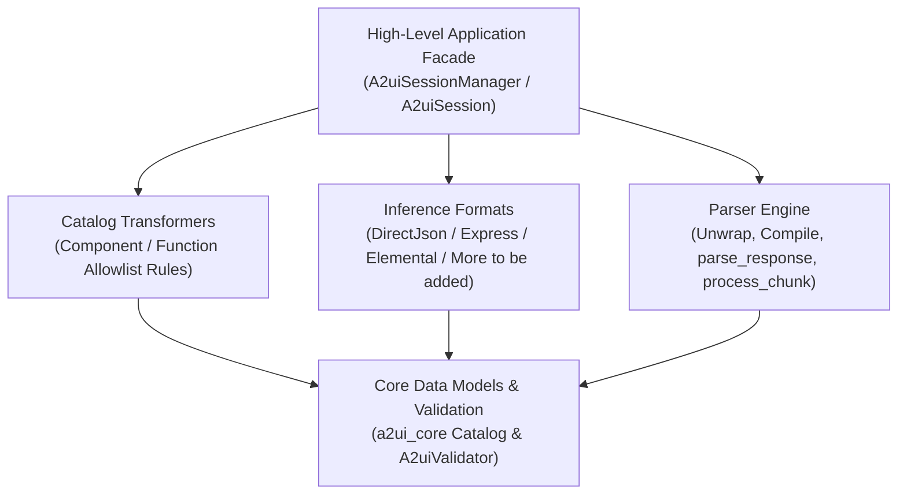

# Agent SDK Development Guide

This document describes the architecture of an A2UI Agent SDK. The design separates concerns into distinct layers to follow a similar structure for consistency across languages, providing a streamlined developer experience for building AI agents that generate rich UI.

The Agent SDK is responsible for:

- **Catalog management**
- **Capability negotiation**
- **Prompt engineering**
- **Response parsing**
- **Payload validation**
- **Transport packaging**

It enables Large Language Models (LLMs) and autonomous agents to understand available UI capabilities and ensures that generated UI payloads conform strictly to negotiated specification contracts before transmission to client renderers.

---

## 1. Unified Architecture Overview

The Agent SDK architecture introduces a clear separation between **low-level single-responsibility primitives** and a **high-level application manager facade**:



1. **Decoupled Primitive Layer**:
   - **Catalog Representation**: Directly uses canonical `Catalog` models from `a2ui_core`.
   - **Catalog Transformers**: Standalone rule sets (`CatalogTransformer`, `ComponentPruningTransformer`, `FunctionPruningTransformer`) for filtering component definitions and function signatures from pristine catalogs.
   - **Inference Formats**: Strategy facades (`InferenceFormat`, `InferenceFormatFactory`) pairing format-specific prompt generators (`PromptGenerator`) and parsers (`Parser`). Supported strategies include `DirectJsonFormat`, `ExpressFormat`, and `ElementalFormat`.
   - **Prompt Generators**: Format builders consuming transformed catalogs and prompt examples to generate system instruction snippets.
   - **Parsers**: Response extraction engines performing tag unwrapping (`unwrap`), streaming chunk processing (`process_chunk`), syntax compilation (`compile`) and decompilation (`decompile`).
   - **Validation Layer**: Leverages core `A2uiValidator` capabilities directly from `a2ui_core`, natively supporting protocol version branching (`v0_8`, `v0_9`, `v0_9_1`, `v1_0`).
2. **Encapsulated Application Session**:
   - `CatalogConfig`: Configuration dataclass encapsulating catalog providers (`BundledCatalogProvider`, `FileSystemCatalogProvider`, `InMemoryCatalogProvider`), custom transformers, and examples.
   - `A2uiSessionManager`: Agent-level lifecycle manager holding supported `CatalogConfigs`, caching pre-negotiated `A2uiSession` instances per renderer capability signature.
   - `A2uiSession`: Central session facade object unifying multi-catalog capability resolution (`resolve_catalogs`), system prompt snippet rendering, turn-scoped parser creation, and response validation.

---

## 2. Directory & Package Structure

All SDK implementations of `a2ui_agent` must maintain a standardized directory layout similar to the Python SDK under `python/a2ui_agent/`.

```
a2ui/agent/
├── session/                   # High-level application facade package
│   ├── catalog_config         # CatalogConfig structure for catalog registration
│   ├── session                # A2uiSession facade implementation
│   ├── session_manager        # A2uiSessionManager class
│   └── catalog_providers      # Catalog provider classes
├── inference_format           # Abstract InferenceFormat & InferenceFormatFactory facades
├── inference_formats/         # Concrete inference format strategy implementations
│   ├── direct_json/           # Self-contained Direct JSON format package
│   │   ├── format             # DirectJsonFormat, DirectJsonFormatFactory
│   │   ├── prompt_generator   # DirectJsonPromptGenerator
│   │   ├── parser             # DirectJsonParser class
│   │   └── streaming          # DirectJsonStreamProcessor class
│   └── experimental/          # Experimental inference format packages
│       ├── express/           # Self-contained Express DSL format package
│       │   ├── format         # ExpressFormat, ExpressFormatFactory
│       │   ├── compiler       # ExpressCompiler class
│       │   ├── decompiler     # ExpressDecompiler class
│       │   ├── parser         # ExpressParser class
│       │   └── prompt_generator # ExpressPromptGenerator class
│       └── elemental/         # Self-contained Elemental format package
│           ├── format         # ElementalFormat, ElementalFormatFactory
│           ├── compiler       # ElementalCompiler class
│           ├── decompiler     # ElementalDecompiler class
│           ├── parser         # ElementalParser class
│           └── prompt_generator # ElementalPromptGenerator class
├── parser/                    # Common Parser contracts and data structures
│   ├── parser                 # Abstract Parser base class
│   └── response_part          # RawResponsePart, TextPart, A2uiPart data structures
├── prompt/                    # Prompt Generation contracts
│   └── generator              # Abstract PromptGenerator base class
├── transformers/              # Catalog and Protocol Transformers
│   ├── base                   # Abstract CatalogTransformer class
│   └── pruning                # ComponentPruningTransformer, FunctionPruningTransformer
└── utils/                     # Utility helpers layer
    └── catalog_resolver       # resolve_catalogs capability resolution function
```

---

## 3. Interface Specification

### A. Catalog Representation & Catalog Transformers

The Agent SDK uses `a2ui.core.Catalog` directly as the canonical model representing component definitions, function signatures, and theme schemas.

#### `CatalogTransformer`

Abstract base interface for transformation rules applied to catalog schemas prior to prompt engineering and payload validation.

```python
TComponent = TypeVar("TComponent", bound=ComponentApi)
TFunction = TypeVar("TFunction", bound=FunctionApi)

class CatalogTransformer(ABC):
    """Abstract base interface for transformation rules applied to catalog schemas."""

    @abstractmethod
    def transform(
        self, catalog: Catalog[TComponent, TFunction]
    ) -> Catalog[TComponent, TFunction]:
        """Transforms a Catalog into a modified Catalog of the same component and function types."""
        pass
```

#### `ComponentPruningTransformer`

Prunes catalog component definitions to an allowlist of allowed components.

```python
class ComponentPruningTransformer(CatalogTransformer):
    """Prunes catalog component definitions to an allowlist of allowed components."""

    def __init__(self, allowed_components: List[str]):
        self.allowed_components = set(allowed_components)

    def transform(
        self, catalog: Catalog[TComponent, TFunction]
    ) -> Catalog[TComponent, TFunction]:
        """Returns a new Catalog filtered to only include components in allowed_components."""
        pass
```

#### `FunctionPruningTransformer`

Prunes catalog function definitions to an allowlist of allowed renderer-side validation rules and logic functions.

```python
class FunctionPruningTransformer(CatalogTransformer):
    """Prunes catalog function definitions to an allowlist of allowed functions."""

    def __init__(self, allowed_functions: List[str]):
        self.allowed_functions = set(allowed_functions)

    def transform(
        self, catalog: Catalog[TComponent, TFunction]
    ) -> Catalog[TComponent, TFunction]:
        """Returns a new Catalog filtered to only include functions in allowed_functions."""
        pass
```

---

### B. Prompt Generation Layer (`a2ui.prompt`)

#### `PromptGenerator`

Abstract base interface for constructing system prompt instruction snippets across inference formats.

```python
class PromptGenerator(ABC):
    """Abstract base class for format-specific prompt generators.

    Attributes:
        catalogs: List of active Catalog instances to include in the system instructions.
        examples: Optional mapping of prompt example turns. The dictionary key is a description
            of the example turn, and the value is a list of AgentToRendererMessage objects
            representing the expected A2UI payload for that turn.
    """
    def __init__(
        self,
        catalogs: List[Catalog[TComponent, TFunction]],
        examples: Optional[Dict[str, List[AgentToRendererMessage]]] = None,
    ):
        self.catalogs = catalogs
        self.examples = examples

    @abstractmethod
    def generate(self) -> str:
        """
        Renders format-specific system prompt instructions and catalog schemas.
        The caller (Agent / Framework) prepends role/workflow preambles and appends suffixes.
        """
        pass
```

---

### C. Common Parser Package (`a2ui.parser`)

#### Response Part Structures

```python
@dataclass
class RawResponsePart:
    """Represents an uncompiled part of an LLM response.

    Attributes:
        text: The conversational text segment preceding or following sentinel tags. Can be empty.
        a2ui_raw: The raw uncompiled format content string (e.g., raw XML/DSL/JSON). None if conversational text.
        is_final: Whether this format-content block is complete/closed (not truncated).
    """
    text: str = ""
    a2ui_raw: Optional[str] = None
    is_final: bool = True

@dataclass
class TextPart:
    """Represents extracted conversational text from an LLM response.

    Attributes:
        text: The conversational text content intended for user display.
    """
    text: str

@dataclass
class A2uiPart:
    """Represents extracted and compiled A2UI payload messages.

    Attributes:
        a2ui: List of validated AgentToRendererMessage objects to deliver to client renderers.
    """
    a2ui: List[AgentToRendererMessage]

ResponsePart = Union[TextPart, A2uiPart]
```

#### `Parser`

Base interface for response parsers across all inference format strategies.

```python
class Parser(ABC):
    """Abstract base class for response parsers.

    Responsible for tokenizing LLM output streams, unwrapping format tags, and compiling raw format
    expressions into standard A2UI payload messages.
    """

    def unwrap(self, content: str) -> List[RawResponsePart]:
        """Tokenizes the LLM response into a list of RawResponsePart objects, extracting raw format content between sentinel tags.

        Args:
            content: Raw string response emitted by the LLM.

        Returns:
            List of RawResponsePart objects separating conversational text from raw format payloads.
        """
        pass

    @abstractmethod
    def compile(self, format_content: str) -> List[AgentToRendererMessage]:
        """Compiles a raw format content string into a list of validated A2UI message structures.

        Args:
            format_content: The uncompiled raw payload string (e.g. raw JSON or DSL expression).

        Returns:
            List of compiled AgentToRendererMessage objects.
        """
        pass

    @abstractmethod
    def decompile(self, a2ui_payload: List[AgentToRendererMessage]) -> str:
        """Decompiles structured A2UI payload messages into this format's raw notation.

        Args:
            a2ui_payload: List of AgentToRendererMessage objects to convert to raw format text.

        Returns:
            Raw format content string representing the messages.
        """
        pass

    def parse_response(self, content: str, wrapped: bool = True) -> List[ResponsePart]:
        """Generic non-streaming response parsing. Unwraps raw LLM text and compiles valid A2UI payloads.

        Args:
            content: Complete raw text response emitted by the LLM.
            wrapped: Whether the output is expected to be wrapped inside format sentinel tags.

        Returns:
            List of ResponsePart objects (TextPart / A2uiPart).
        """
        if wrapped:
            parts = self.unwrap(content)
            result: List[ResponsePart] = []
            for part in parts:
                if part.text:
                    result.append(TextPart(text=part.text))
                if part.a2ui_raw is not None:
                    compiled = self.compile(part.a2ui_raw)
                    result.append(A2uiPart(a2ui=compiled))
            return result
        return [A2uiPart(a2ui=self.compile(content))]

    @abstractmethod
    def process_chunk(self, chunk: str, wrapped: bool = True) -> List[ResponsePart]:
        """Processes streaming response chunks incrementally.

        Args:
            chunk: Incremental text chunk received from the LLM stream.
            wrapped: Whether the output stream is expected to be wrapped inside format sentinel tags.

        Returns:
            List of newly parsed ResponsePart objects (incremental delta) extracted since the last chunk.
        """
        pass
```

---

### D. Validation Layer

Validation is handled directly by `a2ui.core.validating.A2uiValidator` from the `a2ui_core` package. The Agent SDK does not maintain a redundant validator wrapper. `A2uiValidator` natively supports:

- Version branching across all protocol versions (`v0_8`, `v0_9`, `v0_9_1`, `v1_0`).
- Deep structural checks (component uniqueness, root reachability, cyclic reference prevention, recursion depth caps).
- Data binding JSON Pointer syntax validation.

---

### E. Inference Format Facades (`a2ui.inference_format`)

#### `InferenceFormatFactory` & `InferenceFormat`

```python
class InferenceFormatFactory(ABC):
    """Abstract interface for constructing InferenceFormat strategies bound to active catalogs."""

    @abstractmethod
    def create_format(
        self,
        catalogs: List[Catalog[TComponent, TFunction]],
        examples: Optional[Dict[str, List[AgentToRendererMessage]]] = None,
    ) -> "InferenceFormat":
        """Constructs an InferenceFormat instance bound to the provided active catalogs.

        Args:
            catalogs: List of active Catalog instances.
            examples: Optional mapping of few-shot example turns.

        Returns:
            An InferenceFormat strategy instance.
        """
        pass

class InferenceFormat(ABC):
    """Coordinator facade pairing a prompt generator (input) and parser (output) for a format."""

    @property
    @abstractmethod
    def prompt_generator(self) -> PromptGenerator:
        """Returns the format prompt generator instance."""
        pass

    @abstractmethod
    def create_parser(self) -> Parser:
        """Creates a new parser instance bound to this format strategy."""
        pass
```

---

### F. High-Level Application Facade (`a2ui.session`)

#### Catalog Providers

```python
class CatalogProvider(ABC):
    """Abstract base class for loading catalog definitions."""

    @abstractmethod
    def load(self) -> Catalog[TComponent, TFunction]:
        """Loads and returns a Catalog definition instance."""
        pass

class BundledCatalogProvider(CatalogProvider):
    """Loads catalog schemas from bundled package resources for a specified protocol version."""

    def __init__(self, spec_version: str):
        """Initializes the bundled provider.

        Args:
            spec_version: Protocol specification version string (e.g. 'v0.9.1', 'v1.0').
        """
        self.spec_version = spec_version

    def load(self) -> Catalog[TComponent, TFunction]:
        """Loads the bundled package catalog schema for spec_version."""
        pass

class FileSystemCatalogProvider(CatalogProvider):
    """Loads a catalog definition from a JSON file on the local filesystem."""

    def __init__(
        self,
        path: str,
        spec_version: Optional[str] = None, # spec_version is not defined before v1.0
        catalog_id: Optional[str] = None, # catalog_id is not defined in v0.8
    ):
        """Initializes the filesystem catalog provider.

        Args:
            path: Absolute or relative filesystem path to the catalog JSON file.
            spec_version: Optional expected specification version string for validation.
            catalog_id: Optional expected catalog ID string for validation.
        """
        self.path = path
        self.spec_version = spec_version
        self.catalog_id = catalog_id

    def load(self) -> Catalog[TComponent, TFunction]:
        """Reads the catalog JSON file and returns a Catalog instance.

        If self.spec_version or self.catalog_id are defined and the loaded catalog
        has spec_version or catalog_id specified, verify they match; if they conflict, raise an error.
        """
        pass

class InMemoryCatalogProvider(CatalogProvider):
    """Loads a catalog definition from an in-memory dictionary schema."""

    def __init__(
        self,
        catalog: Dict[str, Any],
        spec_version: Optional[str] = None, # spec_version is not defined before v1.0
        catalog_id: Optional[str] = None, # catalog_id is not defined in v0.8
    ):
        """Initializes the in-memory provider.

        Args:
            catalog: Raw catalog schema dictionary.
        """
        self.catalog = catalog
        self.spec_version = spec_version
        self.catalog_id = catalog_id

    def load(self) -> Catalog[TComponent, TFunction]:
        """Constructs and returns a Catalog instance from the raw schema dictionary.

        If self.spec_version or self.catalog_id are defined and the loaded catalog
        has spec_version or catalog_id specified, verify they match; if they conflict, raise an error.
        """
        pass
```

#### `CatalogConfig`

```python
@dataclass
class CatalogConfig:
    """Configuration model associating a component catalog definition with its transformations.

    Attributes:
        catalog: Base Catalog instance loaded via a CatalogProvider.
        transformers: Optional list of CatalogTransformer rules to apply sequentially.
    """
    catalog: Catalog[TComponent, TFunction]
    transformers: Optional[List[CatalogTransformer]] = None

    @property
    def transformed_catalog(self) -> Catalog[TComponent, TFunction]:
        """Returns the Catalog after applying all configured transformers sequentially."""
        current = self.catalog
        if self.transformers:
            for t in self.transformers:
                current = t.transform(current)
        return current

    @classmethod
    def from_path(
        cls,
        catalog_path: str,
        transformers: Optional[List[CatalogTransformer]] = None,
    ) -> "CatalogConfig":
        """Factory method loading a Catalog from disk into a CatalogConfig.

        Args:
            catalog_path: Path to the catalog JSON file.
            transformers: Optional list of catalog transformers.

        Returns:
            A CatalogConfig instance.
        """
        catalog = FileSystemCatalogProvider(catalog_path).load()
        return cls(catalog=catalog, transformers=transformers)
```

#### `A2uiSessionManager`

```python
class A2uiSessionManager:
    """Agent-level session manager holding agent-supported catalogs and caching pre-negotiated A2uiSession instances.

    Attributes:
        catalogs: Master list of CatalogConfig objects supported by the agent.
        examples: Optional mapping of few-shot example turns shared across sessions.
        factory: Default InferenceFormatFactory used when instantiating sessions.
    """

    def __init__(
        self,
        catalogs: List[CatalogConfig],
        examples: Optional[Dict[str, List[AgentToRendererMessage]]] = None,
        inference_format_factory: Optional[InferenceFormatFactory] = None,
    ):
        """Initializes A2uiSessionManager with supported catalog configurations and format factory.

        Args:
            catalogs: List of supported CatalogConfig configurations.
            examples: Optional dictionary of prompt examples.
            inference_format_factory: Optional default InferenceFormatFactory (defaults to DirectJsonFormatFactory).
        """
        self._catalogs = catalogs
        self._examples = examples
        self._factory = inference_format_factory or DirectJsonFormatFactory()
        self._sessions: Dict[str, A2uiSession] = {}

    def _get_capability_key(self, renderer_capabilities: A2uiRendererCapabilities) -> str:
        """Computes a deterministic hash key string for a given A2uiRendererCapabilities object."""
        return renderer_capabilities.model_dump_json(by_alias=True, exclude_none=True)

    def get_or_create_session(
        self,
        renderer_capabilities: A2uiRendererCapabilities,
        inference_format_factory: Optional[InferenceFormatFactory] = None,
    ) -> "A2uiSession":
        """Retrieves a cached A2uiSession or creates and negotiates a new A2uiSession for specified capabilities.

        Args:
            renderer_capabilities: A2uiRendererCapabilities object sent by the client renderer.
            inference_format_factory: Optional override format factory for this session.

        Returns:
            Pre-negotiated client-bound A2uiSession instance.
        """
        key = self._get_capability_key(renderer_capabilities)
        if key in self._sessions:
            return self._sessions[key]

        factory = inference_format_factory or self._factory
        session = A2uiSession(
            catalogs=self._catalogs,
            examples=self._examples,
            renderer_capabilities=renderer_capabilities,
            format_factory=factory,
        )
        self._sessions[key] = session
        return session
```

#### `A2uiSession`

```python
class A2uiSession:
    """Central session facade unifying multi-catalog capability resolution, prompt rendering, parser creation, and validation."""

    def __init__(
        self,
        catalogs: List[CatalogConfig],
        examples: Optional[Dict[str, List[AgentToRendererMessage]]] = None,
        renderer_capabilities: A2uiRendererCapabilities = None,
        format_factory: InferenceFormatFactory = None,
    ):
        """Initializes A2uiSession, resolving active catalogs and instantiating validator and format strategy.

        Args:
            catalogs: List of CatalogConfig configurations.
            examples: Optional dictionary of prompt examples.
            renderer_capabilities: Client renderer capability parameters.
            format_factory: Format factory for instantiating format strategies.
        """
        self._active_catalogs = resolve_catalogs(catalogs, renderer_capabilities)
        self._validator = A2uiValidator(self._active_catalogs)
        self._validate_examples(examples)
        self._inference_format = format_factory.create_format(self._active_catalogs, examples)

    @property
    def active_catalogs(self) -> List[Catalog[TComponent, TFunction]]:
        """Returns the list of active negotiated Catalog instances for this session."""
        return self._active_catalogs

    def _validate_examples(self, examples: Optional[Dict[str, List[AgentToRendererMessage]]]) -> None:
        """Validates all prompt examples against bound A2uiValidator, raising ValueError if any example is invalid."""
        if not examples:
            return
        for description, messages in examples.items():
            for msg in messages:
                errors = self._validator.validate_message(msg)
                if errors:
                    raise ValueError(f"Invalid prompt example '{description}' for negotiated catalogs: {errors}")

    def generate_prompt_snippet(self) -> str:
        """Generates system prompt instruction snippet for active catalogs bound to this session."""
        return self._inference_format.prompt_generator.generate()

    def create_parser(self) -> Parser:
        """Creates a turn-scoped parser instance bound to active session catalogs."""
        return self._inference_format.create_parser()

    def validate_response(self, messages: List[AgentToRendererMessage]) -> None:
        """Validates output payload messages against active catalog schemas.

        Args:
            messages: List of AgentToRendererMessage objects to validate.
        """
        self._validator.validate(messages)
```

---

### G. Utility Helpers (`a2ui.utils`)

#### `resolve_catalogs` (`a2ui.utils.catalog_resolver`)

Negotiates renderer capabilities against a registered sequence of catalogs (`List[CatalogConfig]`) to select matching active schemas for a session.

```python
def resolve_catalogs(
    catalogs: List[CatalogConfig],
    renderer_capabilities: A2uiRendererCapabilities,
    accepts_inline_catalogs: bool = False,
) -> List[Catalog[TComponent, TFunction]]:
    """Matches renderer capabilities against registered catalogs and returns active transformed Catalog objects."""
    pass
```

---

## 4. Inference Format Strategy Implementations

### A. DIRECT_JSON Format (`a2ui.inference_formats.direct_json`)

Standard A2UI JSON payload format enclosed in `<a2ui-json>` sentinel tags.

```python
class DirectJsonFormatFactory(InferenceFormatFactory):
    """Factory for instantiating DirectJsonFormat strategies bound to active catalogs."""

    def create_format(
        self,
        catalogs: List[Catalog[TComponent, TFunction]],
        examples: Optional[Dict[str, List[AgentToRendererMessage]]] = None,
    ) -> InferenceFormat:
        """Constructs a DirectJsonFormat instance bound to the provided active catalogs.

        Args:
            catalogs: List of active Catalog instances.
            examples: Optional dictionary of prompt examples.

        Returns:
            DirectJsonFormat strategy instance.
        """
        return DirectJsonFormat(catalogs=catalogs, examples=examples)

class DirectJsonFormat(InferenceFormat):
    """Coordinator facade pairing DirectJsonPromptGenerator and DirectJsonParser."""

    def __init__(
        self,
        catalogs: List[Catalog[TComponent, TFunction]],
        examples: Optional[Dict[str, List[AgentToRendererMessage]]] = None,
        allowed_messages: Optional[List[str]] = None,
    ):
        """Initializes DirectJsonFormat with active catalogs, examples, and allowed message types.

        Args:
            catalogs: Active Catalog instances.
            examples: Optional prompt example mapping.
            allowed_messages: Optional list of allowed payload envelope names.
        """
        self._prompt_generator = DirectJsonPromptGenerator(
            catalogs, examples=examples, allowed_messages=allowed_messages
        )
        self._catalogs = catalogs

    @property
    def prompt_generator(self) -> DirectJsonPromptGenerator:
        """Returns the DirectJsonPromptGenerator instance."""
        return self._prompt_generator

    def create_parser(self) -> DirectJsonParser:
        """Creates a fresh DirectJsonParser instance bound to active catalogs."""
        return DirectJsonParser(catalogs=self._catalogs)

class DirectJsonPromptGenerator(PromptGenerator):
    """Formats standard JSON schema system prompt instructions enclosed in <a2ui-json> tags."""

    def __init__(
        self,
        catalogs: List[Catalog[TComponent, TFunction]],
        examples: Optional[Dict[str, List[AgentToRendererMessage]]] = None,
        allowed_messages: Optional[List[str]] = None,
    ):
        """Initializes DirectJsonPromptGenerator.

        Args:
            catalogs: Active Catalog instances.
            examples: Optional prompt example mapping.
            allowed_messages: Optional list of allowed payload envelope names.
        """
        super().__init__(catalogs, examples)
        self.allowed_messages = allowed_messages

    def generate(self) -> str:
        """Renders system instructions containing pruned JSON schemas inside <a2ui_schema> tags and <a2ui-json> output instructions.

        Returns:
            Formatted system prompt instruction snippet string.
        """
        pass

class DirectJsonParser(Parser):
    """Parser for standard A2UI JSON payload envelopes enclosed in <a2ui-json> sentinel tags."""

    def __init__(
        self,
        catalogs: List[Catalog[TComponent, TFunction]],
        custom_progressive_keys: Optional[frozenset[str]] = None,
    ):
        """Initializes DirectJsonParser.

        Args:
            catalogs: Active Catalog instances for validation.
            custom_progressive_keys: Optional override set of string keys for progressive token healing.
        """
        self.catalogs = catalogs
        self.custom_progressive_keys = custom_progressive_keys

    @property
    def progressive_keys(self) -> frozenset[str]:
        """Returns the set of string property keys safe to auto-close/heal when fragmented in streaming mode."""
        pass

    def compile(self, format_content: str) -> List[AgentToRendererMessage]:
        """Parses and fixes JSON payload content string into AgentToRendererMessage objects.

        Args:
            format_content: Raw JSON string extracted from <a2ui-json> tags.

        Returns:
            List of compiled AgentToRendererMessage objects.
        """
        pass

    def decompile(self, a2ui_payload: List[AgentToRendererMessage]) -> str:
        """Decompiles AgentToRendererMessage list into standard formatted A2UI JSON string.

        Args:
            a2ui_payload: List of AgentToRendererMessage objects.

        Returns:
            Formatted A2UI JSON string representation.
        """
        pass

    def process_chunk(self, chunk: str, wrapped: bool = True) -> List[ResponsePart]:
        """Processes streaming response chunks, auto-healing progressive_keys in real time.

        Args:
            chunk: Incremental text chunk received from LLM stream.
            wrapped: Whether output is wrapped in sentinel tags.

        Returns:
            List of newly parsed ResponsePart objects.
        """
        pass
```

---

### B. Experimental Express Format (`a2ui.inference_formats.experimental.express`)

Compact functional DSL format designed to reduce output token consumption.

```python
class ExpressFormatFactory(InferenceFormatFactory):
    """Factory for instantiating ExpressFormat strategies bound to active catalogs."""

    def create_format(
        self,
        catalogs: List[Catalog[TComponent, TFunction]],
        examples: Optional[Dict[str, List[AgentToRendererMessage]]] = None,
    ) -> InferenceFormat:
        """Constructs an ExpressFormat instance bound to active catalogs.

        Args:
            catalogs: Active Catalog instances.
            examples: Optional prompt example mapping.

        Returns:
            ExpressFormat strategy instance.
        """
        return ExpressFormat(catalogs=catalogs, examples=examples)

class ExpressFormat(InferenceFormat):
    """Coordinator facade pairing ExpressPromptGenerator and ExpressParser for functional DSL format."""

    def __init__(
        self,
        catalogs: List[Catalog[TComponent, TFunction]],
        examples: Optional[Dict[str, List[AgentToRendererMessage]]] = None,
    ):
        """Initializes ExpressFormat with active catalogs and prompt examples.

        Args:
            catalogs: Active Catalog instances.
            examples: Optional prompt example mapping.
        """
        self._prompt_generator = ExpressPromptGenerator(catalogs=catalogs, examples=examples)
        self._catalogs = catalogs

    @property
    def prompt_generator(self) -> ExpressPromptGenerator:
        """Returns the ExpressPromptGenerator instance."""
        return self._prompt_generator

    def create_parser(self) -> ExpressParser:
        """Creates a fresh ExpressParser instance bound to active catalogs."""
        return ExpressParser(catalogs=self._catalogs)

class ExpressPromptGenerator(PromptGenerator):
    """Compiles catalog components and functions into compact functional DSL signatures for system prompts."""

    def __init__(
        self,
        catalogs: List[Catalog[TComponent, TFunction]],
        examples: Optional[Dict[str, List[AgentToRendererMessage]]] = None,
    ):
        """Initializes ExpressPromptGenerator.

        Args:
            catalogs: Active Catalog instances.
            examples: Optional prompt example mapping.
        """
        super().__init__(catalogs, examples)

    def _generate_component_signatures(self) -> str:
        """Compiles component JSON schemas into multi-line plain-text positional signatures.

        Returns:
            Multi-line plain text signatures for all catalog components.
        """
        pass

    def _generate_function_signatures(self) -> str:
        """Compiles logic check rules and functions into plain-text signatures.

        Returns:
            Multi-line plain text signatures for all catalog functions.
        """
        pass

    def generate(self) -> str:
        """Assembles Express DSL system prompt instructions incorporating positional signatures and example blocks.

        Returns:
            Formatted Express DSL system prompt instruction snippet string.
        """
        pass

class ExpressCompiler:
    """Compiler that lexes and evaluates Express functional DSL expressions into standard A2UI dictionary structures."""

    def __init__(self, catalogs: List[Catalog[TComponent, TFunction]]):
        """Initializes ExpressCompiler with target catalogs.

        Args:
            catalogs: Active Catalog instances.
        """
        self.catalogs = catalogs

    def compile(self, format_content: str) -> List[AgentToRendererMessage]:
        """Lexes and evaluates AST expressions from format_content string into AgentToRendererMessage list.

        Args:
            format_content: Express DSL expression string extracted from <a2ui-express> tags.

        Returns:
            List of compiled AgentToRendererMessage objects.
        """
        pass

class ExpressDecompiler:
    """Decompiler that converts standard A2UI JSON payload objects into Express functional DSL notation."""

    def __init__(self, catalogs: List[Catalog[TComponent, TFunction]]):
        """Initializes ExpressDecompiler with target catalogs.

        Args:
            catalogs: Active Catalog instances.
        """
        self.catalogs = catalogs

    def decompile(self, a2ui_payload: List[AgentToRendererMessage]) -> str:
        """Decompiles structured A2UI payload messages into Express functional DSL string.

        Args:
            a2ui_payload: List of AgentToRendererMessage objects.

        Returns:
            Express functional DSL string.
        """
        pass

class ExpressParser(Parser):
    """Parser that extracts Express functional DSL chunks from LLM responses and decompiles/compiles payloads."""

    def __init__(self, catalogs: List[Catalog[TComponent, TFunction]]):
        """Initializes ExpressParser.

        Args:
            catalogs: Active Catalog instances.
        """
        self.compiler = ExpressCompiler(catalogs)
        self.decompiler = ExpressDecompiler(catalogs)

    def compile(self, format_content: str) -> List[AgentToRendererMessage]:
        """Compiles Express DSL content string into AgentToRendererMessage list using ExpressCompiler.

        Args:
            format_content: Express DSL expression string.

        Returns:
            List of compiled AgentToRendererMessage objects.
        """
        return self.compiler.compile(format_content)

    def decompile(self, a2ui_payload: List[AgentToRendererMessage]) -> str:
        """Decompiles AgentToRendererMessage list into Express DSL string using ExpressDecompiler.

        Args:
            a2ui_payload: List of AgentToRendererMessage objects.

        Returns:
            Express functional DSL string.
        """
        return self.decompiler.decompile(a2ui_payload)

    def process_chunk(self, chunk: str, wrapped: bool = True) -> List[ResponsePart]:
        """Processes Express DSL response chunks incrementally.

        Args:
            chunk: Incremental text chunk from LLM stream.
            wrapped: Whether output is wrapped in sentinel tags.

        Returns:
            List of newly parsed ResponsePart objects.
        """
        pass
```

---

### C. Experimental Elemental Format (`a2ui.inference_formats.experimental.elemental`)

Compact HTML shorthand format tailored for micro models.

```python
class ElementalFormatFactory(InferenceFormatFactory):
    """Factory for instantiating ElementalFormat strategies bound to active catalogs."""

    def create_format(
        self,
        catalogs: List[Catalog[TComponent, TFunction]],
        examples: Optional[Dict[str, List[AgentToRendererMessage]]] = None,
    ) -> InferenceFormat:
        """Constructs an ElementalFormat instance bound to active catalogs.

        Args:
            catalogs: Active Catalog instances.
            examples: Optional prompt example mapping.

        Returns:
            ElementalFormat strategy instance.
        """
        return ElementalFormat(catalogs=catalogs, examples=examples)

class ElementalFormat(InferenceFormat):
    """Coordinator facade pairing ElementalPromptGenerator and ElementalParser for compact HTML format."""

    def __init__(
        self,
        catalogs: List[Catalog[TComponent, TFunction]],
        examples: Optional[Dict[str, List[AgentToRendererMessage]]] = None,
    ):
        """Initializes ElementalFormat with active catalogs and prompt examples.

        Args:
            catalogs: Active Catalog instances.
            examples: Optional prompt example mapping.
        """
        self._prompt_generator = ElementalPromptGenerator(catalogs=catalogs, examples=examples)
        self._catalogs = catalogs

    @property
    def prompt_generator(self) -> ElementalPromptGenerator:
        """Returns the ElementalPromptGenerator instance."""
        return self._prompt_generator

    def create_parser(self) -> ElementalParser:
        """Creates a fresh ElementalParser instance bound to active catalogs."""
        return ElementalParser(catalogs=self._catalogs)

class ElementalPromptGenerator(PromptGenerator):
    """Compiles catalog components into minimal element shorthand syntax rules for micro models."""

    def __init__(
        self,
        catalogs: List[Catalog[TComponent, TFunction]],
        examples: Optional[Dict[str, List[AgentToRendererMessage]]] = None,
    ):
        """Initializes ElementalPromptGenerator.

        Args:
            catalogs: Active Catalog instances.
            examples: Optional prompt example mapping.
        """
        super().__init__(catalogs, examples)

    def _generate_element_signatures(self) -> str:
        """Compiles component definitions into minimal shorthand syntax rules.

        Returns:
            Multi-line shorthand HTML element rules string.
        """
        pass

    def generate(self) -> str:
        """Assembles Elemental DSL system prompt instructions incorporating shorthand element rules and minimal tags.

        Returns:
            Formatted Elemental system prompt instruction snippet string.
        """
        pass

class ElementalCompiler:
    """Compiler that tokenizes Elemental HTML tags and compiles shorthand attribute mappings into standard A2UI payload trees."""

    def __init__(self, catalogs: List[Catalog[TComponent, TFunction]]):
        """Initializes ElementalCompiler with target catalogs.

        Args:
            catalogs: Active Catalog instances.
        """
        self.catalogs = catalogs

    def compile(self, format_content: str) -> List[AgentToRendererMessage]:
        """Parses tag nodes and evaluates shorthand attribute mappings into AgentToRendererMessage list.

        Args:
            format_content: Elemental HTML string extracted from <a2ui-elemental> tags.

        Returns:
            List of compiled AgentToRendererMessage objects.
        """
        pass

class ElementalDecompiler:
    """Decompiler that converts standard A2UI JSON payload objects into Elemental HTML shorthand notation."""

    def __init__(self, catalogs: List[Catalog[TComponent, TFunction]]):
        """Initializes ElementalDecompiler with target catalogs.

        Args:
            catalogs: Active Catalog instances.
        """
        self.catalogs = catalogs

    def decompile(self, a2ui_payload: List[AgentToRendererMessage]) -> str:
        """Decompiles structured A2UI payload messages into Elemental HTML string.

        Args:
            a2ui_payload: List of AgentToRendererMessage objects.

        Returns:
            Elemental HTML shorthand string.
        """
        pass

class ElementalParser(Parser):
    """Parser that tokenizes Elemental HTML tags, decompiles shorthand syntax, and compiles payload messages."""

    def __init__(
        self,
        catalogs: List[Catalog[TComponent, TFunction]],
        validator: Optional[A2uiValidator] = None,
    ):
        """Initializes ElementalParser.

        Args:
            catalogs: Active Catalog instances.
            validator: Optional A2uiValidator for schema checking during parsing.
        """
        self.compiler = ElementalCompiler(catalogs)
        self.decompiler = ElementalDecompiler(catalogs)
        self.validator = validator

    def compile(self, format_content: str) -> List[AgentToRendererMessage]:
        """Compiles Elemental HTML content string into AgentToRendererMessage list using ElementalCompiler.

        Args:
            format_content: Elemental HTML content string.

        Returns:
            List of compiled AgentToRendererMessage objects.
        """
        return self.compiler.compile(format_content)

    def decompile(self, a2ui_payload: List[AgentToRendererMessage]) -> str:
        """Decompiles AgentToRendererMessage list into Elemental HTML string using ElementalDecompiler.

        Args:
            a2ui_payload: List of AgentToRendererMessage objects.

        Returns:
            Elemental HTML shorthand string.
        """
        return self.decompiler.decompile(a2ui_payload)

    def process_chunk(self, chunk: str, wrapped: bool = True) -> List[ResponsePart]:
        """Processes Elemental HTML response chunks incrementally.

        Args:
            chunk: Incremental text chunk from LLM stream.
            wrapped: Whether output is wrapped in sentinel tags.

        Returns:
            List of newly parsed ResponsePart objects.
        """
        pass
```

---

## 5. Agent Workflow & Execution Walkthroughs

### Code Example

```python
# 1. Agent Startup: Initialize long-lived A2uiSessionManager with agent catalogs.
#    Note: Prompt examples passed here are validated internally during session creation
#    (get_or_create_session) against active negotiated catalogs, raising ValueError if any
#    example uses components or structures not supported by the active catalog.
session_manager = A2uiSessionManager(
    catalog_configs=[
        CatalogConfig(BundledCatalogProvider.load("v1.0")),
        CatalogConfig.from_path("./catalogs/custom_catalog.json"),
    ],
    examples=load_examples("./prompts/examples/**")
)

# 2. In Request Handler: Retrieve pre-negotiated A2uiSession matching renderer capabilities
session = session_manager.get_or_create_session(renderer_capabilities)

# 3. Generate system prompt snippet for active catalogs
prompt_snippet = session.generate_prompt_snippet()

# 4. Invoke LLM to generate the output
llm_output_text = myagent.call_llm(prompt_snippet, request_context)

# 5. Instantiate a turn-scoped parser aware of active catalogs
parser = session.create_parser()
response_parts = parse_response(parser, llm_output_text)

# 6. Validate output payload messages against active catalog schemas
for part in response_parts:
    if part.a2ui:
        session.validate_response(part.a2ui)
```

---

## 6. Rejected Alternatives & Design Iterations

During the redesign process, several alternative class abstractions were evaluated and intentionally rejected:

1. **Agent-SDK Level `A2uiCatalog` Wrapper Class**: REJECTED. Bundling catalog operations directly into a wrapper class created a redundant layer over `a2ui.core.Catalog` and mixed catalog representation with transformation/inference logic. Replaced by standalone `CatalogTransformers` and format-specific `PromptGenerators`.
2. **Standalone `CatalogRepository` Class**: REJECTED. Added unnecessary overhead. Replaced by standard `List[Catalog]`, `spec_version` inspection, and capability matching via `resolve_catalogs()`.
3. **Duplicate `A2uiValidator` Facade**: REJECTED. Maintaining a secondary validator wrapper created redundant API surface area. Logic was consolidated directly inside `a2ui.core.validating.A2uiValidator`.
4. **Dedicated `ExampleManager` Class**: REJECTED. Managing prompt examples does not require a complex manager abstraction. Developers pass example dictionaries directly to `CatalogConfig` or `PromptGenerator`.
5. **Monolithic `generate_system_prompt` Function with Rigid Flags**: REJECTED. Forced developers into a rigid system prompt layout. Refactored into modular `PromptGenerator` returning format-specific prompt instruction snippets.
6. **`StrictnessRemovalTransformer`**: REJECTED. Relaxing schema constraints caused contract drift between renderer and agent. Enforces strict schema adherence against negotiated specification contracts.
7. **`MessagePruningTransformer` as a `CatalogTransformer`**: REJECTED. Message pruning operates on payload envelope types rather than component definitions. Functionality was moved directly into `DirectJsonPromptGenerator.generate(allowed_messages=...)`.
8. **`InferenceFormatType` Closed Enum Selection**: REJECTED. Python `Enum` classes cannot be extended by third-party developers, locking users into fixed built-in formats. Replaced by extensible `InferenceFormat` strategy instances and factories.

---

## 7. Conformance Test Plan

Every implementation of `a2ui_agent` must pass the core agent conformance test suite:

1. **Capability Resolution Suite**: Verifies capability matching, fallbacks, and multi-catalog array resolution in `resolve_catalogs()`.
2. **Catalog Transformation Suite**: Verifies `ComponentPruningTransformer` and `FunctionPruningTransformer` filtering accuracy against pristine schemas.
3. **Format Prompt Generation Suite**: Verifies format instruction rendering, `<a2ui_schema>` tag injection, and example block formatting across `direct_json`, `express`, and `elemental` formats.
4. **Streaming Parser & Token Healing Suite**: Verifies sentinel tag unwrapping, `progressive_keys` auto-close token healing for fragmented JSON streams, and AST compilation.
5. **Session Management & Cache Isolation Suite**: Verifies deterministic capability hash key generation, session caching in `A2uiSessionManager`, example validation on initialization, and response validation.
