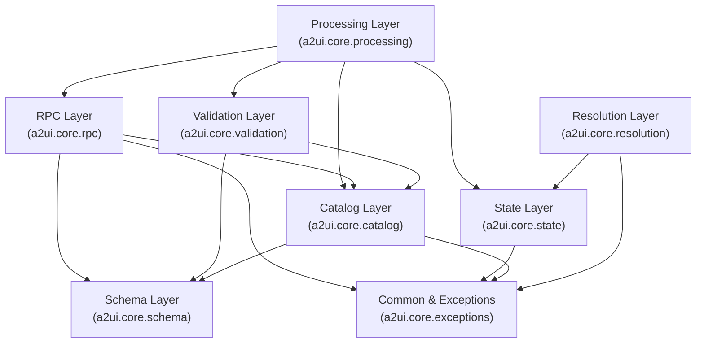
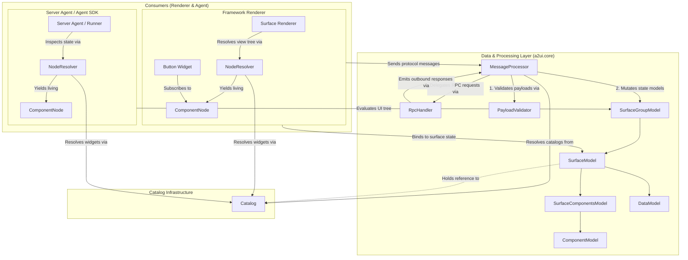

# A2UI Core SDK Specification

This document describes the detailed programmatic specification and architecture of the A2UI Core SDK. The Core SDK serves as the foundational data, state, and processing layer of A2UI.

This layer handles JSON parsing, state models, JSON pointers, catalogs, and schemas. This logic remains completely framework-agnostic, allowing it to be implemented identically across all target environments (including [**agent**](../../docs/public/concepts/glossary.md#a2ui-agent-and-a2ui-renderer)-side or headless languages where there is no [**renderer**](../../docs/public/concepts/glossary.md#a2ui-agent-and-a2ui-renderer)).

For a high-level overview of the entire A2UI ecosystem (including the Inference SDK and [Framework Adapter](../../docs/public/concepts/glossary.md#fw-adapter) structure), see the [A2UI Unified SDK Architecture](../../specification/v0_9_1/docs/sdks_spec.md). For UI framework integration and rendering details, see the [A2UI Framework Adapter Blueprint](a2ui_framework_adapter.blueprint.md).

Terms in **bold** on first use are defined in the [Glossary](../../docs/public/concepts/glossary.md).

---

## 1. Core SDK Role & Architecture

The A2UI Core SDK acts as the central state coordinator. It is designed to represent core concepts and behaviors described in the A2UI specification, without any UI rendering logic.

Its core responsibilities include:

1. **[Catalog](../../docs/public/concepts/glossary.md#catalog) Representation:** Define `Catalog` structures and pure technical [**component**](../../docs/public/concepts/glossary.md#genui-component) metadata/schemas (`ComponentApi`, `FunctionApi`).
2. **Protocol Definitions:** Model strongly-typed inbound and outbound message structures (e.g., `RendererToAgent`, `AgentToRenderer`, etc.).
3. **[Surface](../../docs/public/concepts/glossary.md#surface) State Containers:** Track mutable, long-lived rendering states via `SurfaceModel`, `ComponentModel`, and `DataModel`.
4. **Message Processor:** Parse inbound message sequences to mutate local state containers via `MessageProcessor`.
5. **JSON Pointer Scope:** Standardize relative pointer evaluation and reactivity via scoped context managers.
6. **Validation:** Performs structural JSON Schema checks, reference checks, loop/recursion analysis, and layout integrity checks.
7. **Resolution:** Resolves bound context paths and binds state variables to components for local evaluation.
8. **Multi-Version Protocol Branching:** Supports multiple versions of the protocol.
9. **Multi-Catalog Surface Resolution (v1.0+):** Tracks every catalog a surface may draw from, and resolves per-component and per-function `catalogId` overrides against that set rather than against a single surface-wide default.
10. **Bidirectional RPC Execution (v1.0+):** Coordinates asynchronous and synchronous remote function calls between renderers and server agents via `RpcHandler` (only available starting from version 1.0), managing correlation IDs, timeouts, cancellation callbacks, permission boundaries, and lifecycle disposal.

#### Package Boundary & Non-Goals

Core implements the responsibilities above and nothing beyond them. Functionality that the [Agent SDK](a2ui_agent.blueprint.md) or [Framework Adapter](a2ui_framework_adapter.blueprint.md) blueprint assigns to its own layer does not belong in core, even where core defines the types that functionality would operate on. Those two blueprints are the reference for what each layer owns.

Protocol version coverage is per implementation rather than a property of this blueprint. The Dart SDK does not implement v0.8 while the Python and TypeScript SDKs retain v0.8 for backward compatibility.

---

### A. High-Level Layer Architecture



### B. Runtime Object Architecture & Consumer Binding

The diagram below illustrates how consumers (both Framework Renderers and Server Agents / Agent SDKs) interact with `MessageProcessor` and inspect the reactive layout state:



---

## 2. Directory & Package Structure

The core modular components are organized within the `a2ui.core` namespace. Public interfaces are exposed cleanly across the package layers:

```
a2ui/core/
├── exceptions                      # Root exception hierarchy & RPC error codes
├── common/                         # Shared primitives with no layer dependencies
│   ├── events                      # EventSource / listener plumbing
│   └── semver                      # Protocol version comparison
├── expressions/                    # Protocol-version-agnostic expression parser
├── basic_catalog/                  # Bundled default components and operators
│   ├── v0_8/                       # Conforms to spec v0.8
│   ├── v0_9/                       # Conforms to spec v0.9, v0.9.1
│   ├── v1_0/                       # Conforms to spec v1.0
│   ├── operator_apis               # Operator function signatures
│   └── locale_config               # Locale defaults for formatting functions
├── catalog/                        # Catalog declarations
│   ├── catalog                     # Catalog base class & inlining
│   ├── components                  # Component declarations & API
│   └── functions                   # Function declarations & implementations
├── state/                          # Reactive Layout State Models
│   ├── component_model             # Component property structures
│   ├── data_model                  # Value dictionary binding paths
│   ├── surface_model               # Single UI surface container
│   ├── surface_components_model    # Inlined graph topology & integrity checks
│   └── surface_group_model         # Collection of active surfaces
├── processing/                     # Mutation processing engine
│   ├── message_processor           # Single MessageProcessor entrypoint
│   ├── operations                  # InternalOperation union (version-neutral vocabulary)
│   └── adapters/                   # Spec Version Adapters
│       ├── base                    # VersionAdapter interface & ProtocolVersion enum
│       ├── factory                 # VersionAdapterFactory (hardcoded adapter resolution)
│       ├── v0_8                    # v0.8 adapter
│       ├── v0_9                    # v0.9 adapter
│       └── v1_0                    # v1.0 adapter
├── rpc/                            # Bidirectional Remote Procedure Call engine
│   └── rpc_handler                 # RpcHandler isolating RPC lifecycle, timeout, & callbacks
├── validation/                     # Layout & payload validation layer
│   ├── payload_validator           # Pydantic & JSON Schema payload validator with in-memory registry
│   └── integrity_checker           # Component graph topology, references, and cycle detection
├── resolution/                     # View Tree Resolution Engine
│   ├── component_node              # Living node in view hierarchy (Signal props)
│   ├── component_context           # Per-component resolution scope
│   ├── node_resolver               # Protocol-version-agnostic node resolution
│   ├── generic_binder              # Schema-driven property binding
│   └── data_context                # Path binding & function evaluator (Internal)
└── schema/                         # Autogenerated protocol models
    ├── v0_8/                       # Models for spec v0.8
    │   ├── common_types
    │   ├── agent_to_renderer
    │   ├── renderer_to_agent
    │   └── renderer_capabilities
    ├── v0_9/                       # Models for spec v0.9 and v0.9.1
    │   ├── common_types
    │   ├── agent_to_renderer
    │   ├── renderer_to_agent
    │   └── renderer_capabilities
    └── v1_0/                       # Models for spec v1.0
        ├── common_types
        ├── agent_to_renderer
        ├── renderer_to_agent
        └── renderer_capabilities
```

Layout rules hold across every implementation:

- **Package names are normative.** The validation package is `validation` and the resolution package is `resolution`. Naming them `validating` or `rendering` is a deviation, since `rendering` in particular suggests UI work that this layer does not do.

---

## 3. Interface Specification

### A. Catalog Layer (`a2ui.core.catalog`)

#### `Catalog`

A catalog groups component definitions and function definitions together, along with an optional theme schema.

```typescript
export enum ProtocolVersion {
  V0_8 = 'v0.8',
  V0_9 = 'v0.9',
  V0_9_1 = 'v0.9.1',
  V1_0 = 'v1.0',
}

export class Catalog<
  TComponent extends ComponentApi = ComponentApi,
  TFunction extends FunctionApi = FunctionApi,
> {
  readonly id: string;
  readonly protocolVersion?: ProtocolVersion;
  readonly components: ReadonlyMap<string, TComponent>;
  readonly functions?: ReadonlyMap<string, TFunction>;
  readonly themeSchema?: Schema;

  constructor(
    id: string,
    components: TComponent[],
    functions?: TFunction[],
    themeSchema?: Schema,
    protocolVersion?: ProtocolVersion,
  );
}
```

A `Catalog` is immutable once constructed.

`TFunction` is instantiated as [`FunctionApi`](#functionapi--functionimplementation) for a schema-only catalog used to validate or describe payloads, and as `FunctionImplementation` for a catalog that can also execute its functions.

Both parameters default to their constraint, so code that does not care about the concrete component or function type may write `Catalog` unparameterized. The rest of this document does so wherever the distinction is irrelevant.

A catalog targets a specific protocol version declared via its `protocolVersion` property (e.g. `ProtocolVersion.V1_0`). When parsing a catalog document, the SDK verifies the `protocolVersion` to determine schema compatibility.

##### Optional `protocolVersion`

`protocolVersion` is optional. Catalogs written against v0.8 or v0.9 predate the field and are still supported without it. Catalogs targeting v1.0 or later MUST declare it, since v1.0 features (`catalogId` overrides, RPC function metadata) cannot be resolved without knowing the version.

An absent version is a distinct state, not a wildcard, and it MUST fail closed:

- An unversioned catalog is treated as pre-v1.0. It may serve a v0.8, v0.9, or v0.9.1 surface, and is rejected for a v1.0 or later surface with `A2uiCatalogError`.
- Compatibility checks MUST still run when the version is absent. Skipping the check whenever the value is missing (for example, guarding the call with `catalog.protocolVersion && ...`) turns an unversioned catalog into one that passes every check, which is the opposite of the intended behavior. `isCatalogVersionCompatible` handles the absent case itself and returns `false` for a v1.0 surface.

Parsing a catalog document is parsing untrusted input: raise `A2uiCatalogError` for a missing or non-object document or a `catalogId` conflict.

#### Common Types & Subschema References

When authoring component or function schemas, developers import primitives (`DynamicString`, `DynamicNumber`, `DynamicBoolean`, `DataBinding`, `FunctionCall`, `Action`, `ChildList`, etc.) directly from the schema module matching the catalog's targeted `protocolVersion` (e.g. `a2ui.core.schema.v1_0.common_types` or `@a2ui/core/v1_0`).

- **Subschema References & Wire Emission**: In v1.0+, component schemas emit or retain relative pointers (`"$ref": "common_types.json#/$defs/<TypeName>"`).
- **Forward Compatibility**: While breaking changes between v0.9 and v1.0 prevent v0.9 catalogs from running against v1.0 runtimes, using unversioned relative references in v1.0 catalogs allows them to potentially resolve against future compatible protocol versions without modifying catalog type paths.

```typescript
import {DynamicString, Action, ChildList} from '@a2ui/core/v1_0';
import {ComponentApi} from '@a2ui/core';

export const CardComponent: ComponentApi = {
  name: 'Card',
  schema: z.object({
    title: DynamicString.describe('Card title'),
    onClick: Action.optional(),
    children: ChildList.optional(),
  }),
};
```

#### `ComponentApi`

The framework-agnostic definition of a component. It defines the name and the exact JSON schema footprint of the component, without any rendering logic. It acts as the single source of truth for the component's contract.

```typescript
interface ComponentApi {
  /** The name of the component as it appears in the A2UI JSON (e.g., 'Button'). */
  readonly name: string;
  /** The technical definition used for validation and generating renderer capabilities. */
  readonly schema: Schema;
}
```

#### `FunctionApi` & `FunctionImplementation`

Stateless definition representing a catalog function signature and executable business logic.

```typescript
interface FunctionApi {
  readonly name: string;
  readonly returnType: 'string' | 'number' | 'boolean' | 'array' | 'object' | 'any' | 'void';
  readonly schema: Schema; // The expected arguments
}

/**
 * A function implementation. Splitting API from Implementation is less critical than
 * for components because functions are framework-agnostic, but it allows for
 * re-using API definitions across different implementation providers.
 */
interface FunctionImplementation extends FunctionApi {
  // Executes the function logic. Accepts static inputs, returns a value or a reactive stream.
  execute(args: Record<string, any>, context: DataContext): unknown | Observable<unknown>;
}
```

**Function Implementation Details**:
Functions in A2UI accept statically resolved values as input arguments (not observable streams). However, they can return an observable stream (or Signal) to provide reactive updates to the UI, or they can simply return a static value synchronously.

Functions generally fall into a few common patterns:

1.  **Pure Logic (Synchronous)**: Functions like `add` or `concat`. Their logic is immediate and depends only on their inputs. They typically return a static value.
2.  **External State (Reactive)**: Functions like `clock()` or `networkStatus()`. These return long-lived streams that push updates to the UI independently of [**data model**](../../docs/public/concepts/glossary.md#data-model) changes.
3.  **Effect Functions**: Side-effect handlers (e.g., `openUrl`, `closeModal`) that return `void`. These are triggered by user [**actions**](../../docs/public/concepts/glossary.md#action) rather than interpolation.

If a function returns a reactive stream, it MUST use an idiomatic listening mechanism that supports standard unsubscription. To properly support an AI agent, functions SHOULD include a schema to generate accurate renderer capabilities.

#### The [Basic Catalog](../../docs/public/concepts/glossary.md#basic-catalog) Standard (Core APIs)

The standard A2UI Basic Catalog specifies a set of core components (Button, Text, Row, Column) and functions.

##### Strict API / Implementation Separation

When building libraries that provide the Basic Catalog, it is **crucial** to separate the pure API (the Schemas and `ComponentApi`/`FunctionApi` definitions) from the actual UI implementations.

- **Multi-Framework Code Reuse**: In ecosystems like the Web, this allows a shared `web_core` library to define the Basic Catalog API and Binders once, while separate packages (`react_renderer`, `angular_renderer`) provide the native view implementations.
- **Developer Overrides**: By exposing the standard API definitions, developers adopting A2UI can easily swap in custom UI implementations (e.g., replacing the default `Button` with their company's internal Design System `Button`) without having to rewrite the complex A2UI validation, data binding, and capability generation logic.

For a detailed walkthrough on how to visually and functionally implement each basic component and function, refer to the [Basic Catalog Implementation Guide](../../specification/v0_9_1/docs/basic_catalog_implementation_guide.md).

##### Strongly-Typed Catalog Implementations

To ensure all components are properly implemented and match the exact API signature, platforms with strong type systems should utilize their advanced typing features. This ensures that a provided renderer not only exists, but its `name` and `schema` strictly match the official Catalog Definition, catching mismatches at compile time rather than runtime.

###### Statically Typed Languages (e.g. Kotlin/Swift)

In languages like Kotlin, you can define a strict interface or class that demands concrete instances of the specific component APIs defined by the Core Library.

```kotlin
// The Core Library defines the exact shape of the catalog
class BasicCatalogImplementations(
    val button: ButtonApi, // Must be an instance of the ButtonApi class
    val text: TextApi,
    val row: RowApi
    // ...
)
```

###### Dynamic Languages (e.g. TypeScript)

In TypeScript, we can use intersection types to force the framework renderer to intersect with the exact definition.

```typescript
// Concept: Forcing implementations to match the spec
type BasicCatalogImplementations = {
  Button: ComponentImplementation & {name: 'Button'; schema: Schema};
  Text: ComponentImplementation & {name: 'Text'; schema: Schema};
  Row: ComponentImplementation & {name: 'Row'; schema: Schema};
  // ...
};
```

##### Expression Resolution Logic (`formatString`)

The Basic Catalog requires a `formatString` function capable of interpreting `${expression}` syntax within string properties.

**Implementation Requirements**:

1.  **Recursion**: The implementation MUST use `DataContext.resolveDynamicValue()` or `DataContext.subscribeDynamicValue()` to recursively evaluate nested expressions or function calls (e.g., `${formatDate(value:${/date})}`).
2.  **Tokenization**: Distinguish between DataPaths (e.g., `${/user/name}`) and FunctionCalls (e.g., `${now()}`).
3.  **Escaping**: Literal `${` sequences must be handled (typically escaping as `\${`).
4.  **Reactive Coercion**: Results are transformed into strings using the standard Type Coercion rules.

#### Composing Your Own Catalog

You can define your own catalog by composing components and functions that reflect your design system. While you can build a catalog entirely from scratch, you can also import or combine definitions with the Basic Catalog to save time.

_Example of composing a catalog:_

```python
# Pseudocode
myCustomCatalog = Catalog(
  id="https://mycompany.com/catalogs/custom_catalog.json",
  protocolVersion=ProtocolVersion.V1_0,
  functions=basicCatalog.functions,
  components=basicCatalog.components + [MyCompanyLogoComponent()],
  themeSchema=basicCatalog.themeSchema # Inherit theme schema
)
```

---

### B. Processing Layer (`a2ui.core.processing`)

#### `MessageProcessor`

The "Controller" that accepts the raw stream of [**A2UI messages**](../../docs/public/concepts/glossary.md#a2ui-message), parses them, mutates the state models, and delegates bidirectional RPC execution. It also handles the aggregation of renderer state for synchronization.

##### Accepted Input (`AgentToRendererMessagePayload`)

`MessageProcessor` is the boundary where untrusted wire data enters the SDK, so it accepts every shape an agent or transport realistically sends, not just a list of one version's envelope. That accepted set is named so it can be referenced by signature rather than restated:

```typescript
/** A single inbound envelope, in any supported protocol version. */
export type AgentToRendererMessage =
  | v0_8.ServerToClientMessage
  | v0_9.ServerToClientMessage
  | v1_0.AgentToRendererMessage;

/** A batch envelope of the form '{ "messages": [...] }', in any supported version. */
export type AgentToRendererMessageListWrapper =
  | v0_8.A2uiMessageListWrapper
  | v0_9.A2uiMessageListWrapper
  | v1_0.AgentToRendererMessageListWrapper;

/** Everything 'processMessages' accepts. */
export type AgentToRendererMessagePayload =
  | AgentToRendererMessageListWrapper
  | readonly AgentToRendererMessage[]
  | AgentToRendererMessage
  | Record<string, any>
  | readonly Record<string, any>[];
```

Three properties of this union matter:

- **Single or batch.** A lone message, an array of messages, and a `{messages: [...]}` wrapper are all valid. Requiring callers to wrap a single message in an array pushes trivial normalization onto every transport.
- **Every version.** The list wrapper is a union across all supported versions, not just one. Accepting only one version's wrapper silently rejects a valid batch from another.
- **Parsed or raw.** A raw JSON object (or list of them) is accepted alongside strongly-typed models, because a transport typically hands over decoded JSON that has not been through the schema models yet. Parsing and validating it is the processor's job, by way of the version adapter.

The symmetric outbound type is `RendererToAgentMessagePayload`, built the same way from `RendererToAgentMessage` and `RendererToAgentMessageListWrapper`.

> [!NOTE]
> Internal operation objects are not part of this union. [`InternalOperation`](#version-adapters-a2uicoreprocessingadapters) is the version adapter's normalized output, an implementation detail of the processing layer, and accepting it on the public entry point exposes an unversioned path that bypasses envelope validation.

```typescript
export interface MessageProcessorOptions {
  /** Protocol version used for capability generation and data model reporting. */
  version?: ProtocolVersion;
  /** Adapter registry to resolve messages against. Defaults to the built-in factory. */
  adapterRegistry?: VersionAdapterResolver;
  /** Validation strictness rules applied to component and topology checks. */
  validationConfig?: ValidationConfig;
  /** Receives outbound messages bound for the agent. Required before `callAgentFunction` can be used. */
  outboundListener?: OutboundMessageListener;
  /** Timeout applied to outbound agent calls that do not specify their own. */
  defaultTimeoutSeconds?: number;
}

class MessageProcessor<T extends ComponentApi> {
  readonly model: SurfaceGroupModel<T>;
  readonly version: ProtocolVersion;
  readonly rpc: RpcHandler;

  constructor(
    catalogs: Catalog<T>[],
    actionHandler?: ActionListener,
    options?: MessageProcessorOptions,
  );

  // Synchronous and asynchronous message processing
  processMessages(messages: AgentToRendererMessagePayload): void;
  processMessagesAsync(messages: AgentToRendererMessagePayload): Promise<void>;

  // Outbound RPC convenience delegation to 'rpc' (v1.0+)
  callAgentFunction<T = unknown>(
    surfaceId: string,
    call: FunctionCall,
    options?: CallOptions,
  ): Promise<T>;

  // Returns a strictly typed capabilities object ready for JSON serialization
  getRendererCapabilities(options?: CapabilitiesOptions): A2uiRendererCapabilities;

  /**
   * Returns the aggregated data model for all surfaces that have 'sendDataModel' enabled.
   * This should be used by the transport layer to populate metadata (e.g., 'A2uiRendererDataModel').
   */
  getRendererDataModel(): A2uiRendererDataModel | undefined;

  /** Disposes the processor, its surfaces, and all pending outbound RPC requests. */
  dispose(reason?: string): void;
}
```

##### RPC ownership

The RPC lifecycle belongs to [`RpcHandler`](#d-bidirectional-remote-procedure-call-rpc-layer-a2uicorerpc), reachable as `processor.rpc`. `MessageProcessor` does not re-expose the inbound handlers.

Inbound `callRendererFunction` and `agentFunctionResponse` envelopes arrive through `processMessages` like any other message. The processor recognizes them, builds the `DataContext` for the target surface (or a headless one if there is no surface), and forwards them to `RpcHandler`. Consumers never call the inbound handlers directly, so publishing them on the processor would advertise an entry point that bypasses envelope validation and context construction.

`callAgentFunction` is the exception, and is deliberately mirrored on the processor. It is outbound, callers already hold the processor, and requiring them to reach through `processor.rpc` for the one call they routinely make buys nothing. It forwards its arguments unchanged.

#### Renderer Data Model Synchronization

When a surface is created with `sendDataModel: true`, the renderer is responsible for sending the current state of that surface's data model back to the agent whenever a renderer-to-agent message (like an `action`) is sent.

**Implementation Flow:**

1.  The `MessageProcessor` tracks the `sendDataModel` flag for each surface.
2.  The `getRendererDataModel()` method iterates over all active surfaces and returns a map of data models for those where the flag is enabled.
3.  The **Transport Layer** (e.g., A2A, MCP) calls `getRendererDataModel()` before sending any message to the agent.
4.  If a non-empty data model map is returned, it is included in the transport's metadata field (e.g., `A2uiRendererDataModel` in A2A metadata).

- **Surface Lifecycle**: It is an error to receive a `createSurface` message for a `surfaceId` that is already active; `surfaceId` must be globally unique per client session. The processor MUST throw an error or report a validation failure if this occurs.
- **Component Lifecycle**: If an `updateComponents` message provides an existing `id` but a _different_ `type`, the processor MUST remove the old component and create a fresh one to ensure framework renderers correctly reset their internal state. The same rule applies when the resolved `catalogId` changes for an existing `id`: the component is a different component even under the same type name, so it MUST be removed and re-added rather than mutated in place. Mutating the catalog reference in place leaves already-resolved nodes bound to the previous catalog's schemas.

##### `createSurface` operation ordering

A `createSurface` message may carry an initial data model and an initial component list at once. The processor MUST apply the data model before the components. Components are validated and bound against the data model, so applying them first reports spurious missing-binding warnings for data that is about to arrive in the same message.

The initial data model is applied as one operation per top-level key, merging into the existing root, rather than as a single write to `/`. A single root write replaces the whole document and fires one cascade over every path, which changes both the resulting tree and the notification count that subscribers observe.

#### [Capabilities Objects](../../docs/public/concepts/glossary.md#capabilities-object)

Both sides advertise their capabilities to each other.

Schemas live in `specification/<version>/json/`. v1.0 names the pair [`renderer_capabilities.json`](../../specification/v1_0/json/renderer_capabilities.json) and [`agent_capabilities.json`](../../specification/v1_0/json/agent_capabilities.json). v0.9 and v0.9.1 name the same pair [`client_capabilities.json`](../../specification/v0_9_1/json/client_capabilities.json) and [`server_capabilities.json`](../../specification/v0_9_1/json/server_capabilities.json), carried as `a2uiClientCapabilities` and `a2uiServerCapabilities`. v0.8 spells it differently again ([`a2ui_client_capabilities_schema.json`](../../specification/v0_8/json/a2ui_client_capabilities_schema.json)) and publishes no server-side counterpart.

#### Generating Renderer Capabilities and Schema Types

To dynamically generate the `A2uiRendererCapabilities` payload (specifically `inlineCatalogs`), the processor must convert internal component schemas into valid JSON Schemas.

**Schema Types Location**: Foundational schema types _should_ be defined in a dedicated directory like `schema`. You can see the `renderers/web_core/src/v1_0/schema/common-types.ts` file in the reference web implementation as an example.

**Detectable Common Types**: Shared definitions (like `DynamicString`) must emit external JSON Schema `$ref` pointers. This is achieved by "tagging" the schemas using their `description` property (e.g., `REF:common_types.json#/$defs/DynamicString`).

When `getRendererCapabilities()` converts internal schemas to generate `inlineCatalogs`:

1. Components: Translate each component schema into a raw JSON Schema. Wrap it in the standard A2UI component envelope (`allOf` containing `ComponentCommon`).
2. Functions: Map each function in the catalog to a `FunctionDefinition` object, converting its argument schema to JSON Schema.
3. Theme: Convert the catalog's theme schema into a JSON Schema representation.
4. Reference Processing: For all generated schemas (components, functions, and themes), traverse the tree looking for descriptions starting with `REF:`. Strip the tag and replace the node with a valid JSON Schema `$ref` object.

#### Internal Operations (`a2ui.core.processing.operations`)

`InternalOperation` is the version-neutral vocabulary of the processing pipeline. A version adapter is the only producer: it validates a wire message and emits operations. Everything downstream, including `MessageProcessor`, the state models, and `RpcHandler`, is written against operations and never inspects a raw envelope. That boundary is what keeps version-specific parsing confined to the adapters, so adding a protocol version touches one adapter rather than the whole pipeline.

The union is closed at six members and is discriminated on `type`. Consumers switch exhaustively over it, so adding a seventh member is a breaking change for every consumer and should follow a protocol change, not precede one.

```typescript
/** A component definition carried inside an operation. Extra keys are the component's properties. */
export interface InternalComponentPayload {
  id: string;
  component?: string;
  [key: string]: unknown;
}

export interface InternalCreateSurfaceOp {
  readonly type: 'createSurface';
  readonly surfaceId: string;
  readonly components?: InternalComponentPayload[];
  readonly dataModel?: Record<string, unknown>;
  /** Protocol version of the originating envelope. */
  readonly version?: ProtocolVersion;
  /** v0.8 only. Explicit root component id. */
  readonly root?: string;
  /** Pre-v1.0 only. Removed in v1.0. */
  readonly theme?: unknown;
  /** v0.9 and later. */
  readonly catalogId?: string;
  /** v0.9 and later. */
  readonly sendDataModel?: boolean;
}

export interface InternalUpdateComponentsOp {
  readonly type: 'updateComponents';
  readonly surfaceId: string;
  readonly components: InternalComponentPayload[];
}

export interface InternalUpdateDataModelOp {
  readonly type: 'updateDataModel';
  readonly surfaceId: string;
  readonly value: unknown;
  /** JSON Pointer (RFC 6901). Defaults to '/', which replaces the whole model. */
  readonly path?: string;
}

export interface InternalDeleteSurfaceOp {
  readonly type: 'deleteSurface';
  readonly surfaceId: string;
}

export interface InternalCallRendererFunctionOp {
  readonly type: 'callRendererFunction';
  readonly functionCallId: string;
  readonly call: string;
  readonly version: ProtocolVersion;
  /** v1.0 and later. Overrides the surface's default catalog for this call. */
  readonly catalogId?: string;
  readonly args?: Record<string, unknown>;
  readonly isUserActivated?: boolean;
}

export interface InternalAgentFunctionResponseOp {
  readonly type: 'agentFunctionResponse';
  readonly functionCallId: string;
  readonly version?: ProtocolVersion;
  readonly value?: unknown;
  readonly error?: {code: string; message: string};
}

export type InternalOperation =
  | InternalCreateSurfaceOp
  | InternalUpdateComponentsOp
  | InternalUpdateDataModelOp
  | InternalDeleteSurfaceOp
  | InternalCallRendererFunctionOp
  | InternalAgentFunctionResponseOp;

/** All valid `type` discriminators, for runtime narrowing at module boundaries. */
export const INTERNAL_OPERATION_TYPES = [
  'createSurface',
  'updateComponents',
  'updateDataModel',
  'deleteSurface',
  'callRendererFunction',
  'agentFunctionResponse',
] as const;
```

Each operation is produced by one action key per version. Three of them were renamed after v0.8, and absorbing that renaming is the clearest illustration of what this layer buys: a consumer handling `InternalCreateSurfaceOp` never learns whether the message said `beginRendering` or `createSurface`.

| Operation                         | v0.8 action       | v0.9 / v0.9.1 action | v1.0 action             | Consumed by                                                   |
| :-------------------------------- | :---------------- | :------------------- | :---------------------- | :------------------------------------------------------------ |
| `InternalCreateSurfaceOp`         | `beginRendering`  | `createSurface`      | `createSurface`         | `MessageProcessor.processCreateSurfaceOp()`                   |
| `InternalUpdateComponentsOp`      | `surfaceUpdate`   | `updateComponents`   | `updateComponents`      | `MessageProcessor.processUpdateComponentsOp()`                |
| `InternalUpdateDataModelOp`       | `dataModelUpdate` | `updateDataModel`    | `updateDataModel`       | `MessageProcessor.processUpdateDataModelOp()`                 |
| `InternalDeleteSurfaceOp`         | `deleteSurface`   | `deleteSurface`      | `deleteSurface`         | `MessageProcessor.processDeleteSurfaceOp()`                   |
| `InternalCallRendererFunctionOp`  | not defined       | not defined          | `callRendererFunction`  | `RpcHandler.handleCallRendererFunction()`, via the processor  |
| `InternalAgentFunctionResponseOp` | not defined       | not defined          | `agentFunctionResponse` | `RpcHandler.handleAgentFunctionResponse()`, via the processor |

The `type` discriminators use the v0.9-and-later names. Reusing the current wire names keeps operations readable for the versions in active use, at the cost of a v0.8 operation whose discriminator does not match the action that produced it.

**Design rules**:

1. **Superset of all versions, populated per version.** A single operation type serves every protocol version, so version-only fields such as `root`, `theme`, `catalogId`, and `sendDataModel` are optional and left unset by adapters whose version does not define them. Splitting the type per version would push a version switch into every consumer, which is the coupling the operation layer exists to prevent. Omitting a field outright, on the other hand, makes the versions that do define it unrepresentable.
2. **Post-validation, not pre-validation.** An operation only exists after its envelope passed adapter validation, so consumers may assume required fields are present and correctly typed. They still validate content against the catalog, which the adapter cannot see.
3. **Component payloads stay loose.** `components` carries open maps rather than typed component models. Component properties are catalog-defined and validated later by `PayloadValidator` against the resolved catalog, so typing them at the operation layer would require the adapter to know the catalog.
4. **No transport or surface handles.** Operations reference a surface by `surfaceId` and never carry a `SurfaceModel`, a `DataContext`, or a listener. Resolving an id to live state is the processor's job, and it is also where a missing surface becomes an `A2uiIntegrityError`.

#### Version Adapters (`a2ui.core.processing.adapters`)

Version adapters isolate the syntactic differences between protocol specifications. Each adapter validates one version's wire format and normalizes it into [`InternalOperation`](#internal-operations-a2uicoreprocessingoperations) values.

Adapters are inbound-only. Outbound messages are constructed where their shape is already known: `RpcHandler` builds `callAgentFunction` and `rendererFunctionResponse` envelopes and hands them to its outbound listener, and `SurfaceModel` emits actions through its own event source. Routing those through a second adapter method would add a translation step with nothing to translate.

```typescript
export interface VersionAdapter {
  readonly version: ProtocolVersion;

  /** Action keys this version defines, for example 'createSurface' or 'updateComponents'. */
  readonly validActions: ReadonlySet<string>;

  /** Canonical catalog protocol versions this adapter accepts. */
  readonly compatibleCatalogVersions: ReadonlySet<string>;

  /** Whether a catalog's declared version may be used under this adapter. */
  isCatalogCompatible(catalogVersion?: string | SemVer | null): boolean;

  /** Validates a raw payload and normalizes it into version-neutral operations. */
  extractOperations(payload: AgentToRendererMessagePayload): InternalOperation[];
}

/** Resolves adapters by version string or by inspecting a payload's version tag. */
export interface VersionAdapterResolver {
  getAdapter(version: ProtocolVersion | string): VersionAdapter;
  resolveFromPayload(payload: unknown): VersionAdapter;
  registerAdapter(adapter: VersionAdapter): void;
  /** Union of action keys across all registered adapters. */
  getAllKnownActions(): ReadonlySet<string>;
}

/** Checks whether a catalog's declared version is compatible with an expected message protocol version. */
export function isCatalogVersionCompatible(
  catalogVersion?: string,
  expectedVersion?: string,
): boolean;
```

A shared base class should implement `extractOperations` once, covering payload unwrapping, action selection, envelope validation, and error formatting, and leave subclasses a single hook that turns one validated message into operations. Only that hook differs between versions, so duplicating the surrounding pipeline per version is how implementations drift apart.

**Key adapter behaviors**:

1. **Payload unwrapping**: `extractOperations` accepts a single message, a list of messages, or a `{messages: [...]}` wrapper, and recurses until it reaches individual messages. A null or empty payload yields an empty list rather than an error, so an empty batch is not a failure.
2. **Exactly one action per message**: A message carries exactly one action key. Two or more is a conflict and MUST raise. Zero is also an error, but the adapter first checks the message against the union of action keys from every registered adapter: if the key belongs to another version, the error states that the action is unsupported in this protocol version and lists the allowed ones, rather than reporting a generic missing action. That distinction is what tells an author they sent a v0.9 message to a v1.0 surface.
3. **Envelope validation ownership**: The adapter, not `PayloadValidator`, owns wire envelope validation. Before emitting operations it checks the version header, confirms exactly one update type is present, and validates the prepared message against the versioned protocol schema. `PayloadValidator` is single-catalog scoped and therefore cannot see a whole envelope; see the [Validation Layer](#c-validation-layer-a2uicorevalidation). Adapters MAY normalize a message before schema validation, for instance by filling in an absent `version` field, but MUST NOT use that hook to accept fields their version does not define.
4. **Version header enforcement**: Every version except v0.8 requires a `version` field on the envelope, and its canonical form must fall within `compatibleCatalogVersions`. v0.8 predates the field and MUST NOT require it.
5. **Semantic version compatibility (`isCatalogVersionCompatible`)**: Compares protocol versions using SemVer rules rather than strict string equality. Leading `'v'` prefixes are stripped, and compatibility checks allow matching major/minor specifications while rejecting breaking mismatches, for example `v0.9` against `v1.0`. An absent catalog version is accepted for pre-v1.0 surfaces and rejected for v1.0 and later. Callers pass the version straight through and act on the result; they MUST NOT skip the call when the version is missing, since that converts an unversioned catalog into a universally compatible one.
6. **Per-version `createSurface` fields**: Adapters extract only the fields their version defines, and MUST NOT carry a field forward into a version that removed it.
   - `root`: present in v0.8 only. The adapter extracts it into `SurfaceModel.rootId`, which the topology check uses as the tree root. Hardcoding the root id to `'root'` rejects valid v0.8 payloads that name it otherwise, and omitting `root` from `InternalCreateSurfaceOp` makes those payloads impossible to represent.
   - `theme`: present in v0.8 and v0.9/v0.9.1 only. **v1.0 removed `theme` with no replacement field** (see [`agent_to_renderer.json`](../../specification/v1_0/json/agent_to_renderer.json)), so the v1.0 adapter MUST NOT extract it. Extracting it anyway lets a non-conformant payload through and triggers theme validation that should never run for v1.0.
   - `catalogId`, `sendDataModel`: present in v0.9 and later.

#### Renderer vs. Agent Execution Patterns

In a renderer, `MessageProcessor` receives incoming protocol messages and updates the local layout and data state. In an agent, it is an optional helper for checking LLM-generated messages against catalogs, verifying data paths, and preparing payloads for transmission:

```typescript
// 1. Renderer Usage (Updates layout state and routes UI action events)
const rendererProcessor = new MessageProcessor({
  catalogs: [basicCatalog, customCatalog1, customCatalog2],
  actionHandler: handleRendererClickEvents, // Routes UI events (clicks, form submits) to client app
});
rendererProcessor.processMessages(incomingMessagesFromAgent);

// 2. Agent Usage (Optional helper: validates LLM output and prepares payloads)
const agentProcessor = new MessageProcessor({
  catalogs: [negotiatedCatalog], // Single negotiated catalog enforces catalog compliance
  actionHandler: undefined, // Agent does not render DOM elements or handle clicks
});
agentProcessor.processMessages(parsedLlmPayloadMessages);
```

| Execution Aspect              | Renderer                                                                                                          | Agent                                                                    |
| :---------------------------- | :---------------------------------------------------------------------------------------------------------------- | :----------------------------------------------------------------------- |
| **Architectural Role**        | Processes inbound messages and updates surface state.                                                             | Optional helper for checking and converting outbound messages.           |
| **`catalogs` Parameter**      | Passes all renderer-supported catalogs (`catalogs: [catA, catB]`).                                                | Passes single negotiated catalog (`catalogs: [negotiatedCatalog]`).      |
| **`actionHandler` Parameter** | UI event callback (`actionHandler: onUiEvent`).                                                                   | Omitted or `undefined` (`actionHandler: undefined`).                     |
| **Catalog Compliance**        | Matches `createSurface.catalogId` and component/function `catalogId` overrides against renderer's supported list. | Fails if LLM generates payload referencing un-negotiated catalog.        |
| **Primary Goal**              | Maintains live view models and routes user action events.                                                         | Verifies LLM-generated payloads and data path references before sending. |

---

### C. Validation Layer (`a2ui.core.validation`)

#### `ValidationConfig` & `PayloadValidator`

Validation in `a2ui_core` is split into two complementary systems:

1. **Payload & Catalog Schema Validation (`PayloadValidator`)**: Validates a single component payload, a function call, or a surface theme against a specific catalog's schema using strongly-typed models (Pydantic / Zod) or direct JSON Schema Draft 2020-12 validators. Because components on a surface may originate from different catalogs, `PayloadValidator` is strictly single-catalog scoped and exposes granular validation methods (`validateComponent`, `validateFunction`, `validateTheme`). Wire message envelope structure and action validation are handled by version adapters (`VersionAdapter`).
2. **Graph Topology & Reference Integrity (`SurfaceComponentsModel`)**: Validates relationship integrity across the surface component tree, detecting root presence (`SurfaceModel.rootId`, default `"root"`), missing or dangling child references, orphaned components, cycles and self-references, composition constraints (`allowedParents` / `allowedChildren`), and recursion depth limits.

```typescript
export interface ValidationConfig {
  readonly targetVersion?: string;
  readonly allowOrphanComponents?: boolean;
  readonly allowDanglingReferences?: boolean;
  readonly allowMissingRoot?: boolean;
  readonly allowUnknownElements?: boolean;
  readonly allowedMessages?: string[];
}

export const STRICT_VALIDATION: ValidationConfig = {
  allowOrphanComponents: false,
  allowDanglingReferences: false,
  allowMissingRoot: false,
  allowUnknownElements: false,
};

export const RELAXED_VALIDATION: ValidationConfig = {
  allowOrphanComponents: true,
  allowDanglingReferences: true,
  allowMissingRoot: true,
  allowUnknownElements: true,
};

export class PayloadValidator {
  constructor(options?: {catalog?: Catalog; config?: ValidationConfig});

  /** Validates a single component dictionary payload against catalog schemas. */
  validateComponent(comp: Record<string, any>): A2uiErrorDetail[];

  /** Validates a surface theme dictionary against the catalog theme schema (v0.8 and v0.9 only). */
  validateTheme(theme: Record<string, any>): A2uiErrorDetail[];

  /**
   * Validates a function call name and arguments against catalog function schemas.
   * On success, 'args' carries the coerced arguments produced by the schema library
   * (defaults applied, values coerced, unknown keys stripped). Callers MUST execute
   * with these rather than the raw input.
   */
  validateFunction(
    name: string,
    args: Record<string, any>,
  ): {errors: A2uiErrorDetail[]; args: Record<string, any>};
}
```

Validating and then discarding the coerced result is a correctness bug, not a style choice: the same payload then produces different outcomes depending on whether the schema library applied a default or a coercion, which is exactly the kind of divergence conformance suites are meant to catch.

##### In-Memory Schema Resolution (Zero Network, Zero Disk I/O)

When validating message payloads, catalogs, or function signatures against JSON Schema (e.g., using `Draft202012Validator` in Python or `Ajv` in TypeScript), validators must operate entirely independently of the host file system or network connectivity:

1. **In-Memory Registry**: Dynamic schema models construct a referencing registry mapping base types (`DynamicString`, `DynamicNumber`, `DynamicBoolean`, `DynamicValue`, `anyFunction`) in memory.
2. **Relative Path Mapping**: The in-memory registry registers dynamic types under relative keys (e.g., `"common_types.json"`, `"catalog.json"`), resolving relative `$ref` targets (such as `"common_types.json#/$defs/DynamicString"`) without using external HTTP URIs.
3. **No External Dependencies**: This eliminates runtime file system discovery and remote HTTP fetching, guaranteeing that core validation succeeds identically when packaged as a standalone library distribution (e.g. standalone pip or npm installs) or executed in offline evaluation runners.

##### UAX #31 Identifier Validation

To prevent malformed identifiers, injection vectors, and subtle rendering ambiguities across language platforms, v1.0 specifications mandate that all component names, property keys, and function names adhere to Unicode Standard Annex #31 (UAX #31: Default Identifier Syntax):

- **Start Characters**: Must satisfy `is_xid_start(c)` or equal `'_'` (Unicode ID_Start plus underscores).
- **Continue Characters**: Must satisfy `is_xid_continue(c)` (alphanumerics, connector punctuation, combining marks).
- Non-compliant identifiers must be rejected during envelope and catalog property validation with an `A2uiValidationError`.

##### Graph Validation Runs Before Mutation, Against a Candidate Graph

State mutation is not a validation point. `SurfaceComponentsModel.addComponent()` enforces exactly one invariant, that the ID is not already present on the live surface, and raises `A2uiStateError` if it is. It runs no schema, composition, or topology checks. A caller that adds components directly, bypassing the processor, can therefore leave a surface in a state the protocol forbids.

Graph validation is instead a distinct phase that `MessageProcessor` completes before it touches surface state. It builds a candidate graph by merging the inbound batch over the components already on the surface, then validates that candidate:

1. Reject duplicate IDs within the batch itself.
2. Validate each component's properties against the schema of its own catalog, which is not necessarily the surface default.
3. Validate composition constraints (`allowedParents` / `allowedChildren`) over the merged parent and child maps.
4. Validate topology over the merged graph: root presence, dangling references, cycles and depth, then reachability from the root.

Only after all four pass does the processor apply the batch. Validating a merged candidate rather than the live model is what makes an update atomic: a batch that would introduce a cycle or an orphan is rejected whole, and the surface keeps its last valid graph. It also avoids false rejections. Validating incrementally as each component landed would fail any batch in which a parent arrives before the child it references, which under streaming is the normal arrival order.

The entire phase is skipped when no `ValidationConfig` is supplied. Supplying no config is the explicit opt-out for renderers that trust their agent and want the lowest per-message cost.

The non-throwing `validateReferences()` accessor sits outside this pipeline. It exists for consumers that want to inspect a committed surface and report problems rather than abort, and the processor never calls it.

#### Validation Implementation Matrix

The matrix below details the specific validation checks, their responsible component/method in `a2ui_core`, and the specific error class raised upon failure:

| Validation Category      | Specific Validation Check                                                                         | Responsible Component / Implementation                                        | Raised Error Type     |
| :----------------------- | :------------------------------------------------------------------------------------------------ | :---------------------------------------------------------------------------- | :-------------------- |
| **Protocol Envelope**    | Single update type per message (`createSurface`, `updateComponents`, etc.)                        | `VersionAdapter.extractOperations()`                                          | `A2uiValidationError` |
| **Protocol Envelope**    | Valid `version` tag (`v0.8`, `v0.9`, `v1.0`) & required envelope keys                             | `VersionAdapter.extractOperations()`                                          | `A2uiValidationError` |
| **Identifier Syntax**    | Component, property, and function names comply with UAX #31 identifier syntax                     | `PayloadValidator` (`common/uax31`)                                           | `A2uiValidationError` |
| **Schema Referencing**   | In-memory `$ref` resolution against relative paths (`common_types.json`) without disk or network  | `PayloadValidator` (`referencing.Registry` / `Ajv`)                           | `A2uiValidationError` |
| **Surface Lifecycle**    | Surface non-existence on `createSurface` (no duplicates)                                          | `MessageProcessor.processCreateSurfaceOp()` (`SurfaceGroupModel`)             | `A2uiIntegrityError`  |
| **Surface Lifecycle**    | Surface existence on `updateComponents`, `updateDataModel`, `deleteSurface`                       | `MessageProcessor.processUpdateComponentsOp()` / `processUpdateDataModelOp()` | `A2uiIntegrityError`  |
| **Catalog Negotiation**  | `createSurface.catalogId` and component/function `catalogId` match negotiated renderer capability | `new MessageProcessor({ catalogs: [negotiatedCatalog] })`                     | `A2uiCatalogError`    |
| **Catalog Resolution**   | `createSurface.catalogId` and component/function `catalogId` exist in supported catalogs list     | `MessageProcessor.processCreateSurfaceOp()`                                   | `A2uiCatalogError`    |
| **Component Keys**       | Required `id` and `component` (type name) on creation                                             | `PayloadValidator.validateComponent()`                                        | `A2uiValidationError` |
| **Component Properties** | Property schema validation against catalog definition                                             | `PayloadValidator.validateComponent()`                                        | `A2uiValidationError` |
| **Theme**                | Surface theme validation against catalog theme schema (v0.8, v0.9 only)                           | `PayloadValidator.validateTheme()`                                            | `A2uiValidationError` |
| **Function Signatures**  | Function call arguments and return payload validation against catalog function schema             | `PayloadValidator.validateFunction()` / `RpcHandler`                          | `A2uiValidationError` |
| **Graph Integrity**      | Duplicate component ID within a single update payload                                             | `SurfaceComponentsModel.validateComponentsUpdate()`                           | `A2uiValidationError` |
| **Graph Integrity**      | Missing root component (`SurfaceModel.rootId`, default `"root"`)                                  | `validateComponentsUpdate()` → `validateTopology()`                           | `A2uiIntegrityError`  |
| **Graph Integrity**      | Dangling component references (pointers to missing IDs)                                           | `validateComponentsUpdate()` → `validateTopology()`                           | `A2uiIntegrityError`  |
| **Graph Topology**       | Composition constraints (`allowedParents` / `allowedChildren`)                                    | `validateComponentsUpdate()`                                                  | `A2uiValidationError` |
| **Graph Topology**       | Self-reference detection (`comp_id == ref_id`)                                                    | `validateTopology()` → `detectCycles()`                                       | `A2uiRecursionError`  |
| **Graph Topology**       | Circular reference / cycle detection (DFS stack)                                                  | `validateTopology()` → `detectCycles()`                                       | `A2uiRecursionError`  |
| **Graph Topology**       | Unreachable / orphan component detection                                                          | `validateComponentsUpdate()` → `validateTopology()`                           | `A2uiIntegrityError`  |
| **State Invariant**      | Duplicate component ID against the live surface (mutation guard, not a validation pass)           | `SurfaceComponentsModel.addComponent()`                                       | `A2uiStateError`      |
| **Depth & Syntax**       | Global recursion depth limit (>50) & function nesting (>5)                                        | `VersionAdapter.extractOperations()` / `detectCycles()`                       | `A2uiRecursionError`  |
| **Depth & Syntax**       | JSON Pointer path syntax validation                                                               | `VersionAdapter.extractOperations()` / `PayloadValidator`                     | `A2uiValidationError` |

---

### D. Bidirectional Remote Procedure Call (RPC) Layer (`a2ui.core.rpc`)

The RPC layer coordinates bidirectional remote function execution between client renderers and server-side agents. It allows agents to invoke functions registered in renderer catalogs (e.g. client device sensors, local storage, validation routines) and allows renderers to execute remote capabilities hosted on the agent.

> [!NOTE]
> **Protocol Availability**: Bidirectional Remote Procedure Call (RPC) execution is only available starting from protocol version 1.0 (`v1.0`+). Earlier protocol versions (v0.8, v0.9, v0.9.1) do not define `callRendererFunction`, `callAgentFunction`, `rendererFunctionResponse`, or `agentFunctionResponse` envelopes. Core SDK message processors operating on pre-v1.0 protocols reject these envelopes during validation.

```typescript
export enum RpcErrorCode {
  INVALID_FUNCTION_CALL = 'INVALID_FUNCTION_CALL',
  EXECUTION_ERROR = 'EXECUTION_ERROR',
  TIMEOUT = 'TIMEOUT',
  CANCELLED = 'CANCELLED',
  DISPOSED = 'DISPOSED',
  DUPLICATE = 'DUPLICATE',
  NO_LISTENER = 'NO_LISTENER',
}

export interface CallOptions {
  readonly timeoutSeconds?: number;
  readonly priority?: 'urgent' | 'normal' | 'background';
  readonly cancellationToken?: CancellationToken;
}

export interface PendingAgentCall {
  readonly correlationId: string;
  readonly resolve: (result: any) => void;
  readonly reject: (error: any) => void;
  readonly timerHandle?: ReturnType<typeof setTimeout>;
}

/** Receives every outbound message the handler emits, for the transport to send to the agent. */
export type OutboundMessageListener = (
  message: RendererFunctionResponseMessage | CallAgentFunctionMessage,
) => void | Promise<void>;

export class RpcHandler {
  constructor(options: {
    /** Catalogs available for function resolution. */
    catalogs: Catalog[];
    /** Required before `callAgentFunction` can be used. */
    outboundListener?: OutboundMessageListener;
    defaultTimeoutSeconds?: number;
  });

  /** Dispatches an outbound function call to the remote agent and awaits its correlated response. */
  callAgentFunction<T = unknown>(
    surfaceId: string,
    call: FunctionCall,
    options?: CallOptions,
  ): Promise<T>;

  /** Handles an inbound callRendererFunction message from the remote agent. */
  handleCallRendererFunction(
    message: CallRendererFunctionMessage,
    context?: DataContext,
    isUserActivated?: boolean,
  ): Promise<RendererFunctionResponseMessage>;

  /** Correlates and settles an inbound agentFunctionResponse message with its pending call. */
  handleAgentFunctionResponse(message: AgentFunctionResponseMessage): void;

  /** Disposes the handler, cancelling all pending outbound requests. */
  dispose(reason?: string): void;
}
```

#### RPC Execution Lifecycle & Safeguards

1. **Inbound Call Execution (`handleCallRendererFunction`)**:
   - **Catalog Resolution Order**: An explicit `catalogId` and its absence are two separate paths, not steps in one fallback chain.
     1. If the call carries a `catalogId`, resolve it against the surface's `availableCatalogs`, then against the processor's global catalog list. If neither has it, return `RpcErrorCode.INVALID_FUNCTION_CALL`. Do not fall through to the surface default: the caller named a catalog, and answering with a different one is worse than failing.
     2. If the call carries no `catalogId`, use the surface's `defaultCatalog`.
     3. If neither path yields a catalog, return `RpcErrorCode.INVALID_FUNCTION_CALL`.

     Falling back to the first entry of the global catalog list is wrong for the same reason. It resolves against a catalog the surface may never have negotiated, so a typo in `catalogId` executes a same-named function from an unrelated catalog instead of failing. Once resolved, verify the catalog's `protocolVersion` is compatible with the surface before executing.

   - **Function Resolution & Argument Coercion**: Look up the function in the resolved catalog. If it is absent, or argument validation fails, return `RpcErrorCode.INVALID_FUNCTION_CALL`. Execute with the coerced arguments returned by `validateFunction`, never the raw payload.
   - **Permission & Activation Boundaries**: Verifies execution permissions. If a function requires user activation (e.g., audio playback or clipboard write), execution checks that `isUserActivated === true`.
   - **Headless Fallback Context**: If called without an active DOM view context, provisions a headless `DataContext` backed by the surface or root data model so dynamic value resolutions and data path updates resolve cleanly without null reference errors.
   - **Execution Error Trapping**: Catches any unhandled exceptions during execution, converts them to structured error messages with `RpcErrorCode.EXECUTION_ERROR`, and emits `RendererFunctionResponseMessage`.

2. **Outbound Call Lifecycle (`callAgentFunction`)**:
   - **Correlation ID Tracking**: Generates a unique UUID correlation ID for each outbound call and stores a `PendingAgentCall` entry containing the completion future and timeout timer.
   - **Transport Listener Notification**: Emits the serialized `CallAgentFunctionMessage` to registered transport listeners (e.g. A2A or MCP client connections).
   - **Leak Prevention (`done_callback`)**: Attaches a completion callback to the returned future (e.g., `future.add_done_callback(_cleanup_pending)`). If the caller cancels the future externally or drops execution, pending registry state and timer handles are immediately reclaimed to prevent memory leaks.
   - **Listener Task Error Trapping**: Transport listener task completion callbacks must only remove or reject pending calls when the listener task itself fails or is cancelled; successful outbound delivery preserves the pending call to await the agent's correlated response.
   - **Timeout Enforcement**: If no correlated response is received before `timeoutSeconds` expires (default: 30 seconds), the pending call is rejected with `RpcErrorCode.TIMEOUT` and cleaned up.

3. **Synchronous & Asynchronous Loop Bridging**:
   - In hybrid or synchronous runtime environments (e.g. Python synchronous SDK consumers), calling asynchronous RPC handlers while an event loop is already active must avoid re-entrant loop conflicts (such as `RuntimeError: This event loop is already running`).
   - Implementations bridge this by dispatching the asynchronous execution to a dedicated background single-worker thread (`ThreadPoolExecutor(max_workers=1)`) and waiting on the result synchronously.

4. **Lifecycle Disposal (`dispose`)**:
   - Calling `dispose(reason)` cancels all outstanding pending calls with `RpcErrorCode.DISPOSED`, clears all active timeout timers, removes registered transport listeners, and cleans up internal executor threads.

---

### E. The Framework-Agnostic Data Layer

The Data Layer maintains a long-lived, mutable state object. This layer follows the exact same design in all programming languages and **does not require design work when porting to a new framework**.

#### Prerequisites

To implement the Data Layer effectively, your target environment needs two foundational utilities:

##### 1. Schema Library

To represent and validate component and function APIs, the Data Layer requires a **Schema Library** (like **Zod** in TypeScript or **Pydantic** in Python) that allows for programmatic definition of schemas and the ability to export them to standard JSON Schema. If no suitable library exists, raw JSON Schema strings or `Codable` structs can be used.

##### 2. Observable Library

A2UI relies on standard observer patterns. The Data Layer needs two types of reactivity:

- **Event Streams**: Simple publish/subscribe mechanisms for discrete events (e.g., `onSurfaceCreated`, `onAction`).
- **Stateful Streams (Signals)**: Reactive variables that hold an initial value synchronously upon subscription, and notify listeners of future changes (e.g., DataModel paths, function results). Crucially, the subscription must provide a clear mechanism to **unsubscribe** (e.g., a `dispose()` method) to prevent memory leaks.

#### Design Principles

##### 1. The "Add" Pattern for Composition

We strictly separate **construction** from **composition**. Parent containers do not act as factories for their children.

```typescript
const child = new ChildModel(config);
parent.addChild(child);
```

##### 2. Standard Observer Pattern

Models must provide a mechanism for the rendering layer to observe changes.

1.  **Low Dependency**: Prefer "lowest common denominator" mechanisms.
2.  **Multi-Cast**: Support multiple listeners registered simultaneously.
3.  **Unsubscribe Pattern**: There MUST be a clear way to stop listening.
4.  **Payload Support**: Communicate specific data updates and lifecycle events.
5.  **Consistency**: Used uniformly across `SurfaceGroupModel` (lifecycle), `SurfaceModel` (actions), `SurfaceComponentsModel` (lifecycle), `ComponentModel` (updates), and `DataModel` (data changes).

##### 3. Granular Reactivity

The model is designed to support high-performance rendering through granular updates.

- **Structure Changes**: The `SurfaceComponentsModel` notifies when items are added/removed.
- **Property Changes**: The `ComponentModel` notifies when its specific configuration changes.
- **Data Changes**: The `DataModel` notifies only subscribers to the specific path that changed.

#### Protocol Models & Serialization

The framework-agnostic layer is responsible for defining strict, native type representations of the A2UI JSON schemas. Renderers should not pass raw generic dictionaries (like `Map<String, Any>` or `Record<string, any>`) directly into the state layer.

Developers must create data classes, structs, or interfaces (e.g., `data class` in Kotlin, `Codable struct` in Swift, or Zod-validated `interface` in TypeScript) that perfectly mirror the official JSON specifications. This creates a safe boundary between the raw network stream and the internal state models.

**Required Data Structures:**

> [!NOTE]
> **Multi-Version Protocol Support**: Each top-level message and metadata object must cover multiple A2ui protocol versions. For example, `AgentToRendererMessage` must represent every supported protocol version (including the v0.9 `ServerToClientMessage`), typically implemented using an enum or union type across the versioned schema models.

- **Agent-to-Renderer Messages:** `AgentToRendererMessage` (a multi-version union/protocol type covering `ServerToClientMessage`), `CreateSurfaceMessage`, `UpdateComponentsMessage`, `UpdateDataModelMessage`, `DeleteSurfaceMessage`.
- **Renderer-to-Agent Events:** `RendererToAgentEvent` (a multi-version union/protocol type covering `ClientToServerMessage`), `ActionMessage`, `ErrorMessage`.
- **Batch Wrappers:** `AgentToRendererMessageListWrapper` and `RendererToAgentMessageListWrapper`, each a multi-version union of the `{messages: [...]}` envelope.
- **Entry-Point Unions:** `AgentToRendererMessagePayload` and `RendererToAgentMessagePayload`, the full set of shapes the processor accepts or emits. See [Accepted Input](#accepted-input-agenttorenderermessagepayload).
- **Renderer Metadata:** `A2uiRendererCapabilities` (covering `A2uiClientCapabilities`), `InlineCatalog`, `FunctionDefinition`, `RendererDataModel`.

**JSON Serialization & Validation:**

- **Inbound (Parsing)**: The core library must provide a mechanism to deserialize a raw JSON string into a strongly-typed `AgentToRendererMessage`. If the payload violates the A2UI JSON schema, this layer must throw an `A2uiValidationError` _before_ the message reaches the state models.
- **Outbound (Stringifying)**: The core library must serialize renderer-to-agent events and capabilities from their strict native types back into valid JSON strings to hand off to the transport layer.

#### The State Models

##### SurfaceGroupModel & SurfaceModel

The root containers for active surfaces and their catalogs, data, and components.

Surface lifecycle is observed through `SurfaceGroupModel`'s event sources. There is no separate listener-registration method: a second mechanism for the same events would have to be kept in sync with these, and the observer pattern above is already the standard the state models follow.

```typescript
class SurfaceGroupModel<T extends ComponentApi> {
  addSurface(surface: SurfaceModel<T>): void;
  deleteSurface(id: string): void;
  getSurface(id: string): SurfaceModel<T> | undefined;

  readonly onSurfaceCreated: EventSource<SurfaceModel<T>>;
  readonly onSurfaceDeleted: EventSource<string>;
  /** Re-emits every constituent surface's actions. */
  readonly onAction: EventSource<A2uiRendererAction>;
}

/**
 * Matches 'action' in specification/v1_0/json/renderer_to_agent.json.
 */
interface A2uiRendererAction {
  name: string;
  surfaceId: string;
  sourceComponentId: string;
  timestamp: string; // ISO 8601
  context: Record<string, any>;
  /**
   * The catalog that owns the action's source component, when it differs from
   * the surface default. Without it an agent cannot tell apart two same-named
   * actions contributed by different catalogs on the same surface.
   */
  catalogId?: string;
}

type ActionListener = (action: A2uiRendererAction) => void | Promise<void>;

class SurfaceModel<T extends ComponentApi> {
  readonly id: string;
...
  /** The catalog named by 'createSurface.catalogId'; used when nothing overrides it. */
  readonly defaultCatalog: Catalog<T>;

  /**
   * Every catalog this surface may draw from: the processor's supported catalogs
   * filtered to those version-compatible with the surface. All 'catalogId'
   * overrides resolve against this map.
   */
  readonly availableCatalogs: ReadonlyMap<string, Catalog<T>>;

  readonly dataModel: DataModel;
  readonly componentsModel: SurfaceComponentsModel;

  /** The id of the component that roots the tree. Defaults to 'root'; v0.8 may override it. */
  readonly rootId: string;

  /** Pre-v1.0 only. v1.0 removed 'theme' from 'createSurface'. */
  readonly theme?: Record<string, any>;

  /** If true, the renderer should send the full data model with actions. */
  readonly sendDataModel: boolean;

  readonly onAction: EventSource<A2uiRendererAction>;
  /**
   * Dispatches an action from this surface.
   * @param payload The raw action event from the component.
   * @param sourceComponentId The ID of the component that triggered the action.
   */
  dispatchAction(payload: Record<string, any>, sourceComponentId: string): Promise<void>;
}
```

A surface holds a set of catalogs, not one. `defaultCatalog` only decides what an unqualified reference means; it is not the boundary of what the surface can use. Modelling the surface with a single `catalog` field makes every `catalogId` override unrepresentable, and the resulting failures are hard to read because they surface as "component not found" or "function not found" against whichever catalog happened to be the default.

`availableCatalogs` is populated at `createSurface` time by filtering the processor's catalog list with `isCatalogVersionCompatible` against the surface's protocol version. An override naming a catalog outside this map raises `A2uiCatalogError`.

##### `SurfaceComponentsModel` & `ComponentModel`

Manages the raw JSON configuration of components in a flat map. In languages with a built-in immutable map type, `SurfaceComponentsModel` can expose a single `ImmutableMap<string, ComponentModel>` property rather than separate `get(componentId)` and `getAll()` getter methods.

```typescript
class SurfaceComponentsModel {
  /** Can be replaced by an ImmutableMap<string, ComponentModel> property in supporting languages. */
  get(componentId: string): ComponentModel | undefined;

  /** Can be replaced by an ImmutableMap<string, ComponentModel> property in supporting languages. */
  getAll(): Map<string, ComponentModel>;

  /**
   * Mutation guard, not a validation entry point. Throws A2uiStateError if a component with
   * the same ID is already on the surface, and performs no schema, composition, or topology
   * checks. Callers are responsible for validating a candidate graph beforehand.
   */
  addComponent(component: ComponentModel): void;

  removeComponent(componentId: string): void;
  dispose(): void;

  /** Child component IDs referenced by a component, derived from the catalog's reference map. */
  getChildIds(componentId: string): string[];

  /**
   * Validates an inbound batch against a prospective merge of the batch into the current
   * surface, so a rejected update leaves state untouched. Checks payload-local duplicate IDs,
   * per-component property schemas, composition constraints, then delegates to validateTopology.
   */
  validateComponentsUpdate(
    newComponents: ComponentModel[],
    rootId?: string,
    config?: ValidationConfig,
  ): void;

  /**
   * Validates the committed graph in order: root presence, dangling references, cycles and
   * depth (via detectCycles), then reachability from the root. Each check is individually
   * suppressible through ValidationConfig so partially streamed surfaces can be tolerated.
   */
  validateTopology(options?: ValidationConfig): void;

  /**
   * Walks the graph depth-first from the root, raising A2uiRecursionError on a self-reference,
   * a back edge, or a traversal deeper than the global limit. Returns the reachable set, which
   * validateTopology reuses for its orphan check.
   */
  detectCycles(options?: ValidationConfig): Set<string>;

  /**
   * Non-throwing wrapper over validateTopology for consumers that inspect a committed surface
   * and report problems rather than abort. Returns the first error encountered, or an empty
   * array when the graph is valid. Not part of the processing pipeline.
   */
  validateReferences(options?: ValidationConfig): A2uiValidationError[];

  readonly onCreated: EventSource<ComponentModel>;
  readonly onDeleted: EventSource<string>;
}

class ComponentModel {
  readonly id: string;
  readonly type: string; // Component name (e.g. 'Button')

  /**
   * The catalog that declares this component: the surface's 'defaultCatalog'
   * unless the payload carried a 'catalogId' override. Property validation and
   * node resolution both use this, never the surface default directly.
   */
  readonly catalog: Catalog;

  get properties(): Record<string, any>;
  set properties(newProps: Record<string, any>);

  readonly onUpdated: EventSource<ComponentModel>;
}
```

##### `DataModel`

A dedicated store for application data.

```typescript
interface Subscription<T> {
  readonly value: T | undefined; // Latest evaluated value
  unsubscribe(): void;
}

class DataModel {
  get(path: string): any; // Resolve JSON Pointer to value
  set(path: string, value: any): void; // Atomic update at path
  subscribe<T>(path: string, onChange: (v: T | undefined) => void): Subscription<T>; // Reactive path monitoring
  dispose(): void;
}
```

**JSON Pointer Implementation Rules**:

1.  **A2UI Extension**: A2UI extends JSON Pointer to support **Relative Paths** that do not start with a forward slash `/` (e.g., `name` vs `/name`). These resolve relative to the current evaluation scope.
2.  **Auto-typing (Auto-vivification)**: When setting a value at a nested path (e.g., `/a/b/0/c`), create intermediate segments **that do not yet exist**. If the next segment is numeric (`0`), initialize as an Array `[]`, otherwise an Object `{}`.
3.  **Traversing an Existing Primitive Raises**: If an intermediate segment already holds a primitive, `set` MUST raise `A2uiDataError` naming the path. Replacing that primitive with a fresh container to continue the write destroys committed application data with no error and no event, so the loss is only discovered later when a read returns the wrong shape.
4.  **Forbidden Keys**: Reject any path containing `__proto__`, `constructor`, or `prototype` with `A2uiDataError`. The check is normative in every language, not only those with prototype chains, so that a payload behaves the same everywhere.
5.  **Notification Strategy (Bubble & Cascade)**: Notify exact matches, bubble up to all parent paths, and cascade down to all nested descendant paths.
6.  **Undefined Handling**: Setting an object key to `undefined` removes the key. Setting an array index to `undefined` preserves length but empties the index (sparse array).
7.  **Null Write to an Absent Value**: If reading the path already yields nothing, writing `null` or `undefined` there is a no-op: no parents are created, no key is added, and no notification fires. The test is on the value at the full path, not on whether its parent exists, so a `null` write to a missing key under an existing object is also a no-op. Auto-vivifying parents only to delete the leaf leaves behind empty containers the payload never asked for. When the path does resolve to a value, a `null` write is an ordinary removal and follows rule 6.
8.  **Root Replacement**: `set('/', null)` resets the document to an empty object `{}`, never to null. A null root makes every later read return null, which reads as data loss rather than a reset.
9.  **Value Ownership**: The data model owns what it stores. Implementations deep-copy on construction and on every `set`, so a caller mutating a payload object afterwards cannot reach into committed state. Storing the caller's reference makes reactivity depend on whether the caller happened to reuse an object.

**Type Coercion Standards**:
| Input Type | Target Type | Result |
| :------------------------- | :---------- | :---------------------------------------------------------------------- |
| `String` ("true", "false") | `Boolean` | `true` or `false` (case-insensitive). Any other string maps to `false`. |
| `Number` (non-zero) | `Boolean` | `true` |
| `Number` (0) | `Boolean` | `false` |
| `Any` | `String` | Locale-neutral string representation |
| `null` / `undefined` | `String` | `""` (empty string) |
| `null` / `undefined` | `Number` | `0` |
| `String` (numeric) | `Number` | Parsed numeric value or `0` |

---

### F. Resolution Layer (`a2ui.core.resolution`)

Transient objects created on-demand during rendering to solve "scope" and binding resolution.

```typescript
class DataContext {
  constructor(dataModel: DataModel, path: string, surface: SurfaceModel);
  readonly path: string;
  set(path: string, value: unknown): void;
  resolveDynamicValue<V>(v: DynamicValue): V;
  subscribeDynamicValue<V>(v: DynamicValue, onChange: (v: V | undefined) => void): Subscription<V>;
  nested(relativePath: string): DataContext;
}
```

##### Resolution rules

_Per-call catalog dispatch._ A `FunctionCall` may carry a `catalogId`. `DataContext` resolves the target catalog per call, against the surface's `availableCatalogs`, falling back to `defaultCatalog`. It MUST NOT capture a single catalog's invoker at construction: a context built for a surface outlives any one call, and a captured invoker cannot reach a function the call explicitly asked for by catalog. A `catalogId` naming a catalog outside `availableCatalogs` raises `A2uiCatalogError`.

This depends on `catalogId` surviving deserialization. If the `FunctionCall` model used at runtime is the pre-v1.0 shape (`call`, `args`, `returnType`), a strict schema library strips `catalogId` before resolution ever sees it, and every call silently resolves against the default catalog. Version-specific schema models must be selected by the surface's protocol version rather than aliased back to a legacy definition.

_Recursion into nested containers._ `resolveDynamicValue` recurses into plain objects and arrays, resolving bindings at any depth. Returning a plain object unresolved means a nested binding such as `{"style": {"color": {"path": "/accent"}}}` reaches the renderer as a raw pointer object. Recovering that only through a higher-level schema walk leaves direct `DataContext` callers, including conformance harnesses, with different results from the framework path.

_Expression errors are dispatched, not thrown._ A failure while evaluating a bound expression (unknown function, bad arguments, unresolvable catalog) dispatches an `EXPRESSION_ERROR` to the surface and yields an undefined value for that binding. Throwing out of the resolution pass aborts the whole tree, so one malformed binding blanks an otherwise renderable surface. The RPC path is different: it returns a structured error response, since there is a caller waiting on a result.

_Out-of-scope `@index`._ `@index` outside any repeater scope raises `A2uiValidationError`. Defaulting it to `0` invents a value the payload never supplied and produces a plausible-looking wrong render instead of an error.

_Parser bounds._ The expression parser enforces one shared maximum nesting depth across implementations, and applies it to argument recursion as well as to the top-level expression. Depth limits that differ per language mean the same payload parses in one SDK and is rejected in another; an unbounded argument path is a denial-of-service vector on adversarial input.

##### `GenericBinder`

`GenericBinder` walks a component's declared schema to classify each property as dynamic, action, structural, or checkable, and produces the bound property set the renderer consumes, including two-way setters and action closures.

Classification is driven by the catalog schema, never by inspecting values or matching property names. Hardcoding a property name (for example, treating a key literally named `checks` as special) is a catalog-agnostic violation under `AGENTS.md` §8: it silently privileges one catalog's vocabulary and breaks any catalog that names the concept differently.

_Escape Hatch_: Component implementations can use `ctx.surfaceComponents` to inspect the metadata of other components in the same surface (e.g. a `Row` checking if children have a `weight` property). This is discouraged but necessary for some layout engines.

---

### G. Exceptions (`a2ui.core.exceptions`)

Structured exception hierarchy used to report issues across core operations:

```typescript
/** The base exception class for all A2UI core failures. */
export class A2uiError extends Error {
  constructor(message: string, options?: ErrorOptions) {
    super(message, options);
    this.name = 'A2uiError';
  }
}

/** Raised when layouts violate formal schema structural boundaries. */
export class A2uiValidationError extends A2uiError {
  constructor(message: string, options?: ErrorOptions) {
    super(message, options);
    this.name = 'A2uiValidationError';
  }
}

/** Raised when loading catalog assets or compiling components schema maps. */
export class A2uiCatalogError extends A2uiError {
  constructor(message: string, options?: ErrorOptions) {
    super(message, options);
    this.name = 'A2uiCatalogError';
  }
}

/** Raised when relationship checks or layout parent links are broken. */
export class A2uiIntegrityError extends A2uiValidationError {
  constructor(message: string, options?: ErrorOptions) {
    super(message, options);
    this.name = 'A2uiIntegrityError';
  }
}

/** Raised when layout nested structures exceed depth limits. */
export class A2uiRecursionError extends A2uiValidationError {
  constructor(message: string, options?: ErrorOptions) {
    super(message, options);
    this.name = 'A2uiRecursionError';
  }
}

/** Raised when a remote procedure call fails, times out, is rejected, or lacks a listener. */
export class A2uiRpcError extends A2uiError {
  readonly code: RpcErrorCode;
  constructor(
    message: string,
    code: RpcErrorCode = RpcErrorCode.EXECUTION_ERROR,
    options?: ErrorOptions,
  ) {
    super(message, options);
    this.name = 'A2uiRpcError';
    this.code = code;
  }
}

/** Raised when a data model read or write cannot be satisfied at the given path. */
export class A2uiDataError extends A2uiError {
  /* name = 'A2uiDataError' */
}

/** Raised when the surface or component state machine is asked for an illegal transition. */
export class A2uiStateError extends A2uiError {
  /* name = 'A2uiStateError' */
}

/** Raised when raw model output cannot be extracted or decoded into a payload. */
export class A2uiParseError extends A2uiError {
  /* name = 'A2uiParseError' */
}

/** Raised when a source syntax (e.g. the EXPRESS DSL) cannot be compiled to A2UI messages. */
export class A2uiCompileError extends A2uiError {
  /* name = 'A2uiCompileError' */
}

/** Raised when a bound expression cannot be evaluated. */
export class A2uiExpressionError extends A2uiError {
  /* name = 'A2uiExpressionError' */
}
```

**Parsing wire JSON raises from this hierarchy, never from the language.** Check the shape before casting and raise `A2uiValidationError` with the offending value attached. A raw `TypeError` or `ClassCastException` escapes the hierarchy a caller can catch. The same applies to the expression parser: a malformed expression raises `A2uiParseError` or `A2uiExpressionError`, not a bare `ValueError`.

**Inheritance must match across implementations.** `A2uiIntegrityError` and `A2uiRecursionError` both derive from `A2uiValidationError`, because both report a payload the SDK refused to accept, and a caller that catches `A2uiValidationError` expects to have caught all of them. Parenting them directly on `A2uiError` in one language and on `A2uiValidationError` in another makes the same conformance case pass in one SDK and fail in the other.

**`expect_error.category` in `conformance/conformance_schema.json` names these classes** without the `A2ui` prefix. Add a category alongside the first suite that asserts it.

---

## 4. Conformance Test Plan

See [Conformance README](../../conformance/README.md) for setup and schema definitions.

`conformance/core/` covers this module.
