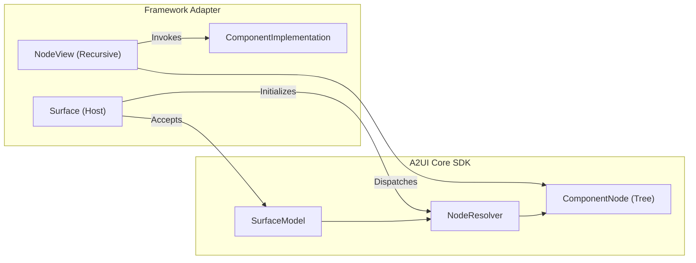

# A2UI Framework Adapter Specification

A [Framework Adapter](../../docs/public/concepts/glossary.md#fw-adapter) renders A2UI surfaces with a native UI framework. It bridges the platform-agnostic [Core SDK](a2ui_core.blueprint.md) to a target UI technology—such as React, Lit, Angular, Flutter, SwiftUI, or AngularDart—translating reactive layout state into platform-native widgets and views.

This specification describes what a framework adapter must build and expose. It is written for a developer implementing an adapter for a new language or UI framework.

---

## 1. Scope & Core Integration

### Integration points with Core

An adapter integrates with the Core SDK at two primary boundaries:

1. **`SurfaceModel`**: The adapter's root entrypoint (`Surface`) takes `SurfaceModel` directly as its sole input. The `SurfaceModel` encapsulates incoming message processing, the live component hierarchy, catalog(s), theme, data models, and event channels.
2. **The Node API (`NodeResolver` and `ComponentNode`)**: The adapter initializes a `NodeResolver` on the `SurfaceModel`. It never queries raw component dictionaries or evaluates JSON pointers directly. Instead, it observes the living tree of `ComponentNode` instances produced by `NodeResolver`.



### What the adapter owns

| Concern                   | Description                                                                        |
| ------------------------- | ---------------------------------------------------------------------------------- |
| Public surface host       | Root view/widget consuming `SurfaceModel` and rendering `NodeResolver.rootNode`.   |
| Component implementations | Framework-specific UI builders registered for catalog component types.             |
| Node dispatcher           | Recursive view mapping each `ComponentNode` to its registered implementation.      |
| Reactivity bridge         | Mapping core signals to framework-native change notifications.                     |
| User input and actions    | Forwarding native events to `WritableBinding.set()` and executing action closures. |
| Ambient context           | Propagating catalogs, theme tokens, and surface handles down the view hierarchy.   |
| Teardown lifecycle        | Disposing resolvers and subscriptions when views unmount.                          |

### What Core owns (Do not reimplement)

- Protocol message parsing, schema validation, and catalog asset loading.
- Data model storage, relative JSON pointer scoping, expressions, and function evaluation.
- Tree topology: parent-child links, template repeaters (`ChildList` expansions), placeholder stand-ins for pending components, cycle detection, and subtree cleanup.
- Property classification: mapping catalog schemas into dynamic values, actions, child references, and checks.

> [!WARNING]
> Direct use of `GenericBinder`, `ComponentContext`, or `DataContext` in view components is a legacy pattern retained in older renderers for compatibility. New framework adapters must depend strictly on `SurfaceModel` and the Node API (`NodeResolver`, `ComponentNode`).

---

## 2. Package Structure

```text
<adapter_package>/
├── surface/          # Public Surface view/widget and ambient context providers
├── nodes/            # Recursive node dispatcher and fallback components
├── binding/          # Reactivity bridge and two-way property accessors
├── catalog/          # ComponentImplementation interface, catalog types, and factories
│   └── basic/        # Basic Catalog native component implementations
└── theme/            # Theme tokens, styles, and styling injectors
```

`catalog/basic/` must remain cleanly decoupled from `surface/` and `nodes/`. Applications often substitute their own design system components for basic elements (e.g. replacing basic `Button` with an internal UI library button), so core rendering mechanics must never hardcode dependencies on the built-in basic catalog.

---

## 3. The Node API Contract

The adapter consumes these Core SDK types:

### `NodeResolver`

Constructed from a `SurfaceModel` and a catalog set:

- Exposes `rootNode`: a reactive signal/observable holding the root `ComponentNode` (or empty if the root component has not arrived).
- Exposes `dispose()`: tears down all active subscriptions and child node records.

### `ComponentNode`

Represents one resolved component instance in the tree:

| Property                     | Type / Meaning      | Usage in Adapter                                                                                        |
| ---------------------------- | ------------------- | ------------------------------------------------------------------------------------------------------- |
| `instanceId`                 | `string`            | Unique key among siblings. Use as native reconciliation key (React `key`, Flutter `Key`, SwiftUI `id`). |
| `componentId`                | `string`            | Raw ID from payload. Used for logs, debug tools, and error messages.                                    |
| `type`                       | `string`            | Component type name (e.g. `"Button"`, `"Text"`). Used for catalog lookup.                               |
| `catalogId`                  | `string?`           | Specific catalog declaring this type (v1.0+).                                                           |
| `state`                      | `NodeState`         | Enum: `resolved`, `pending`, `unknownType`, `cyclic`.                                                   |
| `props`                      | `Signal<NodeProps>` | Reactive map of resolved properties.                                                                    |
| `onDestroyed` / `addCleanup` | Lifecycle hook      | Attaches cleanup closures run when the node is disposed.                                                |

### Resolved Props Contract

Properties in `node.props` are already resolved against the component's data context scope:

| Property Type       | Resolved Representation                              | Adapter Usage                                                                            |
| ------------------- | ---------------------------------------------------- | ---------------------------------------------------------------------------------------- |
| **Dynamic Value**   | `ResolvedBinding<T>`                                 | Read `binding.value` to display.                                                         |
| **Two-Way Binding** | `WritableBinding<T>` (subtypes `ResolvedBinding<T>`) | Read `binding.value` to display; invoke `binding.set(nextValue)` on user edit.           |
| **Action**          | Parameterless closure `() => void`                   | Attach directly to native event listener (`onPressed`, `onClick`).                       |
| **Child**           | `ComponentNode`                                      | Pass to `buildChild(node)`.                                                              |
| **Child List**      | List/Array of `ComponentNode`                        | Map each through `buildChild(childNode)`. Repeaters are already expanded per array item. |

---

## 4. Public APIs

A framework adapter exposes four categories of public APIs:

### 4.1 Surface

The root framework view or widget embedded into the host application.

**Key Requirement:** `Surface` directly accepts `SurfaceModel` from the Core SDK as its sole input. Because `SurfaceModel` already contains the component catalog(s), theme tokens, component state graph, data model, and action/error event channels, `Surface` does not need any additional props.

```typescript
// Generic API Sketch
interface SurfaceProps {
  /** The living Core SDK surface model managing state, catalog(s), theme, and messages. */
  surface: SurfaceModel;
}
```

```dart
// Flutter Sketch
class A2uiSurface extends StatefulWidget {
  final SurfaceModel surface;

  const A2uiSurface({
    super.key,
    required this.surface,
  });
}
```

#### Responsibilities & Behavior:

1. **Resolver Lifecycle**: Instantiates and retains a `NodeResolver(surface, surface.catalog)` for the lifetime of the view. If the `surface` prop changes identity, disposes the old resolver and creates a new one. Disposes the resolver when the view unmounts.
2. **Root Observation**: Observes `nodeResolver.rootNode`. While `rootNode` is empty or pending, renders a framework-appropriate loading placeholder. Once `rootNode` resolves, renders the root `NodeView`.
3. **Ambient Context Injection**: Publishes the surface instance (which exposes `surface.catalog`, `surface.theme`, and event dispatchers) into the framework's ambient DI/context mechanism (React Context, Flutter `InheritedWidget`, SwiftUI `Environment`, Angular DI).

---

### 4.2 ComponentImplementation

`ComponentImplementation` is the most important framework-specific contract. It pairs a component's schema and type name with the framework-native rendering function.

```typescript
// Generic Contract
interface ComponentImplementation extends ComponentApi {
  readonly name: string;
  readonly schema: Schema;
  build(node: ComponentNode, buildChild: BuildChild): NativeView;
}
```

Because UI paradigms and language type systems differ significantly, this API can take several forms depending on the target language:

#### Form 1: Direct Property & Binding Access (Recommended for Dart, Swift, Go)

In statically typed languages without compile-time schema introspection, components receive the `ComponentNode` directly and unpack properties using explicit bindings and casts.

_Example in Dart (e.g. Flutter against PR #2669 `a2ui_core`):_

```dart
typedef Widget ChildWidgetBuilder(ComponentNode child);

class FlutterComponentImplementation {
  final String name;
  final Schema schema;
  final Widget Function(
    BuildContext context,
    ComponentNode node,
    ChildWidgetBuilder buildChild,
  ) builder;

  const FlutterComponentImplementation({
    required this.name,
    required this.schema,
    required this.builder,
  });
}

// Authoring a Button component:
final buttonImplementation = FlutterComponentImplementation(
  name: 'Button',
  schema: buttonSchema,
  builder: (context, node, buildChild) {
    // Read resolved properties directly from node.props
    final props = node.props.peek();
    final labelBinding = props['label'] as ResolvedBinding<dynamic>?;
    final label = labelBinding?.value?.toString() ?? '';
    final action = props['action'] as (Future<void> Function())?;

    return ElevatedButton(
      onPressed: action,
      child: Text(label),
    );
  },
);

// Authoring a TextField component (two-way binding):
final textFieldImplementation = FlutterComponentImplementation(
  name: 'TextField',
  schema: textFieldSchema,
  builder: (context, node, buildChild) {
    final props = node.props.peek();
    final textBinding = props['value'] as ResolvedBinding<dynamic>?;
    final initialText = textBinding?.value?.toString() ?? '';

    return TextFormField(
      initialValue: initialText,
      onChanged: (newText) {
        if (textBinding is WritableBinding) {
          textBinding.set(newText);
        }
      },
    );
  },
);
```

#### Form 2: Generic Typed Accessor Helpers

To minimize manual map indexing and casting, the adapter can expose lightweight accessor methods or extensions on `ComponentNode` or `NodeProps`:

```dart
extension NodePropsAccessors on ComponentNode {
  String? stringValue(String key) =>
      (props.peek()[key] as ResolvedBinding<dynamic>?)?.value?.toString();

  WritableBinding<T>? writableBinding<T>(String key) {
    final b = props.peek()[key];
    return b is WritableBinding<T> ? b : null;
  }

  void Function()? action(String key) =>
      props.peek()[key] as void Function()?;

  List<ComponentNode> childNodes(String key) =>
      (props.peek()[key] as List<dynamic>?)?.cast<ComponentNode>() ?? const [];
}
```

Components author concisely while remaining completely type-safe:

```dart
builder: (context, node, buildChild) {
  final text = node.stringValue('text') ?? '';
  final binding = node.writableBinding<String>('text');
  return TextField(
    controller: TextEditingController(text: text),
    onChanged: (v) => binding?.set(v),
  );
}
```

#### Form 3: Schema-Inferred Typed Props (TypeScript / Dynamic Ecosystems)

Languages with advanced generic type inference (like TypeScript with Zod) can infer the exact resolved shape from the component schema:

- Primitive paths collapse to raw types (`DynamicString` $\to$ `string`).
- Actions collapse to closures (`Action` $\to$ `() => void`).
- Child lists collapse to `ComponentNode[]`.

```typescript
// Component author receives strictly-typed `props` inferred from schema:
export const ReactButton = createComponentImplementation(
  ButtonApi,
  ({ props, buildChild }) => {
    // TypeScript knows props.label is string | undefined and props.action is (() => void) | undefined
    return <button onClick={props.action}>{props.label}</button>;
  },
);
```

#### Form 4: Stateful / Imperative Instances (Vanilla DOM, Android Views)

In frameworks where UI nodes are long-lived mutable objects rather than rebuildable virtual structures, `ComponentImplementation` provides an instantiation factory:

```typescript
interface ComponentInstance {
  mount(parent: NativeElement): void;
  update(node: ComponentNode): void;
  unmount(): void;
}

interface ComponentImplementation extends ComponentApi {
  createInstance(node: ComponentNode): ComponentInstance;
}
```

---

### 4.3 Optional Helper APIs & Ergonomic Sugar

Adapters may provide convenience helpers to eliminate boilerplate when registering catalogs or creating implementations:

1. **`createComponentImplementation(api, builder)`**: Validates and bundles API schema with builder function.
2. **`createCatalog({ id, components, functions })`**: Constructs a catalog container with registered implementations.
3. **Reactivity Wrappers / Hooks**:
   - React: `useNodeProps(node)` / `useSignalValue(node.props)` returning current resolved props.
   - Flutter: `NodePropsBuilder(node: node, builder: (context, props) => ...)` or `ValueListenable` adapter.
   - SwiftUI: `Node.binding(for: "key", default: defaultValue)` wrapping `WritableBinding` into a SwiftUI `Binding<T>`.

---

### 4.4 Basic Catalog Implementation

The adapter should ship pre-built implementations for the standard Basic Catalog components:

- **Containers** (`Row`, `Column`, `Card`, `Modal`, `List`, `Tabs`): Render children in order via `buildChild`. In `List`, items are already expanded by Core per data array entry; the container maps each child node without indexing logic.
- **Display Leaves** (`Text`, `Image`, `Icon`, `Video`, `AudioPlayer`, `Divider`): Read resolved primitives from `node.props` and render native view equivalents.
- **Interactive Controls** (`Button`, `TextField`, `CheckBox`, `Slider`, `ChoicePicker`, `DateTimeInput`): Handle two-way value binding via `WritableBinding.set()`, trigger action closures on native events, and render validation error hints if `checks` are present.

Follow the [Basic Catalog Implementation Guide](../../specification/v0_9_1/docs/basic_catalog_implementation_guide.md) for individual component styling and behavior.

---

## 5. Node Dispatcher Mechanics (`NodeView`)

The internal recursive renderer maps a `ComponentNode` to its native UI element.

```typescript
type BuildChild = (child: ComponentNode) => NativeView;

function NodeView(node: ComponentNode): NativeView;
```

### Execution Steps:

1. **Check `node.state`**:
   - `resolved`: Look up the `ComponentImplementation` in active catalogs by `node.type` (and `node.catalogId` if set).
   - `pending`: Render a non-blocking loading placeholder.
   - `unknownType`: Render a visible diagnostic warning and dispatch an `UNKNOWN_COMPONENT_TYPE` surface error (at most once per node).
   - `cyclic`: Halt recursion, render a cycle indicator, and dispatch a `CYCLIC_REFERENCE` surface error.
2. **Invoke Builder**: Pass `node` and a `buildChild` callback to the implementation.
3. **Provide `buildChild`**: Construct a closure `(child: ComponentNode) => NativeView` that recursively invokes `NodeView(child)`.
4. **Preserve Identity**: Assign `node.instanceId` as the native reconciliation key to ensure sibling reorders do not tear down native elements.

---

## 6. Testing

### Conformance Grounding

The repository maintains language-agnostic conformance tests in [`conformance/`](../../conformance/README.md). Core SDK conformance (`conformance/core/`) must pass in the target language before an adapter can function reliably.

### Required Adapter Test Suite

| Test Area                      | Assertion                                                                                                                                                                    |
| ------------------------------ | ---------------------------------------------------------------------------------------------------------------------------------------------------------------------------- |
| **Tree Hierarchy**             | Loading a surface payload builds a native view tree exactly matching the `ComponentNode` graph, with children in declared order.                                             |
| **Progressive Arrival**        | When a component is referenced before its definition arrives, the adapter renders a placeholder, then upgrades to the real component in place without remounting the parent. |
| **Dynamic Repeaters (`List`)** | Modifying an array in the `DataModel` (insert, delete, reorder) updates child widgets without remounting unaffected siblings.                                                |
| **Two-Way Binding**            | User input on native controls calls `WritableBinding.set()`, updates the Core `DataModel`, and updates all observing components.                                             |
| **Action Execution**           | Triggering native events (clicks, taps) executes the action closure and dispatches the client event with correct scoped data context.                                        |
| **Fallback States**            | Unknown component types and cyclic references render visual diagnostics and dispatch error events without crashing.                                                          |
| **Teardown & Cleanup**         | Unmounting `Surface` or deleting components releases all property subscriptions and frees memory.                                                                            |

---

## 7. Reference Implementations

Consult existing implementations for concrete language mechanics:

| Codebase                                       | Framework | Architecture Highlights                                                                                             |
| ---------------------------------------------- | --------- | ------------------------------------------------------------------------------------------------------------------- |
| [`renderers/react`](../../renderers/react)     | React     | Direct `SurfaceModel` dependency, `NodeResolver` surface, schema-typed props inference, hook-based signal bridging. |
| [`renderers/angular`](../../renderers/angular) | Angular   | `SurfaceModel` integration, Angular Signals, dependency-injected catalog resolution.                                |
| [`renderers/lit`](../../renderers/lit)         | Lit       | Custom element dispatch over shared web core.                                                                       |
| [`dart/a2ui_flutter`](../../dart/a2ui_flutter) | Flutter   | Planned Flutter adapter based on PR #2669 Node API in `a2ui_core`.                                                  |
| [`swift/swiftui`](../../swift/swiftui)         | SwiftUI   | SwiftUI `View` integration, `@Environment` propagation, `Binding<T>` bridging.                                      |
