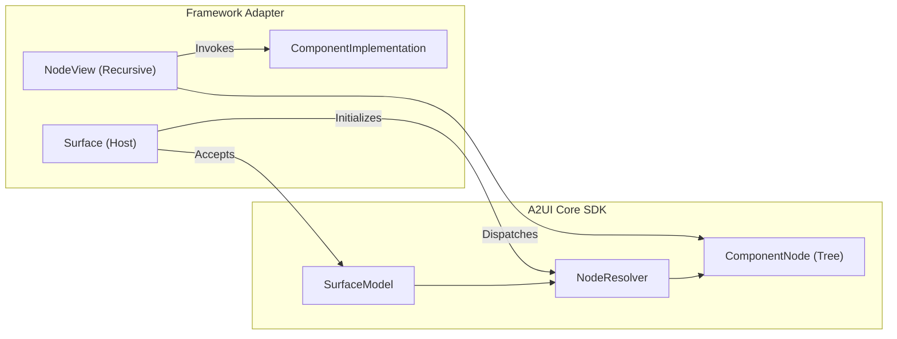

# A2UI Framework Adapter Specification

A [Framework Adapter](../../docs/public/concepts/glossary.md#fw-adapter) renders A2UI surfaces with a native UI framework. It bridges the platform-agnostic [Core SDK](a2ui_core.blueprint.md) to a target UI technology—such as React, Lit, Angular, Flutter, SwiftUI, or AngularDart—translating reactive layout state into platform-native widgets and views.

This specification describes what a framework adapter must build and expose. It is written for a developer implementing an adapter for a new language or UI framework.

---

## 1. Scope & Core Integration

### Protocol versions

The adapter renders the node tree that Core resolves, so it is not tied to one wire format. Core negotiates the protocol version per message and produces the same `ComponentNode` tree for a v0.9 and a v1.0 surface. The adapter targets **v1.0** as its primary version and renders earlier surfaces through the same code path.

A few v1.0 changes do reach the adapter, and this document calls them out where they apply:

| v1.0 change                                                                               | Where it reaches the adapter                                                   |
| ----------------------------------------------------------------------------------------- | ------------------------------------------------------------------------------ |
| `theme` removed from `createSurface` and from catalogs                                    | No theme data to publish or read. Styling is a host concern (§2, §4.1).        |
| Several catalogs on one surface (`catalogId` on components and function calls)            | Implementation preparation covers every catalog (§4.2); `impl` is per node.    |
| Checks evaluate to `ValidationResult` objects                                             | Three resolved validation props instead of a boolean (§3).                     |
| `accessibility` and `metadata` envelope properties on every component                     | Mapped to the platform accessibility API; `metadata` passed through (§3).      |
| Functions carry `requiresUserActivation` and `allowedCallers`                             | Actions run synchronously inside the native gesture handler (§4.5).            |
| Bidirectional RPC (`callRendererFunction`, `callAgentFunction`)                           | Host integration exposes Core's processor operations; views do nothing (§4.5). |
| New basic catalog properties (`TextField.placeholder`, `Video.posterUrl`, `Slider.steps`) | Basic catalog implementations (§4.4).                                          |

Packaging follows the same split: the package root exports the version-agnostic `Surface`, node dispatcher, and implementation factories. Code that only serves a legacy wire format lives under a versioned subpath (for example `./v0_8`, `./v0_9`) and is never imported by the root.

### Integration points with Core

An adapter integrates with the Core SDK at two primary boundaries:

1. **`SurfaceModel`**: The adapter's root entrypoint (`Surface`) takes `SurfaceModel` directly as its sole input. The `SurfaceModel` encapsulates incoming message processing, the live component hierarchy, the surface's catalogs (`defaultCatalog` and `availableCatalogs`), the data model, and the event channels (`onAction`, `onError`, `onWarning`).
2. **The Node API (`NodeResolver` and `ComponentNode`)**: The adapter initializes a `NodeResolver` on the `SurfaceModel`. It never queries raw component dictionaries or evaluates JSON pointers directly. Instead, it observes the living tree of `ComponentNode` instances produced by `NodeResolver`.


```mermaid
graph LR
    subgraph CoreSDK["A2UI Core SDK"]
        SM["SurfaceModel"]
        NR["NodeResolver"]
        CN["ComponentNode (Tree)"]
        SM --> NR
        NR --> CN
    end

    subgraph Adapter["Framework Adapter"]
        S["Surface (Host)"]
        NV["NodeView (Recursive)"]
        CI["ComponentImplementation"]
        S -->|Accepts| SM
        S -->|Initializes| NR
        NV -->|Dispatches| CN
        NV -->|Invokes| CI
    end
```

### What the adapter owns

| Concern                   | Description                                                                                            |
| ------------------------- | ------------------------------------------------------------------------------------------------------ |
| Public surface host       | Root view/widget consuming `SurfaceModel` and rendering `NodeResolver.rootNode`.                       |
| Component implementations | Framework-specific UI builders registered for catalog component types.                                 |
| Node dispatcher           | Recursive view mapping each `ComponentNode` to its registered implementation.                          |
| Reactivity bridge         | Mapping core signals to framework-native change notifications.                                         |
| User input and actions    | Forwarding native events to `WritableBinding.set()` and executing action closures.                     |
| Accessibility mapping     | Applying resolved `accessibility` attributes and inferred semantics to the platform accessibility API. |
| Validation display        | Rendering blocking validation messages and non-blocking warnings from resolved check results.          |
| Ambient context           | Propagating the surface handle, its catalogs, and host styling hooks down the view hierarchy.          |
| Teardown lifecycle        | Disposing resolvers and subscriptions when views unmount.                                              |

### What Core owns (Do not reimplement)

- Protocol message parsing, schema validation, and catalog asset loading.
- Catalog resolution for each component and function call: the item's own `catalogId`, then the surface default, then an error. There is no fallback to the catalogs in capabilities. The adapter never reads `catalogId`.
- Data model storage, relative JSON pointer scoping, expressions, and function evaluation, including `@index` and the reserved `@path` / `@call` keys.
- Function execution and RPC: local `functionCall` actions, `callRendererFunction` handling, `callAgentFunction` dispatch, `rendererFunctionResponse` emission, and the `allowedCallers` and `requiresUserActivation` checks.
- Tree topology: parent-child links, template repeaters (`ChildList` expansions), placeholder stand-ins for pending components, cycle detection, and subtree cleanup.
- Composition validation (`allowedParents`, `allowedChildren`, the reserved `Surface` container) and identifier validation (UAX #31).
- Property classification: mapping catalog schemas into dynamic values, actions, child references, and checks, and normalizing check results into `ValidationResult` objects.

> [!WARNING]
> Direct use of `GenericBinder`, `ComponentContext`, or `DataContext` in view components is a legacy pattern retained in older renderers for compatibility. New framework adapters' views must depend strictly on `SurfaceModel` and the Node API (`NodeResolver`, `ComponentNode`). Function implementations still receive a `DataContext` from Core. An adapter whose surface still binds through `ComponentContext` is not compliant with this blueprint and records the deviation in its codebase blueprint.

---

## 2. Package Structure

```text
<adapter_package>/
├── surface/          # Public Surface view/widget and ambient context providers
├── nodes/            # Recursive node dispatcher and fallback components
├── binding/          # Reactivity bridge and two-way property accessors
├── catalog/          # ComponentImplementation interface, catalog types, and factories
│   └── basic/        # Basic Catalog native component implementations
└── styles/           # Host styling hooks: design tokens, style injectors, platform theme bridging
```

`catalog/basic/` must remain cleanly decoupled from `surface/` and `nodes/`. Applications often substitute their own design system components for basic elements (e.g. replacing basic `Button` with an internal UI library button), so core rendering mechanics must never hardcode dependencies on the built-in basic catalog.

`styles/` holds whatever the host framework uses to style components: CSS custom properties, a token set, or a bridge to the platform theme. It never reads styling from the protocol. v1.0 removed `theme` from `createSurface` and from catalog definitions, and a surface at v1.0 or later carries no brand data. An adapter that also renders v0.9 surfaces may read the legacy theme there, but only from code under its versioned subpath.

Web adapters that share element implementations across frameworks follow the [universal custom elements feature blueprint](../features/universal_custom_elements.blueprint.md), which adds a shared element layer to this layout.

---

## 3. The Node API Contract

The adapter consumes these Core SDK types, defined in the [node resolution feature blueprint](../features/node_resolution.blueprint.md#interfaces):

### `NodeResolver`

Constructed for a `SurfaceModel`:

- Exposes `rootNode`: a reactive signal/observable holding the root `ComponentNode` (or empty if the root component has not arrived).
- Exposes `dispose()`: tears down all active subscriptions and child node records.

### `ComponentNode`

Represents one resolved component instance in the tree:

| Property                     | Type / Meaning      | Usage in Adapter                                                                                                                                                                      |
| ---------------------------- | ------------------- | ------------------------------------------------------------------------------------------------------------------------------------------------------------------------------------- |
| `instanceId`                 | `string`            | Unique among siblings. Names a component at a data scope, so the node object behind it can change (see §5).                                                                           |
| `id`                         | `string`            | Unique across the document for the life of the node object. Use it as a DOM id, a portal key, or an accessibility reference target. A replaced node gets a new one; never persist it. |
| `componentId`                | `string`            | Raw ID from payload. Used for logs, debug tools, and error messages.                                                                                                                  |
| `type`                       | `string`            | Component type name (e.g. `"Button"`, `"Text"`).                                                                                                                                      |
| `impl`                       | `ComponentApi?`     | The catalog entry the resolver chose for `type` from the catalog Core resolved for this component. Render it; do not look the type up again.                                          |
| `context`                    | `ComponentContext?` | The binding context the resolver bound this node with; absent while the node is a placeholder. Passed to per-view binders or universal custom elements that still read a context.     |
| `dataPath`                   | `string`            | The data scope the node's bindings resolve against.                                                                                                                                   |
| `state`                      | `NodeState`         | `resolved`, `pending`, `unknown-type` or `cyclic`.                                                                                                                                    |
| `isPlaceholder`              | `boolean`           | `true` for every state other than `resolved`. A placeholder has no `impl` and empty props.                                                                                            |
| `disposed`                   | `boolean`           | `true` once Core has disposed the node. A view still holding one renders nothing.                                                                                                     |
| `props`                      | `Signal<NodeProps>` | Reactive map of resolved properties.                                                                                                                                                  |
| `onDestroyed` / `addCleanup` | Lifecycle hook      | Attaches cleanup closures run when the node is disposed.                                                                                                                              |

### Resolved Props Contract

Properties in `node.props` are already resolved against the component's data context scope:

| Property Type       | Resolved Representation                                                       | Adapter Usage                                                                                            |
| ------------------- | ----------------------------------------------------------------------------- | -------------------------------------------------------------------------------------------------------- |
| **Dynamic Value**   | `ResolvedBinding<T>`                                                          | Read `binding.value` to display.                                                                         |
| **Two-Way Binding** | `WritableBinding<T>` (subtypes `ResolvedBinding<T>`)                          | Read `binding.value` to display; invoke `binding.set(nextValue)` on user edit.                           |
| **Action**          | `NodeAction`, a parameterless closure                                         | Attach directly to native event listener (`onPressed`, `onClick`). See §4.5 for user activation.         |
| **Child**           | `ComponentNode`                                                               | Pass to `buildChild(node)`.                                                                              |
| **Child List**      | List/Array of `ComponentNode`                                                 | Map each through `buildChild(childNode)`. Repeaters are already expanded per array item.                 |
| **Checks**          | `isValid`, `validationErrors`, and `validationResults` beside `checks`        | Block actions while `isValid` is false; show `validationErrors`; show other results as hints. See below. |
| **Accessibility**   | `accessibility` object with resolved `label`, `description`, `live`, `hidden` | Apply to the platform accessibility API. See below.                                                      |
| **Metadata**        | `metadata.extensions`, a map of opaque extension values                       | Pass through to tooling or ignore. Never render it and never fail on unknown keys.                       |

Child references become nodes where the resolver mounts them: in top-level properties, and single references in objects within top-level arrays. A reference or `ChildList` nested deeper stays unresolved in the props, as ids or descriptors rather than nodes, and is not passed to `buildChild`.

#### Validation results

Core evaluates every `CheckRule` on a component and normalizes each outcome to a `ValidationResult`: `valid`, an optional `code`, a `message` (the function's own message, else the rule's static `message`), and a `severity` of `error`, `warning`, or `info` (default `error`). A boolean result from a v0.9 function is normalized the same way, with severity `error`. Core then publishes three sibling props next to `checks`:

| Prop                | Meaning                                                                  |
| ------------------- | ------------------------------------------------------------------------ |
| `isValid`           | `false` if and only if at least one failed result has severity `error`.  |
| `validationErrors`  | The messages of the failed results with severity `error`, in rule order. |
| `validationResults` | Every failed result, with its `code` and `severity`, in rule order.      |

The adapter:

- disables or blocks the component's action while `isValid` is `false`, and shows `validationErrors` next to the control;
- SHOULD show failed `warning` and `info` results from `validationResults` as non-blocking hints, styled by severity;
- MUST NOT evaluate `checks` itself or branch on the shape of a raw result.

> [!NOTE]
> The reference web implementations render `validationErrors` only; `warning` and `info` results are computed but not shown. An adapter that renders them is ahead of the reference, not in conflict with it.

#### Accessibility

Every v1.0 component may carry `accessibility.label`, `accessibility.description`, `accessibility.live`, and `accessibility.hidden`. `label`, `description`, and `hidden` are dynamic, so they arrive resolved like any other binding. The [protocol](../../specification/v1_0/docs/a2ui_protocol.md#catalog-agnostic-accessibility-requirements) requires every renderer to:

- map the four attributes to the platform's accessibility API (web: `aria-label`, `aria-description`, `aria-live`, `aria-hidden`; Flutter: `Semantics`; iOS: `accessibilityLabel` and friends);
- infer defaults from visible text (a button's child text, a field's label) and let an explicit `accessibility` value override the inferred one.

The mapping belongs in one place per adapter, such as the node dispatcher or a base class every implementation extends, so that custom implementations get it without extra work. The adapter does not validate the attributes; Core already has.

---

## 4. Public APIs

A framework adapter exposes four categories of public APIs:

### 4.1 Surface

The root framework view or widget embedded into the host application.

**Key Requirement:** `Surface` directly accepts `SurfaceModel` from the Core SDK as its sole input. Because `SurfaceModel` already contains the component catalogs, component state graph, data model, and action/error event channels, `Surface` does not need any additional props.

```typescript
// Generic API Sketch
interface SurfaceProps {
  /** The living Core SDK surface model managing state, catalogs, and messages. */
  surface: SurfaceModel;
}
```

```dart
// Flutter Sketch
class A2uiSurface extends StatefulWidget {
  final SurfaceModel surface;

  const A2uiSurface({
    super.key,
    required this.surface,
  });
}
```

#### Responsibilities & Behavior:

1. **Resolver Lifecycle**: Instantiates and retains a `NodeResolver` for the surface for the lifetime of the view. If the `surface` prop changes identity, disposes the old resolver and creates a new one. Disposes the resolver when the view unmounts.
2. **Root Observation**: Observes `nodeResolver.rootNode`. While `rootNode` is empty, renders a framework-appropriate loading placeholder. Once `rootNode` resolves, renders the root `NodeView`.
3. **Ambient Context Injection**: Publishes the surface instance (which exposes the surface's catalogs and event dispatchers) and any host services implementations need, such as a markdown renderer, into the framework's ambient DI/context mechanism (React Context, Flutter `InheritedWidget`, SwiftUI `Environment`, Angular DI).
4. **Rendering only**: `Surface` does not process messages, negotiate capabilities, or execute RPC. Those belong to the host integration (§4.5).

---

### 4.2 ComponentImplementation

`ComponentImplementation` is the most important framework-specific contract. It pairs a component's schema and type name with the framework-native rendering function.

```typescript
// Generic Contract
interface ComponentImplementation extends ComponentApi {
  readonly name: string;
  readonly schema: Schema;
  build(node: ComponentNode, props: NodeProps, buildChild: BuildChild): NativeView;
}
```

A surface may draw from several catalogs at once. The same implementation can be registered in more than one of them, and a child can come from a different catalog than its parent. Two rules follow:

- Any adapter-side preparation of implementations (wrapping them in host elements, binding an injector, caching a view factory) MUST cover every catalog in `surface.availableCatalogs`, not only `surface.defaultCatalog`.
- An implementation reads its props through the schema of the entry the resolver chose (`node.impl.schema`), not through a schema captured when the implementation was authored, unless the two are the same object.

Because UI paradigms and language type systems differ significantly, this API can take several forms depending on the target language:

#### Form 1: Direct Property & Binding Access (Recommended for Dart, Swift, Go)

In statically typed languages without compile-time schema introspection, components receive the `ComponentNode` and its current props, and unpack properties with explicit casts.

_Example in Dart (Flutter against the Dart `a2ui_core`):_

```dart
typedef ChildWidgetBuilder = Widget Function(ComponentNode child);

class FlutterComponentImplementation extends ComponentApi {
  final Widget Function(
    BuildContext context,
    ComponentNode node,
    NodeProps props,
    ChildWidgetBuilder buildChild,
  ) builder;

  const FlutterComponentImplementation({
    required super.name,
    required super.schema,
    required this.builder,
  });
}

// Authoring a Button component:
final buttonImplementation = FlutterComponentImplementation(
  name: 'Button',
  schema: buttonSchema,
  builder: (context, node, props, buildChild) {
    final child = props['child'] as ComponentNode?;
    final action = props['action'] as Future<void> Function()?;

    return ElevatedButton(
      onPressed: action,
      child: child == null ? null : buildChild(child),
    );
  },
);
```

A control that holds native state, such as a text field's controller, keeps it in the widget's `State`: it creates the controller once, updates it when the binding's value differs from the field's text, writes user edits through the `WritableBinding`, and disposes the controller when the view unmounts.

#### Form 2: Generic Typed Accessor Helpers

To minimize manual map indexing and casting, the adapter can expose lightweight accessors on `NodeProps`:

```dart
extension NodePropsAccessors on NodeProps {
  String? stringValue(String key) =>
      (this[key] as ResolvedBinding<Object?>?)?.value?.toString();

  WritableBinding<Object?>? writableBinding(String key) {
    final Object? binding = this[key];
    return binding is WritableBinding ? binding : null;
  }

  Future<void> Function()? action(String key) =>
      this[key] as Future<void> Function()?;

  List<ComponentNode> childNodes(String key) =>
      (this[key] as List<Object?>?)?.cast<ComponentNode>() ?? const [];
}
```

A binding's value is not typed by the schema, so a builder converts it where it needs a typed value:

```dart
builder: (context, node, props, buildChild) {
  final checked = props.writableBinding('value');
  return Checkbox(
    value: checked?.value == true,
    onChanged: (v) => checked?.set(v ?? false),
  );
}
```

#### Form 3: Schema-Inferred Typed Props (TypeScript / Dynamic Ecosystems)

Languages with advanced generic type inference (like TypeScript with Zod) can infer the exact resolved shape from the component schema:

- Primitive paths collapse to raw types (`DynamicString` $\to$ `string`).
- Actions collapse to closures (`Action` $\to$ `() => void`).
- Child lists collapse to `ComponentNode[]`.

```typescript
// Component author receives strictly-typed `props` inferred from schema:
export const ReactButton = createComponentImplementation(
  ButtonApi,
  ({ props, buildChild }) => {
    // TypeScript knows props.label is string | undefined and props.action is (() => void) | undefined
    return <button onClick={props.action}>{props.label}</button>;
  },
);
```

#### Form 4: Stateful / Imperative Instances (Vanilla DOM, Android Views)

In frameworks where UI nodes are long-lived mutable objects rather than rebuildable virtual structures, `ComponentImplementation` provides an instantiation factory:

```typescript
interface ComponentInstance {
  mount(parent: NativeElement): void;
  update(node: ComponentNode): void;
  unmount(): void;
}

interface ComponentImplementation extends ComponentApi {
  createInstance(node: ComponentNode): ComponentInstance;
}
```

---

### 4.3 Optional Helper APIs & Ergonomic Sugar

Adapters may provide convenience helpers to eliminate boilerplate when registering catalogs or creating implementations:

1. **`createComponentImplementation(api, builder)`**: Validates and bundles API schema with builder function.
2. **`createCatalog({ id, protocolVersion, components, functions })`**: Constructs a catalog container with registered implementations. A catalog for v1.0 or later MUST declare its `protocolVersion`; Core rejects an unversioned catalog on a surface at v1.0 or later.
3. **Reactivity Wrappers / Hooks**:
   - React: `useNodeProps(node)` / `useSignalValue(node.props)` returning current resolved props.
   - Flutter: `NodePropsBuilder(node: node, builder: (context, props) => ...)` or `ValueListenable` adapter.
   - SwiftUI: `Node.binding(for: "key", default: defaultValue)` wrapping `WritableBinding` into a SwiftUI `Binding<T>`.

---

### 4.4 Basic Catalog Implementation

The adapter should ship pre-built implementations for the standard Basic Catalog components:

- **Containers** (`Row`, `Column`, `Card`, `Modal`, `List`, `Tabs`): Render children in order via `buildChild`. In `List`, items are already expanded by Core per data array entry; the container maps each child node without indexing logic.
- **Display Leaves** (`Text`, `Image`, `Icon`, `Video`, `AudioPlayer`, `Divider`): Read resolved primitives from `node.props` and render native view equivalents.
- **Interactive Controls** (`Button`, `TextField`, `CheckBox`, `Slider`, `ChoicePicker`, `DateTimeInput`): Handle two-way value binding via `WritableBinding.set()`, trigger action closures on native events, and render validation messages as §3 describes.

The v1.0 basic catalog adds `TextField.placeholder`, `Video.posterUrl`, and `Slider.steps`, and marks `openUrl` as `requiresUserActivation: true`. Its validation functions (`required`, `regex`, `length`, `numeric`, `email`) return `ValidationResult` objects rather than booleans. One implementation set can serve both the v0.9 and the v1.0 basic catalog when it treats the v1.0 properties as optional.

The adapter's catalog also supplies Core `FunctionImplementation`s for the catalog's functions, since Core evaluates every function call in props and actions. Core ships the basic catalog functions per protocol version; the adapter registers Core's implementations rather than writing its own.

Follow the Basic Catalog Implementation Guide for the catalog version being implemented: [v1.0](../../catalogs/basic/v1/basic_catalog_implementation_guide.md) or [v0.9.1](../../specification/v0_9_1/docs/basic_catalog_implementation_guide.md).

---

### 4.5 Host Integration, Actions, and RPC

An adapter package usually ships one host-level entry point beside `Surface`: an Angular service, a React provider, a Flutter controller. It owns Core's `MessageProcessor` and the catalogs, and it is where the application feeds messages in and sends responses out. The host integration exposes, without reimplementing them, Core's operations:

- `processMessages(payload)` for state updates and fire-and-forget calls;
- `processMessagesAsync(payload)`, which awaits `callRendererFunction` execution and returns the `rendererFunctionResponse` messages the application must send back to the agent;
- `callAgentFunction(surfaceId, call, options)` for renderer-initiated agent calls, with an outbound listener the application wires to its transport.

Core executes renderer functions, checks `allowedCallers`, rejects unauthorized calls with `INVALID_FUNCTION_CALL`, and correlates responses. The adapter adds no function execution path of its own.

#### Actions and user activation

A `NodeAction` resolves its payload when invoked. For an `event` payload, Core dispatches one action to the agent. For a `functionCall` payload, Core runs the function locally and dispatches nothing. A function marked `requiresUserActivation` (such as `openUrl`) runs only while the platform reports an active user gesture, so the adapter:

- invokes the `NodeAction` synchronously inside the native gesture handler, with no debounce, defer, or re-dispatch through a scheduler;
- does not inspect, cache, or pre-resolve the action payload;
- may show a pending state while a returned future is unsettled. Failures reach the agent through the surface's error channel; the view needs no error handling of its own.

#### Asynchronous bindings

The protocol lets a dynamic value or check depend on a function that runs asynchronously, including one routed to the agent. A view treats a binding whose value is not yet available like any other empty value and re-renders when the node's `props` emit.

> [!NOTE]
> The protocol's fallback that routes an unregistered local function to `callAgentFunction` is not yet implemented in any Core SDK. Until it is, such a call reports an expression error and the binding resolves to an empty value.

---

## 5. Node Dispatcher Mechanics (`NodeView`)

The internal recursive renderer maps a `ComponentNode` to its native UI element.

```typescript
type BuildChild = (child: ComponentNode) => NativeView;

function NodeView(node: ComponentNode): NativeView;
```

### Execution Steps:

1. **Check `node.state`**:
   - `resolved`: Render `node.impl`, the implementation the resolver already chose.
   - `pending`: Render a non-blocking loading placeholder.
   - `unknown-type` and `cyclic`: Render a visible diagnostic. The resolver has already reported `UNKNOWN_COMPONENT_TYPE` or `CYCLIC_REFERENCE` to the surface, so the adapter does not report it again.
2. **Subscribe to `node.props`**: Rebuild the view when the node's props emit, and pass the current props to the implementation. Unsubscribe when the view unmounts.
3. **Invoke Builder**: Pass `node`, its current props and a `buildChild` callback to the implementation.
4. **Provide `buildChild`**: Construct a closure `(child: ComponentNode) => NativeView` that recursively invokes `NodeView(child)`.
5. **Preserve Identity**: Key each child's view by `node.instanceId`. An `instanceId` names a component at a data scope, so in an explicit child list the view follows its component through a reorder, and in a template it stays with an index. The node object behind an `instanceId` can change while the id stays: when a placeholder's component arrives, when the component's type changes, and when an explicit child list is reordered. A view keyed by `instanceId` therefore moves its subscriptions to the new node, and resets its view state when the type changes.

A component that Core rejects at ingest never becomes a node. This covers a component whose catalog cannot be resolved (no `catalogId` of its own and no surface default), a schema failure, an identifier that violates UAX #31, and a composition violation (`UNALLOWED_PARENT`, `UNALLOWED_CHILD`). The position that references it stays a `pending` placeholder, and Core reports the error to the agent. The dispatcher needs no extra branch for these cases.

---

## 6. Lifecycle & Destruction

A framework adapter coordinates two distinct lifecycles: the **Node lifecycle** managed by Core's `NodeResolver`, and the **View lifecycle** managed by the host UI framework.

### Separation of Ownership

- **Core owns `ComponentNode`**: `NodeResolver` creates nodes when referenced, updates them as properties change, and disposes them when unreferenced or deleted. The adapter MUST NOT call `node.dispose()` or attempt to destroy nodes manually.
- **The Adapter owns Native Views**: The native framework mounts, updates, and unmounts elements. The adapter's sole responsibility is to keep view lifecycles synchronized with node state and cleanly drop listeners when views detach.

### When is a native view destroyed?

1. **Child removal from a parent**: When a parent stops referencing a child, or a dynamic array shrinks, `NodeResolver` disposes that `ComponentNode` and emits an updated children list on the parent. A deleted component that is still referenced becomes a pending placeholder at its position instead. When the parent re-renders its children (keyed by `node.instanceId`), the native framework unmounts and destroys the view for the dropped child.
2. **Placeholder replacement**: When a component definition arrives after being referenced, `NodeResolver` replaces the placeholder node in place and emits a new parent props object containing the concrete `ComponentNode`. The view keyed by the placeholder's `instanceId` switches to the new node and renders the concrete component in place of the placeholder.
3. **Surface unmount**: When the host application removes the `Surface` view/widget (e.g. user navigates away), the adapter MUST invoke `nodeResolver.dispose()`. This recursively disposes all living `ComponentNode` instances, cancels data model subscriptions, and drops internal listeners.

### View cleanup obligations

Whenever a native component unmounts (via framework hooks like React `useEffect` cleanup, Flutter `State.dispose()`, Angular `DestroyRef`, or SwiftUI teardown):

- **Unsubscribe from `node.props`**: Terminate the signal subscription or listener immediately to prevent memory leaks and ghost updates.
- **Flush or discard pending debounced writes**: If the component debounced user input (e.g., text typing), flush pending writes to `WritableBinding.set()` or cancel active timers.
- **Release native resources**: Dispose native controllers, focus nodes, gesture recognizers, or media players.
- **Dispose per-view binders**: A view that owns a binder or controller of its own (a long-lived element in Form 4) disposes it when the view disconnects, not only when the view is handed a different node. A disconnected view that keeps its binder keeps its data model subscriptions alive with it.

### Node Teardown Callbacks (`addCleanup` and `onDestroyed`)

The adapter does not need to orchestrate complex teardown pipelines. `ComponentNode` provides two built-in hooks:

1. **`node.addCleanup(fn)`**: Registers a callback that runs automatically when the node is disposed by `NodeResolver`. Use it for resources tied to the node, such as a subscription created for it. Native controllers belong to the view, which can unmount while its node lives on or outlive a node that is replaced, so they are released in the view's own unmount hook.
2. **`node.onDestroyed`**: An event that fires exactly once when the node is disposed.

In modern declarative frameworks (React, Flutter, SwiftUI), child views unmount naturally when removed from their parent's children list. Between the framework's native unmount hooks and `node.addCleanup()`, lifecycle disposal requires minimal adapter-side code.

---

## 7. Testing

### Conformance Grounding

The repository maintains language-agnostic conformance tests in [`conformance/`](../../conformance/README.md). Core SDK conformance (`conformance/core/`) must pass in the target language before an adapter can function reliably.

### Required Adapter Test Suite

| Test Area                      | Assertion                                                                                                                                                                                                                   |
| ------------------------------ | --------------------------------------------------------------------------------------------------------------------------------------------------------------------------------------------------------------------------- |
| **Tree Hierarchy**             | Loading a surface payload builds a native view tree exactly matching the `ComponentNode` graph, with children in declared order.                                                                                            |
| **Single-message surface**     | A `createSurface` at v1.0 or later carrying `components` and `dataModel` renders without a following `updateComponents`.                                                                                                    |
| **Progressive Arrival**        | When a component is referenced before its definition arrives, the adapter renders a placeholder, then upgrades to the real component in place without remounting the parent.                                                |
| **Dynamic Repeaters (`List`)** | Modifying an array in the `DataModel` (insert, delete, reorder) updates child widgets without remounting unaffected siblings. A template item that reads `@index` shows its position.                                       |
| **Two-Way Binding**            | User input on native controls calls `WritableBinding.set()`, updates the Core `DataModel`, and updates all observing components.                                                                                            |
| **Action Execution**           | Triggering native events (clicks, taps) executes the action closure. An `event` action dispatches the client event with correctly scoped context; a `functionCall` action runs the function locally and dispatches nothing. |
| **User activation**            | A `functionCall` action on an activation-gated function (`openUrl`) runs when fired from a native gesture and is refused when fired without one.                                                                            |
| **Multiple catalogs**          | A surface whose root and one descendant come from two different catalogs renders both, and each implementation receives props shaped by its own catalog's schema.                                                           |
| **Validation results**         | A check that returns `{valid: false, severity: "error", message}` disables the control and shows the message; one returning `severity: "warning"` leaves the control enabled; a boolean `false` behaves as an error.        |
| **Accessibility**              | `accessibility.label`, `description`, `live`, and `hidden` reach the platform accessibility API on the focusable element, and an explicit `label` overrides the inferred one.                                               |
| **Theme ignored**              | A `createSurface` at v1.0 or later that carries a `theme` object renders exactly as one without it.                                                                                                                         |
| **Fallback States**            | Unknown component types and cyclic references render visual diagnostics without crashing, and the adapter reports nothing itself.                                                                                           |
| **Teardown & Cleanup**         | Unmounting `Surface` or deleting components releases all property subscriptions and frees memory.                                                                                                                           |

---

## 8. Gallery App Specification

The Gallery App is a comprehensive development, demonstration, and debugging tool that serves as the reference environment for an A2UI renderer. It allows developers to visualize components, inspect the live data model, step through progressive rendering, and verify interaction logic.

### UX Architecture

The Gallery App implements a three-column layout:

1. **Left Column (Sample Navigation)**: A list of available A2UI sample scenarios, grouped by protocol version, with a version selector. Each version loads its own example set: the v0.9 examples from `specification/v0_9/catalogs/basic/examples` and the v1.0 examples from `catalogs/basic/v1/examples`.
2. **Center Column (Rendering & Messages)**:
   - **Surface Preview**: Renders the active A2UI `Surface`.
   - **JSON Message Stream**: Displays the sequence of A2UI messages.
   - **Interactive Stepper**: An "Advance" control allowing developers to process messages one by one to verify progressive rendering and placeholder upgrades.
3. **Right Column (Live Inspection)**:
   - **Data Model Pane**: A live-updating view of the full `DataModel`.
   - **Action Logs Pane**: A log of triggered actions, their resolved context scopes, and any RPC messages the processor emits.

The gallery registers one basic catalog per supported protocol version with its processor, so a sample's `version` field alone selects the catalog. At least one sample mixes a custom catalog with the basic catalog on one surface.

### Integration Testing Requirements

Every framework adapter implementation should include integration tests that utilize the Gallery App's sample scenarios to verify:

- **Static Rendering**: Basic components (e.g. "Simple Text") render correctly.
- **Layout Integrity**: Layout containers ("Row Layout", "Column Layout") arrange children properly.
- **Two-Way Binding**: Modifying an interactive field (like `TextField` or `CheckBox`) updates both the UI and the underlying `DataModel` simultaneously.
- **Reactive Logic**: Changes in one component dynamically update dependent components.
- **Action Context Scoping**: Actions emitted from nested templates (like `List`) contain correctly resolved data paths.
- **Version Coverage**: Each sample set renders under its own protocol version, including at least one v1.0 sample with inline `components` and `dataModel`.

---

## 9. Reference Implementations

Consult existing implementations for concrete language mechanics:

| Codebase                                                                       | Framework    | Architecture Highlights                                                                                                                                                                                                                    |
| ------------------------------------------------------------------------------ | ------------ | ------------------------------------------------------------------------------------------------------------------------------------------------------------------------------------------------------------------------------------------ |
| [`typescript/web_core/src/universal`](../../typescript/web_core/src/universal) | Web (shared) | The shared custom element layer the three web renderers render through, including the basic catalog elements for v0.9 and v1.0. See the [universal custom elements feature blueprint](../features/universal_custom_elements.blueprint.md). |
| [`renderers/react`](../../renderers/react)                                     | React        | `NodeResolver` owned by `Surface`; every node renders as a custom element; React implementations are hosted in portal elements; schema-typed props inference. The closest implementation of this blueprint.                                |
| [`renderers/angular`](../../renderers/angular)                                 | Angular      | Angular Signals, dependency-injected catalog resolution, dual-mode native/universal rendering. Its host component still binds through `ComponentContext` rather than `NodeResolver`.                                                       |
| [`renderers/lit`](../../renderers/lit)                                         | Lit          | Thin package over the universal layer. Its `Surface` still binds the root through `ComponentContext` rather than `NodeResolver`.                                                                                                           |
| [`dart/a2ui_flutter`](../../dart/a2ui_flutter)                                 | Flutter      | Planned Flutter adapter based on the Node API in the Dart `a2ui_core`.                                                                                                                                                                     |
| [`swift/swiftui`](../../swift/swiftui)                                         | SwiftUI      | SwiftUI `View` integration, `@Environment` propagation, `Binding<T>` bridging.                                                                                                                                                             |
