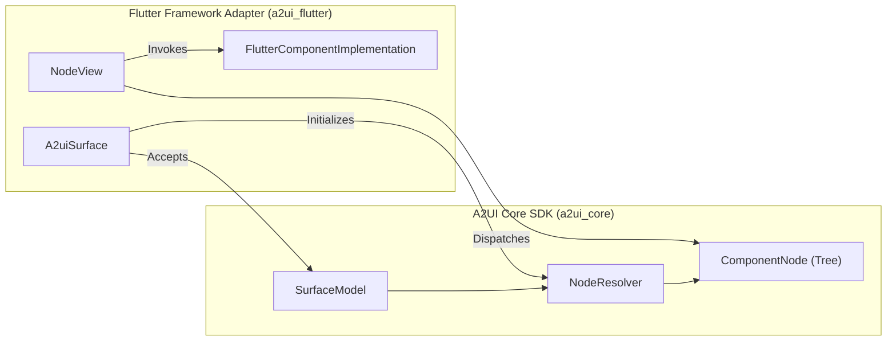

# A2UI Flutter Framework Adapter

The official Flutter framework adapter for A2UI, building directly on the Node API of `a2ui_core`.

Implements protocol **v0.9**.

---

## Architecture Overview

`a2ui_flutter` translates reactive A2UI component trees into native Flutter widgets. It adheres strictly to the [A2UI Framework Adapter Specification](../../blueprints/modules/a2ui_framework_adapter.blueprint.md).



### Key Contracts

1. **`A2uiSurface`**: The public root widget embedded into your Flutter app. Directly accepts a `SurfaceModel<FlutterComponentImplementation>` as its sole input. Manages the lifecycle of `NodeResolver` and injects ambient context (`A2uiSurfaceScope`).
2. **`FlutterComponentImplementation`**: Pairs a component type name and JSON Schema with a Flutter widget builder:

   ```dart
   typedef ChildWidgetBuilder = Widget Function(
     ComponentNode<FlutterComponentImplementation> child,
   );

   class FlutterComponentImplementation extends ComponentApi {
     final Widget Function(
       BuildContext context,
       ComponentNode<FlutterComponentImplementation> node,
       ChildWidgetBuilder buildChild,
     ) builder;
   }
   ```

3. **`NodeView`**: The recursive dispatcher widget keyed by `ValueKey(node.instanceId)`. Subscribes to `node.props` and renders the component or appropriate fallback states (loading placeholder, unknown type warning, cyclic reference indicator).
4. **`NodePropsAccessors`**: Ergonomic typed accessors on `ComponentNode<FlutterComponentImplementation>` (`stringValue`, `boolValue`, `numValue`, `writableBinding`, `action`, `childNodes`, `childNode`).
5. **`A2uiThemeAdapter`**: Adapts A2UI JSON theme definitions to Flutter `ThemeData`.
