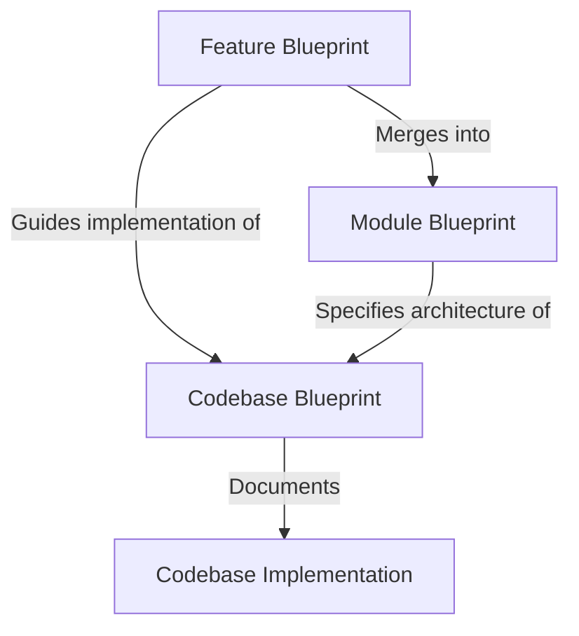

# **Scaling A2UI codebases with spec-driven development**

## *Status: Draft*

## *Created: 2026-06-18 Modified: 2026-06-18*

# **Background**

The A2UI team has adopted recent development practices of using agents to write the majority of our code, using designs, specifications, prompts and other codebases as inputs to guide it. In this paradigm, the job of human developers is primarily to write and maintain the documentation that agents use to write code. This spec-driven development (SDD) approach is being adopted across the software industry in various ways. Members of the A2UI team have tried many different approaches, including generating detailed design docs which are then reviewed by humans for implementation, maintaining markdown guides which can be used to implement multiple variants of a codebase (e.g. `renderer_guide.md` for web renderers) or creating detailed Github issues that are used by agents to implement features.

The A2UI team is aims to write and maintain a several codebases across multiple languages with a small team. We have an opportunity to do this more efficiently by formalizing our adoption of spec-driven development patterns, so that we can 

We need to adapt existing spec-driven development approaches to a family of codebases which implement the same specification across different languages.

# **Goals**

* Allow the A2UI team to more quickly implement features across SDK implementations in multiple languages.  
* Allow contributors outside of the core A2UI team to more efficiently write and maintain their own A2UI SDKs, for example the Jetpack Composer and Swift UI renderers.  
* Allow the A2UI team to collaborate more efficiently by standardizing the way that we record SDK and feature specifications.  
* Increase the productivity of agents working in our codebase on any task by giving them better access to relevant design documentation.  
* Make it easier for humans and agents to understand the discrepancies between different SDK codebases by emphasizing better definition of features and a clear separation between required features and optional (a.k.a. new or experimental) features.
* Avoid disrupting existing workflows used by team members and ensure they still have freedom to experiment with novel techniques.

# **Overview**

This document outlines the **Spec-Driven Development (SDD)** methodology for the A2UI repository. The goal of SDD is to streamline the implementation of the A2UI protocol and its features across multiple programming languages and UI frameworks by establishing clear, language-agnostic specifications (called **Blueprints**) and leveraging AI coding agents to scale development.



Under this model:
1. **Module Blueprints** define the high-level architecture, core interfaces, and behavior of repository modules (e.g., `a2ui_core`, `a2ui_inference`, `a2ui_react`, etc.).
2. **Feature Blueprints** describe specific feature additions or behavioral changes to a module.
3. **Codebase Blueprints** reside within each platform's implementation folder, tracking implemented features and documenting local design decisions or deviations.

Spec-driven development is primarily used for major features, e.g. the addition of a new public API, behavior, protocol version or architectural change.

Smaller features can still be implemented ad-hoc with no feature specification, if they are:

* Making changes to functionality that is not explicitly documented in the module blueprint, or
* Addressing local bugs, refactorings, or performance optimizations that do not affect the public API or cross-language protocol compliance, or
* Adding codebase-specific utility functions or internal helpers that do not impact compatibility with other SDKs.

# **Document types**

## **Feature blueprint**

### **Required vs optional features**

A **Required Feature Blueprint** describes a feature that is expected to be implemented in all codebases for a specific module. When a required feature blueprint is added, the associated module blueprint is updated at the same time to completely include the information required to implement the feature. The purpose of preserving the required feature blueprint in version control is to help agents implement the feature in existing module codebases based on previous versions of the module blueprint.

An **Optional Feature Blueprint** describes a feature that is not baked into the module blueprint and is not expected to be implemented in all codebases. It allows platforms to support experimental or framework-specific features without forcing compliance across all SDKs.

### **my\_feature.blueprint.md structure**

Every feature blueprint must follow a standardized Markdown structure with YAML frontmatter. Below is an example feature blueprint for a dynamic theming feature, written in a language-agnostic way:

```markdown
---
feature_name: dynamic_theming
module_blueprints:
  - a2ui_core
  - a2ui_react
  - a2ui_lit
  - a2ui_angular
required: false
date_added: 2026-06-23
status: active
---

# **Dynamic Theming Feature Blueprint**

## **Requirements**
Allow agents or clients to dynamically adjust the visual theme of an active surface without recreating the surface. The client must parse theme updates in the incoming message stream and apply the new styling parameters in real time using common reactivity interfaces.

## **Detailed Description of Changes**
1. **Protocol Schema**: Add an optional `updateTheme` object to the `A2uiMessage` envelope schema.
2. **Message Ingestion**: The `MessageProcessor` must parse the `updateTheme` message and update the associated `SurfaceModel` state.
3. **State Layer**: The `SurfaceModel` must expose a reactive `theme` property/stream that emits theme updates to subscribers.
4. **Context Propagation**: The `ComponentContext` must provide access to the resolved theme parameters from the parent `SurfaceModel`.
5. **Widget Rendering**: The `ComponentImplementation` must observe the theme via its `ComponentContext` and apply styling rules dynamically during the `build()` / `render()` execution.

## **Links**
* RFC/Discussion: [Issue #452](https://github.com/a2ui-project/a2ui/issues/452)
* Protocol Specification: [a2ui_protocol.md](file:///Users/jsimionato/development/a2ui_repos/spec-driven/a2ui/specification/v1_0/docs/a2ui_protocol.md)

## **Test Cases & Conformance**
* **Test Case 1: Simple Theme Apply**: Verify that sending `updateTheme` with a new background color updates the `theme` signal on `SurfaceModel` and triggers a re-render.
* **Test Case 2: Theme Reset**: Verify that passing a `null` theme resets the `SurfaceModel` theme to default values.
* Conformance data located at: `specification/v1_0/test/conformance/dynamic_theming/`

## **Implementation Steps**
1. Update the `server_to_client.json` schema to include the `updateTheme` envelope.
2. Implement parsing and state propagation in the `a2ui_core` codebase implementations (updating `MessageProcessor` and `SurfaceModel`).
3. Update framework-specific renderers (`a2ui_react`, `a2ui_lit`, etc.) to bind to the new `theme` stream in their adapters and update native widgets dynamically.
4. Update respective codebase blueprints.

## **Checklist**
- [ ] Schema updated and validated
- [ ] `MessageProcessor` parses `updateTheme` and updates `SurfaceModel`
- [ ] `SurfaceModel` exposes reactive `theme` stream
- [ ] Framework-specific adapters observe `theme` and trigger native re-renders
- [ ] Conformance tests passing
```

## **Optional feature blueprint**

An **Optional Feature Blueprint** follows the exact same structure as a required feature blueprint, but with the header `required: false` in its YAML frontmatter. It has the following characteristics:
* **Decoupled Lifecycle**: It is not integrated into the base Module Blueprint. Instead, it exists as a standalone specification file.
* **Ad-hoc Implementation**: Each codebase implementation can decide independently whether to support the feature based on platform capabilities and user needs.
* **Discovery**: Codebases that implement the feature must list it in their `codebase.blueprint.md` under `implemented_features` to let clients and agents know it is supported.

## **Module blueprint**

A **Module Blueprint** describes an entire architectural module in a language-agnostic way. It serves as the primary source of truth for building a new codebase from scratch or verifying the correctness of an existing one.

### **Blueprint file content**

Module blueprints are stored in `blueprints/modules/` and must follow this structure:

* **YAML Frontmatter**:
  * `name`: The canonical name of the module (e.g., `a2ui_core`).
  * `code_location`: The directory pattern where implementations reside (e.g., `renderers/web_core`, `agent_sdks/kotlin/core`).
  * `protocol_version`: The target protocol version (e.g., `v1.0`).
  * `included_features`: A list of required feature blueprint names that are fully integrated into this module.

* **Core Sections**:
  * **Architecture Overview**: High-level explanation of the module's responsibilities and data flow.
  * **Core Interfaces**: Abstract definitions of key classes, interfaces, methods, and types (e.g., `MessageProcessor`, `SurfaceModel`, `ComponentContext`, `ComponentImplementation`, `Surface`).
  * **Behavioral Rules**: Detailed rules for state transition, event emission, error boundaries, and resource management (e.g., subscription lifecycle).

### **Conformance test content**

* **Verification Suite**: Defines the contract of conformance that all implementations of this module must satisfy.
* **Mock Data**: Specifies the path to the JSON payloads, mock actions, and expected output states used for validation.
* **Test Plan**: Instructions on how to execute the test suite in a new language/ecosystem.

## **Codebase**

A **Codebase** is a concrete, language-specific or framework-specific implementation of a module. Examples of codebases in this repository include:
* `renderers/web_core` (TypeScript implementation of `a2ui_core`)
* `renderers/lit` (Lit/HTML implementation of `a2ui_lit`)
* `agent_sdks/kotlin` (Kotlin implementation of `a2ui_inference` and `a2ui_core`)

## **Codebase blueprint**

Each codebase must contain a `codebase.blueprint.md` file in its root directory. This file maps the concrete implementation back to the language-agnostic module blueprint, tracking its feature support and local engineering decisions.

### **File Structure**

* **YAML Frontmatter**:
  * `associated_module`: The name of the module blueprint it implements (e.g., `a2ui_core`).
  * `implemented_features`: A list of required and optional feature blueprint names that are fully implemented in this codebase.
  * `protocol_compliance`: The version of the protocol implemented.

* **Core Sections**:
  * **Architecture & Styling**: Explanation of how the codebase maps the abstract module interfaces to concrete platform patterns (e.g., using Lit signals, React hooks, or Kotlin flows).
  * **Technical Decisions & Overrides**: Documentation of any intentional deviations from the module blueprint, along with their engineering rationale (e.g., handling platform limitations, performance optimizations).
  * **Dependencies**: External libraries used for reactivity, parsing, or UI components.

# **Developer journeys**

This section explains what steps will be taken by developers and agents to perform common tasks in spec-driven development

## **Specify a new required feature**

1. Create required feature blueprint **(significant human input required)**  
2. Update module blueprint based on the feature blueprint, to ensure the module blueprint fully specifies the feature and how to implement it. Add the feature name to the module’s “included features”. (coding agent)

## **Specify a new optional feature**

1. Create optional feature blueprint **(significant human input required)**

## **Promote an optional feature to be required**

1. Update module blueprint based on the feature blueprint, and add it to the module’s “included\_features”. (coding agent)

## **Implement an optional or required feature in a codebase**

1. Verify that the codebase does not already contain the feature  
2. Create a temporary design describing in detail how the feature should be implemented in the specific codebase, taking into account the feature blueprint, the codebase blueprint, and the actual codebase code. This file should not be checked in. **(human input required)**  
3. Use the temporary design to implement the feature  
4. Update the codebase blueprint to add the feature to the “included\_features” and include any codebase specific decisions that were made as part of the feature implementation 

## **Implement all the features necessary to bring a codebase “up to date”**

1. Read the codebase blueprint and module blueprint and identify all the required features in the module that are not in the codebase.  
2. Implement each feature in chronological order, based on their blueprints, following the steps to implement a feature above.  
3. Consult the module blueprint and verify that the codebase now matches it, making minor changes to the codebase as necessary to make it as consistent as possible to the module blueprint.  
4. Update the codebase blueprint to add the feature to the “included\_features”.

## **Resolve inconsistencies between a module blueprint and all of its associated codebases**

1. Read the relevant module blueprint  
2. Search for all codebases that associated with the module  
3. Analyse every codebase associated with the module, identifying:  
   1. Required features that are missing from each codebase  
   2. Discrepancies between the blueprint and the actual implementation e.g. API names or structures which are inconsistent  
   3. Discrepancies between the codebases, for which the module blueprint provides no guidance.  
4. Report the above and propose actions to take to reduce the inconsistencies including:  
   1. Adding additional detail to the blueprints to reduce ambiguity  
   2. Update the module blueprint to explicitly mark a detail as being a codebase-level decision  
   3. Updating codebases to match the module blueprints  
   4. Update the codebase blueprint to document a reason that it has intentionally deviated from the module blueprint for a language-specific reason.  
5. Implement some of the proposed actions, based on human discretion **(significant human input required)**

## **Implement a new codebase**

1. Create a temporary design describing in detail how the codebase should be implemented based on the module blueprint. **(significant human input required)**  
2. Implement the module based on the temporary design  
3. Create a new codebase blueprint, summarizing the design of details that are not specified in the module blueprint.

## **Clean up feature blueprints**

Feature blueprints undergo a clean, Git-centric lifecycle to prevent the blueprints directory from becoming cluttered with obsolete specifications.

1. **Required Features**: Once a required feature has been fully implemented in all active codebases and its requirements have been integrated into the base Module Blueprint, the feature blueprint file is **deleted** from the workspace. Because the file was committed to Git, it remains preserved in the repository's Git history forever, allowing anyone to easily retrieve it if needed.
2. **Optional Features**: Optional feature blueprints remain in `blueprints/features/` as long as they are actively supported. If they are promoted to required, they are integrated into the Module Blueprint and deleted. If they are deprecated or abandoned, they are simply deleted.

# **Workflow Integration & Minimizing Disruption**

To ensure a smooth transition to Spec-Driven Development without interrupting the team's velocity or disrupting existing workflows, we will adopt the following strategies:

## **Non-Disruptive Migration of Existing Docs**
We are not throwing away or rewriting our existing documentation. The bootstrap process primarily involves **relocating and refactoring** our current guides—specifically migrating the framework-agnostic parts of [renderer_guide.md](file:///Users/jsimionato/development/a2ui_repos/spec-driven/a2ui/specification/v1_0/docs/renderer_guide.md) into `a2ui_core.blueprint.md` and the framework-specific parts into their respective renderer blueprints. By **essentially just moving and reorganizing** existing specifications into the new directory structure, we minimize cognitive load and preserve all existing engineering decisions and context.

## **Flexible Prototyping & Iteration Channels**
The introduction of official blueprints does not force developers to write formal blueprints from day one. We recognize that design is an iterative process. To keep workflows lightweight and agile, we support a multi-stage, flexible prototyping flow:

1. **Ideation & Discussion (GitHub Issues & RFCs)**:
   * Teams can continue to brainstorm, discuss, and refine feature ideas using GitHub Issues or pull request discussions.
   * This is the recommended channel for early-stage iteration before any formal blueprint is created. It allows developers to align on the *why* and *what* of a feature without the overhead of formalizing the *how*.
2. **Task-Specific Local Specifications**:
   * During the implementation phase of a task, developers and agents are encouraged to write and use **local, temporary specification files** or design drafts.
   * These files can be stored in `.gitignored` workspace folders or local scratch directories. They allow developers to map out platform-specific code structures, class diagrams, and local variables at a high velocity without creating version control noise.
3. **Draft Blueprints**:
   * Once a feature design is finalized and ready for multi-platform implementation, it is checked in as a formal blueprint in `blueprints/features/` with `status: draft` in its YAML frontmatter. This signals that it is open for cross-platform review before implementation begins.

## **Automation via AI Agent Skills**
To completely eliminate administrative overhead for human developers, our specialized AI agent skills will handle the lifecycle of blueprints automatically:

* **Automated Draft Generation**:
   * The `a2ui-blueprint-maintenance` skill can automatically read a GitHub Issue thread, extract the design consensus, and generate a fully structured, schema-compliant `my_feature.blueprint.md` file.
   * It can also ingest local, informal design drafts and format them into official feature blueprints.
* **Auto-Bootstrapping Codebases**:
   * When setting up a new repository or codebase, the `a2ui-feature-implementer` skill can automatically generate the initial `codebase.blueprint.md` file, pre-populated with the target module's required features.
* **Auto-Validation & Deletion**:
   * Our agent skills will run local validation checks during development to catch blueprint drift.
   * Upon the merge of a pull request that completes a feature across all platforms, the maintenance agent will automatically **delete** the feature blueprint from `blueprints/features/` and update the respective module blueprints, ensuring the specification remains perfectly synchronized with the code with zero manual effort.

# **Implementation**

## **Folder structure**

To keep specifications organized, all language-agnostic blueprints will reside in a top-level `/blueprints/` directory, while codebase-specific blueprints will reside in the root of their respective implementation directories.

```
/
├── blueprints/
│   ├── README.md                 # SDD guidelines and workflow documentation
│   ├── modules/                  # Language-agnostic Module Blueprints
│   │   ├── a2ui_core.blueprint.md
│   │   ├── a2ui_inference.blueprint.md
│   │   ├── a2ui_react.blueprint.md
│   │   └── a2ui_lit.blueprint.md
│   └── features/                 # Feature Blueprints (active or optional)
│       └── dynamic_theming.blueprint.md
│
├── renderers/
│   ├── web_core/
│   │   └── codebase.blueprint.md # Web Core codebase blueprint (implements a2ui_core)
│   ├── lit/
│   │   └── codebase.blueprint.md # Lit Renderer codebase blueprint (implements a2ui_lit)
│   └── react/
│       └── codebase.blueprint.md # React Renderer codebase blueprint (implements a2ui_react)
│
└── agent_sdks/
    └── kotlin/
        └── codebase.blueprint.md # Kotlin SDK codebase blueprint (implements a2ui_inference + a2ui_core)
```

## **Skills**

To support automated execution of spec-driven tasks, we will maintain a set of specialized AI agent skills in the `.agents/skills/` directory. Each skill represents a distinct, non-overlapping operational mode for the AI agents:

### 1. **`a2ui-blueprint-navigator` (The Explorer)**
* **Role**: A read-only analytical guide. It is responsible for discovering, reading, and auditing blueprints and their codebase implementations to ensure compliance.
* **Key Tasks**:
  * **Discovery**: Crawls `/blueprints/` and codebase directories to establish a map of specifications and implementations.
  * **Compliance Audits**: Compares a concrete codebase's files against its `codebase.blueprint.md` and the associated module blueprint.
  * **Gap Analysis**: Identifies missing required features, protocol version mismatches, and architectural deviations, producing a comprehensive, read-only report.
  * **Deviations Log**: Verifies that any codebase deviations are explicitly and correctly documented in the codebase blueprint.

### 2. **`a2ui-feature-implementer` (The Programmer)**
* **Role**: A hands-on coding executor. It is responsible for translating blueprints into functional, platform-compliant code in a specific codebase.
* **Key Tasks**:
  * **Plan Creation**: Reads active feature blueprints and drafts a temporary, codebase-specific design document before starting execution.
  * **Code Generation**: Writes high-quality, type-safe code that implements the specified interfaces (e.g., `MessageProcessor`, `SurfaceModel`, `ComponentContext`, etc.) according to the target framework's idioms.
  * **Testing**: Implements local unit tests and hooks up platform-agnostic conformance tests.
  * **Codebase Registration**: Updates the local `codebase.blueprint.md` file to add the feature name to `implemented_features` and log any local engineering decisions made during implementation.

### 3. **`a2ui-blueprint-maintenance` (The Coordinator)**
* **Role**: A project-level administrator. It manages the evolution, promotion, validation, and cleanup of specifications across the workspace.
* **Key Tasks**:
  * **Feature Promotion**: Merges the requirements, description, and steps of an active required feature blueprint directly into the base Module Blueprint's sections, adding the feature name to the module's `included_features`.
  * **Spec Cleanup**: Deletes completed feature blueprints from `blueprints/features/` once they are integrated into the module blueprints and all active codebases are verified as compliant.
  * **Validation Suite**: Executes the blueprint validation script (`scripts/validate_blueprints.py`) to verify frontmatter compliance, entity naming rules, and reference integrity.
  * **Global Alignments**: Recommends updates to the workspace guides (e.g., `AGENTS.md`) when architectural changes alter development flows.

## **Blueprint validation**

We will implement a blueprint validator script that verifies that all blueprints conform to the format described above, e.g. they include all the required headers in the expected format, and follow the expected file structure (e.g. name and filename match). This should be easy to trigger via a script, and should be run on CI to block submission of invalid blueprints.

The validation script (`scripts/validate_blueprints.py`) will check:
* **Frontmatter compliance**: Verify all mandatory YAML fields are present and correctly typed.
* **Entity naming rules**: Ensure feature names and module names use snake_case and match their filenames.
* **Integrity of references**: Validate that `associated_module` and `implemented_features` in codebase blueprints point to valid, existing blueprints.
* **CI Integration**: Integrate the validator as a GitHub Action block on pull requests targeting `main`.

## **Bootstrap tasks**

Setting up spec-driven development requires a systematic migration and setup process:

### **Phase 1: Foundation & Tooling**
1. **Directory Setup**: Create the `/blueprints/`, `/blueprints/modules/`, and `/blueprints/features/` folders and check in the initial `/blueprints/README.md`.
2. **Write Validator Script**: Implement `scripts/validate_blueprints.py` to validate frontmatter and reference integrity.
3. **CI Integration**: Set up `.github/workflows/validate-blueprints.yml` to run the validator on PRs.

### **Phase 2: Specification Migration**
1. **Core State Layer Blueprint (`a2ui_core`)**: Refactor the framework-agnostic portions of [renderer_guide.md](file:///Users/jsimionato/development/a2ui_repos/spec-driven/a2ui/specification/v1_0/docs/renderer_guide.md) (e.g., state models, JSON pointer rules, message processor) into `blueprints/modules/a2ui_core.blueprint.md`.
2. **Renderer Framework Blueprints (`a2ui_react`, `a2ui_lit`, etc.)**: Refactor the framework-specific portions of [renderer_guide.md](file:///Users/jsimionato/development/a2ui_repos/spec-driven/a2ui/specification/v1_0/docs/renderer_guide.md) (e.g., surface component, native widget rendering, binder patterns, lifecycle rules) into respective renderer module blueprints (e.g., `a2ui_react.blueprint.md`, `a2ui_lit.blueprint.md`).
3. **Agent Inference SDK Blueprint (`a2ui_inference`)**: Migrate [agent_sdk_guide.md](file:///Users/jsimionato/development/a2ui_repos/spec-driven/a2ui/agent_sdks/agent_sdk_guide.md) into `blueprints/modules/a2ui_inference.blueprint.md`.

### **Phase 3: Codebase Bootstrapping & Skills**
1. **Create Codebase Blueprints**: Write initial `codebase.blueprint.md` files for all active codebases (`web_core` mapping to `a2ui_core`, `lit` mapping to `a2ui_lit`, `react` mapping to `a2ui_react`, `kotlin` mapping to `a2ui_inference` + `a2ui_core`, etc.), documenting their current feature set and architectural decisions.
2. **Write Agent Skills**: Implement the specialized skills under `.agents/skills/` (`a2ui-blueprint-navigator`, `a2ui-feature-implementer`, `a2ui-blueprint-maintenance`) to codify the SDD workflow.