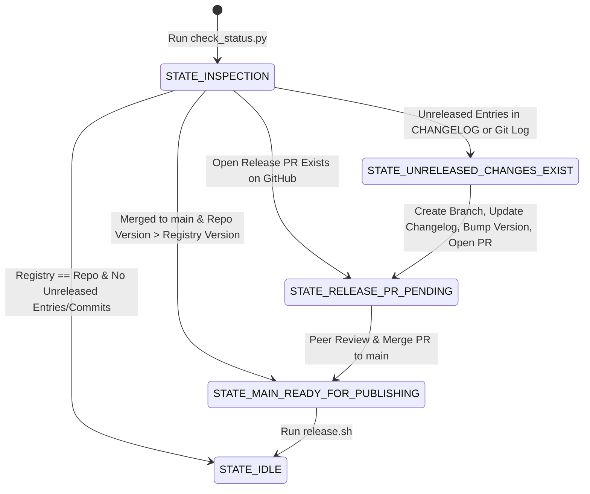

# A2UI Package Release Guide

This document is the authoritative, language-agnostic guide for releasing A2UI SDK and renderer packages. It applies to all maintained packages in this repository (Python, TypeScript/Web, and future language targets).

For codebase-specific technical guides:

- **Python SDKs**: [agent_sdks/python/docs/python_publishing.md](../../agent_sdks/python/docs/python_publishing.md)
- **TypeScript/Web Packages**: [renderers/docs/web_publishing.md](../../renderers/docs/web_publishing.md)
- **Agent Skill**: [.agents/skills/a2ui-release-sdks/SKILL.md](../../.agents/skills/a2ui-release-sdks/SKILL.md)

---

## 1. Core Release Philosophy & State Machine

Releases in A2UI follow a **two-stage state machine**. Each package's state is **tracked and processed independently by relative directory path**:



### Official Named States per Package:

1. **`STATE_IDLE`**: Package version equals published registry version and has no unreleased commits or changelog entries.
2. **`STATE_UNRELEASED_CHANGES_EXIST`**: Package has unreleased changes (in `CHANGELOG.md` or git log), but local version is not yet bumped and no release PR is open.
3. **`STATE_RELEASE_PR_PENDING`**: A release PR for this package is currently open on GitHub awaiting review/merge.
4. **`STATE_MAIN_READY_FOR_PUBLISHING`**: The release PR has merged into `main`. The version string in `main` is greater than the published registry version.

---

## 2. Status Inspection & Direct Release Tooling

Check the current release status across all packages using the automated checker:

```bash
./.agents/skills/a2ui-release-sdks/scripts/check_status.py
```

To execute a release for any package once merged to `main`, run the release script for the package directory:

- **TypeScript Packages**:
    ```bash
    ./renderers/release.sh renderers/web_core
    ./renderers/release.sh renderers/lit
    ./renderers/release.sh renderers/angular
    ./renderers/release.sh renderers/react
    ./renderers/release.sh renderers/markdown/markdown-it
    ```
- **Python Packages**:
    ```bash
    ./agent_sdks/python/release.sh agent_sdks/python/a2ui_core
    ./agent_sdks/python/release.sh agent_sdks/python/a2ui_agent
    ```

---

## 3. Prerequisites & Authentication

Before triggering a package release, ensure your local development environment has authentication configured:

### 1. Google Cloud Authentication

Googlers publishing artifacts to internal staging registries or Exit Gate buckets must authenticate via `gcloud`:

```bash
# General gcloud login
gcloud auth login

# Application Default Credentials (required for Python twine & upload scripts)
gcloud auth application-default login
```

### 2. GitHub Credentials

Ensure GitHub CLI (`gh`) is authenticated to interact with the repository:

```bash
gh auth login
```

---

## 4. Changelog & SemVer Rules

Every publishable package maintains a `CHANGELOG.md` file in its package root directory (e.g., `renderers/web_core/CHANGELOG.md`, `agent_sdks/python/a2ui_agent/CHANGELOG.md`).

### Structure & Conventions

```markdown
## Unreleased

- Add new feature X [#123]
- BREAKING CHANGE: Rename API parameter Y to Z [#124]

## 0.10.6

- Previous release notes...
```

### Protocol During Feature Development

When adding features or fixing bugs in feature PRs, developers append bullet points directly under `## Unreleased`.

### Breaking Change Convention

Any breaking change entry in `CHANGELOG.md` MUST start with `BREAKING CHANGE:` or `- BREAKING CHANGE: <description>`.

### Pre-Release Git Reconciliation Protocol

When preparing a package release, the agent/maintainer performs a reconciliation check between `git log` and `CHANGELOG.md`:

1. Inspect `git log` for the package directory since the previous release commit/tag.
2. Scan for significant PRs or commits (`feat:`, `fix:`, `refactor:`, `BREAKING CHANGE:`) that are NOT yet documented under `## Unreleased` in `CHANGELOG.md`.
3. Append any missing significant items to `CHANGELOG.md` to ensure complete release notes.
4. Inspect all entries under `## Unreleased` to verify if breaking changes exist and select the appropriate SemVer bump version.
5. If `CHANGELOG.md` has no `## Unreleased` items and no significant commits exist in `git log`, skip releasing that package (keep in `STATE_IDLE`).

### Version Bump Selection Rules (SemVer)

When choosing `<new_version>`:

- **Pre-1.0 (`0.x.y`)**:
    - **MINOR Bump** (`0.10.x` -> `0.11.0`): Mandatory when changes contain `BREAKING CHANGE:` entries or breaking API modifications.
    - **PATCH Bump** (`0.10.x` -> `0.10.y`): Backward-compatible features and bug fixes.
- **Post-1.0 (`X.y.z`)**:
    - **MAJOR Bump** (`1.x.y` -> `2.0.0`): Mandatory for breaking changes (`BREAKING CHANGE:`).
    - **MINOR Bump** (`1.x.y` -> `1.y+1.0`): New backward-compatible features.
    - **PATCH Bump** (`1.x.y` -> `1.x.y+1`): Backward-compatible bug fixes.
