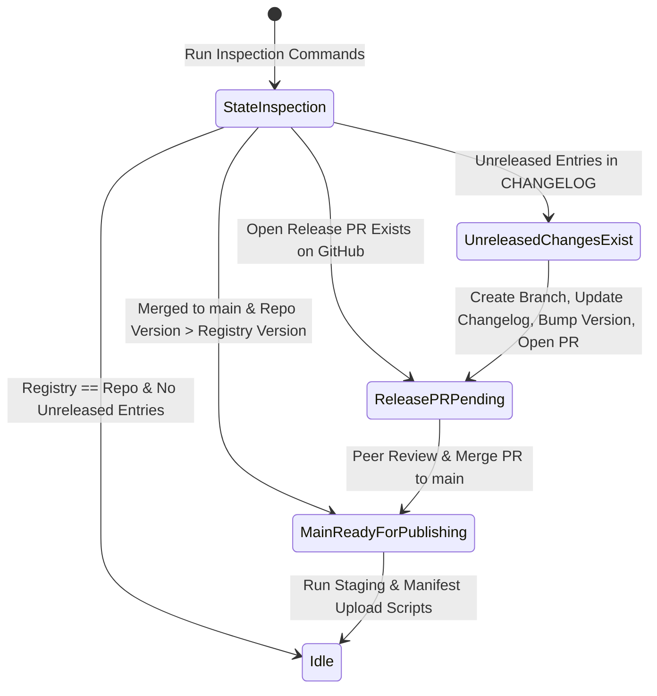

# A2UI Package Release Guide

This document is the authoritative, language-agnostic guide for releasing A2UI SDK and renderer packages. It applies to all maintained packages in this repository (Python, TypeScript/Web, and future language targets).

For codebase-specific technical guides:

- **Python SDKs**: [agent_sdks/python/docs/python_publishing.md](../../agent_sdks/python/docs/python_publishing.md)
- **TypeScript/Web Packages**: [renderers/docs/web_publishing.md](../../renderers/docs/web_publishing.md)
- **Agent Skill**: [.agents/skills/a2ui-release-sdks/SKILL.md](../../.agents/skills/a2ui-release-sdks/SKILL.md)

---

## 1. Core Release Philosophy & State Machine

Releases in A2UI follow a **two-stage state machine**:



1. **Stage 1: Version Bump & Release Notes (Pull Request)**:
    - Evaluates `CHANGELOG.md` unreleased items across packages.
    - Increments the version string in `package.json` / `version.py`.
    - Moves `CHANGELOG.md` `## Unreleased` entries to `## <new_version>`.
    - Runs pre-flight unit tests and opens a GitHub PR targeting `a2ui-project/a2ui`.
2. **Stage 2: Staging & Manifest Upload (Post-Merge)**:
    - Once the Version Bump PR is merged into `main`, release artifacts are published to staging/internal registries.
    - Release manifests are uploaded to trigger public distribution (via Exit Gate to PyPI / NPM).

---

## 2. Prerequisites & Authentication

Before triggering a package release, ensure your local development environment has authentication configured:

### 1. Google Cloud Authentication

Googlers publishing artifacts to internal staging registries or Exit Gate buckets must authenticate via `gcloud`:

```bash
# General gcloud login
gcloud auth login

# Application Default Credentials (required for Python twine & upload scripts)
gcloud auth application-default login
```

### 2. GitHub Credentials

Ensure GitHub CLI (`gh`) is authenticated to interact with the repository:

```bash
gh auth login
```

---

## 3. Changelog & SemVer Rules

Every publishable package maintains a `CHANGELOG.md` file in its package root directory (e.g., `renderers/web_core/CHANGELOG.md`, `agent_sdks/python/a2ui_agent/CHANGELOG.md`).

### Structure & Conventions

```markdown
## Unreleased

- Add new feature X [#123]
- Fix edge-case bug Y [#124]

## 0.10.6

- Previous release notes...
```

### Protocol During Feature Development

When adding features or fixing bugs in feature PRs, developers append bullet points directly under `## Unreleased`.

### Protocol During Package Release

When preparing a package version release:

1. Rename `## Unreleased` to `## <new_version>`.
2. Insert a fresh, empty `## Unreleased` header above `## <new_version>`.

### Empty Unreleased Policy

If a release is requested but `CHANGELOG.md` has no entries under `## Unreleased`:

- Check git history (`git log -n 20 <pkg_dir>`) to see if unreleased commits exist.
- If unreleased commits exist, document them under `## Unreleased`.
- If no unreleased commits exist, **skip releasing that package**.

### Version Bump Selection Rules (SemVer)

When choosing `<new_version>`:

- **Breaking Changes in Pre-1.0 (`0.x.y`)**: If `CHANGELOG.md` contains entries marked `BREAKING CHANGE` or breaking API modifications while pre-1.0 (`0.x.y`), bump the **MINOR** version (e.g., `0.10.2` -> `0.11.0`). If post-1.0 (`X.y.z`), bump the **MAJOR** version (`1.x.y` -> `2.0.0`).
- **Backward-Compatible Changes**: If changes contain only non-breaking features or bug fixes, bump the **PATCH** version (e.g., `0.10.6` -> `0.10.7`).
