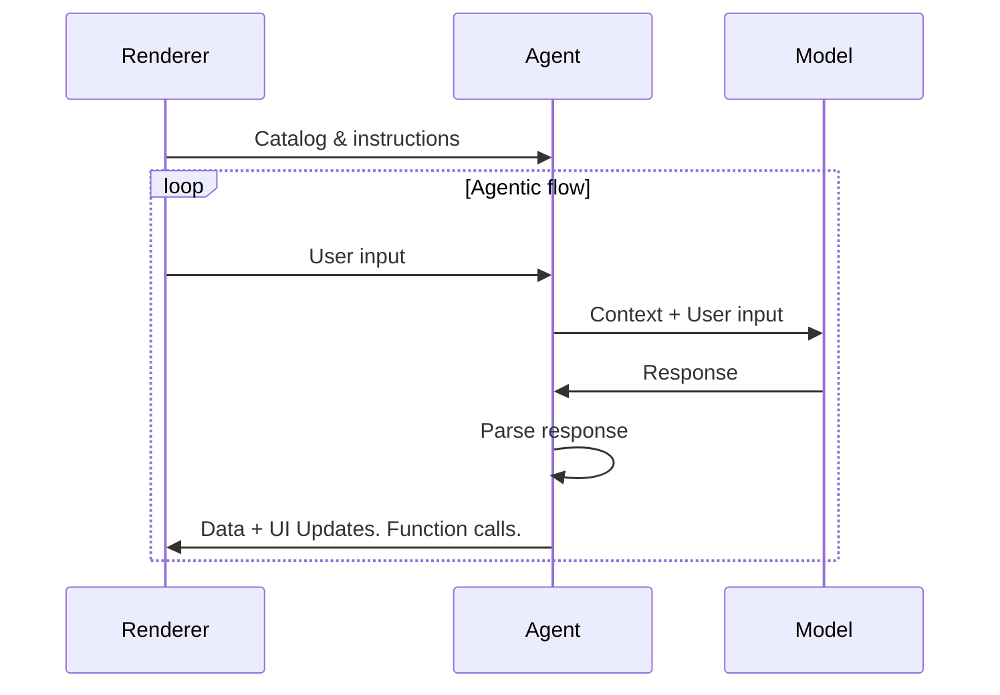
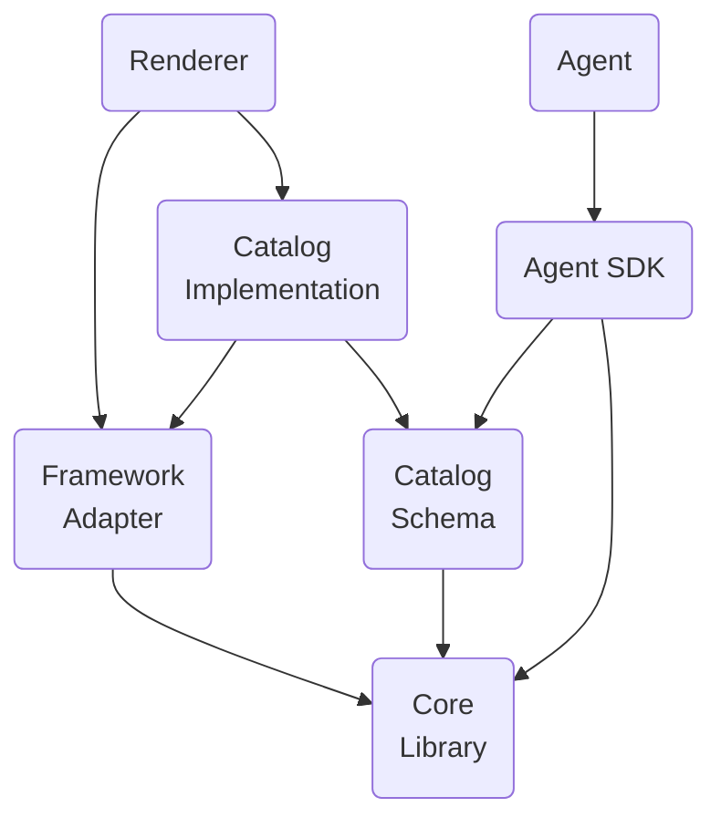

# Glossary

**A2UI protocol, between renderer and agent:**

The A2UI protocol defines a conversation between an **agent** and a **renderer**:

1. The **renderer** sends its **UI capabilities** as a set of A2UI catalogs, with **instructions** on how to use them.
2. The **agent** then repeats a loop:
    - Sends **UI** to render and **functions** to call, based on the catalog it received
    - Receives **user input** from the renderer
    - Updates the **data** shown in the UI

**Agent and model:**

To produce responses for the renderer, the agent sends requests to a model. The model can be:

- a remote or local LLM, in most cases
- another agent, in more complex orchestrations
- a deterministic engine, usually for testing

**Interaction overview:**

**A2UI SDKs:**

The A2UI team provides two SDKs for a number of languages and frameworks:

- **Agent SDK**: sets up the agent side of the interaction with the renderer and the model.
- **Framework adapter SDK (aka renderer SDK)**: sets up the renderer side of the interaction with the agent and handles incoming messages.

**Terms in this glossary:**

The terms below are grouped into three categories:

- **A2UI protocol terms**: interaction between the renderer and the agent.
- **A2UI agent terms**: agent architecture and the Agent SDK.
- **Generative UI terms**: general generative UI concepts.

## A2UI protocol terms

Terms required by the A2UI protocol.

### A2UI agent and A2UI renderer

The protocol is designed for **AI-powered agents**, but it works with deterministic agents as well. For example, an agent may return a pre-canned A2UI UI.

If the agent is stateless, or does not guarantee that it preserves the catalog, the renderer should send the catalog with every message.

Some agents use a predefined catalog, so renderers must either support that catalog or use an adapter.

### GenUI component

A UI component that the agent is allowed to use. Examples: date picker, carousel, button, hotel selector.

### Catalog

1. Itemized renderer capabilities:
    - List of components that the agent can use to generate UI
    - List of functions that can be invoked by renderer
    - Styles and themes
2. An explanation of how to use those capabilities.

Depending on the use case, catalog components can be more or less domain-specific:

- **Less specific**:

    Basic UI primitives like buttons, labels, rows, columns, option-selectors and so on.

- **More specific**:

    Components like HotelCheckout or FlightSelector.

### Basic catalog

A catalog maintained by the A2UI team for getting started with A2UI quickly.

See the [basic catalog](../../../specification/v0_9_1/catalogs/basic/catalog.json).

### Catalog transformer

A rule set that filters, adapts, or mutates a pristine **catalog** before system prompt instructions are generated or payload validation schemas are compiled.

#### Why catalog transformers are needed

A catalog specifies every component and function that a renderer supports, but agents often need to prune or restrict it:

- **Context window optimization**: A catalog can define dozens of components and functions. Injecting all of their JSON schemas into a model's system prompt costs context window tokens, adds prompt latency, and raises inference costs. A pruning transformer keeps only the components that the agent's task needs.
- **Capability guardrails**: Some workflows or security roles need interactive features restricted. For example, a guest mode may allow display cards and text, but no form inputs or administrative components.
- **Model signature reduction**: Pruning function rules and validation checks produces compact prompt instructions for small models.

#### Example catalog transformers

- `ComponentPruningTransformer`: a utility class that filters the catalog based on a list of allowed component names.

- `FunctionPruningTransformer`: a utility class that filters the catalog based on a list of allowed function names.

### Capabilities object

The set of catalogs that are available for use. An agent or a renderer advertises what it supports through this set, so the other side knows what it may send.

For example, if a renderer supports Basic, Hotels and Flights catalogs, it will advertise them in its capabilities object.

A capabilities object is exchanged through transport metadata or an initialization payload, not as an [A2UI message](#a2ui-message). The exact placement is transport-specific.

The objects are named differently in earlier versions of the protocol: v0.9 and v0.9.1 call them client and server capabilities, and v0.8 defines only a client-side schema.

### Surface

An area of UI, built by the A2UI agent and managed by the A2UI renderer, that consists of a number of components. Surfaces cannot nest.

### A2UI message

A message between the agent and the renderer.

Because the protocol supports streaming, a message can be finished (fully delivered) or unfinished (partially delivered). A finished message is either completed (delivered successfully) or interrupted (delivery stopped because of a technical problem).

See the [data flow guide](data-flow.md).

### Agent turn

The set of messages that the agent sends before it starts waiting for user input.

### Data model

An observable, hierarchical, JSON-like object, shared between the renderer and the agent and updatable by both. Each surface has its own data model.

Components can bind to nodes of the data model and update automatically when those values change.

The data model gives two-way synchronization: it captures user interactions into a state object that is sent to the agent, and it lets the agent push data updates back to the UI.

See the [data binding guide](data-binding.md).

### Data reference

In a component definition, a reference to a data element, resolved either by a path in the data model or by value.

See the [example in the basic catalog](../../../specification/v0_9/catalogs/basic/catalog.json#L23).

### Renderer function

A function that the renderer provides for the agent to invoke when needed.

A renderer function is not the same as an LLM tool:

| Feature      | Renderer function                                                  | LLM tool invocation                                                  |
| ------------ | ------------------------------------------------------------------ | -------------------------------------------------------------------- |
| Executor     | A2UI renderer                                                      | LLM requests the invocation without concern about execution details. |
| Timing       | After the agent to renderer message is sent.                       | Before the agent to renderer message is sent.                        |
| Purpose      | UI logic: validation, visibility toggles, formatting.              | Reasoning, data fetching, backend actions.                           |
| Definition   | Registered in renderer function registry and advertised in catalog | Defined in ToolDefinition, passed to the LLM.                        |
| State access | Access to DataContext and input values.                            | Access to external APIs, databases, and services, but not to the UI. |

See the [example in common types](../../../specification/v0_9_1/json/common_types.json#L200).

### Action

A container for an interaction triggered by the user in the UI. Actions come in two types:

- **Event**: Dispatched to the agent for processing (e.g., clicking "Submit").
- **Function**: Executed locally on the renderer (e.g., opening a URL).

See the [detailed guide on actions](actions.md).

## A2UI agent terms

Terms used to describe agent architecture and the Agent SDK.

### A2UI tag

In model-to-agent messages, a delimiter tag such as `<a2ui-json>` or `<a2ui>` that bounds an A2UI payload block inside the model's text output.

A single model turn can mix conversational text and structured UI blocks, so A2UI tags mark where each UI block starts and ends.

### Inference format

The format of the structured UI blocks in model-to-agent messages, for example JSON, [Express DSL syntax](https://github.com/a2ui-project/a2ui/tree/main/agent_sdks/python/a2ui_agent/src/a2ui/inference_formats/experimental/express), or Elemental HTML tags.

### Phases of parsing of model-to-agent responses

**Tag unwrapping:**

The first phase of response parsing (`unwrap`), where the parser scans the model response for opening and closing **A2UI tags**, and separates conversational text (e.g., _"Here is your summary:"_) from the enclosed raw UI blocks.

**Compilation:**

The second phase of response parsing (`compile`), where the raw UI blocks extracted during unwrapping (standard JSON, Express DSL syntax, or Elemental HTML tags) are parsed, decompiled, and transformed into standard A2UI protocol payloads such as `createSurface` and `updateDataModel`.

### Agent architecture

An A2UI agent can be built in several ways:

- **Same-process or server-side**:

    The agent and the renderer may live in one process of a client side application. Example: a desktop Flutter application.

    Or the renderer may live on the box that displays the UI, and the agent on another box (server).

- **Orchestrator agent**:

    A central orchestrator manages interactions between a user and several specialized sub-agents. The orchestrator can be in the same process or on the server.

- **Pulling / pushing**:

    An agent can wait for messages and requests from the renderer, or push them to it.

- **Stateful / stateless**:

    Agents can preserve state or be stateless.

- **Mixed with other protocols**:

    A2UI can be used in combination with other protocols. For example, an agent may be an MCP and/or A2A server.

- **Something else**:

    Custom variations of the options above are also possible.

### Recommended code organization

Agent and renderer functionality consists of layers that can be developed separately and reused:

- **Core library**:

    Set of primitives needed to describe a catalog and to interact with the agent.

    For example, see the [JavaScript web core library](../../../renderers/web_core/README.md).

- **Catalog schema**:

    Definition of a catalog in the form of JSON.

    For example, see the [basic catalog schema](../../../specification/v0_9_1/catalogs/basic/catalog.json).

- **Agent SDK**:

    Code that implements the agent's interaction with the model and the renderer.

- **Framework adapter (or renderer SDK)**:

    Code that runs the agent's instructions in a concrete framework. For example:
    - JavaScript core and catalogs may be adapted to Angular, Electron, React and Lit frameworks.
    - Dart core and catalogs may be adapted to Flutter and Jaspr frameworks.

    See the [Angular adapter](../../../renderers/angular/README.md).

- **Catalog implementation**:

    Implementation of the catalog schema for a framework.

    For example:
    - See the [Angular implementation of the basic catalog](../../../renderers/angular/src/v0_9/catalog/basic)

## Generative UI terms

Terms that the A2UI protocol does not require, but that are common in the context of generative UI.

### Known patterns of GenUI

- **Chat**:

    Pieces of generated UI appear one by one, sorted by time, in a vertically scrollable area, mixed with user input.

- **Canvas**:

    A space for collaboration with an agent.

- **Dashboard**:

    Pieces of generated UI are organized by meaning rather than by time, and stay pinned where the user expects to see them.

- **Wizard**:

    Pieces of generated UI are shown one by one, to collect the information needed for a certain task.

### NoAI information

Information categorized as **not accessible by AI**, for example credit card details.

Application owners decide which information is not accessible by AI, and the answer is **different in different contexts**. For example, in some products medical history should never go to the AI, while in others the AI relies on medical history to help with diagnostics.

The term matters in the GenUI context, because end users want to **clearly see** which of their input may go to the AI and which may not.
