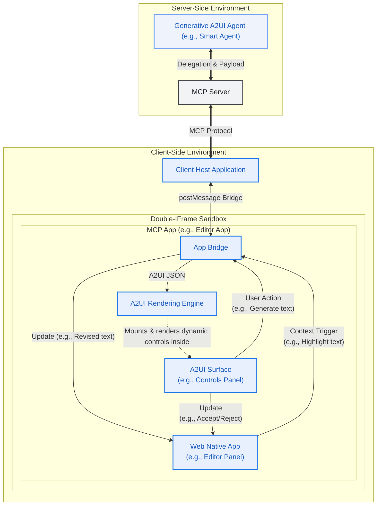
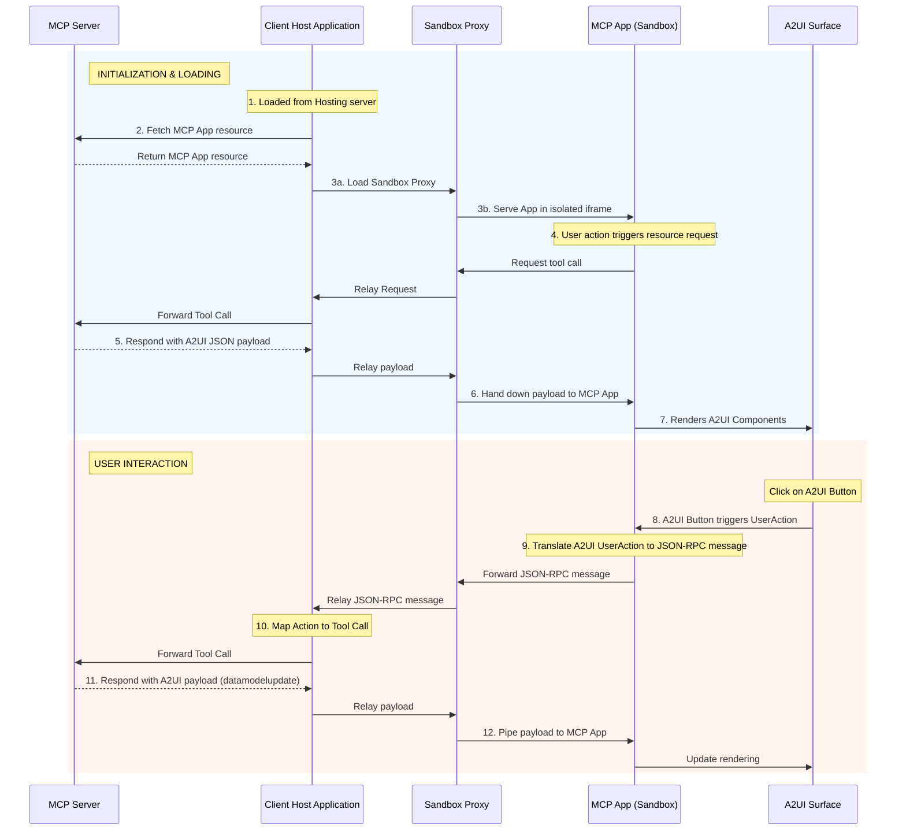

# A2UI Dynamic Rendering within MCP Applications

This guide shows you how to serve rich, interactive A2UI interfaces within [MCP Apps](https://modelcontextprotocol.io/extensions/apps/overview) using Tools and Embedded Resources. The architecture supports dynamic **Dual-Mode Capability Negotiation**:

1. **Native A2UI Mode (Preferred)**: Host clients advertising `application/a2ui+json` render `<a2ui-surface>` directly with zero iframe overhead, dispatching actions to MCP tools via the SDK Action Dispatcher.
2. **Iframe Sandboxed Mode (Fallback)**: Legacy hosts render through an isolated double-iframe sandbox managed by the SDK `McpSandboxHost`.

See the formal [A2UI over MCP Apps Protocol Specification (v1.0)](../../../specification/v1_0/extensions/mcp_apps/docs/a2ui_mcp_apps_specification.md) for full protocol details.


## Prerequisites

- **[Python 3.10+](https://www.python.org/)**
- **[uv](https://docs.astral.sh/uv/)** — fast Python package manager
- **[Node.js 18+](https://nodejs.org/)** (for the MCP Inspector)

## Quick Start: Run the Dual-Mode Sample

The repository includes a ready-to-run dual-mode sample demonstrating both Native A2UI and Iframe Sandboxed modes:

```bash
# 1. Start the Python MCP Server
cd samples/community/mcp/a2ui-mcpapps-extensions/server
uv run server.py --transport sse --port 8000

# 2. In another terminal, start the Client Web App
cd samples/community/mcp/a2ui-mcpapps-extensions/client
yarn install
yarn dev
```

For more details, see the [Dual-Mode Sample README](../../../samples/community/mcp/a2ui-mcpapps-extensions/README.md).

## Architecture Overview

The system consists of three main actors interacting through a chain of communication:

1.  **Client Host Application**: The outer container (e.g., an Angular app) that connects to the MCP Server and hosts the secure sandbox for the MCP App.
2.  **MCP Application (Sandboxed)**: The untrusted third-party web application (e.g., a Lit or Angular micro-app) running inside a double-iframe sandbox. This app contains the A2UI surface.
3.  **MCP Server**: The backend server providing the application resources and handling tool calls.



## Deep Dive: The Communication Flow

A key aspect of this pattern is that the **MCP App** renders the A2UI payloads directly, rather than relying on the Client Host Application to do so.

### Loading A2UI Components in MCP Apps

Here is the sequence of events for dynamically loading A2UI components into MCP Apps:

1.  **Trigger**: The MCP App decides it needs to fetch or update UI content (e.g., on initialization or via a user-initiated Action).
2.  **Request**: The MCP App sends a JSON-RPC request to the Host via `window.parent.postMessage`.
    - _Example Method_: `ui/fetch_counter_a2ui`
3.  **Relay**: The Sandbox Proxy relays this message to the Client Host.
4.  **MCP Call**: The Client Host translates this custom message into a standard MCP `tools/call` request to the MCP Server.
    - _Example Tool_: `fetch_counter_a2ui`
5.  **Response**: The MCP Server executes the tool and returns a result containing an `application/a2ui+json` resource.
6.  **Response forwarding**: The Host receives the tool result and forwards it back down through the Sandbox Proxy to the MCP App.
7.  **Rendering**: The MCP App extracts the A2UI JSON payload from the resource and feeds it into its local A2UI `MessageProcessor`, which updates the A2UI surface dynamically.

### Handling User Actions

Interactivity within the rendered A2UI surface is handled by reversing the flow:

1.  A user clicks a button within the A2UI surface inside the MCP App.
2.  The A2UI component triggers a `userAction`.
3.  The MCP App captures this event via the A2UI `MessageProcessor.events` subscription.
4.  The MCP App packages the action and sends it as a JSON-RPC message to the Host (e.g., `ui/increase_counter`).
5.  The Host calls the corresponding tool on the MCP Server.
6.  The Server returns a new A2UI payload (representing the updated state), which is piped back to the MCP App to update the rendering.

### Sequence Diagram



## How to Implement

To build your own MCP App with A2UI capabilities, follow these steps:

### Step 1: Inlining the Renderer

MCP Apps are typically delivered as a single HTML resource from the MCP Server. To achieve this with a modern framework like Angular or React:

1.  Build your application normally to produce static assets (`index.html`, `.js`, `.css`).
2.  Use a post-build script (like the [`inline.js`](../../../samples/community/mcp/a2ui-in-mcpapps/server/apps/src/inline.js) script in the sample) to read the `index.html` and replace external `<script src="...">` and `<link rel="stylesheet" href="...">` tags with inline `<script>` and `<style>` tags containing the actual file contents.
3.  This produces a self-contained HTML file that can be safely loaded via `srcdoc` in the restricted iframe.

> [!TIP]
> **Using Vite to inline**
>
> If your project uses Vite (common for React, Vue, or Lit), you can achieve the same single-file output automatically using plugins like `vite-plugin-singlefile`. This eliminates the need for a custom post-build script by handling the inlining during the build process itself.
>
> **How to use it:**
>
> 1. **Install the plugin**:
>     ```bash
>     npm install -D vite-plugin-singlefile
>     ```
> 2. **Configure Vite**: Add the plugin to your `vite.config.ts` (or `.js`):
>
>     ```typescript
>     import {defineConfig} from 'vite';
>     import {viteSingleFile} from 'vite-plugin-singlefile';
>
>     export default defineConfig({
>       plugins: [viteSingleFile()],
>     });
>     ```
>
>     This will ensure that all JS and CSS assets are inlined into the `index.html` file on build, making it ready to be served by your MCP server as a single resource.

### Step 2: Leveraging the Official A2UI MCP SDK

Both the server and client SDKs provide high-level helpers to streamline integration:

#### Python Server (`a2ui.mcp`)

```python
from mcp.server.mcpserver import MCPServer
from a2ui.mcp import (
    create_a2ui_tool_result,
    create_a2ui_resource_contents,
    supports_native_a2ui,
    A2UI_MIME_TYPE,
    MCP_APPS_MIME_TYPE,
)

app = MCPServer("my-a2ui-mcp-server")

@app.tool(name="get_interactive_ui")
def get_interactive_ui() -> types.CallToolResult:
    a2ui_payload = [{
        "version": "v1.0",
        "createSurface": {
            "surfaceId": "main-surface",
            "catalogId": "https://a2ui.org/specification/v1_0/catalogs/basic/catalog.json",
            "components": [
                {"id": "root", "component": "Column", "children": ["btn_action"]},
                {
                    "id": "btn_action",
                    "component": "Button",
                    "text": "Submit Action",
                    "action": {"event": {"name": "submit_data", "context": {"value": 42}}}
                }
            ]
        }
    }]
    return create_a2ui_tool_result(a2ui_payload, text_fallback="A2UI payload ready.")
```

#### TypeScript Client (`@a2ui/web_core/v1_0`)

```typescript
import {
  buildMcpUiClientCapabilities,
  createMcpActionDispatcher,
  extractA2uiFromToolResult,
  McpSandboxHost,
} from '@a2ui/web_core/v1_0';
import {MessageProcessor} from '@a2ui/web_core/v0_9';
import {basicCatalog} from '@a2ui/lit/v0_9';

// 1. Initialize MCP Client with A2UI capability negotiation
const clientCaps = buildMcpUiClientCapabilities({
  enableNativeA2ui: true,
  enableHtmlApp: true,
});

// 2. Set up processor and automatic action dispatcher
const processor = new MessageProcessor([basicCatalog]);
const dispatcher = createMcpActionDispatcher(processor.model, mcpClient, {
  messageProcessor: processor,
  onError: (err) => console.error('Tool execution error:', err),
});

// 3. Call tool and feed initial UI into processor
const result = await mcpClient.callTool({name: 'get_interactive_ui', arguments: {}});
const messages = extractA2uiFromToolResult(result);
if (messages) {
  await processor.processMessages(messages);
}
```

### Step 3: Managing Sandboxed Iframe Fallback (`McpSandboxHost`)

For legacy hosts or untrusted third-party apps requiring double-iframe sandboxes, use `McpSandboxHost`:

```typescript
const sandboxHost = new McpSandboxHost({
  mcpClient,
  allowedTools: ['submit_data', 'reset_data'],
  onStatusChange: (status) => console.log('Sandbox status:', status),
});

// Attach controller to the sandbox proxy iframe
sandboxHost.attach(iframeElement);

// Load HTML content into the sandbox
const resource = await mcpClient.readResource({uri: 'ui://my-app'});
sandboxHost.loadHtml(resource.contents[0].text);
```

This pattern enables the MCP App to serve as a dynamic interface for the MCP Server's A2UI capabilities while maintaining strict security isolation.

### Inlined MCP App HTML Pseudocode

To put this all together, here is an HTML mockup representing a compiled and inlined MCP Application. It defines the placeholder UI with a native `<a2ui-surface>` element, initializes the `AppBridge` to communicate with the outer host, fetches its dynamic A2UI layout on load, and processes events using the loaded A2UI SDK:

```html
<!DOCTYPE html>
<html lang="en">
  <head>
    <meta charset="UTF-8" />
    <title>Inlined MCP App Surface</title>
    <!-- Assumes the standard A2UI SDK script is bundled or loaded -->
  </head>
  <body>
    <div>
      <h3>MCP App (Editor Panel)</h3>
      <p>This text is native to the sandboxed third-party app.</p>

      <!-- A2UI Surface custom element provided by the A2UI SDK -->
      <a2ui-surface surfaceId="recipe-card"></a2ui-surface>
    </div>

    <script>
      // Note: The pseudocode below assumes AppBridge from @modelcontextprotocol/ext-apps
      // and a2uiProcessor from the A2UI SDK are preloaded or inlined.
      const bridge = new AppBridge({name: 'editor-panel', version: '1.0.0'});

      // Helper to extract and process dynamic A2UI responses from tool results
      function processA2UIResponse(result) {
        const a2uiResource = result?.content?.find(
          c => c.type === 'resource' && (c.resource?.mimeType === 'application/a2ui+json' || c.resource?.mimeType === 'application/json+a2ui'),
        );
        if (a2uiResource?.resource?.text) {
          const payload = JSON.parse(a2uiResource.resource.text);
          window.a2uiProcessor.processMessages(payload);
        }
      }

      // 1. Initialize AppBridge and fetch initial controls
      async function initApp() {
        await bridge.connect();

        // Call server tool to load initial layout controls
        const result = await bridge.callServerTool({name: 'fetch_controls', arguments: {}});
        processA2UIResponse(result);
      }

      // 2. Handle interactive User Actions routed by the A2UI SDK
      window.a2uiProcessor.events.subscribe(async event => {
        if (!event.message.userAction) return;
        const action = event.message.userAction;

        // Route the user action directly via the bridge to the MCP Server tool
        const result = await bridge.callServerTool({
          name: action.name,
          arguments: action.context,
        });

        // Feed any updated server UI states back to the A2UI processor
        processA2UIResponse(result);
      });

      // Initialize the app on startup
      initApp();
    </script>
  </body>
</html>
```

## Security Considerations

- **Explicit Target Origin**: Always use specific target origins (e.g., `'https://trusted-host.com'`) instead of `*` when calling `postMessage` if the host origin is known. This prevents malicious iframes from intercepting your RPC requests.
- **Null Origin Handling**: Remember that inside a strict sandbox (`sandbox="allow-scripts"` without `allow-same-origin`), `window.location.origin` will evaluate to `"null"`. You must validate incoming messages carefully by comparing `event.source` against the expected window object (e.g., `window.parent`).
