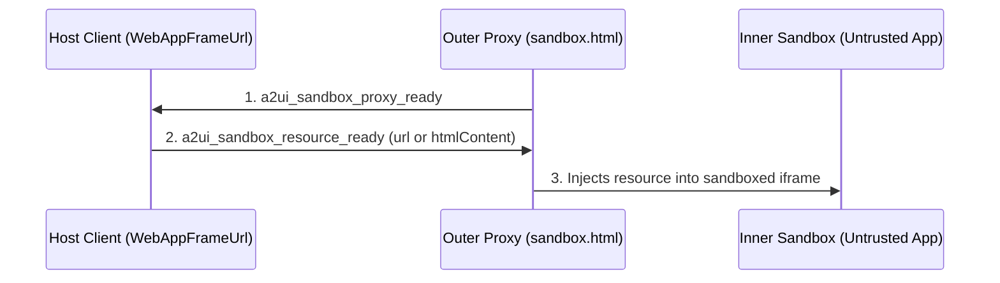
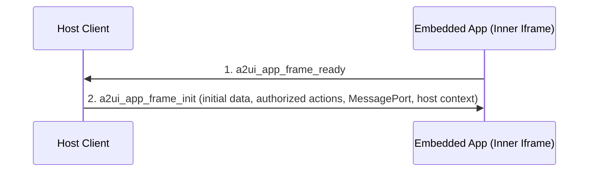

# A2UI WebApp Iframe Component Specification (v0.9)

## A Specification for Sandboxed, Rich Interactive Components in the Agent-to-UI Protocol

Jul 27, 2026  
Status: In progress

# Abstract

This specification document defines the A2UI Iframe Component (v0.9) for the secure, sandboxed rendering of rich interactive web applications and model-generated HTML content. This document serves two primary purposes:

1. **Platform Implementation Blueprint:** It provides client-side platform developers with a strict, standard set of instructions to implement compliant `WebAppFrameUrl` and `WebAppFrameSrcdoc` components in any native programming language (e.g., TypeScript/Web, Kotlin/Android, Swift/iOS, or Dart/Flutter) while maintaining identical security and sandboxing guarantees.
2. **Interoperable Application Standard:** It defines a secure, transport-agnostic runtime environment and messaging contract. Embedded web application developers can build highly portable, rich interactive tools that are guaranteed to run seamlessly, sync state, and invoke local functions inside "any" A2UI-compliant client wrapper.

# 1. Introduction and motivation

The A2UI protocol is designed to stream structured, type-safe JSON component trees to a client renderer. While A2UI provides standard primitive components (e.g., `Text`, `Row`, `Button`, `TextField`), complex enterprise use cases often require:

- **Deterministic rendering** of highly custom legacy dashboards, charts, and visualizations.
- **Interactive embeds** like maps, complex multi-step forms, and dynamic tools (e.g., rich text editors, calculators, interactive games) served directly by remote servers.
- **Strict isolation** of untrusted third-party applications to protect the host application's DOM, session cookies, and storage.

The **A2UI Iframe Component** bridges this gap. It defines a secure runtime environment inside a sandboxed proxy.

In **A2UI v0.9**, the following new A2UI features can significantly increase the Iframe component's utility:

- **Local Client-Side Function Calls:** Allowing isolated apps to trigger secure local custom functions (e.g., querying system hardware, opening URLs, local formatting).
- **Two-Way Local Data Binding:** Establishing a direct, reactive, network-free synchronization loop between the iframe's internal state and the parent A2UI local Data Model.

# 2. Architectural overview

In complex agentic workflows, rendering rich third-party widgets, charts, and legacy dashboards safely is critical. A2UI provides web-app embedding frames to run isolated code safely.

To meet both security and performance requirements, A2UI separates this specification into two layers:

1. **The WebAppFrame Runtime & Communication Contract:** A single, unified transport protocol that defines how _any_ application running inside an A2UI-based iframe communicates with the host. It covers JSON-RPC event messaging, local Two-Way Data Binding, and client-side function execution to support A2UI v0.9 features.
2. **Component Catalog Definitions & Rendering Setups:** Two separate frontend component definitions—**WebAppFrameUrl** and **WebAppFrameSrcdoc**—each with a tailored schema and unique sandbox/security configurations corresponding to their specific source type (external URL vs. raw inline HTML).

# 3. The WebAppFrame runtime and communication contract

While simple, LLM-generated applications can use raw, fire-and-forget `window.postMessage` events for zero-dependency execution, **human developers should use the official `@a2ui/web-bridge` SDK (coming soon)** (or equivalent).

The `@a2ui/web-bridge` SDK establishes a private `MessageChannel` between the host and the iframe and wraps the underlying protocol into a secure, type-safe, and Promise-based API. This hides the complexity of request correlation, deep-equality checks, and message origin validation.

However, at the wire level, all communications occur using custom top-level message string tags (`a2ui_*`) with flat keys. The protocol definitions below represent this underlying wire format.

## 3.1. Sandbox bootstrap lifecycle

Before the application-level handshake occurs, WebAppFrame components that rely on the **Double-Iframe Sandboxing** architecture (such as `WebAppFrameUrl` loading external 3P content) must complete an infrastructure-level bootstrap sequence.

This bootstrap ensures that the untrusted URL or HTML content is securely injected into a strict inner sandbox, rather than loading directly into the outer proxy frame.



1. **`a2ui_sandbox_proxy_ready` (Proxy -> Host):** The outer proxy iframe (e.g. `sandbox.html`) is loaded from a trusted origin. Once its script initializes, it sends this message to the Host to signal it is ready to receive untrusted content.
   ```json
   {
     "type": "a2ui_sandbox_proxy_ready"
   }
   ```
2. **`a2ui_sandbox_resource_ready` (Host -> Proxy):** The Host intercepts the proxy ready signal and replies with the untrusted URL (or raw HTML for Srcdoc).
   ```json
   {
     "type": "a2ui_sandbox_resource_ready",
     "url": "https://untrusted-3p-app.com/"
   }
   ```
3. **Inner Sandbox Creation:** The proxy frame dynamically creates an inner `<iframe sandbox="...">` element without `allow-same-origin`, assigns the untrusted resource to it, and sets up a secure message relay between the inner frame and the Host.

## 3.2. Application handshake lifecycle

To guarantee that state synchronization messages are never lost during initial frame loading, a formal bidirectional handshake should be strictly enforced:



1. **`a2ui_app_frame_ready` (Embedded App -> Host Client):** Once the embedded application is fully loaded and its `window.addEventListener('message', ...)` listener is registered, it must dispatch an `a2ui_app_frame_ready` message to notify the host.
   ```json
   {
     "type": "a2ui_app_frame_ready"
   }
   ```
2. **`a2ui_app_frame_init` (Host Client -> Embedded App):** Upon receiving the ready signal, the Host Client immediately replies with an `a2ui_app_frame_init` message containing the initial state of the bound data model and lists of authorized actions and client functions. **Host clients must also transfer a `MessagePort` (e.g., `event.ports[0]`)** with this message to establish the dedicated 1-to-1 communication bridge for the `@a2ui/web-bridge` SDK.
   ```json
   {
     "type": "a2ui_app_frame_init",
     "value": {
       "initialData": {
         "selectedModel": {"id": "model_s", "trim": "Plaid"},
         "carColor": "Pearl White"
       },
       "allowedEvents": ["onCheckoutSubmit"],
       "allowedFunctions": ["formatCurrency"],
       "hostContext": {
         "containerDimensions": {
           "width": 800,
           "height": 500
         }
       }
     }
   }
   ```

## 3.3. Outgoing messages (Embedded app to host)

### A. Event dispatch (`a2ui_action`)

Dispatched when the user interacts with the embedded application (e.g., clicking a button) and the app wants to trigger a server-side action.

**Message schema**

```json
{
  "type": "a2ui_action",
  "action": "string",
  "data": {
    "key": "any-primitive-or-nested-json"
  }
}
```

**Host action**  
The host checks if the dispatched `action` name is present in the component's `allowedEvents` array. If yes, it packages the action context and streams it to the A2UI server. If not, it silently drops it and prints a security warning in the developer console.

### B. Reactive state synchronization (`a2ui_data_model_change`)

Dispatched when the embedded application updates its internal state and wants to write it back to the parent A2UI Data Model.

**Message schema**

```json
{
  "type": "a2ui_data_model_change",
  "key": "string",
  "subpath": "string",
  "value": "any-primitive-or-json-object"
}
```

**Host action**  
The host instantly writes the `value` back to the Data Model. If `subpath` is provided, the host resolves it relative to the root bound data path (`dataPath + subpath`) and updates only that specific sub-field. If `subpath` is omitted, the host replaces the entire root value at `dataPath`. This triggers local reactivity, instantly updating any sibling components.

To avoid infinite update loops and redundant echoes, both sides should implement cycle prevention:

1. **Host-side Write Lock / Echo Suppression:** When the host processes an incoming `a2ui_data_model_change` message from the app, it should temporarily set a transaction flag (or write lock) during the write to its local store. The host's data subscription listener should check this flag and suppress sending a loopback `a2ui_data_model_update` notification to the app for the duration of that synchronous write stack.
2. **Deep-Equality Checking:** The host discards incoming `a2ui_data_model_change` messages if the value is structurally identical to the current state at the target path, and the embedded app does the same for incoming `a2ui_data_model_update` messages to prevent unnecessary redraw cycles.

> [!WARNING]
> Because state propagation is bi-directional over an asynchronous sandbox boundary, race conditions or state clobbering can occur if the host and the embedded app write to the same path concurrently.
> To prevent race conditions, the embedded application and the host SHOULD use targeted subpath updates (via the `subpath` parameter) rather than transmitting full object snapshots.

### C. Local client-side function execution (`a2ui_function_call`)

Dispatched when the embedded app wants to invoke a registered local v0.9 function.

**Message schema**

```json
{
  "type": "a2ui_function_call",
  "call": "string",
  "callId": "string",
  "args": {
    "argName": "any-value"
  }
}
```

**Host action**  
The host checks if the target function is listed in `allowedFunctions`. If verified, it evaluates the function using A2UI's client catalog engine and returns the result.

### D. Frame resize request (`a2ui_size_changed`)

Allows the embedded app to dynamically request height changes to prevent local scrollbars.

**Message schema**

```json
{
  "type": "a2ui_size_changed",
  "height": "number",
  "width": "number"
}
```

**Host action**  
The host dynamically updates the DOM height style of the wrapper container to the requested pixel value (typically utilizing animations or transitions).

## 3.4. Incoming messages (Host to embedded app)

### A. Reactive state update (`a2ui_data_model_update`)

Sent whenever the data bound to the `data.path` updates in the parent A2UI Data Model. The embedded app consumes this update and automatically synchronizes its local UI/state with the updated values. If `subpath` is provided, the app updates state at that specific subpath relative to its root data binding. If `subpath` is omitted, the app replaces its full root state.

**Message schema**

```json
{
  "type": "a2ui_data_model_update",
  "key": "string",
  "subpath": "string",
  "value": "any-primitive-or-json-object"
}
```

### B. Local function execution output

Sent as a response to an `a2ui_function_call` execution.

**Message schema (success or error)**

```json
{
  "type": "a2ui_function_result",
  "call": "string",
  "callId": "string",
  "status": "string",
  "result": "any-value-or-object",
  "error": {
    "code": "string",
    "message": "string"
  }
}
```

**Embedded app action**  
The embedded app consumes this result and processes it based on its own logic.

### C. Host context update (`a2ui_host_context_update`)

Sent whenever the host container's layout or context dynamically changes (e.g., window resized by the user). This allows the embedded app to responsively adapt its layout to match the newly allocated dimensions.

**Message schema**

```json
{
  "type": "a2ui_host_context_update",
  "value": {
    "containerDimensions": {
      "width": 900,
      "height": 600
    }
  }
}
```

**Embedded app action**  
The embedded app consumes this updated configuration and dynamically adjusts its internal rendering as needed.

## 3.5. WebAppFrame Protocol vs. MCP App Bridge Protocol Equivalence

The A2UI `WebAppFrame` contract and the MCP App Bridge (`@modelcontextprotocol/ext-apps/app-bridge`) share identical runtime capabilities and semantics, but differ in their underlying message envelope.

While WebAppFrame uses custom top-level message string tags (`a2ui_*`) with flat keys optimized for simple scripts, the standard MCP App Protocol uses standard JSON-RPC 2.0 framing (`jsonrpc: "2.0"`).

Because of this difference, if a developer wishes to use the formalized bridge approach for WebAppFrame, they should use the dedicated `@a2ui/web-bridge` SDK rather than the `@modelcontextprotocol/ext-apps/app-bridge` SDK, as the latter strictly enforces JSON-RPC 2.0 formatting.

# 4. Component catalog definition

The two web frame components, _WebAppFrameUrl_ and _WebAppFrameSrcdoc_, shall be registered as distinct options in the A2UI v0.9 Component Catalog.

## 4.1. WebAppFrameUrl schema definition

Used to load an external web application hosted on a remote domain.

```json
{
  "WebAppFrameUrl": {
    "type": "object",
    "description": "Renders a secure, allowlisted external web application URL in an iframe.",
    "properties": {
      "id": {
        "$ref": "common_types.json#/$defs/ComponentId"
      },
      "component": {
        "const": "WebAppFrameUrl"
      },
      "url": {
        "$ref": "common_types.json#/$defs/DynamicString",
        "description": "The external URL to load inside the iframe."
      },
      "data": {
        "type": "object",
        "properties": {
          "paths": {
            "type": "object",
            "description": "A dictionary mapping custom state keys to distinct JSON Pointer paths in the data model.",
            "additionalProperties": {
              "type": "string"
            }
          }
        },
        "required": ["paths"],
        "additionalProperties": false
      },
      "height": {
        "$ref": "common_types.json#/$defs/DynamicNumber"
      },
      "allowedEvents": {
        "type": "array",
        "items": {"type": "string"}
      },
      "allowedFunctions": {
        "type": "array",
        "items": {"type": "string"}
      }
    },
    "required": ["id", "component", "url"],
    "unevaluatedProperties": false
  }
}
```

## 4.2. WebAppFrameSrcdoc schema definition

Used to load standalone, sandboxed, model-generated HTML/JS layouts.

```json
{
  "WebAppFrameSrcdoc": {
    "type": "object",
    "description": "Renders rich, model-generated HTML/JS bundles securely in a sandboxed safe content frame.",
    "properties": {
      "id": {
        "$ref": "common_types.json#/$defs/ComponentId"
      },
      "component": {
        "const": "WebAppFrameSrcdoc"
      },
      "htmlContent": {
        "type": "string",
        "description": "The raw HTML string to render via srcdoc."
      },
      "data": {
        "type": "object",
        "properties": {
          "paths": {
            "type": "object",
            "description": "A dictionary mapping custom state keys to distinct JSON Pointer paths in the data model.",
            "additionalProperties": {
              "type": "string"
            }
          }
        },
        "required": ["paths"],
        "additionalProperties": false
      },
      "allowedEvents": {
        "type": "array",
        "items": {"type": "string"}
      },
      "allowedFunctions": {
        "type": "array",
        "items": {"type": "string"}
      }
    },
    "required": ["id", "component", "htmlContent"],
    "unevaluatedProperties": false
  }
}
```

# 5. Rendering setup and security controls

The separation of A2UI web frames into two components is fundamentally driven by their divergent threat models and sandbox requirements.

## 5.1. Overall security specifications

Beyond the specific network and rendering isolation strategies, both `WebAppFrameUrl` and `WebAppFrameSrcdoc` components enforce strict, capability-based security through the Principle of Least Privilege:

- **Explicit Action Allowlisting (`allowedEvents`):** The embedded application cannot trigger arbitrary host or server-side actions. The host client acts as a strict firewall for all `a2ui_action` payloads, silently dropping any action name not explicitly pre-approved in the component's `allowedEvents` schema configuration.
- **Restricted Client-Side Execution (`allowedFunctions`):** The embedded application is blocked from arbitrarily invoking local client-side APIs. Every `a2ui_function_call` request is intercepted and validated against the `allowedFunctions` array.
- **Targeted State Scoping (`paths`):** Through the explicit `paths` mapping, the sandbox is granted access to only the specific segments of the global A2UI Data Model it strictly requires.
- **Denial-of-Service (DoS) Prevention (Throttling & Equality Checks):** To prevent malicious applications from monopolizing the host's main thread or initiating infinite render loops, the protocol mandates deep-equality checks for state updates and strict throttling/clamping for dynamic resize requests.

> [!NOTE]
> **CSP Delivery Nuance:** There is a fundamental difference in how Content Security Policies (CSP) are enforced between the two component types. When fetching the application by URL (`WebAppFrameUrl`), the inner iframe loads an external resource via its `src` attribute; therefore, the sandbox proxy cannot inject a `<meta>` tag into the document's `<head>`. CSP must be delivered entirely via HTTP `Content-Security-Policy` headers from the remote server. Conversely, when receiving the application as `srcdoc` (`WebAppFrameSrcdoc`), the sandbox proxy holds the raw HTML string and must inject the CSP `<meta>` tag directly into the markup before rendering.

## 5.2. WebAppFrameUrl rendering & security specifications

Since `WebAppFrameUrl` loads content from remote servers, its threat model revolves around phishing and malicious tab-navigation.

**Required Hardening Controls:**

- **Strict Domain Allowlist:** The component must consume a DomainMatcher context (allowlistContext) and reject any URL whose hostname does not match allowlisted exact or wildcard rules (e.g., `*.trusteddomain.com`).
- **Server-Side CSP Enforcement:** Because the application is fetched by URL, the host cannot inject a CSP `<meta>` tag. The remote server is responsible for supplying appropriate HTTP `Content-Security-Policy` headers.
- **Origin Parameter Injection:** The host must append the parent window's origin query parameter (`?origin=<location_origin>`) to the URL before iframe load, safely declaring the host's identity to the loaded site.
- **Expected Origin Validation:** The host must store `expectedOrigin` during load. It must discard all postMessage payloads where `event.origin !== expectedOrigin` or `event.source !== directIframe.contentWindow`.
- **Double-Iframe Sandboxing (Web Platforms):** A single layer iframe does not offer good isolation. Web renderers must load the external URL via a nested proxy frame (e.g., A2UI Sandbox Proxy). The outer same-origin proxy coordinates message transfers, while the inner iframe is strictly sandboxed.

## 5.3. WebAppFrameSrcdoc rendering & security specifications

Since `WebAppFrameSrcdoc` renders raw, dynamic markup, it must be executed under a Network-Free Sandbox to prevent CSRF and exfiltration.

**Required Hardening Controls:**

- **Strict CSP Meta Tag Injection:** Unlike `WebAppFrameUrl`, the renderer receives the raw HTML string. It must parse the HTML, strip any author-supplied CSP meta tags, and inject a strict CSP meta tag as the first child of the head: `<meta http-equiv="Content-Security-Policy" content="default-src 'self' 'unsafe-inline' 'unsafe-eval' data:; connect-src 'none';">`.
- **Double-Iframe Sandboxing (Web Platforms):** A single layer iframe does not offer good isolation. Web renderers must load raw HTML via a nested proxy frame (e.g., A2UI Sandbox Proxy). The outer same-origin proxy coordinates message transfers, while the inner iframe is strictly sandboxed without allow-same-origin.
- **Source Verification:** The proxy must verify postMessage payloads exclusively via `event.source === inner.contentWindow` equality.

## 5.4. Security controls and operational guardrails

To prevent poorly written or malicious embedded applications from thrashing the layout or initiating infinite render loops, the Host Client must enforce the following runtime controls when processing `a2ui_size_changed` requests:

- **Clamping:** The host must clamp the requested dimensions using configuration rules (e.g., `minHeight: 100px`, `maxHeight: 2000px`, `minWidth: 200px`, `maxWidth: 3000px`).
- **Throttling:** Consecutive resize events from the same component ID must be queued or rate-limited to a maximum of one redraw execution per 100 milliseconds.
- **Threshold Gate:** Dynamic changes of less than 5 pixels in both height and width should be ignored to prevent subtle layout shaking.

# 6. Implementation guidelines

- **Developer SDK (`@a2ui/web-bridge` - Coming Soon):** While raw `postMessage` is specified for zero-dependency AI generation, human developers building `WebAppFrameUrl` targets should import the official `@a2ui/web-bridge` SDK (coming soon) to wrap the communication in a secure `MessageChannel` with Promise-based function invocations.
- **SafeContentFrame / Double-Iframe Sandboxing:** A single layer iframe does not offer good isolation. To ensure embedded apps are well isolated in a public setting, developers should leverage a secure double-iframe sandbox pattern. Instead of relying on a single iframe, developers can utilize the open-source **A2UI Sandbox Proxy** (e.g., the `sandbox.html` implementation provided in the A2UI repository) to embed applications for both `WebAppFrameSrcdoc` and `WebAppFrameUrl`. This proxy achieves the same strict isolation as enterprise technologies (like Google's SafeContentFrame) by using an outer same-origin frame that coordinates verified message transfers, and an inner frame that is strictly sandboxed without `allow-same-origin`. While this may incur additional latency, it significantly improves security for the host application, especially when the content is generated by an LLM-powered agent. This shifts the Firewall operation duty that the proxy-iframe took care of to the WebAppFrame component itself.

# References

- MCP Apps in A2UI (https://a2ui.org/guides/mcp-apps-in-a2ui/): The original A2UI iframe technical implementation in GitHub
- What's new in A2UI v0.9: https://a2ui.org/specification/v0.9-evolution-guide/
