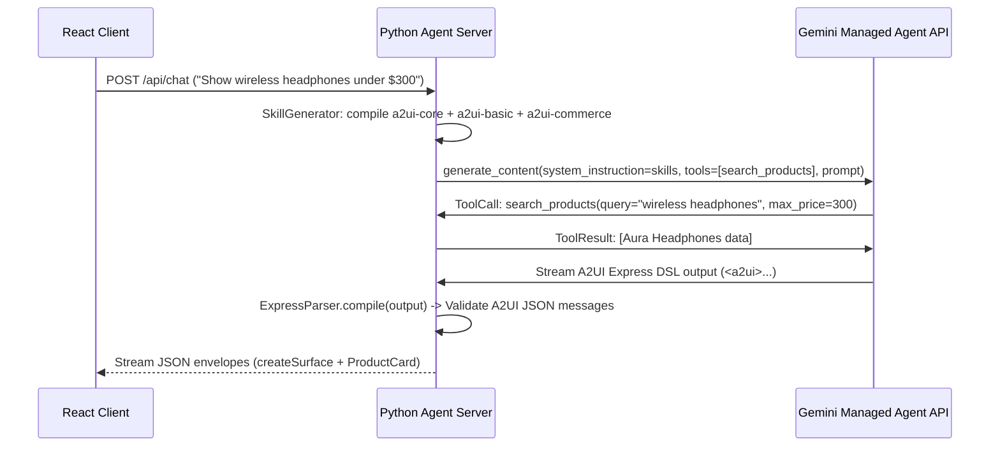

# E-Commerce Managed Agent Demo App System Design

## 1. Overview

This document specifies the design for a compelling, real-world E-Commerce Assistant application built with A2UI, Python Agent SDK, Google Gemini Managed Agent API, and a React + TypeScript client.

The application allows users to interact naturally with an AI commerce assistant to search products, check stock availability, inspect pricing, compare specifications, and build a shopping cart.

---

## 2. Modular Skills Architecture

The Python agent backend programmatically generates three modular skills using `SkillGenerator(modular=True)`:

```
skills/
├── a2ui-core/
│   └── SKILL.md            # Protocol sentinel tags (<a2ui>), syntax rules, data model bindings ($/path)
├── a2ui-basic/
│   └── SKILL.md            # Standard layout controls: Card, Column, Row, Text, Button, TextField
└── a2ui-commerce/
    └── SKILL.md            # Commerce-specific signatures: ProductCard, ProductGrid, InventoryBadge, PriceTag, CartSummary
```

---

## 3. Domain-Specific Component Catalog (`commerce_catalog.json`)

Catalog ID: `https://a2ui.org/catalogs/commerce/v1.0/catalog.json`

### Components:

1. `ProductCard(title, price, image, inStock, rating, action)`
   - Renders product image, title, formatted price, star rating, stock badge, and action button.
2. `ProductGrid(children, columns?)`
   - Responsive multi-column layout container for product lists.
3. `InventoryBadge(quantity, status)`
   - Visual status indicator (`in_stock`, `low_stock`, `out_of_stock`).
4. `PriceTag(amount, currency, discountPercent?)`
   - Currency-formatted price tag with optional list price and savings badge.
5. `CartSummary(items, subtotal, tax, shipping, total, checkoutAction)`
   - Cart breakdown panel with dynamic line items and checkout trigger.

---

## 4. Backend Python Server Architecture (`server.py`)

### Hardcoded Product Database

```python
PRODUCTS = [
    {
        "id": "prod_1",
        "name": "Aura Noise-Canceling Headphones",
        "category": "audio",
        "price": 299.99,
        "stock": 14,
        "rating": 4.8,
        "image": "https://images.unsplash.com/photo-1505740420928-5e560c06d30e",
        "description": "Premium wireless headphones with active noise cancellation and 30-hour battery life."
    },
    {
        "id": "prod_2",
        "name": "ErgoPro Mechanical Keyboard",
        "category": "peripherals",
        "price": 149.50,
        "stock": 3,
        "rating": 4.6,
        "image": "https://images.unsplash.com/photo-1587829741301-dc798b83add3",
        "description": "Ergonomic split mechanical keyboard with customizable RGB switches."
    },
    # Additional electronics, peripherals, and smart home items
]
```

### Agent Toolsets

- `search_products(query: str, category: Optional[str], max_price: Optional[float]) -> list[dict]`
- `get_product_details(product_id: str) -> dict`
- `check_inventory(product_id: str) -> dict`

### Server Execution Flow



---

## 5. React + TypeScript Client (`client/`)

- Tech stack: React 18, TypeScript, Vite, TailwindCSS / UI components.
- A2UI Renderer: Registers custom component handlers for `ProductCard`, `ProductGrid`, `InventoryBadge`, `PriceTag`, and `CartSummary`.
- Split layout view: Left sidebar for assistant chat conversation, Right pane for dynamic live A2UI canvas rendering.
