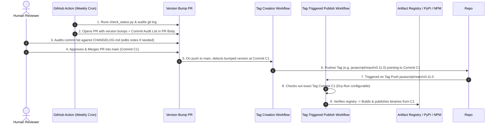

# Proposal: Automated Multi-Language Tag-Based Release System

| Metadata         | Details                                                                            |
| :--------------- | :--------------------------------------------------------------------------------- |
| **Status**       | Proposed                                                                           |
| **Author**       | A2UI Core Architecture Team                                                        |
| **Created**      | 2026-09-01                                                                         |
| **Target Scope** | Python (`a2ui-core`, `a2ui-agent-sdk`), TypeScript (`@a2ui/*`), future SDK targets |

---

## 1. Overview & Objectives

This proposal specifies the design and implementation plan for the **A2UI Multi-Language Tag-Based Automated Release System**. It establishes a continuous, deterministic pipeline for releasing A2UI SDK and renderer packages across programming languages.

### Key Objectives

1. **Human-Centric Changelogs**: `CHANGELOG.md` files remain **100% human-maintained**. High-level release notes are written by developers under `## Unreleased`. Raw git commit logs are never injected into `CHANGELOG.md`.
2. **Automated PR Commit Auditing**: Automated release PRs generate a **Commit Audit Table** in the **GitHub PR Description** listing all commits since the previous release. Human reviewers cross-reference this audit list against `CHANGELOG.md` to ensure no significant changes are omitted.
3. **Namespaced Tagging Scheme (`javascript/`, `python/`)**: Every release generates an immutable Git tag using ecosystem prefixes (`javascript/<pkg>/v<version>`, `python/<pkg>/v<version>`) to prevent tag collisions in multi-language monorepos.
4. **Atomic & Idempotent Releases**: Publishing workflows trigger strictly on Git tag creation, checking out the **exact tag commit** (`C1`). Artifact Registry / PyPI existence checks ensure publishing occurs **exactly once** per version.
5. **Dry-Run & Bootstrapping Safety**: Provides configurable `dry_run` modes and tag bootstrapping scripts to initialize baselines without risk.

---

## 2. Tag Naming Scheme

To prevent Git tag collisions as packages in additional languages (TypeScript/JS, Python, Dart/Flutter, Swift, Kotlin, Go) are added to the repository, all tags follow the **Ecosystem & Path Namespace Scheme**:

$$\text{Format: } \langle\text{ecosystem}\rangle/\langle\text{package\_name}\rangle/\text{v}\langle\text{version}\rangle$$

### Official Tag Mapping Table

| Ecosystem        | Package Name  | Monorepo Relative Path           | Git Release Tag Format          |
| :--------------- | :------------ | :------------------------------- | :------------------------------ |
| **`javascript`** | `web_core`    | `renderers/web_core`             | `javascript/web_core/v0.10.7`   |
| **`javascript`** | `lit`         | `renderers/lit`                  | `javascript/lit/v0.10.4`        |
| **`javascript`** | `angular`     | `renderers/angular`              | `javascript/angular/v0.10.6`    |
| **`javascript`** | `react`       | `renderers/react`                | `javascript/react/v0.11.0`      |
| **`javascript`** | `markdown-it` | `renderers/markdown/markdown-it` | `javascript/markdown-it/v0.1.1` |
| **`python`**     | `a2ui_core`   | `agent_sdks/python/a2ui_core`    | `python/a2ui_core/v0.1.1`       |
| **`python`**     | `a2ui_agent`  | `agent_sdks/python/a2ui_agent`   | `python/a2ui_agent/v0.5.0`      |

---

## 3. End-to-End Release Pipeline Architecture

The release process decouples **Version Bumping & Note Verification (Pull Request)** from **Binary Artifact Publishing (Git Tag)**:



---

## 4. Detailed 4-Step Release Lifecycle

### Step 1: Automated Release PR Generation (`create_release_pr.py`)

> **Deterministic Script Mechanism**: Automated Release PR generation is performed by a **pure Python script (`.agents/skills/a2ui-release-sdks/scripts/create_release_pr.py`)**. No LLM or AI agent runtime is required for scheduled cron execution. An AI agent can optionally invoke this same script when asked by a maintainer to prepare a release.

- **Trigger**: Weekly schedule (`0 9 * * 1` Mondays at 09:00 UTC) or manual `workflow_dispatch`.
- **Script Algorithm (`create_release_pr.py`)**:
  1. **Status Inspection**: Executes `check_status.py` logic to inspect all package `CHANGELOG.md` files. If zero packages have unreleased changes, exits quietly (no PR opened).
  2. **Git Commit History Audit**: For each package with unreleased changes (`STATE_UNRELEASED_CHANGES_EXIST`), fetches commits since the previous tag (`git log <last_tag>..HEAD -- <pkg_dir>`).
  3. **SemVer Calculation**: Scans `## Unreleased` entries. If `BREAKING CHANGE:` exists, selects **MINOR** (pre-1.0) or **MAJOR** (post-1.0). Otherwise, selects **PATCH**.
  4. **File Mutation**:
     - Bumps `"version"` in package `package.json` / `version.py`.
     - Renames `## Unreleased` to `## <new_version>` and inserts fresh `## Unreleased` header above in `CHANGELOG.md`.
     - Runs `yarn install` at monorepo root to update lockfiles cleanly.
  5. **Branch & PR Creation via GitHub CLI (`gh`)**:
     - Formats a **GitHub PR Description** with a **Commit Audit Table**:

     ```markdown
     ### 📦 Release PR: Prepare Package Version Bumps

     Please cross-reference the **Commits Since Last Release** below against the human-authored notes in each package's `CHANGELOG.md`.

     ---

     #### 1. `@a2ui/react` (`renderers/react`)

     - **Proposed Version**: `0.10.2` -> `0.11.0` (MINOR bump due to `BREAKING CHANGE:`)
     - **Human Release Notes in `CHANGELOG.md`**:
       - (v0_9) Component implementations may supply a `view`...
       - **BREAKING CHANGE**: (v0_9) On schema-marked references...
     - **Commits Since Last Release (`javascript/react/v0.10.2`..HEAD)**:
       - `a1b2c3d` refactor(react): migrate surface rendering to node layer ([#2393])
       - `e4f5g6h` fix(react): update child reference schema handling ([#2359])
     ```

  6. Bumps version identifiers (`package.json` / `version.py`), renames `## Unreleased` to `## <new_version>`, and opens branch `release/sdks-weekly`.

---

### Strict Formal Changelog Conventions (Zero Fuzzy Matching)

To ensure 100% deterministic version bump calculations without fuzzy string matching, developers MUST format items under `## Unreleased` using **EXACTLY ONE** of the two canonical syntaxes below:

#### Canonical Syntax Option 1: Subheading Section Format (Recommended)

```markdown
## Unreleased

### Breaking Changes

- Rename API parameter Y to Z [#124]

### Features

- Add support for custom layout binders [#130]

### Bug Fixes

- Resolve DateTimeInput styling on WebKit [#2200]
```

#### Canonical Syntax Option 2: Strict Line Prefix Format

```markdown
## Unreleased

- BREAKING CHANGE: Rename API parameter Y to Z [#124]
- FEAT: Add support for custom layout binders [#130]
- FIX: Resolve DateTimeInput styling on WebKit [#2200]
```

#### Strict Parsing & SemVer Calculation Matrix

The parser (`create_release_pr.py`) evaluates entries against strict exact token matches (`### Breaking Changes`, `### Features`, `### Bug Fixes`, `BREAKING CHANGE:`, `FEAT:`, `FIX:`):

| Strict Token Matched                                                   | Pre-1.0 Version Bump (`0.x.y`)   | Post-1.0 Version Bump (`X.y.z`) |
| :--------------------------------------------------------------------- | :------------------------------- | :------------------------------ |
| `### Breaking Changes` OR `BREAKING CHANGE:`                           | **MINOR** (`0.10.2` -> `0.11.0`) | **MAJOR** (`1.2.3` -> `2.0.0`)  |
| `### Features` OR `FEAT:`                                              | **MINOR** (`0.10.2` -> `0.11.0`) | **MINOR** (`1.2.3` -> `1.3.0`)  |
| `### Bug Fixes` OR `FIX:` (or un-prefixed lines under `## Unreleased`) | **PATCH** (`0.10.2` -> `0.10.3`) | **PATCH** (`1.2.3` -> `1.2.4`)  |

#### Human SemVer Override Mechanism

If the script calculates a `PATCH` bump (e.g. `0.10.3`) but maintainers decide the release warrants a `MINOR` bump (`0.11.0`):

- Maintainers simply edit `"version"` in `package.json` / `version.py` directly on the open Release PR before merging.
- The downstream tag creation and publishing workflows automatically respect whatever version number is merged into `main`.

---

### Step 2: Human Review & Edit Options

Maintainers review the generated release PR and can modify notes or version bump types via 3 mechanisms:

1. **GitHub Web UI**: Go to **Files changed** -> **Edit file** on `CHANGELOG.md` or `package.json` and commit directly to the PR branch.
2. **Local Checkout**:
   ```bash
   gh pr checkout <pr_number>
   # Edit files, commit, and push
   git commit -am "docs(release): update release notes"
   git push
   ```
3. **AI Agent Instruction**: Prompt an AI agent (_"Update renderers/react/CHANGELOG.md on the open release PR branch to add note X"_).

Maintainers click **Squash & Merge** into `main`, producing Git commit **`C1`**.

---

### Step 3: Automated Tag Creation Workflow (`tag-on-merge.yml`)

- **Trigger**: Runs on `push` to `main` when version files (`package.json`, `version.py`) are modified.
- **Action**:
  1. Inspects commit `C1` to identify modified package version files.
  2. Creates Git tags matching the ecosystem convention (`javascript/react/v0.11.0`, `python/a2ui_core/v0.1.1`) pointing strictly to commit `C1`.
  3. Pushes tags to upstream repository.

---

### Step 4: Tag-Triggered Publishing Workflow (`publish-tag.yml`)

- **Trigger**: Runs on `push` of tags (`javascript/**`, `python/**`).
- **Action**:
  1. `actions/checkout` checks out `refs/tags/<tag_name>` (commit `C1`).
  2. Runs `./renderers/release.sh <pkg_path>` or `./agent_sdks/python/release.sh <pkg_path>`.
  3. Checks Artifact Registry / PyPI version existence. If version already exists, skips upload safely.
  4. Builds production binaries (without running unit tests, as CI verified them prior to PR merge) and uploads to Artifact Registry staging.
  5. Uploads Exit Gate manifest to GCS bucket.
  6. Creates GitHub Release for the tag.

---

## 5. Skills & Tooling Integration

### 1. `a2ui-release-sdks` Skill Specification

The agent skill file [SKILL.md](../../.agents/skills/a2ui-release-sdks/SKILL.md) provides AI agents with recipes for managing release notes, running status checks, and preparing release PRs:

- **Status Discovery Recipe**: Run `./scripts/release/create_release.py`.
- **Changelog Management Recipe**: Inspect `CHANGELOG.md` under `## Unreleased`. Never auto-dump commit logs into `CHANGELOG.md`. Format human entries cleanly.
- **Commit Audit Recipe**: Run `git log <last_tag>..HEAD -- <pkg_dir>` to assemble the commit audit table for PR descriptions.
- **Version Selection Recipe**: Pre-1.0 (`0.x.y`): `BREAKING CHANGE:` -> MINOR, else PATCH. Post-1.0 (`X.y.z`): `BREAKING CHANGE:` -> MAJOR, `feat:` -> MINOR, `fix:` -> PATCH.

### 2. Centralized Release Manager Script (`create_release.py`) Updates

Update `create_release.py` to:

- Resolve baseline tags using `javascript/<pkg>/v<version>` and `python/<pkg>/v<version>`.
- Query `https://registry.npmjs.org/<pkg>/latest` and PyPI JSON APIs for registry versions.
- Output unreleased changelog items and branch synchronization status against `upstream/main`.

### 3. Release Scripts (`renderers/release.sh` & `agent_sdks/python/release.sh`) Updates

- Support path-based arguments (`renderers/web_core`, `agent_sdks/python/a2ui_core`).
- Support tag-based input parsing (`javascript/web_core/v0.10.7` -> `renderers/web_core`).
- Maintain Artifact Registry & PyPI pre-upload version existence checks for idempotency.

---

## 6. Testing, Verification & Bootstrapping Plan

### 1. Tag Bootstrapping Strategy

To establish initial Git tag baselines for current package versions, execute an initial tag bootstrapping script:

```bash
# JavaScript baseline tags
git tag javascript/web_core/v0.10.7 HEAD
git tag javascript/lit/v0.10.4 HEAD
git tag javascript/angular/v0.10.6 HEAD
git tag javascript/react/v0.11.0 HEAD
git tag javascript/markdown-it/v0.1.1 HEAD

# Python baseline tags
git tag python/a2ui_core/v0.1.1 HEAD
git tag python/a2ui_agent/v0.5.0 HEAD

git push upstream --tags
```

### 2. Dry-Run Verification

All GitHub Action workflows support a `dry_run` input (`default: true` during rollout):

```yaml
on:
  workflow_dispatch:
    inputs:
      dry_run:
        description: 'Perform dry run without uploading artifacts'
        type: boolean
        default: true
```

---

## 7. Implementation Task & File Index

| Target File                                                 | Status          | Description & Implementation Details                                                                                                                                                                                                                                                                       |
| :---------------------------------------------------------- | :-------------- | :--------------------------------------------------------------------------------------------------------------------------------------------------------------------------------------------------------------------------------------------------------------------------------------------------------- |
| **`specification/proposals/automated_release_pipeline.md`** | **Implemented** | Authoritative proposal specification document detailing the tag-based release pipeline.                                                                                                                                                                                                                    |
| **`scripts/release/create_release.py`**                     | **Implemented** | Centralized release status & PR creator script. Supports status inspection, git commit audit since last baseline tag, strict SemVer calculation, version string / changelog header mutations, lockfile sync, HTTP 404 registry handling, and PR creation via `gh`. Supports `--create-pr` and `--dry-run`. |
| **`scripts/release/bootstrap_tags.py`**                     | **Implemented** | Created tag bootstrapper script to initialize `javascript/<pkg>/v<ver>` and `python/<pkg>/v<ver>` baseline Git tags. Supports `--push` and `--force`.                                                                                                                                                      |
| **`renderers/release.sh`**                                  | **Implemented** | Updated to support `javascript/<pkg>/v<version>` tag input parsing and `--dry-run` flag.                                                                                                                                                                                                                   |
| **`agent_sdks/python/release.sh`**                          | **Implemented** | Updated to support `python/<pkg>/v<version>` tag input parsing and `--dry-run` flag.                                                                                                                                                                                                                       |
| **`.agents/skills/a2ui-release-sdks/SKILL.md`**             | **Implemented** | Updated skill instructions with `javascript/` and `python/` tagging schemes, strict canonical changelog syntaxes, and commit audit recipes.                                                                                                                                                                |
| **`docs/contributing/release.md`**                          | **Implemented** | Updated master contributor release guide with tag naming conventions, strict syntaxes, and 4-step workflow architecture.                                                                                                                                                                                   |
| **`.github/workflows/release-pr.yml`**                      | **Implemented** | Created GitHub Action workflow for weekly scheduled cron (`0 9 * * 1`) and `workflow_dispatch` running `create_release.py --create-pr`.                                                                                                                                                                    |
| **`.github/workflows/tag-on-merge.yml`**                    | **Implemented** | Created GitHub Action workflow to auto-create and push `javascript/` and `python/` Git tags when version PR merges to `main`.                                                                                                                                                                              |
| **`.github/workflows/publish-tag.yml`**                     | **Implemented** | Created GitHub Action workflow to build and publish tagged packages on tag push (`javascript/**`, `python/**`). Supports `dry_run` input.                                                                                                                                                                  |
| **`scripts/release/tests/test_create_release.py`**          | **Implemented** | Created automated unit test suite covering SemVer calculation, HTTP 404 registry handling, tag formatting, and version file mutations (11/11 passing).                                                                                                                                                     |

---

## 8. Authentication Security, Permissions & Error Recovery

To guarantee reliable execution across developer workstations and automated CI/CD runners, the pipeline establishes explicit credential verification and diagnostic recovery paths:

### 1. Google Cloud CLI & Application Default Credentials (ADC)

- **Local Developer Pre-Flight Verification**: Publishing scripts (`./renderers/release.sh` and `./agent_sdks/python/release.sh`) execute `gcloud auth print-access-token > /dev/null 2>&1` before invoking build or upload tools.
- **Diagnostic Error Handling**: If authentication token is missing or expired, scripts exit immediately with code 1 and output step-by-step resolution instructions:
  ```text
  ❌ ERROR: Google Cloud CLI authentication token is missing or expired.
     To fix, run: gcloud auth login --update-adc
  ```
- **Required GCP IAM Roles**:
  - `roles/artifactregistry.writer` (for pushing Python wheels to `us-python.pkg.dev` and npm packages to `us-npm.pkg.dev`)
  - `roles/storage.objectAdmin` (for uploading Exit Gate release manifests to `gs://oss-exit-gate-prod-projects-bucket/...`)

### 2. Bot Identity Architecture (`github-actions[bot]` & GitHub Apps)

- **Zero Personal Tokens Policy**: To prevent dependency on individual developer credentials, all automated commits, branch creations, Git tags, and Release PRs run under an official bot identity.
- **Native `secrets.GITHUB_TOKEN`**: The workflow uses GitHub's built-in `GITHUB_TOKEN` (`permissions: contents: write, pull-requests: write`). Pull Requests opened by the workflow are authored by `github-actions[bot]` (`41898282+github-actions[bot]@users.noreply.github.com`).
- **Optional Dedicated GitHub App**: Repositories seeking custom bot names (e.g. `a2ui-release-bot[bot]`) can configure a dedicated GitHub App using `actions/create-github-app-token` with repository secrets `RELEASE_BOT_APP_ID` and `RELEASE_BOT_PRIVATE_KEY`.

### 3. OSS Exit Gate v1.5.0 Keyless WIF Integration

The publishing workflow (`.github/workflows/publish-tag.yml`) integrates directly with Google's **OSS Exit Gate v1.5.0**:

1. **Builder Registration**:
   The workflow is registered as an authorized builder in the Exit Gate project configuration (`project.txtpb`):
   ```textproto
   builders: "github_workflow:a2ui-project/a2ui/.github/workflows/publish-tag.yml@refs/heads/main"
   ```
2. **Keyless OIDC Workload Identity Federation (WIF)**:
   The workflow authenticates using `google-github-actions/auth@v2` (`id-token: write`):
   ```yaml
   - name: Authenticate with OSS Exit Gate
     uses: 'google-github-actions/auth@v2'
     with:
       workload_identity_provider: 'projects/305452601764/locations/global/workloadIdentityPools/builders/providers/github'
   ```
3. **Artifact Registry Staging & Manifest Triggering**:
   - Builds production wheels and npm packages.
   - Uploads artifacts to internal Artifact Registry repositories (`https://us-python.pkg.dev/oss-exit-gate-prod/a2ui--pypi`, `https://us-npm.pkg.dev/oss-exit-gate-prod/a2ui--npm`).
   - Generates `manifest.json` (`{ "publish_all": true }`) and uploads it to GCS (`gs://oss-exit-gate-prod-projects-bucket/a2ui/<registry>/manifests/manifest-${VERSION}.json`).
4. **Automated Verification & External Publication**:
   The OSS Exit Gate verifies the WIF identity, evaluates BCID compliance policy, and publishes the package to public registries (PyPI, npm, GitHub Releases) under monitored Google infrastructure.

---

## 9. One-Time Setup & Configuration Checklist (GitHub & Google Infra)

To activate the automated release system, maintainers complete the following one-time configuration across GitHub repository settings, Google Cloud infrastructure, and the OSS Exit Gate:

### 1. GitHub Repository Settings (`github.com/a2ui-project/a2ui`)

1. **Actions Permissions**:
   - Navigate to **Settings** -> **Actions** -> **General** -> **Workflow permissions**.
   - Select **Read and write permissions** (enables `github-actions[bot]` to push release branches, tags, and PRs).
   - Check **Allow GitHub Actions to create and approve pull requests**.
2. **Branch Protection Rules**:
   - Navigate to **Settings** -> **Branches** -> **Add branch protection rule** for `main`.
   - Enable **Require status checks to pass before merging** (select `Python CI`, `Presubmit Lint`).
3. **Optional Repository Secrets**:
   - Navigate to **Settings** -> **Secrets and variables** -> **Actions**.
   - If using custom GCP Workload Identity pools (outside default OSS Exit Gate pool), add:
     - `GCP_WORKLOAD_IDENTITY_PROVIDER`: `projects/305452601764/locations/global/workloadIdentityPools/builders/providers/github`
     - `GCP_SERVICE_ACCOUNT`: `a2ui-py@oss-exit-gate-prod.iam.gserviceaccount.com`

### 2. Google Cloud Infrastructure & OSS Exit Gate (Piper / Google3)

1. **Project Onboarding via `usercli`**:
   Execute the OSS Exit Gate CLI to configure `a2ui` project publishing rules:
   ```bash
   /google/bin/releases/ossexitgate-user-cli/usercli create-project \
     --project_name=a2ui \
     --package_registry=pypi \
     --environment=prod \
     --builders="github_workflow:a2ui-project/a2ui/.github/workflows/publish-tag.yml@refs/heads/main"
   ```
2. **Register Builder Workflow in `project.txtpb`**:
   In `configs/security/opensource/exit_gate/prod/projects/a2ui/project.txtpb`, verify builder registration:
   ```textproto
   builders: "github_workflow:a2ui-project/a2ui/.github/workflows/publish-tag.yml@refs/heads/main"
   ```
3. **Grant Buganizer Component Access**:
   Grant Issue Viewer access to the presubmit role:
   ```bash
   /google/bin/releases/buganizer/public/buganizer_admin \
     --component_id=<component_id> \
     --action=add \
     --field=view \
     --user=oss-exit-gate-creds-compliant@prod.google.com \
     --use_prod=True
   ```
4. **PyPI & npm Registry Credentials**:
   - **PyPI**: Add `a2ui-py@oss-exit-gate-prod.iam.gserviceaccount.com` as a Trusted Publisher on PyPI (leave Subject blank).
   - **npm**: Store npm publishing tokens in Secret Manager under GCP project `oss-exit-gate-prod`.

### 3. Baseline Tag Bootstrapping (One-Time Command Execution)

Maintainers run the following commands once on `main` to set initial Git tag baselines for existing published packages:

```bash
# JavaScript baseline tags
git tag javascript/web_core/v0.10.7 HEAD
git tag javascript/lit/v0.10.4 HEAD
git tag javascript/angular/v0.10.6 HEAD
git tag javascript/react/v0.11.0 HEAD
git tag javascript/markdown-it/v0.1.1 HEAD

# Python baseline tags
git tag python/a2ui_core/v0.1.1 HEAD
git tag python/a2ui_agent/v0.5.0 HEAD

git push upstream --tags
```
