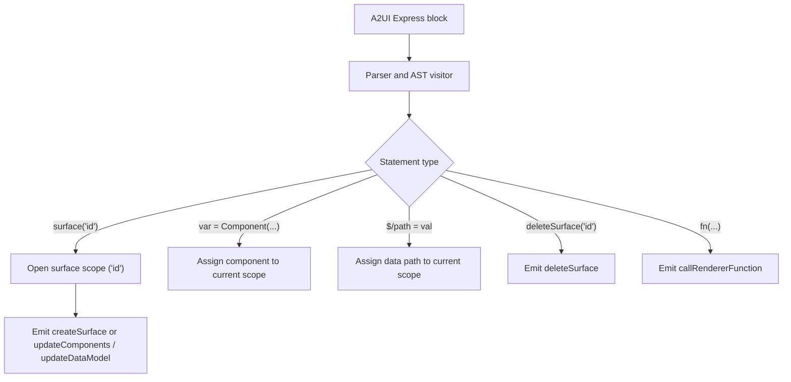

# Express DSL `surface()` design

## Summary

A2UI Express DSL is a compact declarative syntax designed for generative user interface models. The `surface("surface_id")` top-level statement opens a scope targeting a surface, while `deleteSurface("surface_id")` destroys an existing surface.

---

## Design principles

1. Explicit surface targeting. `surface("surface_id")` opens a scope for that surface. A scope that assigns `root` creates the surface (`createSurface`), while a scope that assigns components without `root` updates an existing surface (`updateComponents`).
2. Multiple surfaces. A single `<a2ui>` block can target several surfaces with a sequence of `surface(...)` statements. The messages come back in the order of their statements.
3. Default surface. If a block has no surface statement, the compiler uses its `surface_id` parameter (`"default_surface"` by default).
4. Deletion. `deleteSurface("id")` is a standalone command that destroys a surface.
5. Catalogs. With a single catalog, `createSurface` carries that catalog's `catalogId`. With multiple catalogs, `createSurface` omits `catalogId` and each component and function call carries its own `catalogId`, resolved by name across active catalogs or via an explicit `catalogId` override.

---

## Grammar and syntax

`surface` is a top-level statement with positional or keyword parameters:

```ebnf
surfaceStatement = "surface(" surfaceId [ "," catalogId ] ")" ;
```

### Signatures

- `surface(surfaceId)`
- `surface(surfaceId, catalogId)` (single-catalog mode only)
- `surface(surfaceId="id", catalogId="uri")` (single-catalog mode only)

### Parameters

| Parameter   | Type   | Required | Description                                                                                          |
| :---------- | :----- | :------- | :--------------------------------------------------------------------------------------------------- |
| `surfaceId` | String | Yes      | Unique string identifier for the target surface.                                                     |
| `catalogId` | String | No       | Optional ID of the sole active catalog in single-catalog mode. Rejected when multiple catalogs exist. |

---

## Usage examples

### Creating a surface

```express
<a2ui>
surface("dashboard-surface-1")
root = Card(main_column)
main_column = Column([title, metric_card])
title = Text("## Sales Dashboard")
metric_card = Card(Text("$12,450"))
</a2ui>
```

#### Compiled output (A2UI v1.0 `createSurface`)

```json
[
  {
    "version": "v1.0",
    "createSurface": {
      "surfaceId": "dashboard-surface-1",
      "catalogId": "https://a2ui.org/specification/v1_0/catalogs/basic/catalog.json",
      "components": [
        {
          "id": "root",
          "component": "Card",
          "child": "main_column"
        },
        {
          "id": "main_column",
          "component": "Column",
          "children": ["title", "metric_card"]
        },
        {
          "id": "title",
          "component": "Text",
          "text": "## Sales Dashboard"
        },
        {
          "id": "metric_card",
          "component": "Card",
          "child": "metric_card_child"
        },
        {
          "id": "metric_card_child",
          "component": "Text",
          "text": "$12,450"
        }
      ]
    }
  }
]
```

### Updating a surface in a later turn

A later turn updates components on the same surface with `surface(...)` (omitting `root`):

```express
<a2ui>
surface("dashboard-surface-1")
main_column = Column([title, metric_card, status_text])
status_text = Text("Updated 1m ago", "caption")
$/metrics/sales = 15800
</a2ui>
```

#### Compiled output (A2UI v1.0 `updateComponents` and `updateDataModel`)

```json
[
  {
    "version": "v1.0",
    "updateComponents": {
      "surfaceId": "dashboard-surface-1",
      "components": [
        {
          "id": "main_column",
          "component": "Column",
          "children": ["title", "metric_card", "status_text"]
        },
        {
          "id": "status_text",
          "component": "Text",
          "text": "Updated 1m ago",
          "variant": "caption"
        }
      ]
    }
  },
  {
    "version": "v1.0",
    "updateDataModel": {
      "surfaceId": "dashboard-surface-1",
      "path": "/",
      "value": {
        "metrics": {
          "sales": 15800
        }
      }
    }
  }
]
```

### Several surfaces in one block

```express
<a2ui>
surface("header-surface")
root = Row([app_title])
app_title = Text("# Analytics Portal")

surface("sidebar-surface")
root = Column([nav_home, nav_reports])
nav_home = Button(Text("Home"), _, Event("home"))
nav_reports = Button(Text("Reports"), _, Event("reports"))
</a2ui>
```

---

## Compiler pipeline



### Surface scope partitioning

1. Scope start. A `surface("id")` statement opens a scope for `"id"`.
2. Scope end. A scope ends at the next surface statement or at the end of the block. `deleteSurface(...)` and standalone function calls are emitted in place.
3. Protocol mapping:
   - A `surface(...)` scope that defines `root` emits a `createSurface` that holds the components and the data model. For v0.9 and v0.9.1 targets, it emits a bare `createSurface` followed by `updateComponents` and `updateDataModel`.
   - A `surface(...)` scope that defines components without `root` emits `updateComponents` (and `updateDataModel` if data paths are assigned). A scope with only data path assignments emits an `updateDataModel`.
4. Default scope. If assignments come before any surface statement, the compiler opens an implicit scope for its `surface_id` parameter.

### Decompiling

The decompiler first coalesces the message sequence, folding updates into the `createSurface` of their surface when the result is equivalent. Each surface scope is emitted with a `surface(...)` header and leaf data path assignments (`$/path = value`).
