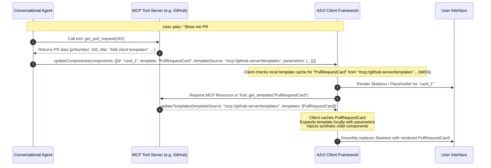

# Proposal: Client-Expanded Templates & Dynamic MCP Template Federation

## Abstract

This proposal extends the A2UI Templates architecture to support **client-side template expansion** and **dynamic template federation over the Model Context Protocol (MCP)**.

While server-expanded templates expand into canonical Basic Catalog primitives prior to leaving the Agent SDK, **client-expanded templates** are transported as compact JSON definitions over the wire. Templates can be bundled directly in `createSurface` or dynamically streamed via a new `updateTemplates` protocol message. Furthermore, components inside `updateComponents` can explicitly reference remote templates via a `templateSource` property (analogous to component-level `catalogId` in A2UI v1.0). When an unknown template source is encountered, the client framework dynamically fetches the template from the designated MCP server or endpoint, caches it locally, and synchronously inflates the layout tree on the client.

This architecture enables:

1. **Extreme Wire Efficiency**: Transmitting compact parameter payloads over low-bandwidth channels instead of extensive repetitive component graphs.
2. **Decoupled Multi-Agent & Tool UI Federation**: Independent MCP servers (e.g., GitHub, Jira, Salesforce) can publish and maintain their own specialized UI templates without requiring the core conversational agent to know their visual layout details.
3. **Reactive Edge Expansion**: Instant client-side re-inflation when local data models mutate, without server roundtrips.

---

## 1. Motivation & Problem Statement

### The Multi-Agent & MCP UI Dilemma

In modern AI agent ecosystems, a central orchestrating agent often communicates with multiple specialized tools and subagents via the Model Context Protocol (MCP).

Under the existing model:

- **Approach A (Server-expanded templates)**: The orchestrator's backend must hold all template layouts in memory. If a GitHub MCP server wants to display a Pull Request Card, the orchestrator needs to know the exact YAML layout of that card. This breaks tool encapsulation.
- **Approach B (Raw Basic Catalog components from tools)**: The MCP tool returns hundreds of raw UI primitives in its tool output. This significantly inflates token usage and wire payload size.

### The Solution: Client-Expanded Federated Templates

Client-expanded templates solve this dilemma:

- The MCP server serves as the **Template Authority**, emitting specialized template definitions via `updateTemplates`.
- The central orchestrator outputs only a compact invocation:
  ```json
  {
    "id": "pr_102",
    "template": "PullRequestCard",
    "templateSource": "mcp://github-tool/templates",
    "parameters": {
      "prNumber": 102,
      "repo": "jacobsimionato/a2ui"
    }
  }
  ```
- The client-side A2UI framework resolves `templateSource`, loads the template definition (if not already cached), and expands the layout directly on the client.

---

## 2. Protocol Message Extensions

To support client-side templates, the A2UI message protocol is extended in two areas: `createSurface` and the new `updateTemplates` message.

### 2.1 Bundling in `createSurface`

Initial templates known at surface creation time can be transported directly inside `createSurface`.

```json
{
  "version": "v1.0",
  "createSurface": {
    "surfaceId": "main",
    "catalogId": "https://a2ui.org/specification/v1_0/catalogs/basic/catalog.json",
    "templates": [
      {
        "name": "MetricCard",
        "catalogs": ["https://a2ui.org/specification/v1_0/catalogs/basic/catalog.json"],
        "description": "KPI metric card",
        "parameters": {
          "label": {"type": "string"},
          "value": {"type": "string"}
        },
        "layout": {
          "component": "Card",
          "child": {
            "component": "Column",
            "children": [
              {"component": "Text", "text": "${label}", "variant": "caption"},
              {"component": "Text", "text": "${value}", "variant": "h2"}
            ]
          }
        }
      }
    ]
  }
}
```

### 2.2 The `updateTemplates` Message

For templates delivered after surface creation, or emitted dynamically by connected MCP servers, the protocol introduces the top-level `updateTemplates` message.

#### Schema Specification:

```json
{
  "$schema": "https://json-schema.org/draft/2020-12/schema",
  "title": "A2UI UpdateTemplates Message",
  "type": "object",
  "required": ["templates"],
  "properties": {
    "surfaceId": {
      "type": "string",
      "description": "Optional surface to which these templates are scoped. If omitted, templates are scoped globally to the client session."
    },
    "templateSource": {
      "type": "string",
      "description": "The authority URI or MCP server identifier publishing these templates (e.g. 'mcp://github-server/templates')."
    },
    "replace": {
      "type": "boolean",
      "default": false,
      "description": "If true, clears previously registered templates under this templateSource before adding the new set."
    },
    "templates": {
      "type": "array",
      "items": {
        "$ref": "template_definition.json"
      },
      "description": "Array of JSON-serialized template definitions."
    }
  }
}
```

#### Example Message:

```json
{
  "version": "v1.0",
  "updateTemplates": {
    "templateSource": "mcp://github-service/templates",
    "templates": [
      {
        "name": "PullRequestCard",
        "catalogs": ["https://a2ui.org/specification/v1_0/catalogs/basic/catalog.json"],
        "description": "GitHub PR status card with merge status and CI indicator.",
        "parameters": {
          "prNumber": {"type": "integer"},
          "title": {"type": "string"},
          "author": {"type": "string"},
          "status": {"type": "enum", "values": ["open", "merged", "closed"]}
        },
        "layout": {
          "component": "Card",
          "child": {
            "component": "Column",
            "children": [
              {
                "component": "Row",
                "justify": "spaceBetween",
                "children": [
                  {"component": "Text", "text": "#${prNumber} ${title}", "variant": "h3"},
                  {"component": "Text", "text": "${status}", "variant": "caption"}
                ]
              },
              {"component": "Divider", "axis": "horizontal"},
              {"component": "Text", "text": "Opened by @${author}", "variant": "body"}
            ]
          }
        }
      }
    ]
  }
}
```

---

## 3. Template Referencing in A2UI Content

### 3.1 Component-Level Referencing & Contrast with v1.0 `catalogId`

In the A2UI v1.0 specification, `ComponentCommon` introduced `catalogId` on individual components to override the surface-level default catalog:

```json
// A2UI v1.0 Component with custom catalogId
{
  "id": "chart_1",
  "catalogId": "https://company.org/catalogs/analytics/catalog.json",
  "component": "LineChart",
  "series": "/metrics/cpu"
}
```

Analogously, client-expanded templates introduce `template` and `templateSource` to the component model:

```json
// Client-Expanded Template Component Reference
{
  "id": "pr_widget_1",
  "template": "PullRequestCard",
  "templateSource": "mcp://github-service/templates",
  "parameters": {
    "prNumber": 342,
    "title": "Add client-side template expansion",
    "author": "octocat",
    "status": "open"
  }
}
```

#### Property Definitions:

- **`template`** (string, required): The ID of the template to instantiate (e.g. `"PullRequestCard"`).
- **`templateSource`** (string, optional): The URI or namespace of the template provider.
  - Can be an MCP URI: `mcp://<serverId>/<endpoint>`
  - Can be an HTTPS endpoint: `https://templates.a2ui.org/library/v1`
  - Can be a local identifier: `local` or `shared`
  - If omitted, the template is resolved from the surface's default template registry.
- **`parameters`** (object, required): A key-value mapping matching the template's declared parameter schema.

---

## 4. MCP Server Integration & Dynamic Federation

When a client encounters a template invocation with a `templateSource` that has not yet been loaded, it uses the Model Context Protocol (MCP) to fetch the template on demand.

### 4.1 Sequence Diagram: On-Demand Dynamic Resolution



### 4.2 Proactive vs. Reactive MCP Template Delivery

The architecture supports both delivery patterns:

1. **Proactive Delivery (Tool Response Multiplexing)**:
   When an MCP server returns a tool response to an agent, it can include an `updateTemplates` message in its response payload or stream it directly over the client channel. When the client receives the agent's `updateComponents` message, the template is already warm in memory.

2. **Reactive Delivery (Client On-Demand Fetching)**:
   If an agent references a template that the client has not yet received:
   - The client invokes the standard MCP resource:
     `mcp://<serverId>/templates/<templateId>`
   - The MCP server returns the template JSON in an `updateTemplates` payload.

---

## 5. Client Expansion Engine & Lifecycle

### 5.1 Deterministic Client Synthetic ID Generation

When the client-side A2UI framework expands a template, it preserves the existing adjacency list component architecture. It generates synthetic IDs for all internal components of the template layout:

$$\text{syntheticId} = \{\text{hostId}\} \mathbin{\_} \{\text{slotName}\} \mathbin{\_} \{\text{index}\} \mathbin{\_} \{\text{componentType}\}$$

#### Example Expansion:

Given host component:

```json
{
  "id": "team_lead_widget",
  "template": "UserProfile",
  "parameters": {"userName": "Elena Vance", "role": "Principal"}
}
```

The client engine replaces `team_lead_widget` in its active render tree with:

```json
[
  {
    "id": "team_lead_widget",
    "component": "Card",
    "child": "team_lead_widget_child_column"
  },
  {
    "id": "team_lead_widget_child_column",
    "component": "Column",
    "children": [
      "team_lead_widget_child_column_children_0_text",
      "team_lead_widget_child_column_children_1_text"
    ]
  },
  {
    "id": "team_lead_widget_child_column_children_0_text",
    "component": "Text",
    "text": "Elena Vance",
    "variant": "h3"
  },
  {
    "id": "team_lead_widget_child_column_children_1_text",
    "component": "Text",
    "text": "Principal",
    "variant": "caption"
  }
]
```

### 5.2 Progressive Rendering & Skeleton Loading

Because remote template retrieval involves an asynchronous network hop, the client framework must provide a seamless user experience:

1. **Placeholder State**: When an un-cached template is encountered, the client mounts a canonical placeholder (e.g. an animated skeleton card with the specified dimensions or basic text).
2. **Progressive Mounting**: Once `updateTemplates` is processed, the placeholder is smoothly replaced with the expanded component tree without unmounting neighboring components.
3. **Timeout Fallback**: If the template source fails to resolve within a configurable timeout (default: 3000ms), a clean error card is displayed:
   `"Unable to load template 'PullRequestCard' from mcp://github-server/templates"`.

### 5.3 Two-Way Client Data Binding Interoperability

Client-expanded templates have direct, low-latency access to the client's `DataModel`:

- **Local Interpolation**: If a template parameter contains a data binding path (e.g. `path: "/currentUser/name"`), the client resolves it reactively against the local surface data store.
- **Dynamic Updates**: When the agent sends `updateDataModel`, any client-expanded template bound to that path automatically updates without needing re-expansion.

---

## 6. End-to-End Concrete Example

### Step 1: MCP Server Emits `updateTemplates`

```json
{
  "version": "v1.0",
  "updateTemplates": {
    "templateSource": "mcp://cloud-ops/templates",
    "templates": [
      {
        "name": "ServerHealthCard",
        "catalogs": ["https://a2ui.org/specification/v1_0/catalogs/basic/catalog.json"],
        "parameters": {
          "hostname": {"type": "string"},
          "cpuUsage": {"type": "number"},
          "status": {"type": "enum", "values": ["healthy", "warning", "down"]}
        },
        "layout": {
          "component": "Card",
          "child": {
            "component": "Column",
            "children": [
              {
                "component": "Row",
                "justify": "spaceBetween",
                "children": [
                  {"component": "Text", "text": "${hostname}", "variant": "h3"},
                  {"component": "Icon", "name": "dns"}
                ]
              },
              {"component": "Divider", "axis": "horizontal"},
              {"component": "Text", "text": "CPU Load: ${cpuUsage}%", "variant": "body"}
            ]
          }
        }
      }
    ]
  }
}
```

### Step 2: Agent Sends Compact `updateComponents`

```json
{
  "version": "v1.0",
  "updateComponents": {
    "surfaceId": "ops_dashboard",
    "components": [
      {
        "id": "root",
        "component": "Column",
        "children": ["server_1", "server_2"]
      },
      {
        "id": "server_1",
        "template": "ServerHealthCard",
        "templateSource": "mcp://cloud-ops/templates",
        "parameters": {
          "hostname": "prod-api-01",
          "cpuUsage": 42.5,
          "status": "healthy"
        }
      },
      {
        "id": "server_2",
        "template": "ServerHealthCard",
        "templateSource": "mcp://cloud-ops/templates",
        "parameters": {
          "hostname": "prod-db-01",
          "cpuUsage": 89.1,
          "status": "warning"
        }
      }
    ]
  }
}
```

### Step 3: Client Inflates Component Subtrees Locally

The client expands `server_1` and `server_2` into native `Card`, `Column`, `Row`, and `Text` nodes, rendering the complete dashboard with zero server expansion overhead.

---

## 7. Edge Cases & Boundary Conditions

### 1. Template Namespace Collisions

**Problem**: Two distinct MCP servers (e.g. `mcp://github` and `mcp://gitlab`) both define a template named `IssueCard`.
**Solution**: Templates are keyed internally in the client cache by the composite tuple `(templateSource, templateId)`. If `templateSource` is omitted in the invocation, the resolution order is:

1. Active surface local templates.
2. Global session templates.
3. Fallback error if multiple matching templates exist in different sources.

### 2. Security & Declarative Sandboxing

**Risk**: Can an untrusted MCP server deliver malicious executable scripts inside a template?
**Mitigation**:

- A2UI templates are strictly **declarative JSON data structures** validating against `template_definition.json`.
- Templates contain _no executable code_, JavaScript, or eval functions.
- The client engine validates all component types within a template against the surface's allowed `catalogId`. A template cannot invoke unverified or unauthorized custom components.

### 3. Client Recursion Limits

To prevent cyclic template references (e.g. Template `A` invokes Template `B` which invokes Template `A`), the client expansion engine maintains a call-stack set and enforces a strict depth limit:

```typescript
const MAX_CLIENT_TEMPLATE_DEPTH = 16;
```

If this depth is exceeded, the client halts expansion and marks the node as `TemplateRecursionError`.

### 4. Cache Persistence & Invalidation

- **Session Cache**: Cached in memory for the duration of the client connection.
- **Persistent Cache (Optional)**: If the client enables local storage caching (e.g. IndexedDB), templates with versioned sources (e.g. `mcp://github/templates/v1.2.0`) can be cached across browser refreshes, making subsequent loads instant.
- **Invalidation**: Sending an `updateTemplates` message with `replace: true` flushes the cache for that `templateSource`.

---

## 8. Summary Comparison: Server vs. Client Expansion

| Feature                          | Server-Expanded Templates                                | Client-Expanded Templates                                                   |
| :------------------------------- | :------------------------------------------------------- | :-------------------------------------------------------------------------- |
| **Expansion Location**           | Agent SDK (Server-Side)                                  | A2UI Framework / Renderer (Client-Side)                                     |
| **Wire Protocol Payload**        | Standard Basic Catalog primitives (`Card`, `Text`, etc.) | Compact JSON template references & `updateTemplates`                        |
| **Client Requirement**           | Zero. Any standard Basic Catalog renderer works.         | Client must include template inflation logic (`@a2ui/templates`).           |
| **Dynamic Tool Federation**      | Central orchestrator must hold all tool templates.       | Autonomous MCP servers publish templates dynamically via `updateTemplates`. |
| **Confidential Data Resolution** | Excellent (secure server callbacks query private DBs).   | Moderate (private data must be transmitted to the client).                  |
| **Wire Bandwidth**               | Higher (expanded component graphs sent over wire).       | Minimal (only parameters and IDs sent over wire).                           |
