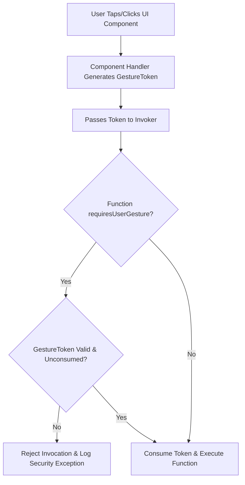

# Proposal: User-Gesture-Restricted Functions in A2UI

_Status: Draft_

_Author: Greg Spencer_

_Created: 2026-08-03_

---

## 1. Background and Current Problem Statement

A2UI client-side catalog functions, such as `openUrl`, run actions on the renderer. Currently, the renderer's data context engine executes a function whenever it evaluates an expression containing that function call.

A2UI is a declarative JSON protocol without inline code execution capabilities like JavaScript. Payloads generated by LLMs or server endpoints cannot directly execute arbitrary scripts or dispatch synthetic `.click()` DOM events. However, the current framework logic permits functions like `openUrl` to run automatically in several uninitiated scenarios:

### 1.1 Unintended Auto-Invocation Vectors

1. **Initial Surface Render Auto-Trigger**:
   A server or LLM payload can include function calls within component properties evaluated during initial layout construction. As soon as the surface renders, `openUrl` executes immediately without any user interaction.

2. **Dynamic Property Interpolation (`formatString`) Abuse**:
   The expression engine evaluates string interpolation expressions during component rendering or template list iteration. If a payload contains an expression such as:
   ```json
   {
     "component": "Text",
     "text": "${openUrl('https://example.com/phish')}"
   }
   ```
   the renderer evaluates `openUrl()` as part of string formatting. This opens an external browser window automatically during render without user consent.

3. **Reactive Data Model Re-evaluations**:
   When background data synchronization or state updates modify the `DataContext`, reactive dependencies trigger re-evaluation of bound expressions. Any function call bound to state updates executes automatically.

### 1.2 Security and User Experience Impact
* **Phishing and Unwanted Redirection**: Users can be navigated to external websites or deep-linked into native apps without clicking a link or button.
* **Pop-up Blocker Conflicts**: Web browsers block `window.open` calls that do not originate from an active user gesture, causing runtime errors or silent failures.
* **Loss of User Control**: Automated side effects violate the core requirement that actions with side effects (navigation, copying data, modifying system state) must be explicitly initiated by user intent.

---

## 2. Pros and Cons

### 2.1 Pros
* **Auto-Invocation Protection**: Stops automated window/tab navigation or side-effect triggers during layout rendering, dynamic property interpolation, or background state updates.
* **Zero Custom Component Overhead**: Component authors write standard event bindings (`@click=${props.action}` in Lit, `onClick={props.action}` in React, `onPressed: props.action` in Flutter). Framework binders pre-wrap `props.action` to create and attach gesture tokens automatically. Custom component authors write no token-handling code.
* **Centralized Web Implementation**: Web gesture token handling is implemented once inside `web_core` (`GenericBinder` and `DataContext`). This covers Lit, React, Angular, and Vue renderers without individual renderer modifications.
* **Programmatic Token Inspection**: Custom function implementations can programmatically inspect `options.gestureToken`. This enables hybrid execution flows, such as navigating directly when gesture-initiated, or displaying a permission confirmation dialog when uninitiated.

### 2.2 Cons
* **Engine Invoker Signatures**: Requires updating `FunctionInvoker` and `DataContext` signatures across web (`web_core`) and native core SDKs (`a2ui_core`) to accept `InvocationOptions`.

---

## 3. Proposed Solution

This proposal introduces an optional catalog attribute, `requiresUserGesture: boolean`, to function metadata definitions.

When a function definition includes `requiresUserGesture: true` (such as `openUrl`), the A2UI framework guarantees that the function only executes in response to a physical user interaction (such as a button click, form submission, or touch gesture). Uninitiated calls during layout rendering, dynamic property interpolation, or reactive model updates are blocked and rejected by the renderer engine.

### Protocol Schema Metadata (`requiresUserGesture`)

In catalog function definitions, `requiresUserGesture` specifies whether the function requires an active user gesture context at invocation time:

```json
{
  "functions": {
    "openUrl": {
      "type": "object",
      "description": "Opens the specified URL in a browser or handler. Requires an active user gesture.",
      "returnType": "void",
      "requiresUserGesture": true,
      "properties": {
        "call": { "const": "openUrl" },
        "args": {
          "type": "object",
          "properties": {
            "url": { "type": "string", "format": "uri" }
          },
          "required": ["url"]
        }
      }
    }
  }
}
```

---

## 4. Renderer Token Execution Model

Renderers enforce user-gesture constraints using **Explicit Gesture Context Tokens** (`UserGestureToken`).

When a user interacts with a UI component:
1. **Token Generation**: The component event listener (such as a `Button` click handler) generates a short-lived, single-use `UserGestureToken`.
2. **Context Propagation**: The renderer passes the token into `invokeFunction(name, args, { gestureToken })`.
3. **Validation and Consumption**:
   - If `fn.requiresUserGesture === true` and no valid gesture token is present, execution is rejected with a security exception.
   - If a valid token is present, the token is consumed (`token.consume()`) to prevent replay attacks, and the function executes.
4. **Static and Reactive Expression Evaluation**: Data bindings, dynamic string interpolations, and reactive state updates explicitly pass `gestureToken: undefined`, automatically blocking `requiresUserGesture` functions during layout evaluation.



---

## 5. Developer Experience and Component Authoring

Custom component authors do not need to modify component implementations to support this feature.

### 5.1 Automatic Action Wrapping via Framework Binders
When custom components receive action callbacks as props (`props.action`), the renderer's framework binder (such as `GenericBinder` in `web_core`) generates those callbacks. The binder automatically wraps `props.action` to capture the DOM or native touch event and construct a `UserGestureToken`.

Component authors write standard framework code:
* **Lit**: `<button @click=${props.action}>Click Me</button>`
* **React**: `<button onClick={props.action}>Click Me</button>`
* **Flutter**: `ElevatedButton(onPressed: props.action, child: Text("Click Me"))`
* **Jetpack Compose**: `Button(onClick = props.action) { Text("Click Me") }`

Because framework binders pre-wrap `props.action`, custom component authors write no gesture-token boilerplate or manual event extraction logic.

---

## 6. Platform Implementation Designs

### 6.1 Web Engine (`web_core`) Design

In `web_core` (shared by **Lit**, **React**, **Angular**, and **Vue** renderers), gesture token handling is implemented centrally inside `GenericBinder` and `DataContext`.

#### `web_core` Action Binder Implementation:
```typescript
// web_core: src/v0_9/rendering/generic-binder.ts
export function bindAction(dataContext: DataContext, actionCall: ActionDefinition) {
  return (eventOrOptions?: Event | { event?: Event }) => {
    // Extract DOM Event from framework event argument or window fallback
    const domEvent = eventOrOptions instanceof Event
      ? eventOrOptions
      : eventOrOptions?.event ?? (typeof window !== 'undefined' ? window.event : undefined);

    const gestureToken = domEvent ? createWebGestureToken(domEvent) : undefined;

    return dataContext.invokeFunction(actionCall.call, actionCall.args, { gestureToken });
  };
}
```

#### `Catalog.invoker` Validation:
```typescript
// web_core: src/v0_9/catalog/types.ts
this.invoker = (name, rawArgs, ctx, options) => {
  const fn = this.functions.get(name);
  if (!fn) throw new A2uiExpressionError(`Function not found: ${name}`, name);

  if (fn.requiresUserGesture && (!options?.gestureToken || !options.gestureToken.isValid)) {
    throw new A2uiSecurityError(
      `Execution blocked: Function '${name}' requires an active user gesture.`,
      name,
    );
  }

  // Consume token to prevent replay attacks
  options?.gestureToken?.consume();
  const safeArgs = fn.schema.parse(rawArgs);
  return fn.execute(safeArgs, ctx, options?.abortSignal);
};
```

---

### 6.2 Flutter (Dart) Design

Flutter has a synchronous, single-threaded event loop. The token model is passed via `ActionDispatcher`.

#### Flutter Token Class and Function Invoker:
```dart
class UserGestureToken {
  final DateTime timestamp = DateTime.now();
  final String sourceComponentId;
  bool _consumed = false;

  UserGestureToken({required this.sourceComponentId});

  /// Valid for 5 seconds and single-use
  bool get isValid => !_consumed && DateTime.now().difference(timestamp) < const Duration(seconds: 5);

  void consume() => _consumed = true;
}

// In Component onPressed handler:
ElevatedButton(
  onPressed: () {
    final token = UserGestureToken(sourceComponentId: widget.id);
    actionDispatcher.dispatch(props.action, gestureToken: token);
  },
  child: Text(props.label),
);

// In openUrl Implementation:
void executeOpenUrl(Map<String, dynamic> args, FunctionContext context) {
  final token = context.gestureToken;
  if (token == null || !token.isValid) {
    throw SecurityException("Function 'openUrl' requires an active user gesture.");
  }
  token.consume();
  url_launcher.launchUrl(Uri.parse(args['url']));
}
```

---

### 6.3 Android (Kotlin / Jetpack Compose) Design

On Android, Jetpack Compose click handlers (`onClick`) execute synchronously on the Main Thread. Kotlin's receiver lambdas and `CoroutineContext` pass and preserve gesture tokens across asynchronous coroutine suspensions cleanly.

#### Jetpack Compose Token and Coroutine Context Scope:
```kotlin
data class UserGestureToken(
    val sourceComponentId: String,
    val timestamp: Long = System.currentTimeMillis()
) {
    private var isConsumed = false

    val isValid: Boolean
        get() = !isConsumed && (System.currentTimeMillis() - timestamp < 5000)

    fun consume(): Boolean {
        if (isConsumed) return false
        isConsumed = true
        return true
    }
}

// Action Scope passed into Compose event handlers
class ActionScope(val gestureToken: UserGestureToken? = null)

// Jetpack Compose Button
@Composable
fun A2UIButton(componentId: String, label: String, onAction: ActionScope.() -> Unit) {
    Button(
        onClick = {
            val token = UserGestureToken(sourceComponentId = componentId)
            ActionScope(gestureToken = token).onAction()
        }
    ) {
        Text(text = label)
    }
}

// CoroutineContext element for preserving token across async coroutines:
class GestureContextElement(val token: UserGestureToken) : CoroutineContext.Element {
    companion object Key : CoroutineContext.Key<GestureContextElement>
    override val key: CoroutineContext.Key<*> = Key
}
```

---

### 6.4 iOS (Swift / SwiftUI) Design

In Swift and SwiftUI, closures passed to `Button(action: { ... })` execute on the `@MainActor`. Swift structured concurrency supports `@TaskLocal` values, allowing gesture tokens to be bound to Swift tasks and preserved automatically across `async/await` boundaries.

#### SwiftUI Token and TaskLocal Scoping:
```swift
public final class UserGestureToken {
    public let sourceComponentId: String
    public let timestamp: Date = Date()
    private var isConsumed: Bool = false

    public init(sourceComponentId: String) {
        self.sourceComponentId = sourceComponentId
    }

    public var isValid: Bool {
        return !isConsumed && Date().timeIntervalSince(timestamp) < 5.0
    }

    @discardableResult
    public func consume() -> Bool {
        guard !isConsumed else { return false }
        isConsumed = true
        return true
    }
}

public struct ActionContext {
    public let gestureToken: UserGestureToken?
    public init(gestureToken: UserGestureToken? = nil) {
        self.gestureToken = gestureToken
    }
}

// TaskLocal Concurrency Support:
public enum A2UIGestureScope {
    @TaskLocal public static var currentToken: UserGestureToken?
}

// SwiftUI Button Component
struct A2UIButton: View {
    let componentId: String
    let label: String
    let onAction: (ActionContext) -> Void

    var body: some View {
        Button(action: {
            let token = UserGestureToken(sourceComponentId: componentId)
            onAction(ActionContext(gestureToken: token))
        }) {
            Text(label)
        }
    }
}
```

---

## 7. Security Efficacy and Threat Matrix

| Threat / Scenario | Risk Level | Protection Mechanism |
| :--- | :--- | :--- |
| **Initial Render Auto-Trigger** (Model payload invoking `openUrl` on load) | High | **Blocked**: Initial layout render passes `gestureToken: undefined`. |
| **Interpolation Abuse** (Injecting `${openUrl('...')}` in text node) | High | **Blocked**: Expression engine passes no gesture token during formatting. |
| **Reactive Model Update** (State sync triggering function execution) | Medium | **Blocked**: Reactive state updates lack active gesture token context. |
| **Replay Attacks** (Re-using a single gesture token for multiple side effects) | Medium | **Blocked**: Token is consumed on first execution (`token.consume()`). |
| **Expired Gesture Tokens** (Delayed invocation after 5 seconds) | Low | **Blocked**: `token.isValid` checks time window expiry (< 5s). |

---

## Addendum: Programmatic Token Access Example

Setting `requiresUserGesture: true` delegates security enforcement to the framework invoker. However, custom functions can omit `requiresUserGesture` (or set it to `false`) and inspect `options.gestureToken` programmatically inside their `execute()` function body.

This enables **hybrid function implementations** that execute directly when gesture-initiated, but fall back to displaying a user permission dialog when uninitiated:

```typescript
export const MyCustomOpenUrlImplementation = createFunctionImplementation(
  MyCustomOpenUrlApi,
  (args, context, options) => {
    const hasActiveGesture = options?.gestureToken?.isValid === true;

    if (hasActiveGesture) {
      // 1. Gesture-Initiated: Consume token and open URL directly
      options.gestureToken.consume();
      window.open(args.url, '_blank', 'noopener,noreferrer');
    } else {
      // 2. Uninitiated / Automated Call: Fallback to displaying a permission dialog
      showPermissionModal({
        title: "Permission Request",
        message: `An automated action wants to open: ${args.url}. Allow navigation?`,
        onApprove: () => {
          // User clicked "Allow" on the dialog -> Physical click provides a new gesture
          window.open(args.url, '_blank', 'noopener,noreferrer');
        },
        onDeny: () => {
          console.log("Navigation request denied by user.");
        }
      });
    }
  }
);
```
