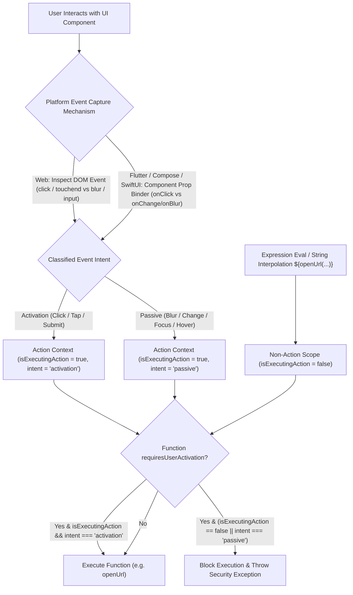

# Proposal: User-Gesture-Restricted Functions in A2UI

_Status: Draft_

_Author: Greg Spencer_

_Created: 2026-08-05_

---

## 1. Background and Current Problem Statement

A2UI client-side catalog functions, such as `openUrl`, run actions on the renderer. Currently, the renderer's data context engine executes a function whenever it evaluates an expression containing that function call.

A2UI is a declarative JSON protocol without inline code execution capabilities like JavaScript. Payloads generated by LLMs or server endpoints cannot directly execute arbitrary scripts or dispatch synthetic `.click()` DOM events. However, the current framework logic permits functions like `openUrl` to run automatically in several uninitiated scenarios:

### 1.1 Unintended Auto-Invocation Vectors

1. **Initial Surface Render Auto-Trigger**:
   A server or LLM payload can include function calls within component properties evaluated during initial layout construction. As soon as the surface renders, `openUrl` executes immediately without any user interaction.

2. **Dynamic Property Interpolation (`formatString`) Abuse**:
   The expression engine evaluates string interpolation expressions during component rendering or template list iteration. If a payload contains an expression such as:

   ```json
   {
     "component": "Text",
     "text": "${openUrl('https://example.com/phish')}"
   }
   ```

   the renderer evaluates `openUrl()` as part of string formatting. This opens an external browser window automatically during render without user consent.

3. **Reactive Data Model Re-evaluations**:
   When background data synchronization or state updates modify the `DataContext`, reactive dependencies trigger re-evaluation of bound expressions. Any function call bound to state updates executes automatically.

### 1.2 Security and User Experience Impact

- **Phishing and Unwanted Redirection**: Users can be navigated to external websites or deep-linked into native apps without clicking a link or button.
- **Pop-up Blocker Conflicts**: Web browsers block `window.open` calls that do not originate from an active user gesture, causing runtime errors or silent failures.
- **Loss of User Control**: Automated side effects violate the core requirement that actions with side effects (navigation, copying data, modifying system state) must be explicitly initiated by user intent.

---

## 2. Pros and Cons

### 2.1 Pros

- **Auto-Invocation Protection**: Stops automated window/tab navigation or side-effect triggers during layout rendering, dynamic property interpolation, background state updates, or passive input events (e.g. `onBlurAction`, `onChangeAction`).
- **Catalog Compatibility**: Requires no component metadata changes in catalog definitions. Does not add interaction annotations (`userInteractionLevel`) to component schemas.
- **Standard Component Bindings**: Custom component authors write standard event handlers (`@click=${props.action}` in Lit, `onClick={props.action}` in React, `onPressed: props.action` in Flutter). Binders wrap action callbacks automatically to set the Action Execution Scope.
- **Uniform Protocol Handling**: Avoids renderer protocol version checks (`protocolVersion >= "1.0"` vs `< "1.0"`), working uniformly across all protocol versions.
- **Cross-Platform Consistency**: Leverages native platform event primitives across Web, Flutter, Jetpack Compose, and SwiftUI.

### 2.2 Cons & Trade-offs

- **Trusted Event Inspection Requirement**: Renderers MUST inspect native event types (`click`/`touchend` vs `blur`/`input`) and verify `event.isTrusted` inside action binders so that synthetic JavaScript `.dispatchEvent()` or uninitiated timers cannot programmatically open an Activation Action Context.

---

## 3. Proposed Solution

This proposal introduces **Action Context Enforcement with Event Classification**:

1. `requiresUserActivation: boolean` on catalog function definitions (e.g., `openUrl`).
2. Framework-enforced **Action Execution Scope & Activation Event Classification** across renderers.

When a function definition sets `requiresUserActivation: true` (such as `openUrl`), the A2UI framework guarantees that the function only executes when dispatched from within the execution scope of an **intentional user activation Action** (e.g., click, tap, submit). Uninitiated calls during layout rendering, dynamic property interpolation, reactive model updates, or passive input handlers (`onBlurAction`, `onChangeAction`) are blocked and rejected by the renderer engine.

### 3.1 Catalog Function Metadata (`requiresUserActivation`)

In catalog function definitions, `requiresUserActivation` specifies whether the function requires a user activation context at invocation time:

```json
{
  "functions": {
    "openUrl": {
      "type": "object",
      "description": "Opens the specified URL in a browser or handler. Requires user activation.",
      "returnType": "void",
      "requiresUserActivation": true,
      "properties": {
        "call": {"const": "openUrl"},
        "args": {
          "type": "object",
          "properties": {
            "url": {"type": "string", "format": "uri"}
          },
          "required": ["url"]
        }
      }
    }
  }
}
```

### 3.2 Runtime Action Execution Scope & Event Classification

Rather than adding metadata to catalog component definitions or introducing new Action types in JSON payloads, renderer engines classify the **underlying interaction event intent** at runtime:

- **Activation Intent (`actionIntent = "activation"`)**:
  Triggered by physical, intentional user activation events:
  - Web: Trusted DOM events (`click`, `auxclick`, `touchend`, `submit`, `Enter`/`Space` keypress on focused interactive node).
  - Mobile: Primary gesture callbacks (`onPressed`/`onTap` in Flutter, `onClick` in Compose, `Button(action:)` in SwiftUI).
  - **Permits** functions marked `requiresUserActivation: true`.

- **Passive Intent (`actionIntent = "passive"`)**:
  Triggered by continuous input, focus change, or passive events:
  - Web: DOM events (`blur`, `focus`, `input`, `change`, `pointermove`, `mouseenter`).
  - Mobile: Input/focus callbacks (`onChangeAction`, `onBlurAction`, `onFocusAction`).
  - **Blocks** functions marked `requiresUserActivation: true`, while allowing standard state model updates or data validations.

- **Non-Action Scope (`isExecutingAction = false`)**:
  Active during surface layout construction, dynamic string interpolation (`${openUrl(...)}`), template iteration, reactive state updates, or direct agent function invocation messages.
  - **Blocks** functions marked `requiresUserActivation: true`.

- **Agent Invocation Rejection**: Functions declared with `callableFrom: "rendererOrAgent"` (or `"rendererOnly"`) that set `requiresUserActivation: true` MUST be rejected with a runtime security error if directly invoked by a server/agent message. Because direct backend agent calls execute without a physical client user activation context (`isExecutingAction = false`), they are prohibited from auto-executing user-activation-restricted functions.

### 3.3 Asynchronous Execution Boundaries

When a user initiates an Action, the resulting execution chain may include asynchronous processing turns (such as asynchronous state updates, data transformations, or `await` promises/futures).

- **Scope Persistence Across `await` Turns**: The Action Execution Scope (`isExecutingAction = true` and `actionIntent = "activation"`) persists across asynchronous task boundaries (`await`, Promises, Futures, Coroutines, Tasks) for any execution flow initiated by a user activation event.
- **Rule**: As long as the initial execution was triggered by an intentional user activation Action, subsequent asynchronous operations and function calls within that Action handler pipeline remain inside the active Action Context and are permitted to execute `requiresUserActivation` functions.

---

## 4. Renderer Action Execution Model

Renderers enforce user-gesture constraints using **Action Execution Scopes** (`isExecutingAction` and `actionIntent`).



---

## 5. Developer Experience and Component Authoring

Custom component authors do not need to modify component implementations to support this feature.

### 5.1 Automatic Action Wrapping

When custom components receive action callbacks as props (`props.action`), the renderer's framework binder (such as `GenericBinder` in `web_core`) generates those callbacks. The binder automatically captures native touch/click events and wraps callback execution within `dataContext.executeInActionScope(intent, callback)`.

#### Runtime Enablement:

Component authors handle runtime enablement (`disabled`, `enabled`, or custom state props) inside standard framework code:

- **Lit**: `<button ?disabled=${props.disabled} @click=${e => !props.disabled && props.action(e)}>Click Me</button>`
- **React**: `<button disabled={props.disabled} onClick={e => !props.disabled && props.action(e)}>Click Me</button>`
- **Flutter**: `ElevatedButton(onPressed: props.disabled ? null : () => props.action(), child: Text("Click Me"))`
- **Jetpack Compose**: `Button(onClick = props.action, enabled = !props.disabled) { Text("Click Me") }`

If a component instance is disabled at runtime, `props.action()` is skipped, no Action Context is opened, and no function executes.

---

## 6. Platform Implementation Designs

### 6.1 Web Engine (`web_core`) Design

In `web_core` (shared by **Lit**, **React**, **Angular**, and **Vue** renderers), Action Context handling is implemented centrally inside `GenericBinder` and `DataContext`.

#### `web_core` Action Binder Implementation:

```typescript
// web_core: src/v0_9/data/data-context.ts
export type ActionIntent = 'activation' | 'passive';

export class DataContext {
  private _isExecutingAction = false;
  private _actionIntent: ActionIntent = 'passive';

  public get isExecutingAction(): boolean {
    return this._isExecutingAction;
  }

  public get actionIntent(): ActionIntent {
    return this._actionIntent;
  }

  public executeInActionScope<T>(intent: ActionIntent, callback: () => T): T {
    const prevAction = this._isExecutingAction;
    const prevIntent = this._actionIntent;
    this._isExecutingAction = true;
    this._actionIntent = intent;
    try {
      const result = callback();
      if (result instanceof Promise) {
        return result.finally(() => {
          this._isExecutingAction = prevAction;
          this._actionIntent = prevIntent;
        }) as unknown as T;
      }
      this._isExecutingAction = prevAction;
      this._actionIntent = prevIntent;
      return result;
    } catch (error) {
      this._isExecutingAction = prevAction;
      this._actionIntent = prevIntent;
      throw error;
    }
  }
}

// web_core: src/v0_9/rendering/generic-binder.ts
const ACTIVATION_EVENTS = new Set(['click', 'auxclick', 'touchend', 'submit']);

export function bindAction(dataContext: DataContext, actionCall: ActionDefinition) {
  return (eventOrOptions?: Event | {event?: Event}) => {
    const domEvent =
      eventOrOptions instanceof Event
        ? eventOrOptions
        : ((eventOrOptions as any)?.nativeEvent ?? (eventOrOptions as any)?.event);

    // Classify event intent based on DOM event type
    const isActivationEvent =
      domEvent &&
      domEvent.isTrusted &&
      (ACTIVATION_EVENTS.has(domEvent.type) ||
        (domEvent instanceof KeyboardEvent && (domEvent.key === 'Enter' || domEvent.key === ' ')));

    const intent: ActionIntent = isActivationEvent ? 'activation' : 'passive';

    return dataContext.executeInActionScope(intent, () => {
      return dataContext.invokeFunction(actionCall.call, actionCall.args);
    });
  };
}
```

#### `Catalog.invoker` Validation:

```typescript
// web_core: src/v0_9/catalog/types.ts
this.invoker = (name, rawArgs, ctx) => {
  const fn = this.functions.get(name);
  if (!fn) throw new A2uiExpressionError(`Function not found: ${name}`, name);

  if (fn.requiresUserActivation) {
    const isValidScope = ctx.isExecutingAction && ctx.actionIntent === 'activation';
    if (!isValidScope) {
      throw new A2uiSecurityError(
        `Execution blocked: Function '${name}' requires a user activation Action context (e.g. click, tap, submit). ` +
          `It cannot be executed during layout rendering, interpolation, passive events (blur/change), or reactive updates.`,
        name,
      );
    }
  }

  const safeArgs = fn.schema.parse(rawArgs);
  return fn.execute(safeArgs, ctx);
};
```

---

### 6.2 Flutter (Dart) Design

In Flutter/Dart, Action Context scopes propagate using `DataContext.runInActionScope`:

```dart
enum ActionIntent { activation, passive }

class DataContext {
  bool _isExecutingAction = false;
  ActionIntent _actionIntent = ActionIntent.passive;

  bool get isExecutingAction => _isExecutingAction;
  ActionIntent get actionIntent => _actionIntent;

  R runInActionScope<R>(ActionIntent intent, R Function() block) {
    final prevAction = _isExecutingAction;
    final prevIntent = _actionIntent;
    _isExecutingAction = true;
    _actionIntent = intent;
    try {
      final result = block();
      if (result is Future) {
        return (result.whenComplete(() {
          _isExecutingAction = prevAction;
          _actionIntent = prevIntent;
        })) as R;
      }
      _isExecutingAction = prevAction;
      _actionIntent = prevIntent;
      return result;
    } catch (error) {
      _isExecutingAction = prevAction;
      _actionIntent = prevIntent;
      rethrow;
    }
  }
}

// Button Widget Binder:
ElevatedButton(
  onPressed: props.disabled ? null : () {
    context.runInActionScope(ActionIntent.activation, () {
      actionDispatcher.dispatch(props.action, context: context);
    });
  },
  child: Text(props.label),
);

// Function Invocation Guard:
void verifyFunctionExecution(FunctionDefinition fn, DataContext context) {
  if (fn.requiresUserActivation) {
    if (!context.isExecutingAction || context.actionIntent != ActionIntent.activation) {
      throw SecurityException(
        "Function '${fn.name}' requires execution within an active intentional user activation Action context.",
      );
    }
  }
}
```

---

### 6.3 Android (Kotlin / Jetpack Compose) Design

On Android, Jetpack Compose click handlers execute in coroutines with `ActionContextElement`:

```kotlin
enum class ActionIntent { ACTIVATION, PASSIVE }

class ActionContextElement(
    val isExecutingAction: Boolean = true,
    val intent: ActionIntent = ActionIntent.ACTIVATION
) : CoroutineContext.Element {
    companion object Key : CoroutineContext.Key<ActionContextElement>
    override val key: CoroutineContext.Key<*> = Key
}

// Jetpack Compose Button Component
@Composable
fun A2UIButton(componentId: String, label: String, enabled: Boolean = true, onAction: suspend () -> Unit) {
    val coroutineScope = rememberCoroutineScope()
    Button(
        onClick = {
            if (!enabled) return@Button
            coroutineScope.launch(ActionContextElement(isExecutingAction = true, intent = ActionIntent.ACTIVATION)) {
                onAction()
            }
        },
        enabled = enabled
    ) {
        Text(text = label)
    }
}
```

---

### 6.4 iOS (Swift / SwiftUI) Design

In SwiftUI, TaskLocal values (`A2UIActionScope`) bind Action Context scopes across `async/await` tasks:

```swift
public enum ActionIntent {
    case activation
    case passive
}

public enum A2UIActionScope {
    @TaskLocal public static var isExecutingAction: Bool = false
    @TaskLocal public static var actionIntent: ActionIntent = .passive
}

// SwiftUI Button Component
struct A2UIButton: View {
    let actionCall: ActionDefinition
    let context: DataContext

    var body: some View {
        Button(action: {
            Task {
                await A2UIActionScope.$isExecutingAction.withValue(true) {
                    await A2UIActionScope.$actionIntent.withValue(.activation) {
                        await context.invokeFunction(actionCall.call, args: actionCall.args)
                    }
                }
            }
        }) {
            Text(actionCall.label)
        }
    }
}
```

---

## 7. Security Efficacy and Threat Matrix

| Threat / Scenario                                                                   | Risk Level | Protection Mechanism                                                      |
| :---------------------------------------------------------------------------------- | :--------- | :------------------------------------------------------------------------ |
| **Initial Render Auto-Trigger** (Model payload invoking `openUrl` on load)          | High       | **Blocked**: Initial layout render has `isExecutingAction = false`.       |
| **Interpolation Abuse** (Injecting `${openUrl('...')}` in text node)                | High       | **Blocked**: Expression engine operates with `isExecutingAction = false`. |
| **Reactive Model Update** (State sync triggering function execution)                | Medium     | **Blocked**: Reactive state updates operate outside Action Context.       |
| **Passive Event Exploitation** (`openUrl` bound to `onBlurAction`/`onChangeAction`) | Medium     | **Blocked**: Blur/change events operate with `actionIntent = "passive"`.  |
| **Synthetic Event Attack** (Script calling `.click()`)                              | Medium     | **Blocked**: Binders require `domEvent.isTrusted === true`.               |

---
