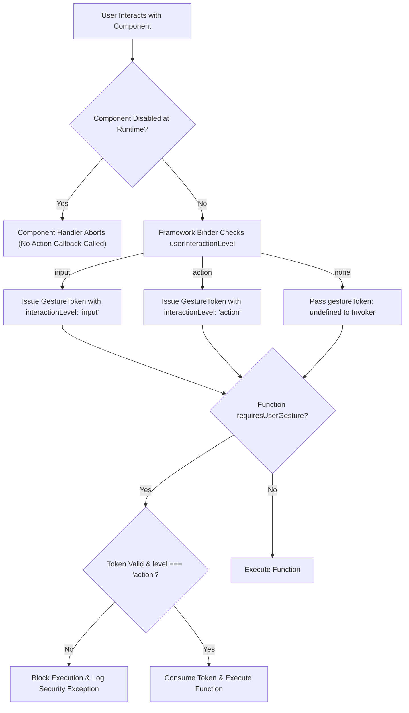

# Proposal: User-Gesture-Restricted Functions in A2UI

_Status: Draft_

_Author: Greg Spencer_

_Created: 2026-08-03_

---

## 1. Background and Current Problem Statement

A2UI client-side catalog functions, such as `openUrl`, run actions on the renderer. Currently, the renderer's data context engine executes a function whenever it evaluates an expression containing that function call.

A2UI is a declarative JSON protocol without inline code execution capabilities like JavaScript. Payloads generated by LLMs or server endpoints cannot directly execute arbitrary scripts or dispatch synthetic `.click()` DOM events. However, the current framework logic permits functions like `openUrl` to run automatically in several uninitiated scenarios:

### 1.1 Unintended Auto-Invocation Vectors

1. **Initial Surface Render Auto-Trigger**:
   A server or LLM payload can include function calls within component properties evaluated during initial layout construction. As soon as the surface renders, `openUrl` executes immediately without any user interaction.

2. **Dynamic Property Interpolation (`formatString`) Abuse**:
   The expression engine evaluates string interpolation expressions during component rendering or template list iteration. If a payload contains an expression such as:

   ```json
   {
     "component": "Text",
     "text": "${openUrl('https://example.com/phish')}"
   }
   ```

   the renderer evaluates `openUrl()` as part of string formatting. This opens an external browser window automatically during render without user consent.

3. **Reactive Data Model Re-evaluations**:
   When background data synchronization or state updates modify the `DataContext`, reactive dependencies trigger re-evaluation of bound expressions. Any function call bound to state updates executes automatically.

### 1.2 Security and User Experience Impact

- **Phishing and Unwanted Redirection**: Users can be navigated to external websites or deep-linked into native apps without clicking a link or button.
- **Pop-up Blocker Conflicts**: Web browsers block `window.open` calls that do not originate from an active user gesture, causing runtime errors or silent failures.
- **Loss of User Control**: Automated side effects violate the core requirement that actions with side effects (navigation, copying data, modifying system state) must be explicitly initiated by user intent.

---

## 2. Pros and Cons

### 2.1 Pros

- **Auto-Invocation Protection**: Stops automated window/tab navigation or side-effect triggers during layout rendering, dynamic property interpolation, or background state updates.
- **Zero Custom Component Overhead**: Component authors write standard event bindings (`@click=${props.action}` in Lit, `onClick={props.action}` in React, `onPressed: props.action` in Flutter). Framework binders pre-wrap `props.action` to create and attach gesture tokens automatically. Custom component authors write no token-handling code.
- **Centralized Web Implementation**: Web gesture token handling is implemented once inside `web_core` (`GenericBinder` and `DataContext`). This covers Lit, React, Angular, and Vue renderers without individual renderer modifications.
- **Programmatic Token Inspection**: Custom function implementations can programmatically inspect `options.gestureToken`. This enables hybrid execution flows, such as navigating directly when gesture-initiated, or displaying a permission confirmation dialog when uninitiated.

### 2.2 Cons

- **Engine Invoker Signatures**: Requires updating `FunctionInvoker` and `DataContext` signatures across web (`web_core`) and native core SDKs (`a2ui_core`) to accept `InvocationOptions`.

### 2.3 Remaining Security Risks and Exploitation Vectors

While `requiresUserGesture` blocks automated background invocations, malicious or poorly designed payloads can still attempt to exploit user-initiated event handlers:

- **Text Entry and Input Validation Checks**:
  Text components evaluate validation rules (such as `check` expressions) during user typing. Typing a single character produces a physical event. By classifying `TextField` as `userInteractionLevel: "input"`, the framework issues an `input`-level gesture token. When an expression calls a function requiring an `action`-level token (such as `openUrl`), `invoker` blocks execution during character entry.

- **Hover and Cursor Movement (`onMouseEnter` / `onPointerMove`)**:
  Passive layout nodes (`Container`, `Text`, `Image`) default to `userInteractionLevel: "none"`. The framework binder never generates gesture tokens for passive elements, preventing cursor movement or hover events from triggering side-effect actions unexpectedly.

- **Click Hijacking and Deceptive UI Labels**:
  A payload cannot bypass gesture verification, but it can mislabel interactive UI elements (such as labeling a button "Cancel" or "Close" while binding its click handler to a side-effecting action like `openUrl` or data export). When the user clicks the element, the physical click supplies a valid `action`-level gesture token and triggers the function.

#### Recommended Mitigations:
1. **Component Interaction Classification**: Catalogs must classify components accurately using `userInteractionLevel` (`"action"` for buttons/links, `"input"` for text fields, `"none"` for passive nodes).
2. **Restrict Token Event Types**: Framework binders must strictly limit `UserGestureToken` generation to activation events (`click`, `touchend`, `submit`, explicit key submission) and exclude passive events like mouse hover (`mouseenter`, `pointermove`).

---

## 3. Proposed Solution

This proposal introduces two complementary catalog attributes:
1. `requiresUserGesture: boolean` on catalog function definitions (e.g., `openUrl`).
2. `userInteractionLevel: "action" | "input" | "none"` on catalog component definitions (defaulting to `"none"`).

When a function definition sets `requiresUserGesture: true` (such as `openUrl`), the A2UI framework guarantees that the function only executes in response to an active, physical user interaction originating from an interactive component classified as `userInteractionLevel: "action"`. Uninitiated calls during layout rendering, dynamic property interpolation, reactive model updates, or passive component evaluation are blocked and rejected by the renderer engine.

### 3.1 Catalog Function Metadata (`requiresUserGesture`)

In catalog function definitions, `requiresUserGesture` specifies whether the function requires an active user gesture context at invocation time:

```json
{
  "functions": {
    "openUrl": {
      "type": "object",
      "description": "Opens the specified URL in a browser or handler. Requires an active user gesture.",
      "returnType": "void",
      "requiresUserGesture": true,
      "properties": {
        "call": {"const": "openUrl"},
        "args": {
          "type": "object",
          "properties": {
            "url": {"type": "string", "format": "uri"}
          },
          "required": ["url"]
        }
      }
    }
  }
}
```

### 3.2 Component Interaction Levels (`userInteractionLevel`)

In catalog component definitions, `userInteractionLevel` declares the component's interaction class:

```json
{
  "components": {
    "Button": {
      "userInteractionLevel": "action",
      "description": "Interactive action button capable of triggering side-effect functions."
    },
    "TextField": {
      "userInteractionLevel": "input",
      "description": "Data entry input component."
    },
    "Text": {
      "userInteractionLevel": "none",
      "description": "Passive presentation node."
    }
  }
}
```

* **`"action"`**: Components designed to trigger side-effect actions (`Button`, `Link`, `MenuItem`). Generates `action`-level gesture tokens valid for all `requiresUserGesture` functions.
* **`"input"`**: Components designed for data entry (`TextField`, `Slider`, `CheckBox`). Generates `input`-level gesture tokens valid for data model updates and validation checks, but blocked for `requiresUserGesture` functions.
* **`"none"`** (default for v1.0+): Passive presentation nodes (`Text`, `Image`, `Container`, `Divider`). Never generates gesture tokens.

#### Protocol Version Gating (`protocolVersion >= 1.0`)
To remain completely catalog-agnostic while guaranteeing backward compatibility with baseline v0.9 catalogs:
* **v1.0+ Surfaces (`protocolVersion >= "1.0"`)**: Renderers strictly enforce `userInteractionLevel` component gating. Unclassified components default to `"none"`.
* **Legacy Baseline Surfaces (`protocolVersion < "1.0"`)**: Renderers skip component-level `userInteractionLevel` filtering and issue gesture tokens directly from physical user events, relying on `requiresUserGesture` function checks. Legacy v0.9 components remain fully functional without catalog modification.

---

## 4. Renderer Token Execution Model

Renderers enforce user-gesture constraints using **Explicit Gesture Context Tokens** (`UserGestureToken`).

When a user interacts with a UI component:

1. **Token Generation**: The component event binder inspects the component's catalog `userInteractionLevel`. If the level is `"none"`, no token is issued (`gestureToken: undefined`). If the level is `"action"` or `"input"`, a short-lived, single-use `UserGestureToken` is generated carrying the corresponding `interactionLevel`.
2. **Context Propagation**: The renderer passes the token into `invokeFunction(name, args, { gestureToken })`.
3. **Validation and Consumption**:
   - If `fn.requiresUserGesture === true`, execution requires a valid gesture token with `token.interactionLevel === "action"`. If the token is missing, expired, or has `interactionLevel !== "action"`, execution is rejected with a security exception.
   - If a valid `action` token is present, the token is consumed (`token.consume()`) to prevent replay attacks, and the function executes.
4. **Static and Reactive Expression Evaluation**: Data bindings, dynamic string interpolations, and reactive state updates explicitly pass `gestureToken: undefined`, automatically blocking `requiresUserGesture` functions during layout evaluation.



---

## 5. Developer Experience and Component Authoring

Custom component authors do not need to modify component implementations to support this feature.

### 5.1 Automatic Action Wrapping and Option A Runtime Enablement

When custom components receive action callbacks as props (`props.action`), the renderer's framework binder (such as `GenericBinder` in `web_core`) generates those callbacks. The binder automatically inspects the component's catalog `userInteractionLevel` and wraps `props.action` to capture the DOM or native touch event and construct a `UserGestureToken`.

#### Runtime Enablement (Option A):
Component authors handle runtime enablement (`disabled`, `enabled`, or custom state props) inside standard framework code:
* **Lit**: `<button ?disabled=${props.disabled} @click=${e => !props.disabled && props.action(e)}>Click Me</button>`
* **React**: `<button disabled={props.disabled} onClick={e => !props.disabled && props.action(e)}>Click Me</button>`
* **Flutter**: `ElevatedButton(onPressed: props.disabled ? null : () => props.action(), child: Text("Click Me"))`
* **Jetpack Compose**: `Button(onClick = props.action, enabled = !props.disabled) { Text("Click Me") }`

If a component instance is disabled at runtime, the component implementation simply skips invoking `props.action()`. Because `props.action()` is never invoked, `bindAction` is never called, and no `UserGestureToken` is generated. This avoids reserving protocol property names like `disabled`, preventing property name collisions with custom components.

---

## 6. Platform Implementation Designs

### 6.1 Web Engine (`web_core`) Design

In `web_core` (shared by **Lit**, **React**, **Angular**, and **Vue** renderers), gesture token handling is implemented centrally inside `GenericBinder` and `DataContext`.

#### `web_core` Action Binder Implementation:

```typescript
// web_core: src/v0_9/rendering/generic-binder.ts
export function bindAction(dataContext: DataContext, actionCall: ActionDefinition, componentType: string) {
  return (eventOrOptions?: Event | {event?: Event}) => {
    const isV1OrLater = (dataContext.protocolVersion ?? '0.9') >= '1.0';
    const componentDef = dataContext.catalog.components.get(componentType);
    const level = isV1OrLater ? (componentDef?.userInteractionLevel ?? 'none') : 'action';

    // Passive components ('none') never generate gesture tokens on v1.0+ surfaces
    if (level === 'none') {
      return dataContext.invokeFunction(actionCall.call, actionCall.args, {gestureToken: undefined});
    }

    // Extract DOM Event from framework event argument
    const domEvent =
      eventOrOptions instanceof Event
        ? eventOrOptions
        : eventOrOptions && 'nativeEvent' in eventOrOptions
          ? (eventOrOptions as any).nativeEvent
          : (eventOrOptions as any)?.event;

    // Enforce domEvent.isTrusted to reject synthetic script events
    if (!domEvent || !domEvent.isTrusted) {
      return dataContext.invokeFunction(actionCall.call, actionCall.args, {gestureToken: undefined});
    }

    const gestureToken = createWebGestureToken(domEvent, {
      interactionLevel: level,
      createdAt: performance.now(), // Monotonic clock
    });

    return dataContext.invokeFunction(actionCall.call, actionCall.args, {gestureToken});
  };
}
```

#### `Catalog.invoker` Validation:

```typescript
// web_core: src/v0_9/catalog/types.ts
this.invoker = (name, rawArgs, ctx, options) => {
  const fn = this.functions.get(name);
  if (!fn) throw new A2uiExpressionError(`Function not found: ${name}`, name);

  if (fn.requiresUserGesture) {
    const token = options?.gestureToken;
    if (!token || !token.isValid || token.interactionLevel !== 'action') {
      throw new A2uiSecurityError(
        `Execution blocked: Function '${name}' requires an active 'action' gesture token from an interactive component.`,
        name,
      );
    }
    token.consume();
  }

  const safeArgs = fn.schema.parse(rawArgs);
  return fn.execute(safeArgs, ctx, options?.abortSignal);
};
```

---

### 6.2 Flutter (Dart) Design

Flutter has a synchronous, single-threaded event loop. The token model uses Dart `Stopwatch` for monotonic time tracking and is passed via `ActionDispatcher`.

#### Flutter Token Class and Function Invoker:

```dart
class UserGestureToken {
  final Stopwatch _stopwatch = Stopwatch()..start();
  final String sourceComponentId;
  final String interactionLevel; // 'action' | 'input' | 'none'
  bool _consumed = false;

  UserGestureToken({
    required this.sourceComponentId,
    this.interactionLevel = 'action',
  });

  /// Valid for 5 seconds (monotonic clock) and single-use
  bool get isValid => !_consumed && _stopwatch.elapsedMilliseconds < 5000;

  void consume() => _consumed = true;
}

// In Component onPressed handler:
ElevatedButton(
  onPressed: props.disabled ? null : () {
    final token = UserGestureToken(
      sourceComponentId: widget.id,
      interactionLevel: 'action',
    );
    actionDispatcher.dispatch(props.action, gestureToken: token);
  },
  child: Text(props.label),
);

// In openUrl Implementation:
void executeOpenUrl(Map<String, dynamic> args, FunctionContext context) {
  final token = context.gestureToken;
  if (token == null || !token.isValid || token.interactionLevel != 'action') {
    throw SecurityException("Function 'openUrl' requires an active 'action' user gesture.");
  }
  token.consume();
  url_launcher.launchUrl(Uri.parse(args['url']));
}
```

---

### 6.3 Android (Kotlin / Jetpack Compose) Design

On Android, Jetpack Compose click handlers (`onClick`) execute synchronously on the Main Thread. Kotlin's `SystemClock.elapsedRealtime()` provides a monotonic clock, and `CoroutineContext` passes gesture tokens across asynchronous coroutine suspensions cleanly.

#### Jetpack Compose Token and Coroutine Context Scope:

```kotlin
data class UserGestureToken(
    val sourceComponentId: String,
    val interactionLevel: String = "action",
    val createdAtRealtimeMs: Long = SystemClock.elapsedRealtime()
) {
    private var isConsumed = false

    val isValid: Boolean
        get() = !isConsumed && (SystemClock.elapsedRealtime() - createdAtRealtimeMs < 5000)

    fun consume(): Boolean {
        if (isConsumed) return false
        isConsumed = true
        return true
    }
}

// CoroutineContext element for preserving token across async coroutines:
class GestureContextElement(val token: UserGestureToken) : CoroutineContext.Element {
    companion object Key : CoroutineContext.Key<GestureContextElement>
    override val key: CoroutineContext.Key<*> = Key
}

// Jetpack Compose Button Component
@Composable
fun A2UIButton(componentId: String, label: String, enabled: Boolean = true, onAction: suspend () -> Unit) {
    val coroutineScope = rememberCoroutineScope()
    Button(
        onClick = {
            if (!enabled) return@Button
            val token = UserGestureToken(sourceComponentId = componentId, interactionLevel = "action")
            coroutineScope.launch(GestureContextElement(token)) {
                onAction()
            }
        },
        enabled = enabled
    ) {
        Text(text = label)
    }
}
```

---

### 6.4 iOS (Swift / SwiftUI) Design

In Swift and SwiftUI, closures passed to `Button(action: { ... })` execute on the `@MainActor`. Swift structured concurrency supports `@TaskLocal` values, using `ContinuousClock` for monotonic time tracking and `$currentToken.withValue` to bind tokens across `async/await` task boundaries.

#### SwiftUI Token and TaskLocal Scoping:

```swift
public final class UserGestureToken {
    public let sourceComponentId: String
    public let interactionLevel: String
    private let startTime: ContinuousClock.Instant = .now
    private var isConsumed: Bool = false

    public init(sourceComponentId: String, interactionLevel: String = "action") {
        self.sourceComponentId = sourceComponentId
        self.interactionLevel = interactionLevel
    }

    public var isValid: Bool {
        return !isConsumed && startTime.duration(to: .now) < .seconds(5)
    }

    @discardableResult
    public func consume() -> Bool {
        guard !isConsumed else { return false }
        isConsumed = true
        return true
    }
}

// TaskLocal Concurrency Support:
public enum A2UIGestureScope {
    @TaskLocal public static let currentToken: UserGestureToken?
}

// SwiftUI Button Component
struct A2UIButton: View {
    let componentId: String
    let label: String
    let isEnabled: Bool
    let onAction: () async -> Void

    var body: some View {
        Button(action: {
            guard isEnabled else { return }
            let token = UserGestureToken(sourceComponentId: componentId, interactionLevel: "action")
            Task {
                await A2UIGestureScope.$currentToken.withValue(token) {
                    await onAction()
                }
            }
        }) {
            Text(label)
        }
        .disabled(!isEnabled)
    }
}
```

---

## 7. Security Efficacy and Threat Matrix

| Threat / Scenario                                                              | Risk Level | Protection Mechanism                                                      |
| :----------------------------------------------------------------------------- | :--------- | :------------------------------------------------------------------------ |
| **Initial Render Auto-Trigger** (Model payload invoking `openUrl` on load)     | High       | **Blocked**: Initial layout render passes `gestureToken: undefined`.      |
| **Interpolation Abuse** (Injecting `${openUrl('...')}` in text node)           | High       | **Blocked**: Expression engine passes no gesture token during formatting. |
| **Reactive Model Update** (State sync triggering function execution)           | Medium     | **Blocked**: Reactive state updates lack active gesture token context.    |
| **Replay Attacks** (Re-using a single gesture token for multiple side effects) | Medium     | **Blocked**: Token is consumed on first execution (`token.consume()`).    |
| **Expired Gesture Tokens** (Delayed invocation after 5 seconds)                | Low        | **Blocked**: `token.isValid` checks time window expiry (< 5s).            |

---

## Addendum: Programmatic Token Access Example

Setting `requiresUserGesture: true` delegates security enforcement to the framework invoker. However, custom functions can omit `requiresUserGesture` (or set it to `false`) and inspect `options.gestureToken` programmatically inside their `execute()` function body.

This enables **hybrid function implementations** that execute directly when gesture-initiated, but fall back to displaying a user permission dialog when uninitiated:

```typescript
export const MyCustomOpenUrlImplementation = createFunctionImplementation(
  MyCustomOpenUrlApi,
  (args, context, options) => {
    const hasActiveGesture = options?.gestureToken?.isValid === true;

    if (hasActiveGesture) {
      // 1. Gesture-Initiated: Consume token and open URL directly
      options.gestureToken.consume();
      window.open(args.url, '_blank', 'noopener,noreferrer');
    } else {
      // 2. Uninitiated / Automated Call: Fallback to displaying a permission dialog
      showPermissionModal({
        title: 'Permission Request',
        message: `An automated action wants to open: ${args.url}. Allow navigation?`,
        onApprove: () => {
          // User clicked "Allow" on the dialog -> Physical click provides a new gesture
          window.open(args.url, '_blank', 'noopener,noreferrer');
        },
        onDeny: () => {
          console.log('Navigation request denied by user.');
        },
      });
    }
  },
);
```
