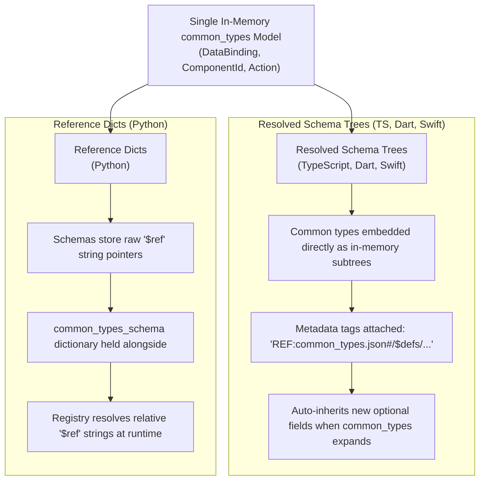

# Design Proposal: Version-Agnostic `common_types.json` References & Unified In-Memory Catalog Architecture

**Author:** A2UI Core Team  
**Date:** September 1, 2026  
**Status:** Proposal / Draft  
**Target Release:** A2UI v1.0 Protocol Specification & Agent/Renderer SDKs  

---

## 1. Executive Summary & Core Architectural Principle

### 1.1 Goal & Overview
The A2UI team is finalizing the **v1.0 specification**. A key architectural mandate is **Catalog Portability**: enabling developers to define a component catalog (e.g., `catalog.json` or TS/Dart/Swift code) once and use it across multiple protocol versions (v0.9, v0.9.1, v1.0, and future releases).

We propose making catalog definitions protocol-version-agnostic by:
1. Changing `$ref` targets in catalog schemas from version-qualified URLs (`https://a2ui.org/specification/v1_0/common_types.json#/$defs/...`) to an **unversioned relative target**: `"common_types.json#/$defs/<TypeName>"`.
2. **Removing the `"protocolVersion"` field** from `catalog.json` files (e.g., `specification/v1_0/catalogs/basic/catalog.json`) and making `protocolVersion` optional/deprecated in `catalog_definition.json`.

At runtime, Agent and Renderer SDKs dynamically resolve `"common_types.json"` against whichever protocol version schema is currently active.

---

### 1.2 Core Architectural Principle: Single, Gradually Expanding `common_types` Model

Instead of maintaining separate, version-locked models for every protocol release, A2UI SDKs operate on a **single in-memory model of `common_types` that expands additively over time**:



#### How Schema Representation Works Across Languages:

1. **Resolved Tree Representation (TypeScript, Dart, Swift, etc.)**:
   - Component APIs are defined by embedding SDK common-type builders directly into resolved in-memory schema trees (e.g., `DynamicStringSchema` inside `CustomCardSchema`).
   - The common-type builders attach metadata tags (`REF:common_types.json#/$defs/...`).
   - When generating JSON or `clientCapabilities.inlineCatalogs`, the SDK serializer reads the metadata tags and projects the resolved tree into clean `$ref: "common_types.json#/$defs/..."` JSON schemas without `protocolVersion`.
   - **Key Benefit**: As the SDK's underlying `common_types` model expands (e.g. adding `fallback` or `mode` to `DataBinding`), all resolved component trees in application code **automatically inherit the new capabilities** without modifying any component definitions!

2. **Un-Resolved Reference Representation (Python)**:
   - Component schemas are held as dict structures containing raw `$ref` strings (`"$ref": "common_types.json#/$defs/DynamicString"`), with `common_types_schema` stored alongside as a separate dictionary.
   - Pruning, validation, and Pydantic generation inspect `$ref` strings and resolve them against the active protocol version's `common_types_schema` dictionary at runtime.

---

## 2. Cross-SDK In-Memory Comparison & Code Examples

### 2.1 Cross-SDK In-Memory Matrix

| Language | Schema Representation | How `common_types` Are Represented | Serialization to JSON / `clientCapabilities` |
| :--- | :--- | :--- | :--- |
| **TypeScript (`web_core`)** | Resolved Zod Trees | **Inline Zod Objects with Tags**: Embeds `.describe('REF:common_types.json#/$defs/DynamicString|...')`. | Serializer converts tagged Zod nodes to `"$ref": "common_types.json#/$defs/DynamicString"`. |
| **Dart (`a2ui_core`)** | Resolved `Schema` Trees | **Inline `Schema` Objects with Tags**: Embeds `description: 'REF:common_types.json#/$defs/DynamicString|...'`. | Serializer converts tagged nodes to `"$ref": "common_types.json#/$defs/DynamicString"`. |
| **Python (`a2ui_agent`)** | Dicts & Pydantic Models | **Explicit `$ref` Strings**: Stores `"$ref": "common_types.json#/$defs/DynamicString"` alongside `common_types_schema` dict. | Directly serialized as JSON dicts. Pruner extracts reachable `$defs`. |

---

### 2.2 Programmatic Code Examples

#### TypeScript Example (`@a2ui/web-core`):
```typescript
import { z } from 'zod';
import { DynamicStringSchema, childList, ActionSchema, defineCatalog } from '@a2ui/web-core';

export const CustomCardApi = {
  name: 'CustomCard',
  schema: z.object({
    title: DynamicStringSchema.describe('The title of the card'),
    children: childList().describe('List of child components'),
    onDismiss: ActionSchema.optional().describe('Action to trigger on dismiss'),
  }).strict(),
};

export const myCustomCatalog = defineCatalog({
  id: 'https://mycompany.com/catalogs/v1/custom_catalog.json',
  components: [CustomCardApi],
});
```

#### Dart Example (`package:a2ui_core`):
```dart
import 'package:a2ui_core/a2ui_core.dart';
import 'package:json_schema_builder/json_schema_builder.dart';

class CustomCardComponent extends ComponentApi {
  @override
  String get name => 'CustomCard';

  @override
  Schema get schema => Schema.object(
    properties: {
      'title': CommonSchemas.dynamicString,
      'children': CommonSchemas.childList,
      'onDismiss': CommonSchemas.action,
    },
    required: ['component', 'title', 'children'],
  );
}
```

Both serializations produce identical version-agnostic JSON Schema output (omitting `protocolVersion`):
```json
{
  "$schema": "https://json-schema.org/draft/2020-12/schema",
  "$id": "https://mycompany.com/catalogs/v1/custom_catalog.json",
  "catalogId": "https://mycompany.com/catalogs/v1/custom_catalog.json",
  "components": {
    "CustomCard": {
      "type": "object",
      "properties": {
        "title": {
          "$ref": "common_types.json#/$defs/DynamicString",
          "description": "The title of the card"
        },
        "children": {
          "$ref": "common_types.json#/$defs/ChildList",
          "description": "List of child components"
        }
      },
      "required": ["component", "title", "children"]
    }
  }
}
```

---

## 3. Analysis & Risk Assessment (Derisking)

### 3.1 Additive Field Evolution in `common_types`
When new optional fields are added to `common_types` (e.g. adding `fallback?: any` or `mode?: string` to `DataBinding`):
- **Developer Experience**: Updating the SDK package updates the underlying common-type builder. Existing component definitions compile cleanly without edits.
- **Older Messages (Older Agent -> Newer Renderer)**: Older payloads (`{"path": "/user/name"}`) parse into `{ path: "/user/name", fallback: undefined, mode: "twoWay" }` and render without error.
- **Newer Messages (Newer Agent -> Older Renderer)**: Older parsers ignore unknown optional fields (`fallback: "Guest"`), resolving `path` and rendering safely without runtime crashes.

### 3.2 Equivalent Issues & Fixes Across SDKs

| SDK Language | Issue Description | Required Fix |
| :--- | :--- | :--- |
| **Python (`validator.py`)** | `A2uiValidatorWrapperV10` resolves relative `common_types.json` against the catalog's `$id`. Catalogs with custom `$id`s fail validation if `common_types` is only registered under `a2ui.org`. | Explicitly register `common_types_schema` under both its absolute `$id` AND the root relative URI key `"common_types.json"`. |
| **Dart (`prompt_builder.dart`)** | Legacy code executed `json.replaceAll(commonTypesSchemaId, 'common_types.json')` due to versioned URLs in catalog files. | Remove string replacement hack once catalog files use unversioned relative `$ref`s natively. |
| **TypeScript (`web_core`)** | Ensure Ajv schema validator registers `common_types.json` under root key. | `ajv.addSchema(commonTypesSchema, 'common_types.json')`. |

---

## 4. Proposed Specification Updates for A2UI v1.0

### 4.1 `specification/v1_0/catalogs/basic/catalog.json`
1. **Remove `"protocolVersion": "1.0"`** from the catalog root.
2. Update all `$ref` targets pointing to `common_types.json` from absolute versioned URIs to relative version-agnostic references.

#### Example (Before vs. After):

**Before:**
```json
{
  "$schema": "https://json-schema.org/draft/2020-12/schema",
  "$id": "https://a2ui.org/specification/v1_0/catalogs/basic/catalog.json",
  "protocolVersion": "1.0",
  "title": "A2UI Basic Catalog",
  "components": {
    "Text": {
      "type": "object",
      "properties": {
        "component": { "const": "Text" },
        "text": {
          "$ref": "https://a2ui.org/specification/v1_0/common_types.json#/$defs/DynamicString",
          "description": "The text content to display."
        }
      },
      "required": ["component", "text"]
    }
  }
}
```

**After:**
```json
{
  "$schema": "https://json-schema.org/draft/2020-12/schema",
  "$id": "https://a2ui.org/specification/v1_0/catalogs/basic/catalog.json",
  "title": "A2UI Basic Catalog",
  "components": {
    "Text": {
      "type": "object",
      "properties": {
        "component": { "const": "Text" },
        "text": {
          "$ref": "common_types.json#/$defs/DynamicString",
          "description": "The text content to display."
        }
      },
      "required": ["component", "text"]
    }
  }
}
```

---

### 4.2 `specification/v1_0/docs/a2ui_protocol.md`
Update Section *"Catalog Schema Rules and Conventions"* to formally document that:
1. `common_types.json` references must be version-agnostic (`common_types.json#/$defs/...`).
2. Catalog JSON definitions do not include a `protocolVersion` property.

#### Protocol Specification Text Change:

**Section 3. Catalog Schema Rules and Conventions (Rule 3):**
*Old:*
> External `$ref` targets MUST reference the standard types inside `common_types.json` (`https://a2ui.org/specification/v1_0/common_types.json#/$defs/...`), limited to the following allowed schemas...

*New:*
> External `$ref` targets MUST reference the standard types inside `common_types.json` using the version-agnostic relative target format `common_types.json#/$defs/...` (e.g., `"$ref": "common_types.json#/$defs/DynamicString"`). Catalog definitions MUST NOT constrain themselves to a specific protocol version (omit `protocolVersion`). At runtime, SDKs and renderers resolve `"common_types.json"` to the active protocol version's `common_types.json` schema.

---

### 4.3 `specification/v1_0/json/catalog_definition.json`
- Make `protocolVersion` optional / deprecated in the meta-schema properties block.
- Line 232 already uses `"common_types.json#/$defs/Extensions"`.

---

## 5. Alignment with Future Architectural Proposals

1. **`go/a2ui-catalogs-without-json-schema` (Draft 1)**:
   - Serves as the immediate **Phase 1 bridge** (limiting JSON Schema exposure and advanced `$ref` usages).
   - Removes versioned URLs, clarifying that `common_types` is a built-in SDK runtime primitive rather than a network resource.
   - Enables seamless transition to native simplified catalog DSLs in **Phase 2**.
2. **`go/a2ui-versioning` (Draft 2)**:
   - Directly fulfills the core mandate: *"Allow each Catalog to be used by messages using any A2UI protocol version..."*
   - Supports removing `protocolVersion` from `Catalog` definitions.
   - Enables SDKs to ingest catalog definitions from any version format into a single, universal internal `CatalogModel`.

---

## 6. Conclusion & Recommended Next Steps

1. Remove `"protocolVersion": "1.0"` and update `$ref` targets in `specification/v1_0/catalogs/basic/catalog.json`.
2. Update `specification/v1_0/docs/a2ui_protocol.md` text.
3. Make `protocolVersion` optional/deprecated in `catalog_definition.json`.
4. Register relative `"common_types.json"` key in Python's `A2uiValidatorWrapperV10`.
5. Remove string replacement hack in Dart's `prompt_builder.dart`.
