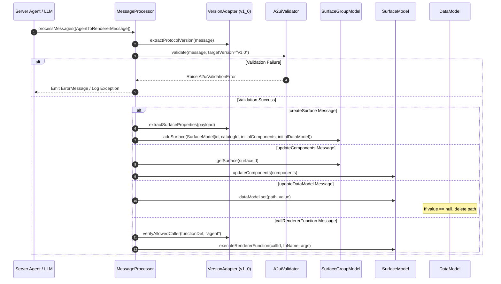
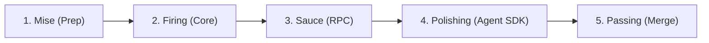

# A2UI v1.0 Implementation Plan: `python/a2ui_core`, `typescript/web_core`, and `python/a2ui_agent`

## 1. High-Level Overview

This document defines the technical implementation plan for upgrading the A2UI framework to the **v1.0 Specification**. The plan covers the Python Core SDK (`python/a2ui_core`), the TypeScript Web Core library (`typescript/web_core`), and the Python Agent SDK (`python/a2ui_agent`).

### 1.1 Objectives

1. **Branched Migration Strategy**: All v1.0 migration and restructuring work is conducted on a dedicated feature branch (`v1_0`) and merged back into `main` upon final verification.
2. **Parallel Two-Person Development Tracks**: Divide implementation tasks into two independent, parallel engineering tracks:
   - **Python Track (Nan)**: Implements `a2ui_core` Python library (`python/a2ui_core`) and Python Agent SDK (`python/a2ui_agent`).
   - **TypeScript Track (Greg)**: Implements `web_core` TypeScript library (`typescript/web_core`).
3. **Single-Word Hybrid Culinary Naming Scheme**: Identify pull requests using 5 single-word culinary line codenames (`Mise`, `Firing`, `Sauce`, `Polishing`, `Passing`) for clear git branch names and PR tracking.
4. **Top-Level Shared Conformance Test Suite**: Extract protocol conformance test vectors into a language-neutral top-level `conformance/` directory containing shared test data (`conformance/test_data/`) and domain-separated test directories (`conformance/core/`, `conformance/agent/`, and `conformance/extensions/`). Each language library maintains its own runner harness under `tests/conformance/` (`conformance_test.py`, `conformance_test.mjs`) for automatic CI test discovery.
5. **Blueprint Conformance**: Align `python/a2ui_core` package layout and module interfaces directly with [blueprints/modules/a2ui_core.blueprint.md](file:///Users/gspencer/code/a2ui/main/blueprints/modules/a2ui_core.blueprint.md) and `python/a2ui_agent` with [blueprints/modules/a2ui_agent.blueprint.md](file:///Users/gspencer/code/a2ui/main/blueprints/modules/a2ui_agent.blueprint.md).
6. **API Parity Across Languages**: Establish a symmetric module structure and API surface between `python/a2ui_core` (Python) and `typescript/web_core` (TypeScript), accounting for language-idiomatic type systems and reactivity paradigms (Pydantic / Signals / Zod).
7. **Unified Multi-Version Processing Model**: Implement a shared runtime core processing model that concurrently handles v0.8, v0.9, v0.9.1, and v1.0 specifications using version adapters (`VersionAdapter`).

### 1.2 Scope and Non-Goals

#### Scope

- Top-level shared conformance suite under `conformance/`.
- Python packages located in `python/a2ui_core` and `python/a2ui_agent`.
- TypeScript package located in `typescript/web_core`.

#### Explicit Non-Goals

1. **Preservation of v0.8 Implementation**: The v0.8 modules in `a2ui_core` (`python/a2ui_core/src/a2ui/core/basic_catalog/v0_8`) and `web_core` (`typescript/web_core/src/v0_8/`) remain untouched.
2. **No Breaking Changes to Framework Renderers**: Framework adapter packages (Angular, React, Flutter, Lit, Swift) are preserved in their existing paths during core implementation and cutover.
3. **No Transport-Layer Changes**: Transport implementations (A2A, MCP, HTTP/WebSocket) are excluded; changes apply only to protocol message payloads and capability payload metadata.

---

## 2. Design Section

### 2.1 Architectural Layering & Directory Layout

`python/a2ui_core` and `typescript/web_core` share a single unified runtime model. Spec version differences are isolated within `processing/adapters/` and versioned schema models under `schema/`. Shared protocol test suites live in top-level `conformance/`, while language-specific runners live under each package's `tests/conformance/` directory as `conformance_test.py` or `conformance_test.mjs` for seamless CI runner integration.

#### Top-Level Repository Conformance Suite Structure (`conformance/`)

```
conformance/
├── core/                               # Conformance test suites for a2ui_core (v0.8, v0.9, v1.0)
│   ├── accessibility.yaml
│   ├── catalog.yaml
│   ├── validator.yaml
│   ├── message_processor.yaml         # Message processing & inline initialization vectors
│   ├── component_nodes.yaml           # Component tree structure & graph topology vectors
│   ├── rpc_functions.yaml              # v1.0 bidirectional RPC vectors
│   ├── multi_catalog.yaml              # v1.0 multi-catalog resolution vectors
│   └── data_deletion.yaml              # v1.0 data model deletion vectors
├── agent/                              # Conformance test suites for a2ui_agent (v0.8, v0.9, v1.0)
│   ├── inference_format.yaml
│   ├── parser.yaml
│   └── streaming_parser.yaml
├── extensions/                         # Protocol extensions
│   ├── a2a/
│   │   └── a2a_integration.yaml
│   └── adk/
│       └── adk_extensions.yaml
└── test_data/                          # Shared payload fixtures & schema manager data
    ├── load_examples/
    └── schema_manager/
```

#### Python Core SDK Structure (`python/a2ui_core/`)

```
python/a2ui_core/
├── pyproject.toml
├── src/a2ui/core/
│   ├── exceptions.py                   # Exception hierarchy (A2uiError, A2uiValidationError, etc.)
│   ├── basic_catalog/                  # Bundled default catalogs (v0_8, v0_9, v1_0)
│   ├── catalog/                        # Catalog abstractions
│   ├── state/                          # Mutable layout state models
│   ├── processing/                     # Message execution engine & VersionAdapterFactory
│   ├── validation/                     # Validation layer
│   ├── resolution/                     # View tree resolution engine
│   └── schema/                         # Autogenerated Pydantic models (v0_8, v0_9, v1_0)
└── tests/                              # Unit & Conformance tests
    └── conformance/
        └── conformance_test.py         # Pytest runner executing conformance/core/
```

#### Python Agent SDK Structure (`python/a2ui_agent/`)

```
python/a2ui_agent/
├── pyproject.toml
├── src/a2ui/agent/
│   ├── processor/                      # High-level application facade
│   ├── inference_formats/              # Direct JSON & Express format strategies
│   └── parser/                         # Response part structures & parsers
└── tests/                              # Unit & Conformance tests
    └── conformance/
        └── conformance_test.py         # Pytest runner executing conformance/agent/
```

#### TypeScript Web Core Structure (`typescript/web_core/`)

```
typescript/web_core/
├── package.json
├── src/
│   ├── v0_8/                           # Legacy untouched v0.8 implementation
│   ├── exceptions/                     # Exception hierarchy
│   ├── catalog/                        # Catalog & ComponentApi interfaces
│   ├── basic_catalog/                  # Basic catalog definitions (v0_9 & v1_0)
│   ├── state/                          # SurfaceGroupModel, SurfaceModel, DataModel, etc.
│   ├── processing/                     # Unified MessageProcessor & VersionAdapterFactory
│   ├── validation/                     # A2uiValidator
│   ├── resolution/                     # DataContext & NodeGraph
│   └── schema/                         # Protocol models (v0_8, v0_9, v1_0)
└── tests/                              # Unit & Conformance tests
    └── conformance/
        └── conformance_test.mjs        # TypeScript runner executing conformance/core/
```

---

### 2.2 Component Interaction & Message Processing Flow



---

### 2.3 Key Specification Changes Covered (v0.9 to v1.0)

1. **Bidirectional RPC Functions**:
   - Agent-to-Renderer: `callRendererFunction` $\rightarrow$ returns `rendererFunctionResponse`.
   - Renderer-to-Agent: `callAgentFunction` $\rightarrow$ returns `agentFunctionResponse`.
   - Runtime authorized caller checking (`callableFrom`: `rendererOnly`, `rendererOrAgent`).
   - User activation requirement flag (`requiresUserActivation: true` for functions like `openUrl`).
2. **Multi-Catalog Surface Mixing**:
   - `supportedCatalogIds` can be mixed within a single surface.
   - `ComponentCommon` and `FunctionCall` support optional explicit `catalogId`.
   - Resolution precedence: (1) explicit component/call `catalogId`, (2) surface default `catalogId`, (3) error out if missing.
3. **Data Model Deletion**:
   - `updateDataModel` requires `value`. Passing `value: null` deletes the path.
4. **Single-Message Surface Initialization**:
   - `createSurface` accepts inline `components` and `dataModel` payloads.
5. **Dynamic Validation Results**:
   - `CheckRule` supports dynamic `ValidationResult` objects (`valid`, `code`, `message`, `severity`).
6. **Iteration Index Built-in Function**:
   - Built-in `@index` function (with optional `offset`) scoped to template iteration loops.
7. **Composition Constraints**:
   - `allowedParents` and `allowedChildren` validation on component definitions, using canonical `"Surface"` container component.
8. **Unicode Naming Standard**:
   - Enforce UAX #31 identifier naming for component names, function names, and argument keys.

---

## 3. Execution Methodology & Quality Standards

This section outlines the process for orchestrating implementation tasks, creating pull requests, and maintaining repository quality across parallel tracks.

### 3.1 Subagent Task Dispatching & Parallel Track Workflow

1. **Track Assignment**:
   - **Python Track (Nan)**: Implements `python/a2ui_core` and `python/a2ui_agent`.
   - **TypeScript Track (Greg)**: Implements `typescript/web_core`.
2. **Subagent Orchestration**: For each active stage, subagents (`invoke_subagent`) are spawned to complete track-specific implementation steps in parallel.
3. **Task Prompting**: Subagents receive explicit prompt specifications containing target file paths, implementation logic, input/output contracts, and verification commands.
4. **Execution Ordering**: Sub-tasks follow strict dependency ordering (autogenerated schemas $\rightarrow$ basic catalog definitions $\rightarrow$ version adapters $\rightarrow$ message processor $\rightarrow$ agent facades). Tasks across Python and TypeScript tracks execute independently and in parallel.

### 3.2 Feature Branch Strategy

- **Feature Branch**: All work is performed on the feature branch `v1_0` (or track-specific sub-branches off `v1_0`).
- **In-Place Development**: Code modifications occur directly in `python/a2ui_core`, `python/a2ui_agent`, and `typescript/web_core` on the feature branch.

### 3.3 Quality Standards & Pre-Push Checklist

Before merging sub-branches or opening PRs, the following quality checks must be satisfied:

#### 1. Unit Testing & Code Coverage (>90%)

- Write comprehensive unit tests for all new functions, state mutations, version adapters, and schema models.
- Maintain at least **90%+ test coverage** across modified source files.
- Run tests via `pytest` (Python) or `yarn test` (TypeScript) and verify a 100% pass rate.

#### 2. Code Documentation (`code-documentation`)

All public APIs, classes, methods, and functions must be documented according to the `code-documentation` skill guidelines:

- **User-Centric**: Document _why_ code exists and _how_ to use it effectively.
- **Summary Sentence**: Lead with a single-sentence summary ending in a period.
- **Third-Person Singular Verbs**: Begin function and method docstrings with third-person singular active verbs (e.g., `"Returns..."`, `"Calculates..."`, `"Creates..."`).
- **Noun Phrases**: Begin variable and property docstrings with a noun phrase (e.g., `"The current color."`).
- **Boolean Documentation**: Always start boolean descriptions with `"Whether..."` (e.g., `"Whether this surface sends data models."`).
- **No Fluff**: Omit boilerplate filler such as `"This class is used to..."` or `"This method...`".
- **Parameters & Returns**: Explicitly document parameter constraints, return payloads, and thrown exceptions.

#### 3. Formatting, Linting & Copyright License Verification

- **Formatting**: Auto-format code (`pyink` for Python, `prettier` for TypeScript via `./scripts/fix_format.sh`).
- **Static Analysis**: Resolve all static analysis and type errors (`mypy` for Python, `tsc --noEmit` for TypeScript).
- **License Headers**: Verify that all newly created source files contain the standard project copyright notice and license header before staging.

#### 4. Adversarial Code Review Subagent (`code-review`)

- Before staging any branch, launch a dedicated subagent running the `code-review` skill to perform an adversarial review of the worktree diff (`git diff base...HEAD`).
- The review subagent inspects modified lines, checks context dependencies, delegates public API reviews to `api-review` where signatures changed, and executes a two-pass critique (generation $\rightarrow$ self-critique) to remove false positives.
- **Mandatory Remediation**:
  - **Critical & High Severity**: Must be resolved before pushing.
  - **Medium & Low Severity**: Remediate all medium and low concerns as long as fixing them does not require major architectural changes.

#### 5. Conventional Commits (`commit-changes`)

- Staged changes are reviewed using `git diff --cached --stat` before committing.
- Commit messages must strictly follow Conventional Commits format (`commit-changes` skill guidelines):
  - `feat(scope): ...` for new capabilities.
  - `fix(scope): ...` for bug fixes.
  - `refactor(scope): ...` for structural updates.
  - `docs(scope): ...` for documentation changes.
- Subjects must be imperative, concise, and lowercase without a trailing period.

#### 6. PR Description & Prose Quality (`write-pr-description` & `write-prose`)

- **PR Description Generation**: Every submitted PR requires a detailed description generated using `write-pr-description` with mandatory sections: `## Summary`, `## Changes`, `## Impact & Risks`, and `## Testing`.
- **Prose Standards (`write-prose`)**:
  - Apply ISO 24495-1 plain language standards: direct active voice, short sentences (15–20 words max), and clear reader orientation.
  - Eliminate banned AI jargon (_leverage, seamless, robust, holistic, pivotal, intuitive, testament, not only... but also_).
  - Describe technical behaviors factually without promotional or hyperbolic language.
- **Hashtag Escaping**: Enforce backtick formatting on spec or issue identifiers (e.g., UAX `#31`) to prevent unwanted GitHub issue auto-linking.

---

## 4. Parallel Track PR Breakdown & Single-Word Naming Scheme

To facilitate parallel development between **Nan (Python Track)** and **Greg (TypeScript Track)** and avoid ambiguity with GitHub PR numbers, implementation is structured into a 5-stage hybrid culinary pipeline:



| Stage       | Codename        | Primary Focus & Included Deliverables                                                                                                                                                                                              | Python Track 🐍 (Nan)                                                                                                                                    | TypeScript Track ⚡ (Greg)                                                                                                                                                                | Lead                                 |
| :---------- | :-------------- | :--------------------------------------------------------------------------------------------------------------------------------------------------------------------------------------------------------------------------------- | :------------------------------------------------------------------------------------------------------------------------------------------------------- | :---------------------------------------------------------------------------------------------------------------------------------------------------------------------------------------- | :----------------------------------- |
| **Stage 1** | **`Mise`**      | **Preparation & Staging**: Feature branch creation (`v1_0`), structuring top-level `conformance/` layout, bringing up `message_processor` and component node test vectors, adding v1.0 feature vectors, and setting up TS harness. | Bring up conformance suite to include `message_processor` and component node test vectors (`message_processor.yaml`, `component_nodes.yaml`).            | Fill in conformance test vectors for new v1.0 features (`rpc_functions.yaml`, `multi_catalog.yaml`, `data_deletion.yaml`), and implement TS test runner harness (`conformance_test.mjs`). | Nan (Prep)<br/>Greg (v1.0 & Harness) |
| **Stage 2** | **`Firing`**    | **Core Data Models & Adapters**: Autogenerated schemas (Pydantic / Zod), `VersionAdapterFactory`, catalog definitions v1.0, data model deletion (`null`), and parent-child composition rules.                                      | `Firing-Python`: Generate Pydantic models, `VersionAdapterFactory`, data model deletion (`null`), and `"Surface"` container rules in `python/a2ui_core`. | `Firing-TS`: Generate Zod/TS models, `VersionAdapterFactory`, data model deletion (`null`), and `"Surface"` container rules in `typescript/web_core`.                                     | Nan (Py)<br/>Greg (TS)               |
| **Stage 3** | **`Sauce`**     | **Fluid Signaling & RPC**: Bidirectional RPC execution (`callRendererFunction`, `callAgentFunction`), dynamic `ValidationResult` handling, multi-catalog resolution order engine, and `@index` function.                           | `Sauce-Python`: Implement `callRendererFunction` / `callAgentFunction` RPC handlers, multi-catalog resolution engine, and `A2uiValidator` in Python.     | `Sauce-TS`: Implement `callRendererFunction` / `callAgentFunction` RPC handlers, multi-catalog resolution engine, and `A2uiValidator` in Web Core.                                        | Nan (Py)<br/>Greg (TS)               |
| **Stage 4** | **`Polishing`** | **Higher Facades & Surface Manager**: Upgrading `python/a2ui_agent`, Direct JSON inference format, Express DSL parser/compiler v1.0, and refining Web Core surface manager.                                                        | `Polishing-Python`: Upgrade `python/a2ui_agent` (Direct JSON format, Express DSL v1.0 grammar, `A2uiGenerator` / `A2uiRequestProcessor` facades).        | `Polishing-TS`: Refine Web Core surface manager, renderer integration hooks, and ensure cross-language API parity.                                                                        | Nan (Py)<br/>Greg (TS)               |
| **Stage 5** | **`Passing`**   | **Verification & Release Cutover**: Executing 100% clean conformance suite across Python and TypeScript harnesses and merging `v1_0` to `main`.                                                                                    | Run `pytest tests/conformance/conformance_test.py` across all YAML test vectors until 100% pass rate.                                                    | Run `node tests/conformance/conformance_test.mjs` across all YAML test vectors; merge `v1_0` to `main`.                                                                                   | Shared                               |

---

## 5. Step-by-Step Implementation Details

### Stage 1: Repository Foundation & Conformance Setup (`Mise`)

#### Step 1.1A: Message Processor & Component Node Conformance Vectors (`Mise-Python`) [Nan]

- **Goal**: Bring up top-level `conformance/core/` test vectors for message processor handling and component node structure.
- **Affected Paths**:
  - `conformance/core/message_processor.yaml`
  - `conformance/core/component_nodes.yaml`
  - `conformance/core/accessibility.yaml`
  - `conformance/core/catalog.yaml`
  - `conformance/core/validator.yaml`
- **Key Requirements**:
  - Define test vectors covering `createSurface`, `updateComponents`, and `updateDataModel`.
  - Structure test cases for invalid operations (duplicate surface IDs, unallowed parents/children, invalid JSON Pointer paths).
  - Ensure compatibility across both Python (`conformance_test.py`) and TypeScript runners.
- **Verification**: Run `uv run pytest python/a2ui_core/tests/conformance/conformance_test.py`.

#### Step 1.1B: v1.0 Feature Conformance Vectors & TypeScript Test Harness (`Mise-TS`) [Greg]

- **Goal**: Create conformance test vectors for new v1.0 protocol features and build the TypeScript test runner harness.
- **Affected Paths**:
  - `conformance/core/rpc_functions.yaml`
  - `conformance/core/multi_catalog.yaml`
  - `conformance/core/data_deletion.yaml`
  - `conformance/agent/v1_0_inference_format.yaml`
  - `typescript/web_core/tests/conformance/conformance_test.mjs`
- **Key Requirements**:
  - Define test vectors for `callRendererFunction`, `callAgentFunction`, `@index(offset)`, multi-catalog resolution, and data deletion via `null`.
  - Build `conformance_test.mjs` harness to load test vectors from top-level `conformance/core/` and `conformance/test_data/`.
- **Verification**: Run `node typescript/web_core/tests/conformance/conformance_test.mjs`.

---

### Stage 2: Core Data Models, Schemas & Version Adapters (`Firing`)

#### Step 2.1A: Autogenerate v1.0 Pydantic Schema Models (`Firing-Python`) [Nan]

- **Goal**: Generate strongly typed Pydantic models for Python (`python/a2ui_core`) from `specification/v1_0/json/` JSON Schema files.
- **Affected Paths**:
  - `python/a2ui_core/scripts/generate_schemas.py`
  - `python/a2ui_core/src/a2ui/core/schema/v1_0/` (`agent_to_renderer.py`, `renderer_to_agent.py`, `renderer_capabilities.py`, `agent_capabilities.py`, `common_types.py`, `constants.py`)
  - `python/a2ui_core/src/a2ui/core/schema/__init__.py`
- **Key Requirements**:
  - Map `agent_to_renderer.json` (replacing `server_to_client.json`), `renderer_to_agent.json` (replacing `client_to_server.json`), `renderer_capabilities.json`, `agent_capabilities.json`, and `common_types.json`.
  - Include support for `callRendererFunction`, `callAgentFunction`, `rendererFunctionResponse`, `agentFunctionResponse`, `ValidationResult`, and `$defs/Extensions`.
  - Export `AgentToRendererMessage` as union of `v0_9.ServerToClientMessage` and `v1_0.AgentToRendererMessage`.
  - Export `RendererToAgentMessage` as union of `v0_9.ClientToServerMessage` and `v1_0.RendererToAgentMessage`.
  - Export `A2uiProtocolVersion` enum (`V0_8 = "v0.8"`, `V0_9 = "v0.9"`, `V0_9_1 = "v0.9.1"`, `V1_0 = "v1.0"`).
- **Verification**: Run `python scripts/generate_schemas.py` and `uv run pytest python/a2ui_core/tests`.

#### Step 2.1B: Autogenerate v1.0 Zod Schema Models (`Firing-TS`) [Greg]

- **Goal**: Generate Zod schemas and TypeScript interfaces for Web Core (`typescript/web_core`) from `specification/v1_0/json/` JSON Schema files.
- **Affected Paths**:
  - `typescript/web_core/src/v1_0/schema/` (`agent-to-renderer.ts`, `renderer-to-agent.ts`, `renderer-capabilities.ts`, `common-types.ts`, `index.ts`)
  - `typescript/web_core/src/schema/index.ts`
- **Key Requirements**:
  - Generate Zod schema definitions matching `agent_to_renderer.json`, `renderer_to_agent.json`, `renderer_capabilities.json`, `agent_capabilities.json`, and `common_types.json`.
  - Export multi-version envelope union types (`AgentToRendererMessage`, `RendererToAgentMessage`) and `A2uiProtocolVersion` enum in TypeScript.
- **Verification**: Run `(cd typescript/web_core && yarn test)`.

#### Step 2.2A / Step 2.2B: Spec Version Adapters & VersionAdapterFactory (`Firing-Python` / `Firing-TS`)

- **Goal**: Implement `VersionAdapter` infrastructure to normalize protocol differences between v0.8, v0.9, v0.9.1, and v1.0.
- **Affected Paths**:
  - `python/a2ui_core/src/a2ui/core/processing/adapters/` (`base.py`, `factory.py`, `v0_8.py`, `v0_9.py`, `v1_0.py`)
  - `typescript/web_core/src/processing/adapters/` (`base.ts`, `factory.ts`, `v0_8.ts`, `v0_9.ts`, `v1_0.ts`)
- **Key Requirements**:
  - Implement `extract_surface_properties(payload)` mapping `theme` (v0.9) vs `surfaceProperties` (v1.0).
  - Implement `extract_initial_state(payload)` to extract inline `components` and `dataModel` from v1.0 `createSurface` messages.
  - Implement `extract_message_type(payload)` handling `ServerToClient` vs `AgentToRenderer` envelope names.
  - Log warning when resolving unmapped versions via `VersionAdapterFactory.resolve_from_payload()`.
- **Verification**: Unit test `test_adapters.py` and `adapters.test.ts` across v0.9 and v1.0 message payload fixtures.

#### Step 2.3A / Step 2.3B: Core Catalog Abstractions & Bundled Basic Catalog v1.0 (`Firing-Python` / `Firing-TS`)

- **Goal**: Update core catalog interfaces to store v1.0 metadata attributes and implement bundled basic catalog v1.0.
- **Affected Paths**:
  - `python/a2ui_core/src/a2ui/core/catalog/` (`catalog.py`, `components.py`, `functions.py`)
  - `python/a2ui_core/src/a2ui/core/basic_catalog/v1_0/` (`catalog.py`, `components.py`, `functions.py`)
  - `typescript/web_core/src/catalog/` (`catalog.ts`, `types.ts`)
  - `typescript/web_core/src/basic_catalog/v1_0/` (`catalog.ts`, `components.ts`, `functions.ts`)
- **Key Requirements**:
  - Add `protocol_version: A2uiProtocolVersion` and `instructions: str` properties to `Catalog`.
  - Add `callable_from` (`rendererOnly`, `rendererOrAgent`) and `requires_user_activation` to `FunctionApi`.
  - Add optional `allowed_parents` and `allowed_children` to `ComponentApi`.
  - Implement UAX #31 identifier validation logic for component names, function names, and argument keys.
  - Load `specification/v1_0/catalogs/basic/catalog.json`: update `Video` (`posterUrl`), `TextField` (`placeholder`), `Slider` (`steps`), set `requiresUserActivation: true` on `openUrl`.
  - Update return types of standard validation functions (`required`, `regex`, `length`, `numeric`, `email`) from `"boolean"` to `"validationResult"`.
- **Verification**: Unit test basic catalog v1.0 initialization and validation checks in `test_catalog.py` and `catalog.test.ts`.

#### Step 2.4A / Step 2.4B: Composition Constraints & Data Model Deletion (`Firing-Python` / `Firing-TS`)

- **Goal**: Enforce parent-child composition rules and data model deletion via `value: null`.
- **Affected Paths**:
  - `python/a2ui_core/src/a2ui/core/state/` (`surface_components_model.py`, `data_model.py`)
  - `typescript/web_core/src/state/` (`surface-components-model.ts`, `data-model.ts`)
- **Key Requirements**:
  - Treat `"Surface"` as implicit top-level parent container for root components (`"allowedParents": ["Surface"]`).
  - Validate parent-child edges during `upsert_component()` and raise structured errors (`UNALLOWED_PARENT`, `UNALLOWED_CHILD`).
  - Enforce required `value` parameter in `DataModel.set()`: if `value is None` (or `null`), delete the key at the specified JSON Pointer path.
- **Verification**: Unit test composition constraint failures and path deletion via `null` in `test_state.py` and `state.test.ts`.

---

### Stage 3: Bidirectional RPC & Multi-Catalog Resolution (`Sauce`)

#### Step 3.1A / Step 3.1B: Agent-to-Renderer Function RPC (`callRendererFunction`) (`Sauce-Python` / `Sauce-TS`)

- **Goal**: Support agent-initiated function calls on the renderer and emit `rendererFunctionResponse` payloads.
- **Affected Paths**:
  - `python/a2ui_core/src/a2ui/core/processing/message_processor.py`
  - `typescript/web_core/src/processing/message-processor.ts`
- **Key Requirements**:
  - Intercept incoming `callRendererFunction` messages.
  - Verify function metadata in catalog: check `callableFrom` permits `agent` invocation (`rendererOrAgent`). If violated or unregistered, return error code `INVALID_FUNCTION_CALL`.
  - Execute matching `FunctionImplementation` and emit `rendererFunctionResponse` containing `callId` and `value` or `error`.
- **Verification**: Test execution of valid remote renderer functions and rejection of `rendererOnly` functions.

#### Step 3.2A / Step 3.2B: Renderer-to-Agent Function RPC (`callAgentFunction`) (`Sauce-Python` / `Sauce-TS`)

- **Goal**: Support renderer-initiated remote function calls sent to the agent and handle `agentFunctionResponse`.
- **Affected Paths**:
  - `python/a2ui_core/src/a2ui/core/processing/message_processor.py`
  - `typescript/web_core/src/processing/message-processor.ts`
- **Key Requirements**:
  - Provide helper method to format outbound `callAgentFunction` message.
  - Process inbound `agentFunctionResponse` messages and route results to pending promises / async futures using `callId`.
  - Ensure error reporting enforces mutual exclusivity between `functionCallId` and `surfaceId`.
- **Verification**: Unit test asynchronous RPC resolution and error response routing.

#### Step 3.3A / Step 3.3B: Multi-Catalog Resolution Engine (`Sauce-Python` / `Sauce-TS`)

- **Goal**: Resolve component and function catalog sources across mixed catalog surfaces.
- **Affected Paths**:
  - `python/a2ui_core/src/a2ui/core/resolution/` (`data_context.py`, `node_graph.py`)
  - `typescript/web_core/src/rendering/` (`data-context.ts`, `node-graph.ts`)
- **Key Requirements**:
  - Precedence algorithm: (1) explicit `catalogId` specified on component or function call, (2) default `catalogId` declared in `createSurface`, (3) throw `A2uiCatalogError` (no fallback to capabilities list).
  - Verify all active catalogs mixed within a surface share the same `protocolVersion`.
- **Verification**: Unit test mixed catalog component trees and error throwing on missing catalog definitions.

#### Step 3.4A / Step 3.4B: Built-in `@index` Function & Dynamic `ValidationResult` (`Sauce-Python` / `Sauce-TS`)

- **Goal**: Implement `@index` loop function and dynamic `ValidationResult` processing in Python and TypeScript core libraries.
- **Affected Paths**:
  - `python/a2ui_core/src/a2ui/core/resolution/data_context.py`
  - `python/a2ui_core/src/a2ui/core/basic_catalog/v1_0/functions.py`
  - `typescript/web_core/src/rendering/data-context.ts`
  - `typescript/web_core/src/basic_catalog/v1_0/functions.ts`
- **Key Requirements**:
  - Implement `@index(offset?: int)` system function handler restricted strictly to template iteration context (Collection Scope).
  - Return `ValidationResult` payload (`valid: bool`, `code: str`, `message: str`, `severity: str`) from check functions; fall back to `CheckRule.message` if primitive boolean returned.
- **Verification**: Test list rendering with `@index` dynamic binding and form validators with dynamic `ValidationResult` returns.

#### Step 3.5A / Step 3.5B: Validation Layer (`A2uiValidator`) Extension (`Sauce-Python` / `Sauce-TS`)

- **Goal**: Update `A2uiValidator` to enforce v1.0 envelope rules, UAX #31 identifiers, and JSON Pointer syntax.
- **Affected Paths**:
  - `python/a2ui_core/src/a2ui/core/validation/validator.py`
  - `typescript/web_core/src/validation/validator.ts`
- **Key Requirements**:
  - Validate envelope message structure against v1.0 JSON schemas.
  - Perform path syntax checks on `updateDataModel` paths and dynamic property bindings.
  - Validate graph topology (detect cycles, orphan nodes, missing root component).
- **Verification**: Run comprehensive validation test suite in `test_validating.py` and `validator.test.ts`.

---

### Stage 4: Agent SDK Facades & Web Core Surface Manager (`Polishing`)

#### Step 4.1: Catalog Providers, Transformers & Capability Resolver (`Polishing-Python`) [Nan]

- **Goal**: Update catalog providers and capability negotiation in `python/a2ui_agent`.
- **Affected Paths**:
  - `python/a2ui_agent/src/a2ui/processor/catalog_providers.py`
  - `python/a2ui_agent/src/a2ui/utils/catalog_resolver.py`
  - `python/a2ui_agent/src/a2ui/catalog_transformers/` (`base.py`, `pruning.py`)
- **Key Requirements**:
  - Update `BundledCatalogProvider` to load v1.0 catalog definitions.
  - Update `resolve_catalogs()` to negotiate multi-catalog capabilities matching `supportedCatalogIds`.
  - Support `ComponentPruningTransformer` and `FunctionPruningTransformer` on v1.0 catalog schemas.
- **Verification**: Unit test catalog loading, capability resolution, and pruning transformers.

#### Step 4.2: Direct JSON Inference Format Strategy v1.0 (`Polishing-Python`) [Nan]

- **Goal**: Upgrade `DirectJsonPromptGenerator` and `DirectJsonParser` to generate system instructions and parse v1.0 message envelopes.
- **Affected Paths**:
  - `python/a2ui_agent/src/a2ui/inference_formats/direct_json/` (`prompt_generator.py`, `parser.py`, `streaming.py`)
- **Key Requirements**:
  - Update sentinel tag instructions to output `v1.0` payload envelopes (`<a2ui-json>`).
  - Instruct model on `createSurface` inline components/dataModel usage and explicit `catalogId` assignments.
- **Verification**: Run `pytest python/a2ui_agent/tests/test_direct_json.py`.

#### Step 4.3: Express DSL Inference Format Strategy v1.0 (`Polishing-Python`) [Nan]

- **Goal**: Upgrade Express compiler, decompiler, and prompt generator to support v1.0 syntax.
- **Affected Paths**:
  - `python/a2ui_agent/src/a2ui/inference_formats/express/` (`compiler.py`, `decompiler.py`, `parser.py`, `prompt_generator.py`)
- **Key Requirements**:
  - Extend grammar to parse `callRendererFunction` and `callAgentFunction` expressions.
  - Parse optional `catalogId` modifiers on component instances and function calls.
- **Verification**: Run `pytest python/a2ui_agent/tests/express/test_compiler.py`.

#### Step 4.4: High-Level Agent Facades (`A2uiGenerator` & `A2uiRequestProcessor`) (`Polishing-Python`) [Nan]

- **Goal**: Connect v1.0 capability negotiation and validation to high-level application facades.
- **Affected Paths**:
  - `python/a2ui_agent/src/a2ui/processor/` (`generator.py`, `processor.py`, `catalog_config.py`)
- **Key Requirements**:
  - Validate LLM-generated payloads against negotiated v1.0 catalogs using `a2ui_core.validation.A2uiValidator`.
- **Verification**: End-to-end agent generation test in `tests/test_agent_integration.py`.

#### Step 4.5: Refine Web Core Surface Manager & Framework Adapter Hooks (`Polishing-TS`) [Greg]

- **Goal**: Refine Web Core surface components model, data context, and framework adapter hooks for 100% API parity with Python Core SDK.
- **Affected Paths**:
  - `typescript/web_core/src/state/` (`surface-group-model.ts`, `surface-model.ts`)
  - `typescript/web_core/src/rendering/` (`node-graph.ts`, `component-node.ts`)
- **Key Requirements**: Ensure reactive signals correctly propagate surface state mutations to downstream framework renderers (Angular, React, Lit).
- **Verification**: Run `(cd typescript/web_core && yarn test)`.

---

### Stage 5: Conformance Verification & Release Cutover (`Passing`)

#### Step 5.1: Execute Language Conformance Harnesses (`Passing`) [Shared]

- **Goal**: Execute language-specific conformance test runners (`conformance_test.py`, `conformance_test.mjs`) targeting top-level `conformance/`.
- **Affected Paths**:
  - `python/a2ui_core/tests/conformance/conformance_test.py`
  - `python/a2ui_agent/tests/conformance/conformance_test.py`
  - `typescript/web_core/tests/conformance/conformance_test.mjs`
- **Key Requirements**:
  - Each harness loads test suites from `conformance/core/` (or `conformance/agent/`) and test data from `conformance/test_data/`.
  - Execute 100% clean test passes across Python and TypeScript harnesses (exit code 0).
- **Verification**: Execute `uv run pytest python/a2ui_core/tests/conformance/conformance_test.py`, `uv run pytest python/a2ui_agent/tests/conformance/conformance_test.py`, and `node typescript/web_core/tests/conformance/conformance_test.mjs`.

#### Step 5.2: Final Verification & Feature Branch Merge (`Passing`) [Shared]

- **Goal**: Verify repository status, ensure zero static analysis or formatting errors, and merge feature branch `v1_0` back into `main`.
- **Verification**: Run `./scripts/fix_format.sh`, verify passing CI workflow, and merge `v1_0` to `main`.
